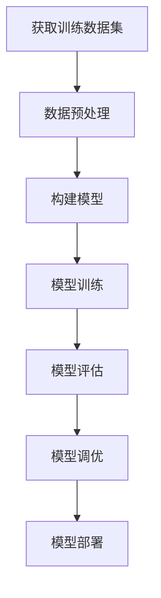

# AI人工智能核心算法原理与代码实例讲解：监督学习

## 1.背景介绍

### 1.1 什么是监督学习?

监督学习(Supervised Learning)是机器学习中最基础和最广泛应用的一种范式。它的目标是基于一组已知的输入-输出数据对(训练数据集),学习一个函数映射,使得当新的输入数据传入时,能够准确预测其对应的输出值。

监督学习的应用场景非常广泛,包括但不限于:

- 图像识别(Image Recognition)
- 语音识别(Speech Recognition) 
- 自然语言处理(Natural Language Processing)
- 推荐系统(Recommendation Systems)
- 金融预测(Financial Forecasting)
- 医疗诊断(Medical Diagnosis)

### 1.2 监督学习的分类

根据预测目标的性质,监督学习可分为以下两大类:

1. **分类(Classification)**: 当预测目标为离散的类别标签时,如判断图像中物体的种类、确定垃圾邮件与否等,称为分类问题。

2. **回归(Regression)**: 当预测目标为连续的数值时,如房价预测、销量预测等,称为回归问题。

## 2.核心概念与联系

### 2.1 训练数据集

训练数据集是监督学习算法的基石。一个高质量的训练数据集对于构建精确的模型至关重要。一个理想的训练数据集应当:

1. 包含足够多的样本,以覆盖输入空间的不同区域。
2. 样本的分布应与预测对象的真实分布相似(独立同分布假设)。
3. 标注准确无误,避免噪声数据。

### 2.2 模型与学习

监督学习的核心在于根据训练数据集学习一个模型,使其能够对新的输入数据做出准确的预测。这个模型可以是:

- 经典的机器学习模型,如线性回归、逻辑回归、决策树等。
- 现代的深度学习模型,如卷积神经网络、递归神经网络等。

学习过程实际上是通过优化算法(如梯度下降)来不断调整模型参数,使模型在训练数据集上的预测误差最小化。

### 2.3 评估指标

为了评估模型的泛化能力,我们需要在不可见的测试数据集上测试模型的性能,常用的评估指标包括:

- 对于分类问题:准确率(Accuracy)、精确率(Precision)、召回率(Recall)、F1分数等。
- 对于回归问题:均方根误差(RMSE)、平均绝对误差(MAE)等。

此外,我们还需要注意模型的其他属性,如复杂度、训练时间、可解释性等。

## 3.核心算法原理具体操作步骤  

在监督学习中,存在多种不同的算法,其核心思想虽有差异,但一般都遵循以下步骤:



### 3.1 获取训练数据集

首先需要获取高质量的训练数据集,包括输入特征和对应的标签。数据可能来自多种渠道,如人工标注、网络爬取、实验测量等。

### 3.2 数据预处理

由于现实世界的数据通常存在噪声、缺失值、异常值等问题,因此需要进行数据清洗、标准化、特征工程等预处理,以提高模型的性能。

### 3.3 构建模型

根据问题的性质和数据的特点,选择合适的模型架构,如线性模型、决策树、神经网络等。同时需要初始化模型参数。

### 3.4 模型训练

利用优化算法(如梯度下降)在训练数据集上不断迭代,更新模型参数,使模型在训练集上的损失函数(如均方误差)最小化。

### 3.5 模型评估

在独立的测试数据集上评估模型的泛化能力,计算评估指标(如准确率、均方根误差等),判断模型是否达到预期性能。

### 3.6 模型调优

如果模型性能不佳,可以尝试调整超参数、增加训练数据、改进模型结构等方式来提升模型性能。

### 3.7 模型部署

当模型性能满足要求后,可将其部署到实际的生产环境中,应用于解决实际问题。

## 4.数学模型和公式详细讲解举例说明

### 4.1 线性回归

线性回归是最基础和最常用的回归算法之一,其数学模型为:

$$y = w_0 + w_1x_1 + w_2x_2 + ... + w_nx_n$$

其中$y$为预测目标,$x_i$为第$i$个特征,$w_i$为对应的权重系数。

训练过程的目标是找到最优的权重系数$w$,使得预测值$\hat{y}$与真实值$y$之间的均方误差最小:

$$\underset{w}{min}\frac{1}{N}\sum_{i=1}^{N}(y_i - \hat{y_i})^2$$

通过最小二乘法或梯度下降法可以求解最优解。

### 4.2 逻辑回归

逻辑回归是二分类问题中最常用的算法,其模型为:

$$P(y=1|x) = \sigma(w_0 + w_1x_1 + ... + w_nx_n) = \frac{1}{1+e^{-(w_0+w_1x_1+...+w_nx_n)}}$$

其中$\sigma$为Sigmoid函数,将线性函数的值映射到(0,1)区间,作为样本属于正类的概率。

在二元交叉熵损失函数下,通过梯度下降法可以求解最优参数$w$:

$$\underset{w}{min}-\frac{1}{N}\sum_{i=1}^{N}[y_i\log\hat{y_i} + (1-y_i)\log(1-\hat{y_i})]$$

### 4.3 支持向量机(SVM)

支持向量机是一种经典的分类算法,其基本思想是找到一个超平面,将两类样本分开,且两类样本到超平面的距离最大。

对于线性可分的情况,超平面方程为:

$$w^Tx + b = 0$$

目标是最大化两类样本到超平面的距离的最小值:

$$\underset{w,b}{max}\frac{1}{\|w\|}\underset{n}{min}|(w^Tx_n + b)|$$

引入拉格朗日乘子法,可以将其转化为对偶型的凸二次优化问题求解。

对于线性不可分的情况,可以引入核技巧,将样本映射到高维空间,使其在高维空间线性可分。

### 4.4 决策树与随机森林

决策树是一种基于"分而治之"策略的树形结构模型。其核心思想是根据特征的信息增益或信息熵,递归地将数据集分割成更小的子集,直到满足某个停止条件。

单棵决策树存在过拟合的风险,因此我们通常使用随机森林(集成学习)的方法来提升性能。随机森林由多棵决策树组成,每棵树在训练时使用数据集的一个自助采样,并且在每次分割时只考虑部分特征,从而减少了单棵树的方差,提高了泛化能力。

## 5.项目实践:代码实例和详细解释说明

以下是一个使用Python语言和scikit-learn库实现线性回归的示例:

```python
from sklearn.linear_model import LinearRegression
from sklearn.datasets import make_regression
from sklearn.model_selection import train_test_split

# 生成模拟回归数据集
X, y = make_regression(n_samples=1000, n_features=5, noise=10, random_state=42)

# 划分训练集和测试集
X_train, X_test, y_train, y_test = train_test_split(X, y, test_size=0.2, random_state=42)

# 创建线性回归模型
model = LinearRegression()

# 训练模型
model.fit(X_train, y_train)

# 在测试集上评估模型
score = model.score(X_test, y_test)
print(f"R-squared on test set: {score:.3f}")
```

代码解释:

1. 首先从`sklearn.datasets`导入`make_regression`函数,生成一个模拟的回归数据集,包含1000个样本,5个特征,并加入一些噪声。
2. 使用`train_test_split`函数将数据集划分为训练集和测试集,测试集占20%。
3. 创建`LinearRegression`模型实例。
4. 调用`fit`方法,在训练集上训练线性回归模型。
5. 在测试集上评估模型的性能,使用`score`方法计算$R^2$分数(决定系数)。

运行结果示例:

```
R-squared on test set: 0.789
```

这表明该线性回归模型在测试集上的决定系数为0.789,具有较好的预测能力。

## 6.实际应用场景

监督学习在现实世界中有着广泛的应用,以下列举了一些典型场景:

1. **图像识别**: 通过卷积神经网络(CNN)实现图像分类、目标检测、语义分割等任务,应用于自动驾驶、医疗影像诊断等领域。

2. **自然语言处理(NLP)**: 利用递归神经网络(RNN)、Transformer等模型,实现文本分类、机器翻译、问答系统、情感分析等任务,应用于智能客服、新闻推荐等场景。

3. **金融预测**: 使用线性回归、决策树等模型预测股票走势、贷款违约风险等,辅助投资决策和风险管理。

4. **推荐系统**: 基于协同过滤、矩阵分解等技术,为用户推荐感兴趣的商品、影视节目等内容,提升用户体验。

5. **欺诈检测**: 通过监督学习模型识别异常行为模式,发现信用卡欺诈、网络入侵等违规操作。

6. **医疗诊断**: 将影像数据、病历数据等输入监督学习模型,辅助医生诊断疾病,提高诊断的准确性和效率。

## 7.工具和资源推荐

以下是一些流行的机器学习框架和工具,可以帮助你更高效地开发和部署监督学习模型:

1. **Python生态系统**:
   - **scikit-learn**: 经典的机器学习库,提供了众多监督学习算法的实现。
   - **TensorFlow**: Google开源的深度学习框架,支持构建和训练神经网络模型。
   - **PyTorch**: Facebook开源的深度学习框架,界面简洁,易于上手。
   - **Keras**: 高级神经网络API,可在TensorFlow或Theano之上运行。

2. **云平台和服务**:
   - **AWS SageMaker**: Amazon Web Services提供的机器学习平台,支持模型构建、训练、部署等全流程。
   - **Google Cloud AI Platform**: Google云平台的机器学习服务,提供了预训练模型和自动化工具。
   - **Azure Machine Learning Studio**: Microsoft的机器学习工作流程构建和模型部署平台。

3. **开源项目和社区**:
   - **Scikit-Learn用户指南**: 官方文档,涵盖了scikit-learn库的使用方法。
   - **TensorFlow官方文档**: 提供了丰富的教程、指南和API参考。
   - **Kaggle**: 著名的数据科学社区,提供数据集和机器学习竞赛。
   - **Papers With Code**: 收集了大量研究论文和开源代码实现。

## 8.总结:未来发展趋势与挑战

监督学习作为机器学习的基础范式,在过去几十年中取得了长足的进步,但仍然面临着一些挑战和发展方向:

1. **数据质量**: 高质量的训练数据是监督学习的关键,但获取大规模、高质量的标注数据仍然是一个巨大的挑战,尤其是在一些专业领域。因此,如何利用少量标注数据(Few-shot Learning)或无标注数据(Unsupervised Learning)成为研究热点。

2. **可解释性**: 尽管深度学习模型表现出色,但它们通常被视为"黑箱",缺乏可解释性。提高模型的透明度和可解释性,有助于建立人们对AI系统的信任,并促进AI在关键领域(如医疗、金融等)的应用。

3. **鲁棒性**: 当前的监督学习模型