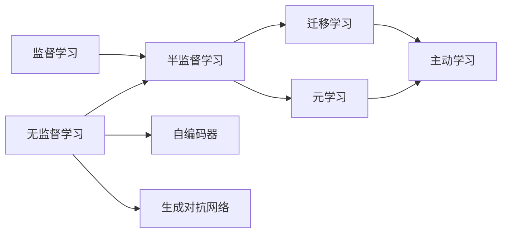

# AI人工智能核心算法原理与代码实例讲解：自主学习

## 1. 背景介绍
### 1.1 人工智能发展历程
#### 1.1.1 早期人工智能
#### 1.1.2 机器学习时代  
#### 1.1.3 深度学习时代

### 1.2 自主学习的重要性
#### 1.2.1 减少人工标注成本
#### 1.2.2 发掘数据内在规律
#### 1.2.3 适应动态环境变化

### 1.3 自主学习的挑战
#### 1.3.1 缺乏监督信息
#### 1.3.2 数据质量参差不齐
#### 1.3.3 评估标准难以确定

## 2. 核心概念与联系
### 2.1 监督学习、无监督学习、半监督学习、强化学习
### 2.2 自编码器(AutoEncoder) 
### 2.3 生成对抗网络(GAN)
### 2.4 元学习(Meta-Learning)
### 2.5 迁移学习(Transfer Learning)
### 2.6 主动学习(Active Learning) 
### 2.7 核心概念之间的联系



## 3. 核心算法原理具体操作步骤
### 3.1 自编码器(AutoEncoder)
#### 3.1.1 编码器
#### 3.1.2 解码器  
#### 3.1.3 损失函数
#### 3.1.4 训练过程

### 3.2 变分自编码器(VAE) 
#### 3.2.1 编码器
#### 3.2.2 解码器
#### 3.2.3 重参数化技巧
#### 3.2.4 损失函数

### 3.3 生成对抗网络(GAN)
#### 3.3.1 生成器
#### 3.3.2 判别器
#### 3.3.3 对抗训练过程
#### 3.3.4 损失函数

### 3.4 元学习(Meta-Learning) 
#### 3.4.1 MAML算法
#### 3.4.2 Reptile算法
#### 3.4.3 元优化器

### 3.5 主动学习(Active Learning)
#### 3.5.1 不确定性采样
#### 3.5.2 委员会机制
#### 3.5.3 基于熵的采样

## 4. 数学模型和公式详细讲解举例说明
### 4.1 自编码器(AutoEncoder)
- 编码器：$z=f(Wx+b)$ 
- 解码器：$\hat{x}=g(W'z+b')$
- 重构损失：$L(x,\hat{x})=||x-\hat{x}||^2$

### 4.2 变分自编码器(VAE)
- 编码器：$q_\phi(z|x)=N(\mu_\phi(x),\sigma^2_\phi(x)I)$
- 解码器：$p_\theta(x|z)=N(\mu_\theta(z),\sigma^2_\theta(z)I)$  
- 重参数化：$z=\mu_\phi(x)+\sigma_\phi(x)\odot\epsilon, \epsilon \sim N(0,I)$
- 损失函数：
$$L(\theta,\phi)=-E_{z\sim q_\phi(z|x)}[\log p_\theta(x|z)]+KL(q_\phi(z|x)||p(z))$$

### 4.3 生成对抗网络(GAN)
- 生成器：$\tilde{x}=G(z), z\sim p(z)$
- 判别器：$D(x)$表示$x$为真实样本的概率
- 生成器损失：$L_G=-E_{z\sim p(z)}[\log D(G(z))]$
- 判别器损失：
$$L_D=-E_{x\sim p_{data}}[\log D(x)]-E_{z\sim p(z)}[\log(1-D(G(z)))]$$

### 4.4 元学习(Meta-Learning) 
- MAML算法：
$$\theta'=\theta-\alpha\nabla_\theta L_{\mathcal{T}_i}(f_\theta)$$
$$\theta=\theta-\beta\nabla_\theta\sum_{\mathcal{T}_i \sim p(\mathcal{T})}L_{\mathcal{T}_i}(f_{\theta'})$$

### 4.5 主动学习(Active Learning)
- 不确定性采样：$x^*=\arg\max_{x} 1-P_\theta(\hat{y}|x)$
- 熵采样：$x^*=\arg\max_{x} H(y|x,\theta)=-\sum_i P_\theta(y_i|x)\log P_\theta(y_i|x)$

## 5. 项目实践：代码实例和详细解释说明
### 5.1 自编码器(AutoEncoder)实现
```python
import torch
import torch.nn as nn

class AutoEncoder(nn.Module):
    def __init__(self):
        super(AutoEncoder, self).__init__()
        self.encoder = nn.Sequential(
            nn.Linear(28*28, 128),
            nn.ReLU(),
            nn.Linear(128, 64),
            nn.ReLU(),
            nn.Linear(64, 32),
        )
        self.decoder = nn.Sequential(
            nn.Linear(32, 64),
            nn.ReLU(),
            nn.Linear(64, 128),
            nn.ReLU(),
            nn.Linear(128, 28*28),
            nn.Sigmoid()
        )

    def forward(self, x):
        z = self.encoder(x)
        recon_x = self.decoder(z)
        return recon_x
```

上述代码定义了一个简单的自编码器模型，包含编码器和解码器两部分。编码器将输入数据映射到低维隐空间，解码器再将隐空间表示重构为原始输入。通过最小化重构误差来训练自编码器。

### 5.2 变分自编码器(VAE)实现
```python
import torch
import torch.nn as nn

class VAE(nn.Module):
    def __init__(self):
        super(VAE, self).__init__()
        self.encoder = nn.Sequential(
            nn.Linear(28*28, 400),
            nn.ReLU()
        )
        self.mu = nn.Linear(400, 20)
        self.logvar = nn.Linear(400, 20)
        self.decoder = nn.Sequential(
            nn.Linear(20, 400),
            nn.ReLU(),
            nn.Linear(400, 28*28),
            nn.Sigmoid()
        )

    def encode(self, x):
        h = self.encoder(x)
        mu = self.mu(h)
        logvar = self.logvar(h)
        return mu, logvar

    def reparameterize(self, mu, logvar):
        std = torch.exp(0.5*logvar)
        eps = torch.randn_like(std)
        z = mu + eps*std
        return z

    def decode(self, z):
        recon_x = self.decoder(z)
        return recon_x

    def forward(self, x):
        mu, logvar = self.encode(x)
        z = self.reparameterize(mu, logvar)
        recon_x = self.decode(z)
        return recon_x, mu, logvar
```

变分自编码器在普通自编码器的基础上引入了变分推断，学习数据的概率分布。编码过程输出均值和方差两个参数，通过重参数化技巧采样得到隐变量表示，再经过解码器重构出原始输入。VAE的损失函数包括重构误差和KL散度正则化项。

### 5.3 生成对抗网络(GAN)实现
```python
import torch
import torch.nn as nn

class Generator(nn.Module):
    def __init__(self):
        super(Generator, self).__init__()
        self.model = nn.Sequential(
            nn.Linear(100, 256),
            nn.ReLU(),
            nn.Linear(256, 512),
            nn.ReLU(),
            nn.Linear(512, 28*28),
            nn.Tanh()
        )

    def forward(self, z):
        img = self.model(z)
        img = img.view(img.size(0), 1, 28, 28)
        return img

class Discriminator(nn.Module):
    def __init__(self):
        super(Discriminator, self).__init__()
        self.model = nn.Sequential(
            nn.Linear(28*28, 512),
            nn.LeakyReLU(0.2),
            nn.Linear(512, 256),
            nn.LeakyReLU(0.2),
            nn.Linear(256, 1),
            nn.Sigmoid()
        )

    def forward(self, img):
        img_flat = img.view(img.size(0), -1)
        validity = self.model(img_flat)
        return validity
```

生成对抗网络由生成器和判别器两部分组成，通过对抗训练的方式学习数据分布。生成器接收随机噪声作为输入，生成与真实样本尽可能相似的假样本。判别器则需要区分真实样本和生成样本。生成器和判别器通过最小最大博弈的方式进行优化。

## 6. 实际应用场景
### 6.1 图像去噪与超分辨率重建
### 6.2 异常检测
### 6.3 数据增强
### 6.4 推荐系统
### 6.5 药物发现
### 6.6 智能机器人

## 7. 工具和资源推荐
### 7.1 深度学习框架
- PyTorch
- TensorFlow
- Keras

### 7.2 开源数据集 
- MNIST
- CIFAR-10/100
- ImageNet
- Omniglot

### 7.3 论文与教程
- 《Auto-Encoding Variational Bayes》
- 《Generative Adversarial Networks》
- 《Model-Agnostic Meta-Learning for Fast Adaptation of Deep Networks》
- 《A Survey of Deep Active Learning》

## 8. 总结：未来发展趋势与挑战
### 8.1 自监督学习
### 8.2 元学习在少样本场景中的应用
### 8.3 主动学习与人机交互
### 8.4 多模态自主学习
### 8.5 隐私与安全
### 8.6 可解释性

## 9. 附录：常见问题与解答
### 9.1 自编码器和 PCA 有什么区别？ 
### 9.2 变分自编码器为什么要用重参数化技巧？
### 9.3 GAN 训练不稳定的原因有哪些？
### 9.4 如何选择合适的元学习算法？
### 9.5 主动学习如何平衡探索和利用？

自主学习作为人工智能的一个重要研究方向，旨在让机器不依赖人工标注数据，通过自我探索和交互来学习新知识、新技能。本文介绍了自主学习的核心概念、主要算法、数学原理以及代码实践。自编码器、生成对抗网络、元学习、主动学习等技术为自主学习的发展提供了有力的工具支持。

展望未来，自主学习将向着自监督学习、多模态学习、人机协同的方向不断发展，在智能机器人、药物发现、智能教育等领域得到更广泛应用。同时，自主学习系统的可解释性、隐私安全等问题也亟待进一步研究和解决。

作者：禅与计算机程序设计艺术 / Zen and the Art of Computer Programming