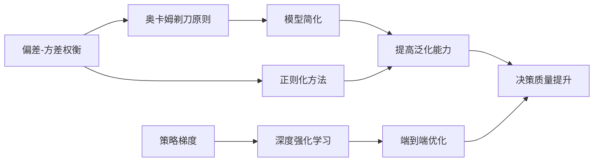

# AI人工智能深度学习算法：利用机器学习提升深度学习模型的决策质量

## 1.背景介绍

人工智能(Artificial Intelligence, AI)正在快速发展,深度学习作为其中最重要的分支,在计算机视觉、自然语言处理、语音识别等领域取得了巨大突破。然而,深度学习模型虽然在某些特定任务上已经达到甚至超过人类的表现,但在决策质量和泛化能力上仍有不足。如何进一步提升深度学习模型的决策质量,是当前AI领域亟待解决的关键问题之一。

机器学习作为人工智能的另一大分支,其特点是通过数据驱动,从经验中学习,不断优化和改进模型。将机器学习的思想和方法引入深度学习,有望克服深度模型的局限性,提升其决策质量。本文将重点探讨如何利用机器学习算法来优化深度学习模型,实现人工智能系统的进一步升级。

### 1.1 深度学习的优势与局限

深度学习的优势主要体现在以下几个方面:

- 端到端学习:通过构建多层神经网络,可以直接从原始数据中学习出有用的特征表示,无需人工设计复杂的特征工程。
- 强大的非线性拟合能力:深度神经网络通过叠加多个非线性变换,能够拟合非常复杂的函数,捕捉数据中的高阶统计信息。  
- 可扩展性:得益于GPU等硬件的发展,以及数据量的增长,深度学习模型可以不断扩大规模,学习更加强大的表示能力。

但深度学习也存在一些固有的局限性:

- 需要大量标注数据:深度模型往往需要海量的有标注训练数据才能达到较好的性能,而人工标注的成本很高。
- 泛化能力有限:训练好的深度模型在遇到训练数据分布以外的样本时,性能往往会显著下降,泛化能力有待提高。
- 决策过程不透明:深度神经网络是一个黑盒模型,其内部决策机制难以解释,这在一些对可解释性要求较高的场景下是不可接受的。
- 对抗样本问题:研究发现,深度模型非常容易被精心构造的对抗样本欺骗,这暴露了其决策机制的脆弱性。

### 1.2 机器学习的互补作用

机器学习主要关注如何从数据出发,通过优化模型在某个目标上的性能,来从经验中学习。其核心要素包括:

- 数据:机器学习基于数据进行训练和评估,需要收集和标注大量的数据样本。
- 模型:从简单的线性模型到复杂的集成学习模型,机器学习提供了丰富的模型选择。
- 优化算法:模型训练的本质是最小化某个损失函数,需要选择合适的优化算法。  
- 评估方法:交叉验证、留一法等,用于评估模型的泛化性能。

机器学习通过在统计学习理论的框架下,利用优化理论、概率论等数学工具,构建了一套完整的方法论。将机器学习与深度学习结合,可以从多个角度改进深度模型的性能:

- 数据增强:利用无监督学习和半监督学习,从无标注数据中挖掘有价值的信息,扩充训练集。
- 模型压缩:使用知识蒸馏、剪枝等技术简化模型结构,在保证性能的同时降低计算开销。
- 迁移学习:利用在其他大规模数据集上预训练的模型,进行微调,减少所需的标注样本数。 
- 元学习:从众多不同的任务中学习如何快速学习的能力,提高模型的泛化和适应能力。
- 强化学习:通过设计奖励函数,使模型在与环境的交互中学习最优决策。

综上,机器学习可以弥补深度学习的不足,提供新的优化思路和方法,二者融合发展,有望推动人工智能迈向更高的台阶。

## 2.核心概念与联系

在利用机器学习算法提升深度学习模型决策质量的过程中,有几个核心概念需要理解:

### 2.1 偏差-方差权衡

偏差-方差权衡(Bias-Variance Trade-off)是机器学习中的一个重要概念。偏差指模型的预测值与真实值之间的差异,反映了模型本身的拟合能力;方差指模型在不同训练集上学到的预测函数的差异,反映了模型的稳定性。一般来说:

- 偏差高的模型往往过于简单,无法很好地拟合数据,欠拟合;
- 方差高的模型往往过于复杂,过度拟合训练数据,泛化能力差。

优化模型的目标就是在偏差和方差之间取得平衡。一些常见的做法有:

- 增加训练数据:更多的数据有助于减少方差,但会增加训练开销;
- 降低模型复杂度:减少参数数量或引入正则化,限制模型的拟合能力;
- 集成学习:综合多个模型的预测,取平均值,可以显著降低方差。

对于深度学习模型,由于其参数量巨大,很容易过拟合,因此需要更加关注如何控制方差。一些有效的方法包括数据增广、早停法、Dropout正则化等。

### 2.2 奥卡姆剃刀原则

奥卡姆剃刀原则(Occam's Razor)是一条重要的模型选择原则。它指出,在可以解释数据的模型中,应该选择最简单的那一个。简单的模型一般参数更少,泛化能力更强,而复杂的模型往往过拟合,虽然在训练集上表现更好,但在测试集上却不尽如人意。

在深度学习中,模型往往非常庞大,参数冗余严重。运用奥卡姆剃刀原则,我们可以对模型进行适当的简化,比如:

- 减少网络的层数和神经元数量;
- 使用参数共享的卷积层替代全连接层;
- 引入L1正则化使部分参数为0;
- 进行低秩因子分解,将大矩阵拆解为多个小矩阵。

通过这些方法,在保持模型性能的同时,可以显著减小模型尺寸,加快训练和推理速度,同时也有助于提高模型的泛化能力。

### 2.3 策略梯度

强化学习是一种重要的机器学习范式,其目标是让智能体(Agent)通过与环境的交互,学习到一个最优的策略(Policy),使得期望的累积奖励最大化。策略梯度(Policy Gradient)是一类基于梯度的强化学习算法,它直接对策略函数的参数进行优化,而无需学习值函数。

策略函数 $\pi_\theta(a|s)$ 定义了在状态 $s$ 下选择动作 $a$ 的概率,其中 $\theta$ 为策略的参数。假设智能体与环境交互了 $T$ 个时间步,得到一条轨迹 $\tau=(s_0,a_0,r_0,s_1,a_1,r_1,...,s_T)$,其累积奖励为 $R(\tau)=\sum_{t=0}^{T-1} \gamma^t r_t$,其中 $\gamma$ 为折扣因子。则策略 $\pi_\theta$ 的期望累积奖励为:

$$J(\theta)=\mathbb{E}_{\tau \sim \pi_\theta}[R(\tau)]=\sum_{\tau} P(\tau|\theta) R(\tau)$$

根据策略梯度定理,策略 $\pi_\theta$ 对应的梯度为:

$$\nabla_\theta J(\theta) = \mathbb{E}_{\tau \sim \pi_\theta}[\sum_{t=0}^{T-1} \nabla_\theta \log \pi_\theta(a_t|s_t) R_t]$$

其中 $R_t=\sum_{t'=t}^{T-1} \gamma^{t'-t} r_{t'}$ 为从 $t$ 时刻开始的累积奖励。这个梯度告诉我们,应该增大得到高累积奖励的轨迹出现的概率,减小得到低奖励的轨迹出现的概率,从而更新策略以获得更高的期望奖励。

将深度学习与强化学习结合,就得到了深度强化学习(Deep Reinforcement Learning,DRL)。DRL使用深度神经网络来表示策略函数 $\pi_\theta$,并使用随机梯度上升等优化算法来更新策略网络的参数。一些代表性的DRL算法包括:

- REINFORCE:最基本的策略梯度算法,使用蒙特卡洛方法估计梯度。 
- Actor-Critic:引入值函数近似累积奖励,减小梯度估计的方差。
- TRPO和PPO:在策略更新时添加约束,使新策略与旧策略保持接近,从而获得更稳定的训练过程。

DRL在AlphaGo、Atari游戏、机器人控制等领域取得了突破性的进展,展现了深度学习与强化学习结合的巨大潜力。将DRL进一步应用到更实际的场景中,有望极大地提升深度模型的决策能力。当然,DRL算法本身还面临着样本效率低、难以收敛、难以迁移等问题,仍需要研究者们的进一步探索。

### 2.4 核心概念之间的联系

上述核心概念之间存在紧密的联系,体现了机器学习算法对深度学习的指导和优化作用:

偏差-方差权衡告诉我们要控制模型复杂度,奥卡姆剃刀原则进一步指明了应该选择尽可能简单的模型。模型简化和正则化方法都有助于提高模型的泛化能力,从而提升决策质量。另一方面,策略梯度算法与深度学习结合形成了深度强化学习范式。DRL可以端到端地优化决策过程,使模型学习到更优的策略,也能显著提升决策质量。

因此,将机器学习算法引入深度学习,并不是简单的叠加,而是一种融合创新。二者相辅相成,优势互补,共同推动着人工智能的进步与发展。

## 3.核心算法原理具体操作步骤

本节将详细介绍几种利用机器学习算法优化深度学习模型的核心算法,并给出具体的操作步骤。

### 3.1 数据增广

数据增广(Data Augmentation)是一种简单而有效的正则化方法,通过对训练样本进行随机转换,可以生成更多的样本,从而扩大训练集,提高模型的泛化能力。常见的图像数据增广方法包括:

1. 随机翻转:水平或垂直翻转图像。
2. 随机裁剪:从原图中随机裁剪出指定大小的子图。
3. 随机旋转:对图像进行随机角度的旋转。
4. 随机缩放:按随机比例缩小或放大图像。
5. 随机平移:在水平或垂直方向上对图像进行随机位移。
6. 随机噪声:叠加随机的高斯噪声、椒盐噪声等。
7. 随机颜色变换:改变图像的亮度、对比度、饱和度等。

数据增广的一般操作步骤如下:

1. 确定数据增广方案,选择合适的增广方法及其参数范围。
2. 定义数据增广流水线,将各种增广方法串联起来。
3. 在每个训练批次中,随机对批次内的样本施加数据增广。
4. 将增广后的样本输入网络进行训练。
5. 测试时,可以使用确定性的数据增广(如中心裁剪),或对多次增广的结果取平均。

数据增广可以显著改善深度模型的性能,尤其是在训练样本较少时。但也要注意,过度的数据增广可能引入噪声,导致模型欠拟合。增广方法的选择要根据任务和