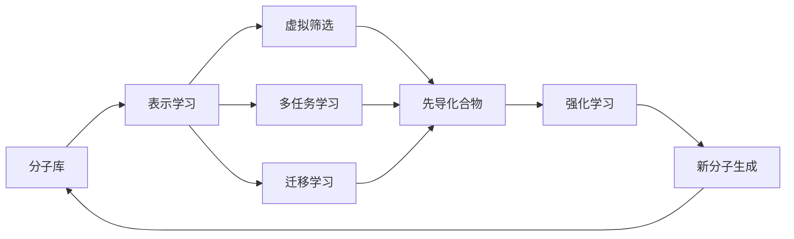
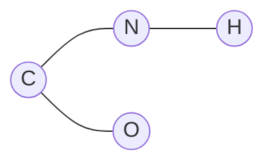

# AI人工智能深度学习算法：在药物研发中的应用

## 1.背景介绍

### 1.1 人工智能在医药领域的应用现状

近年来,人工智能技术在医药领域得到了广泛应用。从药物发现、临床试验到药物生产和管理,AI正在重塑制药行业的各个环节。特别是在新药研发领域,AI技术展现出巨大潜力,有望加速药物发现和开发过程,降低研发成本,提高成功率。

### 1.2 深度学习算法的兴起

深度学习作为人工智能的一个重要分支,近年来取得了突破性进展。以卷积神经网络(CNN)、循环神经网络(RNN)、生成对抗网络(GAN)为代表的深度学习算法,在计算机视觉、自然语言处理、语音识别等领域取得了超越人类的表现。深度学习强大的特征提取和建模能力,使其在药物研发中得到越来越多的应用。

### 1.3 深度学习在药物研发中的优势

与传统的计算机辅助药物设计方法相比,深度学习具有以下优势:

1. 自动学习分子特征:深度学习算法可以自动从大量分子数据中学习提取有效特征,无需人工设计特征。
2. 捕捉分子的非线性关系:深度神经网络可以建模分子内部以及分子与靶点间的复杂非线性关系。  
3. 端到端学习:深度学习支持端到端学习,可以直接从分子结构预测其药物属性,简化建模流程。
4. 泛化能力强:训练好的深度学习模型可以很好地泛化到新分子,预测其性质。

因此,深度学习有望成为AI驱动药物研发的核心技术之一。

## 2.核心概念与联系

### 2.1 表示学习(Representation Learning)

表示学习是深度学习的核心概念之一。其目标是学习数据的有效特征表示,使后续的学习任务更加简单有效。在药物研发中,表示学习主要应用于以下两个方面:

1. 分子表示学习:学习分子的低维稠密向量表示,捕捉分子的化学和结构信息。常用方法包括分子指纹、分子图表示学习等。

2. 药物-靶点相互作用表示学习:学习药物分子和靶点蛋白的联合表示,预测两者的相互作用强度。常用方法包括基于深度学习的药物-靶点相互作用预测等。

### 2.2 多任务学习(Multitask Learning)

多任务学习通过同时学习多个相关任务,利用任务之间的相关性,提升模型的泛化性能。在药物研发中,一个分子往往具有多种属性如溶解度、毒性、稳定性等,这些属性之间存在一定相关性。多任务学习可以通过共享网络层同时预测分子的多个属性,从而获得更加鲁棒和准确的预测模型。

### 2.3 迁移学习(Transfer Learning)

迁移学习利用在源领域学习到的知识,来帮助目标领域的学习任务。在药物研发中,一些学习任务如毒性预测的数据较少,而溶解度预测的数据较多。迁移学习可以利用溶解度预测模型学习到的分子表示,来帮助提升毒性预测的性能。此外,还可以利用在大规模分子库上预训练的模型,迁移到具体的药物研发任务中。

### 2.4 强化学习(Reinforcement Learning)

强化学习是一种让智能体在与环境交互中学习最优决策的机器学习范式。将其应用到药物研发中,可以让模型学习生成具有特定性质的药物分子。具体而言,将分子生成过程建模为马尔可夫决策过程,通过设计适当的奖励函数,让模型学习生成药物相似性高、成药性好的分子。

下图展示了这些核心概念在药物研发流程中的关系和应用:



## 3.核心算法原理与具体操作步骤

本节将重点介绍两个在药物研发中应用广泛的深度学习算法:图卷积神经网络和生成对抗网络。

### 3.1 图卷积神经网络(Graph Convolutional Network, GCN)

图卷积神经网络是一种专门处理图结构数据的深度学习模型。由于分子可以天然表示为图的形式,其中原子为节点,化学键为边,因此GCN非常适合处理分子数据。GCN可以自动学习分子的图表示,捕捉原子之间的相互作用,从而预测分子的各种属性。

GCN的核心是图卷积层,其具体操作步骤如下:

1. 初始化每个原子的特征向量$h_v^{(0)}$,通常使用one-hot编码或原子属性。

2. 对于第$l$层图卷积,更新每个原子的特征为:
$$
h_v^{(l)}=\sigma\left(\sum_{u\in N(v)}\frac{1}{c_{uv}}W^{(l)}h_u^{(l-1)}\right)
$$
其中$N(v)$为原子$v$的邻居原子集合,$c_{uv}$为归一化常数,通常取$\sqrt{|N(u)||N(v)|}$,$W^{(l)}$为可学习的权重矩阵,$\sigma$为激活函数如ReLU。

3. 堆叠多层图卷积层,不断更新原子的特征表示。

4. 使用图池化层如全局求和池化,将整个分子的表示聚合为一个向量。

5. 将分子向量输入到全连接层,预测分子的属性。

通过端到端训练GCN,可以让模型自动学习分子的图表示,并根据图表示预测分子的属性。

### 3.2 生成对抗网络(Generative Adversarial Network, GAN)

生成对抗网络由生成器和判别器两部分组成,通过两者的博弈学习,可以生成与真实数据分布相似的样本。将GAN应用于药物研发,可以学习生成具有药物相似性的新分子。

GAN的具体操作步骤如下:

1. 生成器$G$接受随机噪声$z$作为输入,生成分子$G(z)$。通常使用多层感知机或RNN作为生成器。

2. 判别器$D$接受分子作为输入,预测其为真实分子的概率$D(x)$。通常使用GCN作为判别器。

3. 生成器和判别器通过最小最大博弈目标函数进行优化:
$$
\min_G\max_D V(D,G)=\mathbb{E}_{x\sim p_{data}(x)}[\log D(x)]+\mathbb{E}_{z\sim p_z(z)}[\log (1-D(G(z)))]
$$
其中$p_{data}$为真实分子的分布,$p_z$为噪声的先验分布。

4. 交替训练生成器和判别器,使生成器生成的分子越来越逼真,判别器越来越难以区分真假分子。

5. 训练完成后,使用生成器采样生成新的药物分子。

通过GAN的对抗学习,可以让模型自动学习药物分子的分布,从而生成具有成药性的新分子。

## 4.数学模型和公式详细讲解举例说明

本节将详细讲解GCN中的图卷积公式,并举例说明其计算过程。

### 4.1 图卷积公式讲解

图卷积的核心是聚合节点的邻居信息,更新节点的特征表示。公式如下:

$$
h_v^{(l)}=\sigma\left(\sum_{u\in N(v)}\frac{1}{c_{uv}}W^{(l)}h_u^{(l-1)}\right)
$$

其中:
- $h_v^{(l)}$表示第$l$层卷积后节点$v$的特征向量
- $N(v)$为节点$v$的邻居节点集合
- $c_{uv}$为归一化常数,通常取$\sqrt{|N(u)||N(v)|}$
- $W^{(l)}$为第$l$层卷积的可学习权重矩阵  
- $\sigma$为激活函数,通常使用ReLU

直观理解,图卷积就是将节点的邻居特征进行加权求和,然后通过非线性激活函数得到节点的新特征。通过多层图卷积的堆叠,可以聚合节点的多跳邻居信息。

### 4.2 图卷积计算举例

下面以一个简单的分子图为例,演示图卷积的计算过程。

假设有一个分子图如下:



每个节点的初始特征为one-hot编码:

$$
h_A^{(0)}=[1,0,0],h_B^{(0)}=[0,1,0],h_C^{(0)}=[0,0,1],h_D^{(0)}=[0,0,0]
$$

假设第一层图卷积的权重矩阵为:

$$
W^{(1)}=
\begin{bmatrix}
1 & 2 & -1\\ 
1 & -1 & 1\\
-1 & 1 & 1
\end{bmatrix}
$$

归一化常数$c_{uv}=1$,激活函数为ReLU。

则第一层卷积后,各个节点的特征为:

$$
\begin{aligned}
h_A^{(1)}&=\text{ReLU}\left(W^{(1)}h_B^{(0)}+W^{(1)}h_C^{(0)}\right)\\
&=\text{ReLU}\left(
\begin{bmatrix}
1 & 2 & -1\\ 
1 & -1 & 1\\
-1 & 1 & 1
\end{bmatrix}
\begin{bmatrix}
0\\ 
1\\
0
\end{bmatrix}+
\begin{bmatrix}
1 & 2 & -1\\ 
1 & -1 & 1\\
-1 & 1 & 1
\end{bmatrix}
\begin{bmatrix}
0\\ 
0\\
1
\end{bmatrix}
\right)\\
&=\text{ReLU}\left(
\begin{bmatrix}
2\\ 
-1\\
1
\end{bmatrix}+
\begin{bmatrix}
-1\\ 
1\\
1
\end{bmatrix}
\right)\\
&=\text{ReLU}\left(
\begin{bmatrix}
1\\ 
0\\
2
\end{bmatrix}
\right)=
\begin{bmatrix}
1\\ 
0\\
2
\end{bmatrix}
\end{aligned}
$$

类似地,可以计算出其他节点的特征:

$$
h_B^{(1)}=
\begin{bmatrix}
1\\ 
1\\
1
\end{bmatrix},
h_C^{(1)}=
\begin{bmatrix}
1\\ 
0\\
0
\end{bmatrix},
h_D^{(1)}=
\begin{bmatrix}
0\\ 
1\\
0
\end{bmatrix}
$$

可以看到,图卷积更新后的节点特征聚合了邻居节点的信息。通过多层图卷积的堆叠,可以捕捉节点的高阶交互,从而学习到更加丰富的节点表示。

## 5.项目实践:代码实例和详细解释说明

下面给出使用PyTorch Geometric实现GCN分子属性预测的示例代码,并详细解释说明。

```python
import torch
import torch.nn as nn
import torch.nn.functional as F
from torch_geometric.nn import GCNConv
from torch_geometric.data import DataLoader

# 定义GCN模型
class GCN(nn.Module):
    def __init__(self, input_dim, hidden_dim, output_dim):
        super(GCN, self).__init__()
        self.conv1 = GCNConv(input_dim, hidden_dim)
        self.conv2 = GCNConv(hidden_dim, output_dim)

    def forward(self, data):
        x, edge_index = data.x, data.edge_index
        x = self.conv1(x, edge_index)
        x = F.relu(x)
        x = self.conv2(x, edge_index)
        return x

# 加载数据集
from torch_geometric.datasets import MoleculeNet
dataset = MoleculeNet(root='.', name='ESOL')

# 划分数据集
train_dataset = dataset[:800]
val_dataset = dataset[