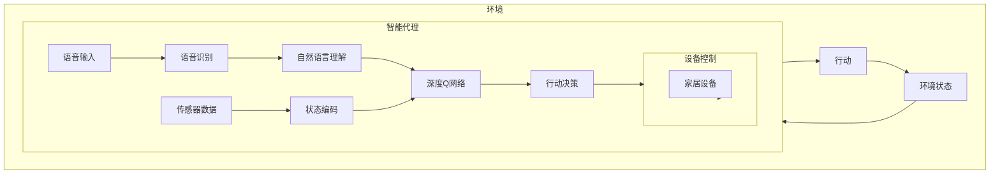

# AI人工智能深度学习算法：智能深度学习代理在智能家居场景中的应用

## 1. 背景介绍

### 1.1 智能家居的崛起

随着科技的飞速发展,人工智能(AI)和物联网(IoT)技术的融合正在推动智能家居的快速普及。智能家居系统旨在通过集成各种智能设备和传感器,为用户提供舒适、便利和高效的居住体验。智能家居不仅可以自动化家居设备的控制,还能够通过数据分析和机器学习算法实现个性化的服务和优化。

### 1.2 智能家居面临的挑战

尽管智能家居带来了诸多便利,但也面临着一些挑战:

1. **数据隐私和安全**: 智能家居系统收集和处理大量个人数据,如何保护用户隐私是一个重要问题。
2. **系统复杂性**: 智能家居涉及多种设备和技术的集成,系统的复杂性给开发和维护带来了挑战。
3. **用户体验**: 如何提供直观且人性化的用户交互界面,使智能家居系统易于使用和控制。
4. **可扩展性和兼容性**: 随着新设备和技术的不断出现,智能家居系统需要具备良好的可扩展性和兼容性。

### 1.3 深度学习在智能家居中的作用

深度学习作为人工智能的一个重要分支,在智能家居领域发挥着越来越重要的作用。通过构建智能深度学习代理,可以有效地解决上述挑战,提升智能家居系统的性能和用户体验。

## 2. 核心概念与联系

### 2.1 深度学习概述

深度学习(Deep Learning)是机器学习的一种新技术,它模仿人脑的结构和功能,通过构建深层神经网络来自动学习数据特征,并用于各种复杂任务,如图像识别、语音识别、自然语言处理等。与传统的机器学习算法相比,深度学习具有自动提取特征、端到端学习、高度非线性映射等优势。

### 2.2 智能代理概念

智能代理(Intelligent Agent)是一种自主的软件实体,能够感知环境、处理信息、做出决策并采取行动,以实现特定目标。智能代理通常具备以下几个关键特征:

1. **自主性**: 能够独立地做出决策和行动,而不需要人工干预。
2. **反应性**: 能够及时感知环境变化并做出相应反应。
3. **主动性**: 能够根据目标和动机主动采取行动。
4. **社交性**: 能够与人类或其他智能体进行交互和协作。

### 2.3 深度学习智能代理

深度学习智能代理是指将深度学习技术与智能代理概念相结合的一种新型人工智能系统。它利用深度神经网络来感知和理解环境,并基于学习到的知识做出决策和行动,从而实现自主智能。

在智能家居场景中,深度学习智能代理可以充当智能助理的角色,通过语音、图像、传感器数据等多模态输入,理解用户的需求和环境状态,并控制家居设备执行相应的操作,为用户提供个性化和智能化的服务体验。

## 3. 核心算法原理具体操作步骤

### 3.1 深度神经网络架构

深度学习智能代理的核心是深度神经网络架构,常见的网络结构包括卷积神经网络(CNN)、递归神经网络(RNN)、长短期记忆网络(LSTM)等。这些网络结构能够有效地处理不同类型的输入数据,如图像、语音、文本等。

以卷积神经网络为例,其基本操作包括卷积(Convolution)、池化(Pooling)和全连接层(Fully Connected Layer)。卷积层用于提取输入数据的局部特征,池化层用于降低特征维度,全连接层则将提取的特征映射到输出空间。通过反向传播算法对网络进行训练,可以自动学习输入数据的特征表示。

### 3.2 强化学习算法

智能代理需要根据环境状态做出合理的行动决策,这可以通过强化学习算法来实现。强化学习是一种基于环境反馈的学习方式,智能体(Agent)通过与环境交互,获得奖励或惩罚信号,并根据这些信号调整自身的策略,以最大化累积奖励。

常见的强化学习算法包括Q-Learning、Deep Q-Network(DQN)、Policy Gradient等。这些算法能够在不断的试错过程中,逐步优化智能体的决策策略,最终达到理想的行为。

### 3.3 端到端学习流程

将深度神经网络和强化学习相结合,可以构建端到端的深度学习智能代理系统。整个学习流程可分为以下几个步骤:

1. **环境感知**: 通过各种传感器获取环境数据,如图像、语音、温度等。
2. **数据预处理**: 对原始数据进行预处理,如降噪、标准化等,以适应神经网络的输入格式。
3. **特征提取**: 利用深度神经网络自动提取输入数据的特征表示。
4. **决策制定**: 基于提取的特征和当前状态,通过强化学习算法制定行动决策。
5. **行动执行**: 将决策转化为具体的操作指令,并执行相应的动作。
6. **反馈收集**: 从环境中获取行动的反馈,如奖励或惩罚信号。
7. **策略优化**: 根据反馈信号,调整神经网络参数和决策策略,以优化智能体的行为。

通过不断的迭代学习,深度学习智能代理可以逐步提高其对环境的理解能力和决策水平,最终实现自主智能。

## 4. 数学模型和公式详细讲解举例说明

### 4.1 卷积神经网络数学模型

卷积神经网络(CNN)是深度学习中一种常用的网络结构,擅长处理图像和视频等高维数据。CNN的核心操作是卷积(Convolution),它通过滤波器(Filter)在输入数据上滑动,提取局部特征。

设输入数据为$I$,卷积核为$K$,卷积操作可表示为:

$$
O(i, j) = \sum_{m}\sum_{n}I(i+m, j+n)K(m, n)
$$

其中,$(i, j)$表示输出特征图$O$的位置,$(m, n)$表示卷积核$K$的位置。通过在整个输入数据上滑动卷积核,可以获得一个新的特征映射$O$。

另一个重要操作是池化(Pooling),它用于降低特征维度,提高网络的鲁棒性和计算效率。常见的池化方法包括最大池化(Max Pooling)和平均池化(Average Pooling)。

对于一个$2 \times 2$的池化窗口,最大池化可表示为:

$$
O(i, j) = \max_{(m, n) \in R}I(i+m, j+n)
$$

其中,$R$表示池化窗口的区域。

通过多层卷积和池化操作,CNN可以逐步提取输入数据的高级语义特征,并将其映射到输出空间,实现目标任务(如图像分类、目标检测等)。

### 4.2 Q-Learning算法

Q-Learning是一种常用的强化学习算法,它通过估计状态-行动对的长期回报值(Q值),来优化智能体的决策策略。

设$s$表示当前状态,$a$表示可选行动,$r$表示获得的即时奖励,$s'$表示执行行动$a$后转移到的新状态,则Q值可以根据下式进行迭代更新:

$$
Q(s, a) \leftarrow Q(s, a) + \alpha \left[ r + \gamma \max_{a'} Q(s', a') - Q(s, a) \right]
$$

其中,$\alpha$是学习率,$\gamma$是折现因子,用于权衡即时奖励和未来回报的重要性。

在每个时间步,智能体会选择Q值最大的行动作为决策:

$$
a^* = \arg\max_a Q(s, a)
$$

为了平衡探索(Exploration)和利用(Exploitation)的关系,常采用$\epsilon$-贪婪(epsilon-greedy)策略,即以$\epsilon$的概率随机选择行动,以$1-\epsilon$的概率选择当前Q值最大的行动。

通过不断与环境交互并更新Q值,Q-Learning算法可以逐步优化智能体的决策策略,最终收敛到一个近似最优的策略。

### 4.3 Deep Q-Network算法

Deep Q-Network(DQN)是将Q-Learning与深度神经网络相结合的算法,它使用神经网络来估计Q值函数,从而能够处理高维、连续的状态空间。

DQN的核心思想是使用一个深度神经网络$Q(s, a; \theta)$来近似Q值函数,其中$\theta$表示网络参数。网络的输入是当前状态$s$,输出是所有可选行动的Q值。

在训练过程中,DQN通过最小化损失函数来优化网络参数$\theta$:

$$
L(\theta) = \mathbb{E}_{(s, a, r, s')} \left[ \left( r + \gamma \max_{a'} Q(s', a'; \theta^-) - Q(s, a; \theta) \right)^2 \right]
$$

其中,$\theta^-$表示目标网络(Target Network)的参数,用于估计$\max_{a'} Q(s', a')$,以提高训练的稳定性。

DQN还采用了经验回放(Experience Replay)和固定Q值目标(Fixed Q-Targets)等技术,进一步提高了算法的性能和收敛速度。

通过端到端的训练,DQN可以直接从原始输入数据(如图像、传感器读数等)中学习最优的Q值函数,从而实现高效的决策制定。

## 5. 项目实践: 代码实例和详细解释说明

为了更好地理解深度学习智能代理在智能家居场景中的应用,我们将通过一个具体的项目实践来演示。该项目旨在构建一个基于深度强化学习的智能家居控制系统,能够根据用户的语音命令和环境传感器数据,自动控制家居设备(如灯光、温控等),为用户提供智能化和个性化的服务体验。

### 5.1 系统架构

整个系统的架构如下所示:



系统的主要组件包括:

1. **语音识别模块**: 将用户的语音命令转换为文本。
2. **自然语言理解模块**: 分析语音命令的语义,提取用户的意图和相关实体。
3. **状态编码模块**: 将环境传感器数据(如温度、湿度等)编码为状态向量。
4. **深度Q网络(DQN)**: 根据语义理解结果和状态向量,通过强化学习算法制定行动决策。
5. **设备控制模块**: 将决策转化为具体的控制指令,并执行相应的家居设备操作。

### 5.2 核心代码实现

以下是深度Q网络(DQN)的核心代码实现,使用PyTorch框架:

```python
import torch
import torch.nn as nn
import torch.optim as optim

class DQN(nn.Module):
    def __init__(self, state_dim, action_dim):
        super(DQN, self).__init__()
        self.fc1 = nn.Linear(state_dim, 128)
        self.fc2 = nn.Linear(128, 64)
        self.fc3 = nn.Linear(64, action_dim)

    def forward(self, state):
        x = torch.relu(self.fc1(state))
        x = torch.relu(self.fc2(x))
        q_values = self.fc3(x)
        return q_values

def train(env, agent, num_episodes):
    for episode in range(num_episodes):
        state = env.reset()
        done = False
        while not done:
            action = agent.get_action(state)
            next_state, reward, done, _ = env.step(action)
            agent.update(state, action, rewar