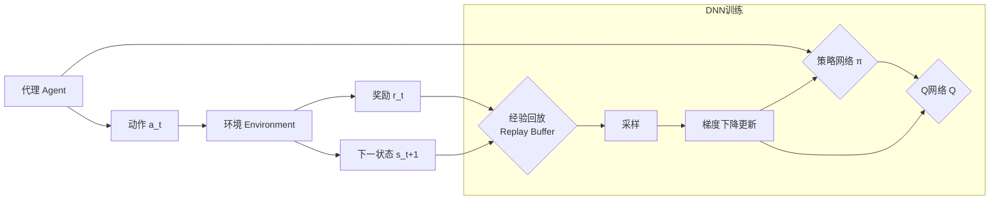

# AI人工智能深度学习算法：智能深度学习代理的使用强化学习优化决策

## 1.背景介绍

人工智能(Artificial Intelligence, AI)是计算机科学的一个分支,它致力于创造能够模仿人类智能行为的机器。近年来,随着计算机硬件性能的不断提升和大数据时代海量数据的积累,AI技术取得了突飞猛进的发展,尤其是在深度学习(Deep Learning, DL)和强化学习(Reinforcement Learning, RL)领域。

深度学习利用多层神经网络从海量数据中自动提取特征,建立高度非线性的复杂模型,在计算机视觉、语音识别、自然语言处理等领域取得了超越人类的性能。而强化学习则让智能体(Agent)通过与环境的交互,在 trial-and-error 中不断学习和优化决策策略,实现类似人类的goal-directed 行为。 

将DL和RL结合,利用DL强大的表示学习能力和RL灵活的决策优化能力,可以创造出功能更加强大的AI系统。这种深度强化学习(Deep Reinforcement Learning, DRL)代理,能够直接从原始的高维观测数据(如图像、文本)中学习策略,应对更加复杂的现实世界任务。DRL在AlphaGo击败人类围棋冠军、Dota2游戏AI击败职业选手等里程碑式事件中展现了令人瞩目的成就。

本文将重点探讨DRL智能代理的核心概念、关键算法、数学原理、代码实践和应用场景,分享这一前沿技术领域的最新进展与未来展望,为AI研究者和从业者提供参考和启发。

## 2.核心概念与联系

要理解DRL,首先需要掌握几个核心概念:

### 2.1 马尔可夫决策过程(Markov Decision Process, MDP)

MDP提供了对RL问题的数学建模。一个MDP由状态集合S、动作集合A、状态转移概率P、奖励函数R和折扣因子γ组成。在每个时间步t,代理根据当前状态s_t选择动作a_t,环境根据 P(s_t, a_t) 转移到下一状态s_{t+1},并给予奖励r_t。RL的目标是学习一个策略π(a|s),使得在MDP中获得的累积奖励最大化。

### 2.2 值函数(Value Function)

值函数V^π(s)表示从状态s开始,遵循策略π能获得的期望累积奖励。而动作值函数(Q-function)Q^π(s,a)则表示在状态s下选择动作a,之后遵循π能获得的期望回报。值函数刻画了状态或状态-动作对的长期价值,是RL的核心。大多数RL算法都是通过学习值函数,来间接得到最优策略的。

### 2.3 策略(Policy)

策略π定义了代理的行为模式,即在每个状态下如何选择动作。策略可以是确定性的a=π(s),也可以是随机性的π(a|s)。RL要优化的目标策略记为π^*,使得值函数达到最大。策略梯度(Policy Gradient)类算法直接对策略函数π进行梯度上升来学习,而值迭代(Value Iteration)、策略迭代(Policy Iteration)等则通过迭代更新值函数得到最优策略。

### 2.4 探索与利用(Exploration vs. Exploitation)

RL面临探索-利用困境。代理需要在探索新的可能性(可能发现更优策略)和利用已有的最佳策略(眼前利益最大化)之间权衡。ε-greedy 和 Upper Confidence Bound (UCB) 是常用的探索策略。

### 2.5 深度神经网络(Deep Neural Network, DNN)

DNN利用多层感知机(Multilayer Perceptron, MLP)、卷积神经网络(Convolutional Neural Network, CNN)、循环神经网络(Recurrent Neural Network, RNN)等模型,逼近值函数、策略函数,将RL扩展到高维、连续状态空间。DNN强大的函数拟合和表示学习能力,使得DRL代理能直接从原始数据中端到端地学习复杂策略。

### 2.6 Experience Replay

为了提高DNN训练的采样效率和稳定性,DRL引入了经验回放机制。代理与环境交互产生的转移数据(s_t, a_t, r_t, s_{t+1})被存储到一个回放缓冲区(Replay Buffer)中,训练时从中随机采样一个批次用于DNN参数更新。这打破了数据的时序关联性,减少了训练的方差。

下图展示了DRL代理的整体架构和训练流程:



## 3.核心算法原理具体操作步骤

DRL有多种不同的算法范式,下面重点介绍几种代表性算法的原理和步骤。

### 3.1 Deep Q-Network (DQN)

DQN是将Q学习与DNN结合的经典算法。它使用DNN逼近Q函数,通过最小化时序差分(TD)误差来训练。

1. 初始化Q网络参数θ,目标Q网络参数θ^-=θ
2. 初始化经验回放缓冲区D
3. for episode = 1 to M do
    1. 初始化初始状态s_1
    2. for t = 1 to T do
        1. 根据ε-greedy策略选择动作a_t
        2. 执行动作a_t,观察奖励r_t和下一状态s_{t+1}
        3. 将转移(s_t, a_t, r_t, s_{t+1})存入D 
        4. 从D中随机采样一个批次的转移数据
        5. 计算TD目标: y_i = r_i + γ max_{a'}Q(s_{i+1},a';θ^-)
        6. 最小化TD误差: L(θ) = E[(y_i - Q(s_i,a_i;θ))^2]
        7. 每C步同步目标网络参数: θ^- = θ
        8. s_t = s_{t+1}
    3. end for
4. end for

### 3.2 Double DQN

Double DQN通过解耦动作选择和动作评估,减少了Q值估计的过高偏差。

将TD目标更新为:
$y_i = r_i + γ Q(s_{i+1}, argmax_a Q(s_{i+1},a;θ);θ^-)$

### 3.3 Dueling DQN

Dueling DQN将Q网络分为状态值V(s)和优势函数A(s,a)两部分,更有效地学习状态价值。

网络输出为: 
$Q(s,a;θ,α,β) = V(s;θ,β) + (A(s,a;θ,α) - \frac{1}{|A|} \sum_{a'} A(s,a';θ,α))$

### 3.4 Deep Deterministic Policy Gradient (DDPG)

DDPG结合了DQN和确定性策略梯度(DPG),可以处理连续动作空间。

1. 初始化参数:演员网络μ(s;θ^μ),评论家网络Q(s,a;θ^Q),对应的目标网络参数θ^μ^-和θ^Q^-
2. 初始化经验回放缓冲区D
3. for episode = 1 to M do 
    1. 初始化初始状态s_1,OU噪声过程N
    2. for t = 1 to T do
        1. 根据噪声策略选择动作: a_t = μ(s_t;θ^μ) + N_t
        2. 执行a_t,观察r_t和s_{t+1},存入D
        3. 从D采样一个批次数据
        4. 计算TD目标: y_i = r_i + γ Q'(s_{i+1}, μ'(s_{i+1};θ^μ^-);θ^Q^-)
        5. 更新评论家: θ^Q = argmin_θ^Q \frac{1}{N} \sum_i (y_i - Q(s_i,a_i;θ^Q))^2
        6. 更新演员: θ^μ = θ^μ + \frac{1}{N} \sum_i \nabla_a Q(s,a;θ^Q)|_{s=s_i,a=μ(s_i)} \nabla_{θ^μ} μ(s;θ^μ)|_{s_i}
        7. 软更新目标网络参数: θ^Q^- = τθ^Q + (1-τ)θ^Q^-, θ^μ^- = τθ^μ + (1-τ)θ^μ^-
        8. s_t = s_{t+1}
    3. end for
4. end for

### 3.5 Asynchronous Advantage Actor-Critic (A3C)

A3C采用异步多线程并行训练,每个线程与环境独立交互,更新全局共享的演员-评论家网络。

1. 初始化全局共享参数:演员θ^π和评论家θ^v
2. for each thread do
    1. 初始化线程环境状态s
    2. 初始化线程参数: θ'^π=θ^π, θ'^v=θ^v
    3. t_start = t
    4. for t = 1 to T_max do
        1. 根据策略π(a|s;θ'^π)选择a_t
        2. 执行a_t,观察r_t和s_{t+1}
        3. 若s_{t+1}是终止状态,则R=0;否则R=V(s_{t+1};θ'^v)
        4. 计算优势函数: A = \sum_{i=0}^{k-1} γ^i r_{t+i} + γ^k R - V(s_t;θ'^v)
        5. 计算策略损失: L^π = - log π(a_t|s_t;θ'^π) A
        6. 计算值函数损失: L^v = \frac{1}{2}(R - V(s_t;θ'^v))^2
        7. 计算熵正则化: H^π = - \sum_a π(a|s_t;θ'^π) log π(a|s_t;θ'^π)
        8. 计算总损失: L = L^π + α L^v - βH^π
        9. 计算L关于θ'^π,θ'^v的梯度,异步地更新到θ^π,θ^v
        10. 每隔一定步数,θ'^π=θ^π, θ'^v=θ^v
        11. s_t = s_{t+1}
    5. end for
3. end for

## 4.数学模型和公式详细讲解举例说明

本节详细推导DRL涉及的一些关键数学模型和公式。

### 4.1 MDP的贝尔曼方程

对于MDP,最优状态值函数V^*(s)满足贝尔曼最优性方程:

$$V^*(s) = \max_a \sum_{s',r} p(s',r|s,a)[r + γV^*(s')]$$

最优动作值函数Q^*(s,a)满足:

$$Q^*(s,a) = \sum_{s',r} p(s',r|s,a)[r + γ\max_{a'}Q^*(s',a')]$$

例如,考虑一个简单的网格世界MDP:

```
+---+---+---+
| 0 | 0 | 1 |
+---+---+---+
| 0 |-1 | 0 |
+---+---+---+
```

状态空间S={s1,s2,s3,s4,s5},动作空间A={上,下,左,右},奖励函数R(s5)=1,R(s4)=-1,其他为0,折扣因子γ=0.9。

根据贝尔曼方程,可以迭代计算最优值函数:

初始化V(s)=0,
V^*(s1) = max[γV^*(s1), γV^*(s2)] = 0
V^*(s2) = max[γV^*(s1), γV^*(s3), γV^*(s5)] = 0.9
V^*(s3) = max[γV^*(s2), γV^*(s4)] = 0
...

收敛后得到:
V^*(s1)=0.81, V^*(s2)=0.9, V^*(s3)=-0.09, V^*(s4)=-1, V^*(s5)=1

最优策略为:
π^*(s1)=右, π^*(s2)=右, π^*(s3)=上, π^*(s4)=上/右, π^*(s5)=任意

### 4.2 策略梯度定理

定义性能度量函数J(θ)为在