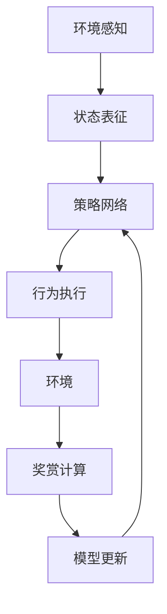
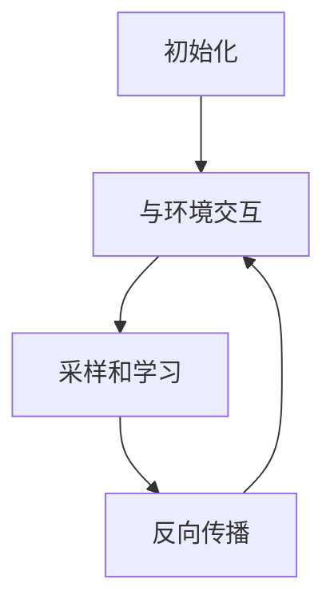
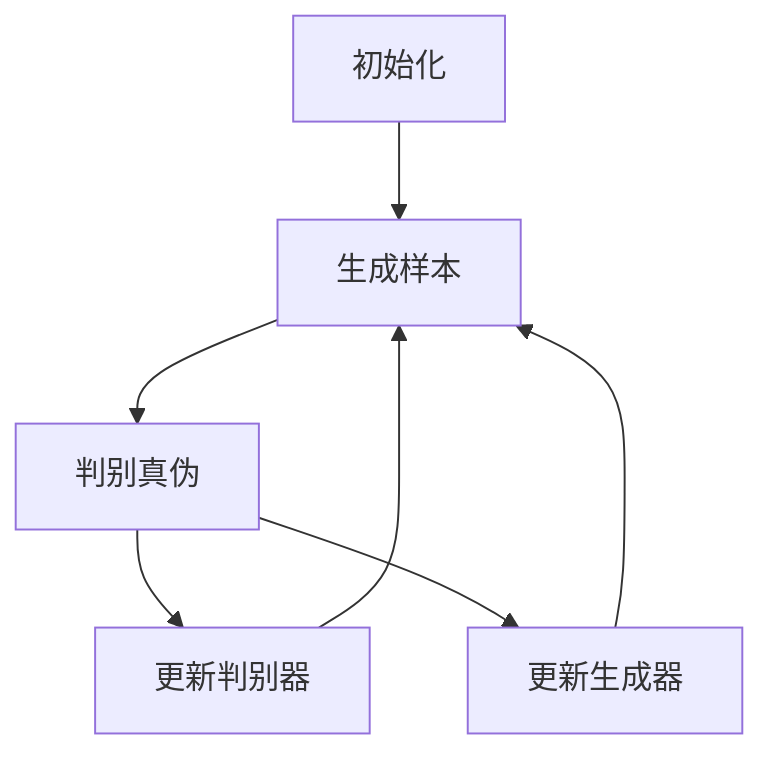

# AI人工智能深度学习算法：深度学习代理工作流的可视化与用户交互设计

## 1.背景介绍

### 1.1 人工智能和深度学习的兴起

人工智能(AI)是当代科技领域最具变革性的力量之一。近年来,由于算力的飞速提升、海量数据的积累以及深度学习算法的突破,AI技术取得了长足的进步,在图像识别、自然语言处理、决策优化等多个领域展现出了超人的能力。

深度学习是AI的核心驱动力,它通过构建深层神经网络模型,模仿人脑的信息处理机制,从大量数据中自动学习特征模式,实现对复杂问题的高精度预测和决策。这种端到端的学习方式,使得深度学习能够突破传统机器学习算法的瓶颈,在处理高维非线性问题时表现出卓越的性能。

### 1.2 深度学习代理的概念

深度学习代理(Deep Learning Agent)是将深度学习技术应用于智能决策系统的一种范式。它通过神经网络模型来表征环境状态和行为策略的映射关系,从而实现对复杂环境的感知、决策和执行。

深度学习代理在许多领域发挥着重要作用,如游戏AI、机器人控制、自动驾驶、智能调度等。它们能够从海量环境数据中学习出高效的决策策略,从而实现自主智能。与此同时,深度学习代理也面临着可解释性、鲁棒性、安全性等诸多挑战。

### 1.3 可视化和用户交互的重要性

尽管深度学习代理在许多领域展现出卓越的性能,但它们的内部运作机制往往是一个"黑箱"。由于缺乏可解释性,很难让人类理解和信任这些智能系统。此外,在实际应用中,人机协作是不可或缺的,需要设计良好的用户交互界面,使人类能够高效地与智能代理进行沟通和控制。

因此,对深度学习代理工作流的可视化和用户交互设计至关重要。可视化技术能够直观地呈现代理的内部状态和决策过程,提高透明度和可解释性。良好的交互设计则能够增强人机协作的效率和体验。这不仅有助于提高人们对AI系统的信任和接受度,也是推动AI技术在实际场景中落地应用的关键。

## 2.核心概念与联系

### 2.1 深度学习代理的工作流程

深度学习代理的工作流程通常包括以下几个关键环节:

1. **环境感知(Environment Perception)**: 通过各种传感器获取环境状态信息,如图像、声音、位置等。

2. **状态表征(State Representation)**: 将获取的环境信息转换为适合神经网络处理的数据格式,如特征向量或张量。

3. **策略网络(Policy Network)**: 基于当前状态,通过深度神经网络模型预测出最优的行为策略。

4. **行为执行(Action Execution)**: 根据策略网络的输出,执行相应的行为,如移动、操作等,并将行为反馈至环境。

5. **奖赏计算(Reward Computation)**: 根据行为的结果,计算获得的奖赏值,作为强化学习的反馈信号。

6. **模型更新(Model Update)**: 利用奖赏信号,通过策略梯度等算法,优化策略网络的参数,提高决策能力。

这个循环不断重复,直至代理达到期望的行为水平。在实际应用中,这个工作流程可能会有所调整和扩展,以适应特定的任务需求。



### 2.2 可视化和交互设计的作用

可视化和交互设计在深度学习代理的工作流程中扮演着重要的角色:

1. **状态可视化**: 将代理所感知的环境状态以直观的方式呈现出来,如实时视频流、三维重建等,有助于人类理解代理的感知过程。

2. **内部状态可视化**: 将代理内部的特征表征、神经网络激活状态等以图形化的方式展示出来,揭示"黑箱"内部的运作机理。

3. **决策过程可视化**: 通过动画、流程图等形式,直观展示代理是如何基于当前状态做出行为决策的。

4. **交互式控制**: 设计友好的用户界面,允许人类实时监控代理的运行状态,并能够在必要时进行干预和指令下达。

5. **模型分析和调试**: 提供丰富的数据可视化工具,帮助开发者分析模型的训练过程、性能指标等,从而优化和改进模型。

通过可视化和交互设计,人类不仅能够更好地理解和信任智能代理,还能够与之高效协作,充分发挥人机结合的优势。这对于提高AI系统的可用性、安全性和可控性至关重要。

## 3.核心算法原理具体操作步骤

### 3.1 深度强化学习算法

深度强化学习是训练深度学习代理的核心算法范式。它将强化学习的理论框架与深度神经网络相结合,使得代理能够直接从原始环境数据中学习出高效的决策策略。

深度强化学习算法的基本思路是:利用神经网络来近似值函数或策略函数,然后通过与环境的交互,不断优化网络参数,使得代理能够获得最大的累积奖赏。常见的算法包括深度Q网络(DQN)、策略梯度(Policy Gradient)、Actor-Critic等。

以DQN算法为例,其核心步骤如下:

1. **初始化**: 创建一个深度神经网络,用于近似Q值函数。初始化经验回放池(Experience Replay Buffer)。

2. **与环境交互**: 根据当前状态,选择一个行为执行。观察环境的反馈(下一状态和奖赏),将这个交互过程存入经验回放池。

3. **采样和学习**: 从经验回放池中随机采样出一个批次的数据,计算Q网络对这些数据的预测值与实际Q值之间的误差(通过Bellman方程计算目标Q值)。

4. **反向传播**: 利用优化算法(如梯度下降),根据误差反向传播更新Q网络的参数。

5. **迭代训练**: 重复步骤2-4,直至Q网络收敛,得到一个近似最优的策略。

在实际应用中,还需要引入一些技巧来提高算法的稳定性和效率,如目标网络(Target Network)、双重Q学习(Double Q-Learning)、优先经验回放(Prioritized Experience Replay)等。



### 3.2 生成对抗网络算法

除了强化学习之外,生成对抗网络(Generative Adversarial Networks, GANs)也是训练深度学习代理的一种重要算法范式。GANs通过对抗训练的方式,能够从数据中学习到高质量的样本生成模型,在图像、语音、视频等领域具有广泛的应用。

对于深度学习代理而言,GANs可以用于生成逼真的环境数据,从而增强代理的感知和决策能力。它也可以直接生成代理的策略模型,实现端到端的行为生成。

GANs的基本原理是:生成器网络(Generator)试图生成逼真的假样本,而判别器网络(Discriminator)则试图区分真实样本和假样本。通过这种对抗训练,生成器和判别器相互促进,最终达到生成高质量样本的目的。

以条件对抗网络(Conditional GANs)为例,其训练步骤如下:

1. **初始化**: 创建生成器网络G和判别器网络D,初始化它们的参数。

2. **生成样本**: 对于一个给定的条件c(如环境状态),生成器网络G(c)生成一个假样本x'。

3. **判别真伪**: 将真实样本x和假样本x'输入到判别器D,分别得到真实性评分D(x)和D(x')。

4. **更新判别器**: 最大化判别器对真实样本的评分,最小化对假样本的评分,即max D(x) - D(x')。通过反向传播更新D的参数。

5. **更新生成器**: 最大化判别器对假样本的评分,即max D(x')。通过反向传播更新G的参数。

6. **迭代训练**: 重复步骤2-5,直至生成器能够生成出逼真的样本。

在实际应用中,还可以引入各种改进技术,如WGAN、SAGAN、ProgressiveGAN等,以提高GAN的训练稳定性和样本质量。



## 4.数学模型和公式详细讲解举例说明

### 4.1 深度Q网络(DQN)

深度Q网络(Deep Q-Network, DQN)是将Q学习算法与深度神经网络相结合的强化学习模型。它使用一个深度卷积神经网络来近似Q值函数,从而能够直接从高维环境数据(如图像、视频等)中学习出最优策略。

DQN的核心思想是:利用神经网络 $Q(s, a; \theta)$ 来近似真实的Q值函数 $Q^*(s, a)$,其中 $s$ 表示环境状态, $a$ 表示行为, $\theta$ 是网络参数。我们希望通过优化网络参数 $\theta$,使得 $Q(s, a; \theta)$ 尽可能接近 $Q^*(s, a)$。

具体地,在每一个时间步,DQN会根据当前状态 $s_t$ 选择一个行为 $a_t$,执行该行为后获得奖赏 $r_t$ 并转移到下一状态 $s_{t+1}$。我们可以定义一个损失函数:

$$J(\theta) = \mathbb{E}_{(s_t, a_t, r_t, s_{t+1})}\left[ \left(r_t + \gamma \max_{a'} Q(s_{t+1}, a'; \theta^-) - Q(s_t, a_t; \theta)\right)^2 \right]$$

其中, $\theta^-$ 表示目标网络的参数(为了增加训练稳定性), $\gamma$ 是折现因子。通过最小化这个损失函数,我们可以使 $Q(s_t, a_t; \theta)$ 逼近 $r_t + \gamma \max_{a'} Q(s_{t+1}, a'; \theta^-)$,即期望的Q值。

在实际训练中,我们会维护一个经验回放池(Experience Replay Buffer),用于存储代理与环境的交互数据 $(s_t, a_t, r_t, s_{t+1})$。每次迭代,我们从回放池中随机采样一个批次的数据,计算损失函数的值,并通过反向传播算法更新网络参数 $\theta$。

DQN算法的伪代码如下:

```python
初始化Q网络参数θ和目标网络参数θ-
初始化经验回放池D
for episode in range(num_episodes):
    初始化环境状态s
    while not done:
        选择行为a = argmax_a Q(s, a; θ) # ε-greedy策略
        执行行为a,获得奖赏r和新状态s'
        存储(s, a, r, s')到经验回放池D
        从D中采样一个批次的数据
        计算损失函数J(θ)
        通过梯度下降更新θ
        每隔一定步数将θ-更新为θ
```

通过上述算法,DQN能够学习到一个近似最优的Q值函数,从而实现高效的决策控制。DQN在许多任务中取得了卓越的性能,如Atari游戏、机器人控制等,成为深度强化学习的里程碑式算法。

### 4.2 策略梯度算法(Policy Gradient)

策略梯度(Policy Gradient)是另一种常用的深度强化学习算法。与DQN不同,策略梯度直接对代理的策略函数 $\pi_\theta(a|s)$ 进行