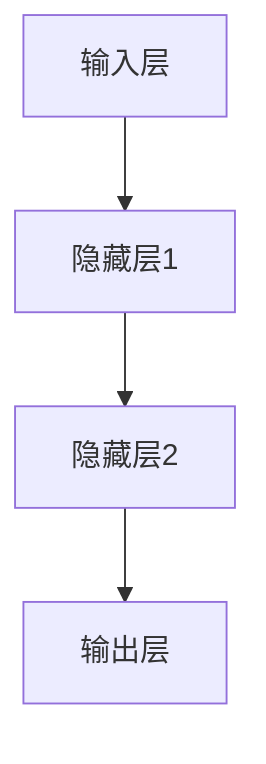
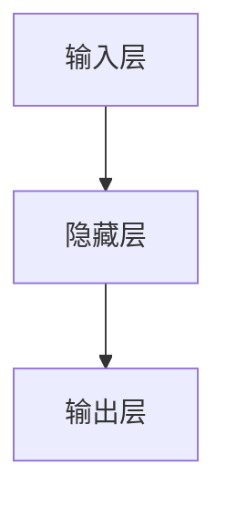
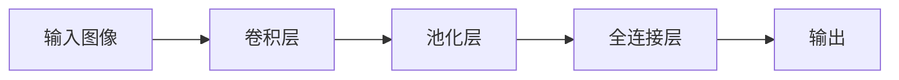
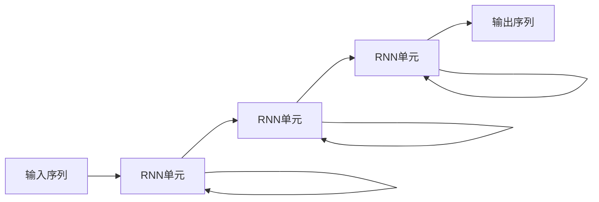
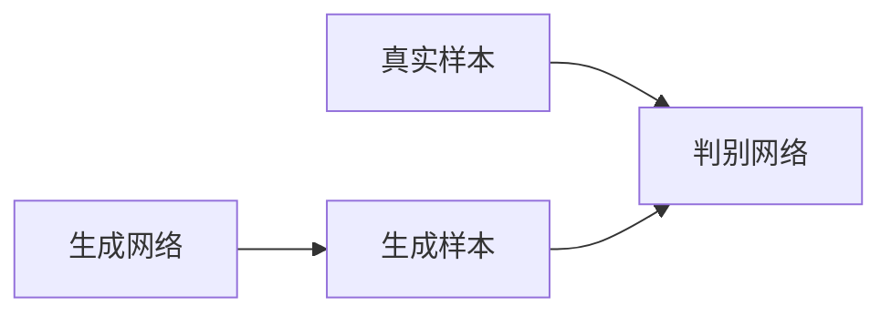
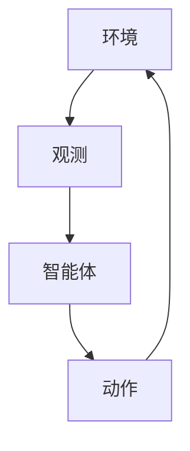

# AI人工智能深度学习算法：深度学习的挑战与前景

## 1.背景介绍

### 1.1 人工智能的兴起

人工智能(Artificial Intelligence, AI)是当代科技发展的热点领域之一,近年来受到了前所未有的关注和重视。人工智能的目标是开发能够模仿人类智能行为的理论、方法、技术及应用系统。随着大数据时代的到来和计算能力的飞速提升,人工智能技术取得了长足进步,在语音识别、图像识别、自然语言处理、智能决策等领域展现出了巨大潜力。

### 1.2 深度学习的崛起

深度学习(Deep Learning)是人工智能领域中一种基于对数据进行表征学习的方法,其灵感来源于人脑的神经网络结构和信息传递规则。近年来,受益于算力的飞速提升、大数据的积累以及算法突破,深度学习取得了令人瞩目的成就,在计算机视觉、自然语言处理、语音识别等领域屡次刷新纪录。

### 1.3 深度学习的重要性

深度学习作为人工智能的核心驱动力量,正在推动着人工智能技术的飞速发展。深度学习模型能够自主学习数据的内在特征,并对复杂问题进行高效处理,展现出了强大的数据挖掘和模式识别能力。深度学习在解决非线性、高维度问题方面具有独特的优势,被广泛应用于计算机视觉、自然语言处理、语音识别、推荐系统等领域。

## 2.核心概念与联系

### 2.1 神经网络

神经网络(Neural Network)是深度学习的基础模型,它模仿生物神经元的工作原理,由大量的人工神经元通过层层连接组成。每个神经元接收来自上一层的输入信号,经过激活函数的非线性变换后,将输出传递给下一层神经元。

### 2.2 前馈神经网络

前馈神经网络(Feedforward Neural Network)是最基本的神经网络结构,信息只从输入层单向传递到输出层,中间通过一个或多个隐藏层进行特征提取和转换。典型的前馈神经网络包括多层感知器(Multilayer Perceptron, MLP)。

### 2.3 卷积神经网络

卷积神经网络(Convolutional Neural Network, CNN)是一种专门用于处理网格结构数据(如图像)的神经网络。它通过卷积操作对局部特征进行提取,并通过池化操作对特征进行降维,最终将提取到的特征传递给全连接层进行分类或回归。CNN在计算机视觉领域取得了巨大成功。

### 2.4 循环神经网络

循环神经网络(Recurrent Neural Network, RNN)是一种专门用于处理序列数据(如文本、语音)的神经网络。它通过内部的循环连接,允许信息在序列的不同时间步之间传递,从而捕捉序列数据中的长期依赖关系。长短期记忆网络(Long Short-Term Memory, LSTM)和门控循环单元(Gated Recurrent Unit, GRU)是RNN的两种常见变体。

### 2.5 生成对抗网络

生成对抗网络(Generative Adversarial Network, GAN)是一种由生成网络和判别网络组成的对抗模型。生成网络的目标是生成逼真的数据样本,而判别网络的目标是区分生成样本和真实样本。通过生成网络和判别网络的不断对抗训练,最终可以生成高质量的数据样本。GAN在图像生成、语音合成等领域有广泛应用。

### 2.6 深度强化学习

深度强化学习(Deep Reinforcement Learning)是将深度学习与强化学习相结合的方法。它使用深度神经网络来近似强化学习中的策略函数或值函数,从而能够处理高维观测数据和连续动作空间。深度强化学习在游戏AI、机器人控制等领域取得了突破性进展。

## 3.核心算法原理具体操作步骤

### 3.1 前馈神经网络训练

前馈神经网络的训练过程通常采用反向传播算法(Backpropagation)进行。具体步骤如下:

1. **前向传播**:输入数据从输入层开始,经过隐藏层的线性变换和非线性激活函数,最终得到输出层的预测值。
2. **计算损失**:将输出层的预测值与真实标签进行比较,计算损失函数(如均方误差、交叉熵等)。
3. **反向传播**:根据链式法则,计算损失函数相对于每个权重和偏置的梯度。
4. **权重更新**:使用优化算法(如梯度下降、Adam等)根据梯度更新网络的权重和偏置。
5. **重复迭代**:重复上述步骤,直到模型收敛或达到预期性能。

### 3.2 卷积神经网络训练

卷积神经网络的训练过程与前馈神经网络类似,但需要特殊处理卷积层和池化层。具体步骤如下:

1. **前向传播**:输入数据经过卷积层提取局部特征,池化层进行特征降维,最终传递到全连接层。
2. **计算损失**:将全连接层的输出与真实标签进行比较,计算损失函数。
3. **反向传播**:根据链式法则,计算损失函数相对于卷积核、偏置和全连接层权重的梯度。
4. **权重更新**:使用优化算法更新卷积核、偏置和全连接层权重。
5. **重复迭代**:重复上述步骤,直到模型收敛或达到预期性能。

### 3.3 循环神经网络训练

循环神经网络的训练过程需要处理序列数据,通常采用反向传播算法的一种变体:反向传播through Time(BPTT)。具体步骤如下:

1. **前向传播**:输入序列数据,依次通过RNN单元进行计算,得到输出序列。
2. **计算损失**:将输出序列与真实标签序列进行比较,计算损失函数。
3. **反向传播**:根据链式法则,计算损失函数相对于RNN单元中的权重和偏置的梯度,通过时间步进行反向传播。
4. **权重更新**:使用优化算法更新RNN单元中的权重和偏置。
5. **重复迭代**:重复上述步骤,直到模型收敛或达到预期性能。

### 3.4 生成对抗网络训练

生成对抗网络的训练过程是一个对抗游戏,生成网络和判别网络相互竞争,最终达到纳什均衡。具体步骤如下:

1. **初始化**:初始化生成网络和判别网络的权重。
2. **生成样本**:生成网络从噪声或潜在空间中采样,生成假样本。
3. **判别真伪**:判别网络接收真实样本和生成样本,对它们进行真伪判别。
4. **更新判别网络**:根据判别网络的判别结果,计算判别损失函数,并更新判别网络的权重。
5. **更新生成网络**:根据判别网络的判别结果,计算生成损失函数,并更新生成网络的权重。
6. **重复迭代**:重复上述步骤,直到生成样本和真实样本无法区分。

### 3.5 深度强化学习训练

深度强化学习的训练过程是一个探索-学习的循环,智能体通过与环境交互来学习最优策略。具体步骤如下:

1. **初始化**:初始化智能体的策略网络或值函数网络。
2. **探索环境**:智能体根据当前策略或值函数在环境中采取行动,获得观测、奖励和下一状态。
3. **存储经验**:将探索过程中获得的经验(状态、动作、奖励、下一状态)存储到经验回放池中。
4. **采样经验**:从经验回放池中采样一批经验数据。
5. **更新网络**:根据采样的经验数据,计算损失函数,并更新策略网络或值函数网络的权重。
6. **重复迭代**:重复上述步骤,直到智能体达到预期性能。

## 4.数学模型和公式详细讲解举例说明

### 4.1 神经网络模型

神经网络模型的数学表达式如下:

$$
y = f(W^{(L)}a^{(L-1)} + b^{(L)})
$$

其中:
- $y$是输出
- $f$是激活函数(如ReLU、Sigmoid等)
- $W^{(L)}$是第L层的权重矩阵
- $a^{(L-1)}$是第L-1层的激活值
- $b^{(L)}$是第L层的偏置向量

在训练过程中,我们需要最小化损失函数$J$,通过反向传播算法计算权重和偏置的梯度:

$$
\frac{\partial J}{\partial W^{(L)}} = \frac{\partial J}{\partial a^{(L)}} \frac{\partial a^{(L)}}{\partial z^{(L)}} \frac{\partial z^{(L)}}{\partial W^{(L)}}
$$

$$
\frac{\partial J}{\partial b^{(L)}} = \frac{\partial J}{\partial a^{(L)}} \frac{\partial a^{(L)}}{\partial z^{(L)}} \frac{\partial z^{(L)}}{\partial b^{(L)}}
$$

其中$z^{(L)} = W^{(L)}a^{(L-1)} + b^{(L)}$是第L层的线性输出。

### 4.2 卷积神经网络模型

卷积神经网络中的卷积操作可以用如下公式表示:

$$
a_{ij}^{l} = f\left(\sum_{m}\sum_{n}w_{mn}^{l-1}a_{i+m,j+n}^{l-1} + b^{l}\right)
$$

其中:
- $a_{ij}^{l}$是第l层第i行第j列的激活值
- $w_{mn}^{l-1}$是第l-1层的卷积核权重
- $b^{l}$是第l层的偏置
- $f$是激活函数

池化操作通常使用最大池化或平均池化,用于降低特征维度和提取局部特征。最大池化可以用如下公式表示:

$$
a_{ij}^{l} = \max\limits_{(m,n) \in R_{ij}}a_{i+m,j+n}^{l-1}
$$

其中$R_{ij}$是以$(i,j)$为中心的池化区域。

### 4.3 循环神经网络模型

循环神经网络的核心是RNN单元,常见的RNN单元包括简单RNN、LSTM和GRU。以LSTM为例,其数学表达式如下:

$$
\begin{aligned}
f_t &= \sigma(W_f \cdot [h_{t-1}, x_t] + b_f) \\
i_t &= \sigma(W_i \cdot [h_{t-1}, x_t] + b_i) \\
\tilde{C}_t &= \tanh(W_C \cdot [h_{t-1}, x_t] + b_C) \\
C_t &= f_t \odot C_{t-1} + i_t \odot \tilde{C}_t \\
o_t &= \sigma(W_o \cdot [h_{t-1}, x_t] + b_o) \\
h_t &= o_t \odot \tanh(C_t)
\end{aligned}
$$

其中:
- $f_t$是遗忘门,控制遗忘上一时间步的细胞状态
- $i_t$是输入门,控制更新