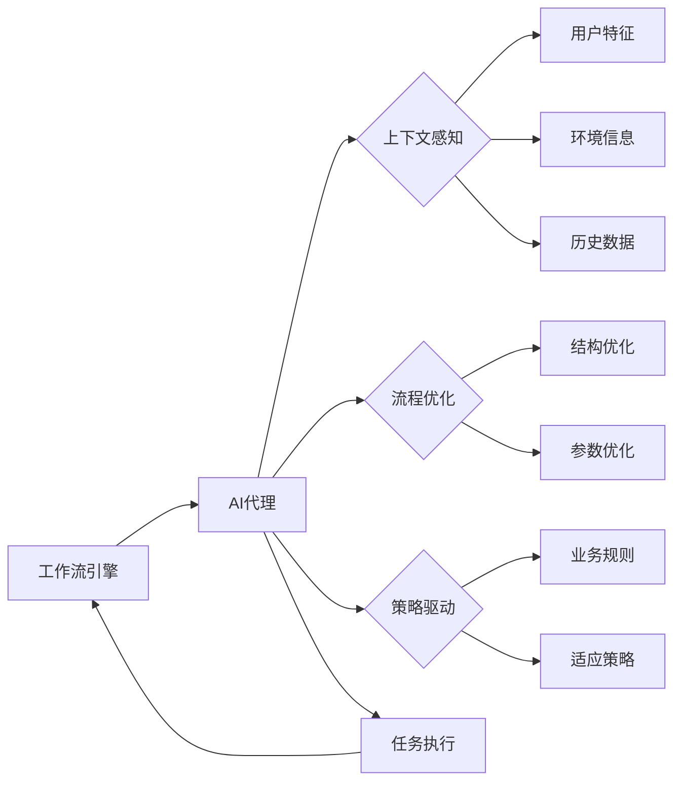

# AI代理在教育技术中的适应性工作流案例

## 1.背景介绍

### 1.1 教育技术的发展现状
#### 1.1.1 教育技术的定义与内涵
#### 1.1.2 教育技术的发展历程
#### 1.1.3 教育技术的现状与挑战

### 1.2 AI技术在教育领域的应用
#### 1.2.1 AI技术的发展现状
#### 1.2.2 AI技术在教育领域的应用场景
#### 1.2.3 AI技术在教育领域应用的优势与局限

### 1.3 适应性学习的概念与意义
#### 1.3.1 适应性学习的定义
#### 1.3.2 适应性学习的理论基础
#### 1.3.3 适应性学习的意义与价值

## 2.核心概念与联系

### 2.1 AI代理的概念与特征
#### 2.1.1 AI代理的定义
AI代理（AI Agent）是一种基于人工智能技术，能够自主执行任务、与环境交互并做出决策的软件实体。它具有感知、推理、学习和行动的能力，可以根据环境的变化动态调整自身行为，以实现特定的目标。

#### 2.1.2 AI代理的特征
- 自主性：AI代理能够独立地执行任务，无需人工干预。
- 交互性：AI代理能够与环境（包括用户、其他代理等）进行交互，接收输入并产生输出。
- 适应性：AI代理能够根据环境的变化调整自身行为，以适应不同的情况。
- 目标导向：AI代理的行为是为了实现特定的目标而优化的。

#### 2.1.3 AI代理的类型
- 反应型代理：根据当前感知做出决策，不考虑历史信息。
- 模型型代理：根据对环境的内部表示（模型）做出决策。
- 目标型代理：根据目标导向的效用函数做出决策。
- 效用型代理：根据效用最大化原则做出决策。

### 2.2 适应性工作流的概念与特点
#### 2.2.1 适应性工作流的定义
适应性工作流（Adaptive Workflow）是一种能够根据环境变化和用户需求动态调整流程结构和执行方式的工作流技术。它利用AI技术，特别是机器学习和规则推理，实现工作流的自适应优化，提高工作效率和质量。

#### 2.2.2 适应性工作流的特点
- 动态性：适应性工作流能够在运行时动态调整流程结构和执行路径。
- 个性化：适应性工作流能够根据用户的特点和需求提供个性化的流程服务。
- 智能化：适应性工作流利用AI技术实现流程的智能优化和自动化。
- 灵活性：适应性工作流能够应对环境变化和异常情况，具有较强的灵活性。

#### 2.2.3 适应性工作流的关键技术
- 工作流建模：支持动态调整的工作流建模语言和方法。
- 流程优化：基于机器学习和优化算法的流程结构和参数优化技术。
- 上下文感知：感知并利用用户、环境等上下文信息进行流程适应。
- 策略驱动：基于业务规则和策略的流程适应决策机制。

### 2.3 AI代理与适应性工作流的关系
#### 2.3.1 AI代理在适应性工作流中的作用
AI代理是实现适应性工作流的关键技术之一。在适应性工作流中，AI代理主要有以下作用：

- 流程执行：AI代理作为工作流的执行主体，负责任务的分配、调度和监控。
- 流程优化：AI代理利用机器学习算法对工作流进行结构和参数优化，提高效率。
- 上下文感知：AI代理通过对用户行为、环境等信息的感知，实现流程的个性化适应。
- 自动化决策：AI代理根据业务规则和策略，自动做出流程适应决策。

#### 2.3.2 适应性工作流对AI代理的要求
为了在适应性工作流中发挥作用，AI代理需要具备以下能力：

- 感知能力：能够获取并理解用户、环境等上下文信息。
- 学习能力：能够通过机器学习算法不断优化自身的决策模型。
- 推理能力：能够根据业务规则和策略进行决策推理。
- 执行能力：能够执行工作流任务并与环境交互。

#### 2.3.3 AI代理与适应性工作流的协同
AI代理与适应性工作流的协同过程如下：

在协同过程中，工作流引擎负责工作流的定义和管理，AI代理负责工作流的执行和优化。AI代理通过上下文感知获取用户特征、环境信息等数据，利用机器学习算法对工作流进行结构和参数优化，并根据业务规则和适应策略自动做出流程决策。优化后的任务由AI代理执行，执行结果反馈给工作流引擎，形成闭环控制。

## 3.核心算法原理具体操作步骤

### 3.1 适应性工作流建模
#### 3.1.1 动态工作流建模语言
适应性工作流建模需要一种能够表达工作流动态特性的建模语言。常用的动态工作流建模语言包括：

- BPMN（Business Process Model and Notation）：通过扩展BPMN元素，如事件、网关等，实现工作流的动态调整。
- YAWL（Yet Another Workflow Language）：提供了灵活的工作流模式和异常处理机制，支持动态工作流建模。
- ADEPT（Application Development based on Encapsulated Pre-modeled Process Templates）：基于图形化的工作流建模语言，支持工作流的动态修改。

#### 3.1.2 动态工作流建模方法
动态工作流建模方法主要有以下几种：

- 基于规则的建模：通过定义ECA（Event-Condition-Action）规则，实现工作流的动态调整。
- 基于案例的建模：通过分析历史工作流执行案例，利用机器学习算法生成动态工作流模型。
- 基于目标的建模：根据工作流的目标和约束条件，利用人工智能规划算法自动生成动态工作流模型。

#### 3.1.3 动态工作流建模步骤
动态工作流建模的一般步骤如下：

1. 定义工作流的基本元素，如任务、事件、网关等。
2. 定义工作流的动态调整规则，如ECA规则、适应策略等。
3. 利用动态工作流建模语言和方法，构建工作流模型。
4. 验证和优化工作流模型，确保其正确性和效率。

### 3.2 工作流优化算法
#### 3.2.1 基于强化学习的工作流优化
强化学习是一种通过试错和奖励反馈来学习最优决策的机器学习方法。在工作流优化中，可以将工作流执行看作一个马尔可夫决策过程（MDP），利用强化学习算法找到最优的工作流执行策略。

具体步骤如下：

1. 定义MDP的状态空间、动作空间和奖励函数。
2. 选择合适的强化学习算法，如Q-Learning、SARSA等。
3. 通过与环境的交互，不断更新价值函数或策略函数。
4. 利用学习到的最优策略指导工作流的执行和调整。

#### 3.2.2 基于遗传算法的工作流优化
遗传算法是一种模拟生物进化过程的优化算法，通过选择、交叉、变异等操作，不断优化工作流的结构和参数。

具体步骤如下：

1. 定义工作流的染色体编码方式，如任务序列、资源分配等。
2. 定义适应度函数，评估工作流执行的质量和效率。
3. 随机生成初始种群，并计算个体的适应度。
4. 通过选择、交叉、变异等操作，生成新一代种群。
5. 重复步骤3-4，直到满足终止条件，得到最优工作流。

#### 3.2.3 基于启发式规则的工作流优化
启发式规则是根据领域知识和经验总结出的优化策略，可以用于指导工作流的动态调整。

具体步骤如下：

1. 收集和分析领域专家的知识和经验，总结出优化规则。
2. 将优化规则形式化表示，如IF-THEN规则、决策树等。
3. 在工作流执行过程中，根据当前状态匹配优化规则。
4. 根据匹配到的规则，对工作流进行动态调整。

### 3.3 适应性决策算法
#### 3.3.1 基于规则的适应性决策
基于规则的适应性决策通过预定义的ECA规则，根据环境变化自动触发工作流的调整。

具体步骤如下：

1. 定义ECA规则，描述环境事件、触发条件和对应的调整操作。
2. 在工作流执行过程中，实时监测环境事件的发生。
3. 当事件发生且满足触发条件时，执行相应的调整操作。
4. 调整后的工作流继续执行，直到完成任务。

#### 3.3.2 基于案例的适应性决策
基于案例的适应性决策通过分析历史工作流执行案例，利用机器学习算法预测最优的调整决策。

具体步骤如下：

1. 收集和预处理历史工作流执行案例，提取特征和决策。
2. 选择合适的机器学习算法，如决策树、KNN等。
3. 利用训练数据集训练机器学习模型。
4. 在工作流执行过程中，根据当前状态预测最优决策。
5. 根据预测结果对工作流进行动态调整。

#### 3.3.3 基于目标的适应性决策
基于目标的适应性决策通过动态评估工作流执行的目标达成度，自动优化工作流以满足目标要求。

具体步骤如下：

1. 定义工作流执行的目标函数，如成本最小化、时间最优化等。
2. 在工作流执行过程中，实时计算目标函数值。
3. 当目标函数值偏离预期时，触发工作流的动态调整。
4. 利用优化算法，如启发式搜索、遗传算法等，找到最优的调整方案。
5. 根据最优方案对工作流进行调整，并继续执行。

## 4.数学模型和公式详细讲解举例说明

### 4.1 马尔可夫决策过程（MDP）
马尔可夫决策过程是强化学习的理论基础，用于建模序贯决策问题。一个MDP由状态集合S、动作集合A、转移概率函数P和奖励函数R组成，形式化定义如下：

$$
MDP = \langle S, A, P, R \rangle
$$

其中，$S$表示状态集合，$A$表示动作集合，$P(s'|s,a)$表示在状态$s$下执行动作$a$后转移到状态$s'$的概率，$R(s,a)$表示在状态$s$下执行动作$a$获得的即时奖励。

MDP的目标是找到一个最优策略$\pi^*$，使得从任意初始状态出发，执行该策略获得的累积奖励最大化：

$$
\pi^* = \arg\max_{\pi} \mathbb{E}\left[\sum_{t=0}^{\infty} \gamma^t R(s_t,\pi(s_t))\right]
$$

其中，$\gamma \in [0,1]$是折扣因子，用于平衡即时奖励和长期奖励。

在工作流优化中，可以将工作流执行过程建模为MDP，状态表示工作流的当前执行状态，动作表示可用的优化决策，奖励函数根据优化目标（如成本、时间等）设计。通过求解MDP，得到最优的工作流执行策略。

### 4.2 Q-Learning算法
Q-Learning是一种常用的无模型强化学习算法，通过不断更新状