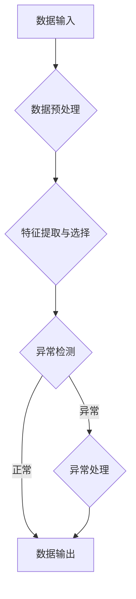

# AI代理工作流中的异常检测与处理机制

## 1. 背景介绍
### 1.1 AI代理工作流概述
### 1.2 异常检测与处理的重要性
### 1.3 本文的研究目标与贡献

## 2. 核心概念与联系
### 2.1 AI代理工作流的定义与特点
### 2.2 异常的定义与分类
#### 2.2.1 数据异常
#### 2.2.2 模型异常  
#### 2.2.3 执行异常
### 2.3 异常检测与处理的关键技术
#### 2.3.1 统计学方法
#### 2.3.2 机器学习方法
#### 2.3.3 专家系统方法

## 3. 核心算法原理具体操作步骤
### 3.1 基于统计学的异常检测算法
#### 3.1.1 假设检验
#### 3.1.2 聚类分析
#### 3.1.3 主成分分析
### 3.2 基于机器学习的异常检测算法 
#### 3.2.1 支持向量机
#### 3.2.2 神经网络
#### 3.2.3 决策树
### 3.3 基于专家系统的异常处理算法
#### 3.3.1 基于规则的推理
#### 3.3.2 基于案例的推理
### 3.4 算法的时间复杂度与空间复杂度分析

## 4. 数学模型和公式详细讲解举例说明
### 4.1 高斯分布模型
### 4.2 泊松分布模型
### 4.3 马尔可夫链模型
### 4.4 贝叶斯网络模型
### 4.5 数学模型在异常检测中的应用举例

## 5. 项目实践：代码实例和详细解释说明
### 5.1 基于Python的异常检测系统架构设计
### 5.2 数据预处理模块代码实现
### 5.3 特征提取与选择模块代码实现 
### 5.4 异常检测模块代码实现
#### 5.4.1 统计学方法代码
#### 5.4.2 机器学习方法代码
### 5.5 异常处理模块代码实现
#### 5.5.1 专家系统方法代码
### 5.6 系统测试与性能评估

## 6. 实际应用场景
### 6.1 智能制造领域的应用
### 6.2 智慧城市领域的应用
### 6.3 自动驾驶领域的应用
### 6.4 医疗健康领域的应用

## 7. 工具和资源推荐
### 7.1 异常检测工具集
### 7.2 异常处理工具集
### 7.3 开源异常检测与处理项目
### 7.4 相关学习资源

## 8. 总结：未来发展趋势与挑战
### 8.1 AI代理工作流异常检测与处理的研究现状
### 8.2 技术发展趋势展望
### 8.3 面临的挑战与对策建议

## 9. 附录：常见问题与解答
### 9.1 如何选择合适的异常检测算法？
### 9.2 异常处理失败后如何进行恢复？
### 9.3 如何平衡异常检测的准确性和效率？
### 9.4 异常检测与处理系统如何与其他系统集成？

AI代理工作流是一种基于人工智能技术构建的自动化业务流程，通过智能代理的协作完成复杂任务。然而，在实际运行过程中，由于环境变化、数据噪声、模型漂移等因素影响，AI代理工作流往往会出现各种异常情况，严重影响系统的可用性和鲁棒性。因此，研究AI代理工作流中的异常检测与处理机制具有重要的理论和实践意义。

本文首先介绍了AI代理工作流的基本概念和特点，分析了工作流异常的类型和成因。异常可分为数据异常、模型异常和执行异常三大类。数据异常是指输入数据不符合预期格式或分布，常见的有缺失值、异常值等；模型异常是指智能代理使用的机器学习模型输出错误或不可靠的结果；执行异常是指工作流实例执行过程中出现死锁、资源耗尽等问题。

异常检测与处理需要用到统计学、机器学习和专家系统等多种技术。统计学方法通过建立数据的概率分布模型，利用假设检验等手段判断数据是否异常；机器学习方法通过训练分类或聚类模型，自动识别异常模式；专家系统方法通过知识库中的规则或案例，对异常进行推理和决策。本文重点介绍了几种常见的异常检测算法，包括高斯分布、支持向量机、神经网络等，并分析了它们的原理、优缺点和复杂度。

在实践部分，本文给出了一个基于Python的异常检测系统架构设计，并详细说明了数据预处理、特征工程、异常检测、异常处理等关键模块的代码实现。针对工业制造、智慧城市、自动驾驶、医疗健康等典型应用场景，讨论了AI代理工作流异常检测与处理的实际需求和挑战。

此外，本文还梳理了异常检测与处理领域常用的工具和资源，包括算法库、开源项目、数据集等，便于读者深入研究和实践。最后，本文总结了AI代理工作流异常检测与处理的研究现状和发展趋势，提出了一些亟待解决的理论和技术难题，如算法的可解释性、在线学习能力、人机协同优化等，并对未来的研究方向和应用前景进行了展望。

综上所述，AI代理工作流中的异常检测与处理是一个复杂的系统工程，涉及多种技术的交叉融合，需要在算法、架构、应用等多个层面进行协同攻关。本文系统地梳理了异常检测与处理的核心概念、原理、方法和实践，可为相关领域的研究人员和工程师提供参考和指导。

作者：禅与计算机程序设计艺术 / Zen and the Art of Computer Programming