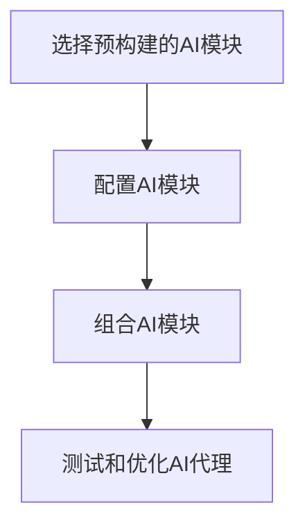

## 1.背景介绍

随着人工智能(AI)技术的快速发展，AI代理在我们的日常生活和工作中扮演着越来越重要的角色。从智能语音助手到自动化的客户服务，AI代理正在改变我们与数字世界的交互方式。然而，创建和管理这些AI代理的过程往往需要专业的编程知识和复杂的工作流程。这就是无代码平台应运而生的原因，它们通过提供可视化的接口和预构建的模块，使得创建AI代理变得更加容易和便捷。本文将深入探讨无代码平台在AI代理工作流中的应用前景。

## 2.核心概念与联系

### 2.1 无代码平台

无代码平台是一种开发环境，允许用户通过图形化界面，而非传统的手动编程方式，来创建应用程序。这种平台的主要优势在于，它可以让非技术背景的用户也能创建和管理应用程序，从而极大地提高了生产效率。

### 2.2 AI代理

AI代理是一种能够执行特定任务的软件，它通过使用机器学习和其他AI技术，能够理解和响应用户的需求。AI代理的应用范围广泛，包括但不限于客户服务、智能家居控制、个人助手和数据分析。

### 2.3 无代码平台和AI代理的联系

无代码平台和AI代理之间的联系主要体现在无代码平台可以极大地简化AI代理的开发和管理过程。通过无代码平台，用户可以通过简单的拖拽和配置操作，而无需编写任何代码，就可以创建功能强大的AI代理。

## 3.核心算法原理具体操作步骤

在无代码平台上创建AI代理的过程通常包括以下几个步骤：

1. 选择预构建的AI模块：无代码平台通常会提供一系列预构建的AI模块，如语音识别、文本分析、图像识别等。用户可以根据自己的需求选择合适的模块。

2. 配置AI模块：每个AI模块都有一些可配置的参数，如模型的复杂度、训练数据的数量等。用户可以根据自己的需求进行配置。

3. 组合AI模块：用户可以将多个AI模块组合在一起，形成一个完整的AI代理。例如，一个智能客户服务代理可能需要组合语音识别模块、文本分析模块和自然语言生成模块。

4. 测试和优化AI代理：创建完成后，用户需要对AI代理进行测试，以确保其性能满足需求。如果性能不佳，用户可以通过调整AI模块的配置或更换AI模块来进行优化。

这个过程可以用以下的Mermaid流程图来表示：

## 4.数学模型和公式详细讲解举例说明

在无代码平台上，AI模块的配置通常涉及到一些数学模型和公式。例如，在配置一个文本分析模块时，用户可能需要设置模型的复杂度，这可以通过调整模型的层数和每层的节点数来实现。这个过程可以用以下的公式来表示：

$$
M = L \times N
$$

其中，$M$ 是模型的复杂度，$L$ 是模型的层数，$N$ 是每层的节点数。模型的复杂度越高，模型的表达能力越强，但同时也会增加模型的训练时间和资源消