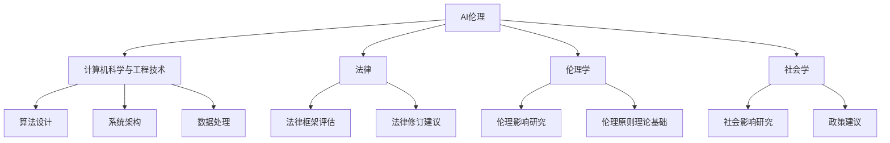

# AI伦理国际标准化的新进展及其影响分析

## 1. 背景介绍

### 1.1 人工智能的快速发展

人工智能(AI)技术在过去几年中取得了长足的进步,已经广泛应用于各个领域,如计算机视觉、自然语言处理、机器学习等。随着AI技术的不断发展和应用范围的扩大,人们也开始关注AI系统的安全性、公平性、透明度和问责制等伦理问题。

### 1.2 AI伦理问题的重要性

AI系统的决策过程通常是一个"黑箱",很难被人类理解和解释。如果AI系统存在偏差或者错误,可能会对个人或社会造成严重影响。此外,AI系统在一些敏感领域的应用,如医疗、金融等,也需要高度的安全性和可靠性。因此,制定AI伦理标准,规范AI系统的开发和应用,确保其符合道德和法律要求,就显得尤为重要。

### 1.3 国际标准化进程

为了应对AI伦理挑战,一些国际组织已经开始制定相关的标准和指南。例如,欧盟于2019年发布了"可信赖AI"的伦理准则;美国国家标准与技术研究院(NIST)也在研究制定AI技术标准的路线图。这些国际标准化努力旨在建立一个统一的AI伦理框架,为AI系统的开发和应用提供指导。

## 2. 核心概念与联系

### 2.1 AI伦理核心原则

虽然不同组织提出的具体原则有所不同,但大多数AI伦理原则都包括以下几个核心方面:

1. **透明度和可解释性**:AI系统的决策过程应该是透明和可解释的,使用户和受影响者能够理解系统是如何做出决策的。

2. **公平性和非歧视**:AI系统不应该对特定群体存在不公平或歧视性。

3. **隐私和数据保护**:AI系统应该尊重个人隐私,并采取适当措施保护个人数据。

4. **安全性和可靠性**:AI系统应该是安全和可靠的,尤其是在涉及人身安全或关键基础设施的应用中。

5. **人工智能人权**:AI系统不应该侵犯人权,应该尊重人的尊严和自主权。

6. **问责制**:AI系统的开发者和使用者应该对系统的行为和影响负责。

### 2.2 AI伦理与其他领域的联系

AI伦理不仅与计算机科学和工程技术相关,还与法律、伦理学、社会学等多个学科密切相关。制定AI伦理标准需要多学科的参与和协作。

例如,法律专家需要评估现有法律框架是否足以应对AI带来的新挑战,并提出相应的法律修订建议。伦理学家则需要研究AI系统的伦理影响,并为AI伦理原则提供理论基础。社会学家可以研究AI技术对社会的影响,并提出相应的政策建议。

上图展示了AI伦理与其他学科之间的联系。AI伦理需要计算机科学、法律、伦理学和社会学等多个领域的参与和贡献。

## 3. 核心算法原理具体操作步骤

虽然AI伦理标准主要关注AI系统的伦理影响和合规性,但一些核心算法原理也与伦理密切相关,需要在算法设计阶段就加以考虑。以下是一些常见的AI算法原理及其与伦理的关系:

### 3.1 机器学习算法

#### 3.1.1 监督学习

监督学习算法通过学习标注数据来训练模型,因此训练数据的质量和标注方式对模型的公平性和准确性有重要影响。例如,如果训练数据存在偏差或标注存在错误,模型可能会学习到这些偏差或错误,导致决策存在不公平或不准确的情况。

为了提高监督学习算法的公平性和准确性,需要采取以下措施:

1. 清理和审计训练数据,消除数据中的偏差和噪声。
2. 使用多元化和包容性的数据集,确保模型能够公平对待不同群体。
3. 采用适当的评估指标,如群体公平度量,以评估模型的公平性。
4. 在模型部署前进行充分的测试和审计,确保其符合伦理标准。

#### 3.1.2 无监督学习

无监督学习算法通过发现数据中的模式和结构来学习,因此数据的质量和算法的设计对模型的公平性和透明度有重要影响。例如,如果算法倾向于发现某些特定的模式,可能会导致对某些群体的歧视。

为了提高无监督学习算法的公平性和透明度,需要采取以下措施:

1. 审计数据集,确保其不存在明显的偏差或噪声。
2. 设计公平和透明的无监督学习算法,避免算法本身存在偏差。
3. 对算法的输出进行审计和解释,确保其符合伦理标准。

#### 3.1.3 强化学习

强化学习算法通过与环境交互来学习,因此环境的设置和奖惩机制对算法的行为有重要影响。例如,如果奖惩机制存在偏差,算法可能会学习到不公平或不道德的行为。

为了提高强化学习算法的公平性和道德性,需要采取以下措施:

1. 设计公平和道德的奖惩机制,确保算法学习到合乎伦理的行为。
2. 在训练过程中监控算法的行为,及时纠正不当行为。
3. 对算法的决策过程进行解释和审计,确保其符合伦理标准。

### 3.2 其他算法原理

除了机器学习算法,其他一些常见的算法原理也与AI伦理密切相关,如:

- **隐私保护算法**:用于保护个人隐私,如差分隐私、安全多方计算等。
- **公平算法**:旨在消除算法中的偏差和歧视,如公平分类、公平聚类等。
- **可解释AI算法**:提高AI系统的透明度和可解释性,如模型可解释性、注意力机制等。
- **安全AI算法**:确保AI系统的安全性和可靠性,如对抗性攻击防御、安全AI训练等。

这些算法原理在AI系统的设计和开发中发挥着重要作用,有助于提高AI系统的伦理水平。

## 4. 数学模型和公式详细讲解举例说明

在AI算法中,一些数学模型和公式与伦理问题密切相关,如公平度量、隐私保护模型等。以下是一些常见的数学模型和公式,以及它们与AI伦理的关系。

### 4.1 公平度量

公平度量用于评估机器学习模型的公平性,常见的公平度量包括:

#### 4.1.1 统计学公平度量

统计学公平度量基于不同群体的统计指标,如准确率、召回率等,来衡量模型的公平性。常见的统计学公平度量包括:

- 等机会(Equal Opportunity):不同群体的真正例率(TPR)应该相等。

  $$TPR_g = P(\hat{Y}=1|Y=1,A=g)$$

  其中,$\hat{Y}$是模型预测值,$Y$是真实标签,$A=g$表示属于群体$g$。

- 平等机会差异(Equal Opportunity Difference):

  $$\text{EOD} = \max_{g,g'} \big| TPR_g - TPR_{g'} \big|$$

  EOD越小,模型越公平。

- 平等机会违反(Equal Opportunity Violation):

  $$\text{EOV} = \max\big\{0, \max_{g,g'} \big(TPR_g - TPR_{g'}\big)\big\}$$

  EOV为0时,模型是完全公平的。

#### 4.1.2 个人公平度量

个人公平度量关注个体层面的公平性,常见的个人公平度量包括:

- 反事实公平(Counterfactual Fairness):对于任意两个个体$x$和$x'$,如果除了受保护属性$A$外的其他属性相同,那么模型的预测应该相同。

  $$P(\hat{Y}=y|X=x,A=g) = P(\hat{Y}=y|X=x',A=g')$$

- 因果公平(Causal Fairness):基于因果图,确保受保护属性$A$不会通过任何路径影响模型预测$\hat{Y}$。

### 4.2 隐私保护模型

隐私保护模型用于保护个人隐私,常见的隐私保护模型包括:

#### 4.2.1 差分隐私(Differential Privacy)

差分隐私保证了在给定数据集上运行算法的输出,与在该数据集加入或删除一条记录后运行算法的输出之间的差异是有限的。形式化定义如下:

对于任意相邻数据集$D$和$D'$(相差一条记录),以及任意输出$S \subseteq Range(M)$,有:

$$P(M(D) \in S) \leq e^\epsilon P(M(D') \in S) + \delta$$

其中,$\epsilon$是隐私损失参数,$\delta$是隐私泄露概率,$M$是隐私保护机制。$\epsilon$和$\delta$越小,隐私保护程度越高。

常见的差分隐私机制包括:

- 高斯机制(Gaussian Mechanism):在查询函数的输出上添加高斯噪声。
- 指数机制(Exponential Mechanism):以$\exp(\epsilon u(D,r)/2\Delta u)$的概率选择输出$r$,其中$u$是实用函数,$\Delta u$是$u$的敏感度。

#### 4.2.2 安全多方计算(Secure Multi-Party Computation)

安全多方计算允许多个参与方在不泄露各自的私有输入数据的情况下,共同计算一个函数。常见的安全多方计算协议包括:

- 加密共享(Secret Sharing):每个参与方将其私有输入拆分为多个份额,并分发给其他参与方。只有当所有份额聚合时,才能重建原始输入。
- 同态加密(Homomorphic Encryption):在密文上进行运算,得到的结果与对明文进行相同运算的结果是一致的。

这些隐私保护模型在AI系统中发挥着重要作用,有助于保护个人隐私和数据安全。

## 5. 项目实践:代码实例和详细解释说明

为了更好地理解AI伦理原则在实践中的应用,我们以一个人脸识别系统为例,探讨如何在系统设计和开发过程中融入伦理考量。

### 5.1 项目概述

该人脸识别系统旨在从视频流中实时检测和识别人脸。它可以应用于安防监控、人员通行管理等场景。系统的主要模块包括:

1. **数据采集模块**:从摄像头或视频文件中获取视频流数据。
2. **人脸检测模块**:使用深度学习模型(如MTCNN)从视频帧中检测出人脸区域。
3. **人脸识别模块**:使用深度学习模型(如FaceNet)从检测到的人脸图像中提取特征,并与人脸数据库中的特征进行匹配,实现人脸识别。
4. **数据存储模块**:存储人脸数据库和系统日志等数据。
5. **用户界面模块**:提供用户界面,显示视频流和识别结果。

### 5.2 伦理考量和实践

在设计和开发该人脸识别系统时,我们需要考虑以下几个方面的伦理问题:

#### 5.2.1 公平性和非歧视

人脸识别模型可能存在偏差,导致对某些群体(如不同种族、性别等)的识别准确率较低。为了提高公平性,我们需要:

1. 使用多元化和包容性的训练数据集,确保模型能够公平对待不同群