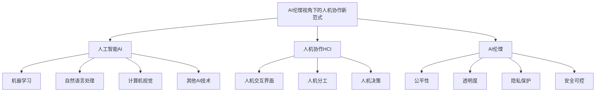

# AI伦理视角下的人机协作新范式探索

## 1.背景介绍

### 1.1 人工智能的崛起

人工智能(AI)技术在过去几十年里取得了长足的进步,已经渗透到我们生活的方方面面。从语音助手到自动驾驶汽车,从推荐系统到医疗诊断,AI正在彻底改变着人类的工作和生活方式。随着算力的不断提升和算法的持续创新,AI系统的性能和应用范围正在不断扩大。

然而,AI技术的发展也带来了一系列伦理和社会挑战。算法偏差、隐私保护、就业影响等问题引发了广泛关注和讨论。如何在发挥AI技术优势的同时,确保其符合人类价值观和伦理准则,成为当前亟待解决的重大课题。

### 1.2 人机协作的必要性

面对AI技术的快速发展,单纯依赖人工智能或者完全排斥人工智能都不是明智之举。人类智慧和AI各有所长,只有人机协作,才能最大限度地发挥双方的优势,实现"1+1>2"的效果。

人类拥有创造力、情商和道德判断力,而AI擅长处理大规模数据、发现隐藏模式和执行重复性任务。通过合理分工和有效协作,人机结合可以产生强大的协同效应,推动科技创新和社会进步。

### 1.3 AI伦理与人机协作

要实现真正意义上的人机协作,必须从伦理层面对AI技术的发展和应用进行规范和约束。AI伦理旨在确保AI系统符合人类价值观,尊重人权,维护公平正义,并对其负面影响进行评估和缓解。

只有在AI伦理的框架下,人机协作才能真正发挥最大潜力,避免滥用和失控,为人类社会带来实实在在的利益。本文将探讨AI伦理视角下的人机协作新范式,分析其核心理念、关键技术和实践路径,为构建人机和谐共存的未来社会提供思路和建议。

## 2.核心概念与联系

### 2.1 人工智能(AI)

人工智能是当代科技发展的核心驱动力,涵盖了机器学习、自然语言处理、计算机视觉等多个领域。AI系统通过模拟人类的认知过程,能够从大量数据中识别模式、推理决策并持续学习优化。

AI技术的突破不仅提高了生产效率,还孕育了全新的应用场景,如智能语音助手、自动驾驶汽车、医疗诊断等,正在深刻改变着人类的生活和工作方式。

### 2.2 人机协作(HCI)

人机协作(Human-Computer Interaction,HCI)是指人与计算机系统之间的交互过程,旨在实现人机之间的高效协同。人机协作包括人机交互界面设计、人机分工模式、人机决策流程等多个方面。

随着AI技术的不断发展,人机协作的内涵和形式也在不断演进。未来,人机协作将更加智能化、自然化和个性化,人机之间的界限将变得越来越模糊。

### 2.3 AI伦理

AI伦理是指在AI系统的设计、开发和应用过程中,需要遵循的一系列伦理准则和价值观。主要包括以下几个核心维度:

1. **公平性(Fairness)**: AI系统应该避免偏见和歧视,确保对所有个体和群体一视同仁。
2. **透明度(Transparency)**: AI系统的决策过程应该具有可解释性,让人类能够理解其内在逻辑。
3. **隐私保护(Privacy Protection)**: AI系统在处理个人数据时,必须充分保护个人隐私和信息安全。
4. **安全可控(Safety and Control)**: AI系统应该受到有效监管,确保其运行安全可控,不会产生意外危害。

AI伦理旨在最大限度地发挥AI技术的优势,同时规避其潜在的风险和负面影响,实现人机和谐共生。

上述三个核心概念紧密相连、环环相扣。只有将人工智能、人机协作和AI伦理有机结合,才能真正构建起AI时代的人机协作新范式。

## 3.核心算法原理具体操作步骤

实现AI伦理视角下的人机协作新范式,需要多个关键算法和技术的支撑。本节将介绍其中的核心算法原理和具体操作步骤。

### 3.1 可解释AI算法

传统的机器学习算法往往是一个"黑箱",很难解释其内部决策逻辑,这与AI伦理中的透明性原则相违背。可解释AI(Explainable AI,XAI)算法旨在提高AI系统的可解释性,让人类能够理解其决策过程。

一种典型的可解释AI算法是LIME(Local Interpretable Model-Agnostic Explanations),其核心思想是通过局部近似模型来解释复杂的机器学习模型。具体操作步骤如下:

1. 选择一个需要解释的实例及其预测结果。
2. 通过对实例进行扰动,生成若干个相似实例及其预测结果。
3. 使用简单的可解释模型(如线性回归)拟合扰动实例和预测结果之间的映射关系。
4. 利用可解释模型的系数,解释原始实例的预测结果。

通过LIME等可解释AI算法,人类可以更好地理解AI系统的决策过程,从而提高对其的信任度,并及时发现和纠正潜在的偏差或错误。

### 3.2 人机协作决策算法

在人机协作过程中,如何有效整合人类智慧和AI能力,做出最优决策,是一个关键问题。贝叶斯机器是一种常用的人机协作决策算法框架,它通过概率模型来融合人类专家知识和AI推理结果。具体步骤如下:

1. 建立初始概率模型,描述决策问题的先验知识。
2. 收集人类专家的判断,作为模型的先验概率。
3. 利用AI系统对相关数据进行分析,得到数据驱动的后验概率。
4. 根据贝叶斯公式,将先验概率和后验概率相结合,得到综合后的决策概率分布。
5. 基于综合概率分布,选择最优决策方案。

贝叶斯机器能够很好地结合人类经验和AI计算能力,实现人机协作决策。在医疗诊断、金融投资等领域已有成功应用。

### 3.3 公平AI算法

为了满足AI伦理中的公平性要求,需要采用特殊的公平AI算法,消除AI系统中可能存在的偏见和歧视。一种常用的算法框架是预处理-内嵌-后处理范式:

1. **预处理**:通过数据变换或重新采样,消除训练数据中的潜在偏差。
2. **内嵌**:在模型训练过程中,加入公平性约束或正则项,使得模型本身具有公平性。
3. **后处理**:对模型的预测结果进行调整,确保其满足特定的公平性度量标准。

以内嵌公平性为例,常用的做法是将公平性度量(如统计率等价性)作为正则项加入损失函数中,使模型在优化过程中兼顾准确性和公平性。具体算法步骤如下:

1. 定义公平性度量,如统计率等价性、等机会等。
2. 将公平性度量转化为损失函数的正则项。
3. 在模型训练时,最小化准确性损失和公平性正则项的加权和。
4. 输出满足公平性约束的模型。

通过上述公平AI算法,可以有效减少AI系统中的潜在偏见,提高其决策的公平性和包容性。

上述三种核心算法,分别针对AI伦理的透明性、人机协作和公平性三个维度,为构建AI伦理视角下的人机协作新范式奠定了坚实的技术基础。

## 4.数学模型和公式详细讲解举例说明

本节将详细介绍上述核心算法中涉及的数学模型和公式,并给出具体的例子说明。

### 4.1 可解释AI算法:LIME

LIME算法的核心思想是通过局部线性逼近,解释复杂模型对于某个实例的预测结果。具体数学模型如下:

已知一个复杂的机器学习模型$f$,对于输入实例$x$,我们希望解释其预测结果$f(x)$。LIME算法首先生成一个扰动实例集$\{z_1,z_2,...,z_n\}$,其中每个$z_i$都是通过对$x$进行少量扰动得到的。然后,LIME使用一个简单的可解释模型$g$,拟合扰动实例集和原始模型$f$在这些实例上的预测结果之间的映射关系,即:

$$\xi(x) = \arg\min_{g \in G} \mathcal{L}(f,g,\pi_x) + \Omega(g)$$

其中:
- $\xi(x)$是对$x$的解释模型
- $G$是可解释模型的集合,通常选择线性模型
- $\mathcal{L}$是一个衡量$f$和$g$之间差异的损失函数
- $\pi_x$是一个关于$x$的局部性度量,用于赋予靠近$x$的实例更高的权重
- $\Omega(g)$是对可解释模型$g$的复杂度进行惩罚的正则项

通过优化上述目标函数,我们可以得到一个局部线性模型$g$,它能够很好地逼近$f$在$x$附近的行为。进而,通过分析$g$的系数,我们就可以解释$f(x)$的原因。

例如,对于一个预测房价的模型,如果$g$的系数表明"房间数量"对预测结果影响很大,那么就可以解释为该模型主要依赖于"房间数量"这一特征来预测房价。

### 4.2 人机协作决策算法:贝叶斯机器

贝叶斯机器是一种将人类专家知识和AI推理结果相结合的决策框架,其核心是贝叶斯公式:

$$P(H|E) = \frac{P(E|H)P(H)}{P(E)}$$

其中:
- $H$是假设,如某种决策方案
- $E$是观测到的证据,如相关数据
- $P(H)$是$H$的先验概率,可由人类专家给出
- $P(E|H)$是在假设$H$成立的条件下,$E$出现的概率,可由AI系统计算得到
- $P(H|E)$是在观测到$E$之后,$H$的后验概率,即我们最终需要得到的决策概率

具体到某个决策问题,假设有$n$个可选方案$\{H_1,H_2,...,H_n\}$,相关证据为$E$,则每个方案的后验概率为:

$$P(H_i|E) = \frac{P(E|H_i)P(H_i)}{\sum_{j=1}^n P(E|H_j)P(H_j)}$$

我们可以选择具有最大后验概率的方案作为最终决策。

例如,在医疗诊断中,假设$H_i$代表第$i$种疾病,$E$是患者的症状和检查结果。医生可以给出每种疾病的先验概率$P(H_i)$,而AI系统则可以根据历史数据计算出$P(E|H_i)$。通过贝叶斯公式,我们就可以得到每种疾病的后验概率,从而做出最优诊断决策。

### 4.3 公平AI算法:统计率等价性

统计率等价性(Statistical Parity)是一种常用的