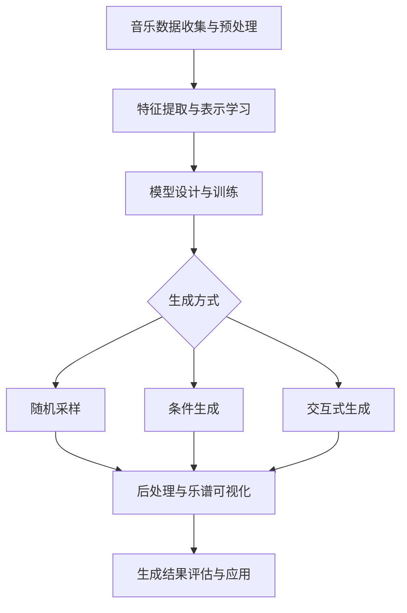

# AI作曲：谱写未来的旋律

## 1. 背景介绍
### 1.1 音乐与人工智能的渊源
### 1.2 AI作曲的发展历程
#### 1.2.1 早期探索
#### 1.2.2 深度学习的崛起
#### 1.2.3 近年来的突破性进展

## 2. 核心概念与联系
### 2.1 音乐理论基础
#### 2.1.1 音高、节奏、和声
#### 2.1.2 曲式结构
#### 2.1.3 情感表达
### 2.2 机器学习与深度学习
#### 2.2.1 监督学习与非监督学习
#### 2.2.2 神经网络与深度学习模型
#### 2.2.3 生成模型与对抗生成网络（GAN）
### 2.3 AI作曲中的关键技术
#### 2.3.1 音乐表示学习
#### 2.3.2 序列生成模型
#### 2.3.3 风格迁移与融合

## 3. 核心算法原理具体操作步骤
### 3.1 数据预处理
#### 3.1.1 音乐数据的收集与标注
#### 3.1.2 音乐特征提取与表示
#### 3.1.3 数据增强与数据集构建
### 3.2 模型训练
#### 3.2.1 模型结构设计
#### 3.2.2 损失函数与优化算法
#### 3.2.3 超参数调优与模型评估
### 3.3 音乐生成
#### 3.3.1 随机采样与束搜索
#### 3.3.2 条件生成与交互式生成
#### 3.3.3 后处理与乐谱可视化

## 4. 数学模型和公式详细讲解举例说明
### 4.1 Markov模型与n-gram模型
### 4.2 循环神经网络（RNN）与长短期记忆网络（LSTM）
### 4.3 变分自编码器（VAE）与生成对抗网络（GAN）
### 4.4 Transformer模型与自注意力机制

## 5. 项目实践：代码实例和详细解释说明
### 5.1 基于LSTM的古典音乐生成
#### 5.1.1 数据准备与预处理
#### 5.1.2 模型构建与训练
#### 5.1.3 生成结果分析与评估
### 5.2 基于GAN的流行音乐风格迁移
#### 5.2.1 数据准备与预处理
#### 5.2.2 模型构建与训练
#### 5.2.3 生成结果分析与评估
### 5.3 基于Transformer的交互式作曲助手
#### 5.3.1 数据准备与预处理
#### 5.3.2 模型构建与训练
#### 5.3.3 交互式作曲流程与用户反馈

## 6. 实际应用场景
### 6.1 音乐创作辅助工具
### 6.2 游戏与影视配乐生成
### 6.3 音乐教育与训练
### 6.4 个性化音乐推荐与生成

## 7. 工具和资源推荐
### 7.1 开源数据集
### 7.2 开源代码库与框架
### 7.3 相关学术论文与综述
### 7.4 在线教程与课程

## 8. 总结：未来发展趋势与挑战
### 8.1 多模态音乐生成
### 8.2 人机协作与交互式作曲
### 8.3 音乐理解与分析
### 8.4 版权与伦理问题

## 9. 附录：常见问题与解答
### 9.1 AI作曲是否会取代人类作曲家？
### 9.2 如何评估AI生成音乐的质量？
### 9.3 AI作曲技术在其他领域的应用前景如何？
### 9.4 如何平衡AI作曲的创新性与可解释性？

人工智能作曲（AI作曲）是一个令人激动的交叉领域，它结合了音乐理论、机器学习和计算创造力，旨在通过算法和数据驱动的方法自动生成音乐作品。近年来，随着深度学习技术的飞速发展，AI作曲取得了长足的进步，生成的音乐作品在旋律、和声、节奏等方面都达到了令人印象深刻的水平。

AI作曲的核心思想是通过分析大量的音乐数据，学习其中蕴含的模式、规律和风格特征，然后利用学习到的知识生成新的音乐片段或完整的音乐作品。这个过程通常包括数据收集与预处理、特征提取与表示学习、模型设计与训练、音乐生成与后处理等关键步骤。

在数据预处理阶段，需要收集大量的音乐数据，并将其转化为适合机器学习的格式。常见的音乐表示方法包括MIDI、钢琴卷帘（piano roll）、乐谱图像等。此外，还需要对数据进行清洗、标注和增强，以提高数据质量和多样性。

特征提取与表示学习是AI作曲的关键环节之一。传统的方法包括手工设计特征，如音高、时值、和弦等。而深度学习方法则可以自动学习音乐数据中的高层特征，如旋律走向、和声进行、节奏模式等。常用的深度学习模型包括卷积神经网络（CNN）、循环神经网络（RNN）、长短期记忆网络（LSTM）等。

在模型设计与训练阶段，需要根据任务需求和数据特点，选择合适的模型结构和损失函数。常见的模型结构包括序列到序列模型、变分自编码器（VAE）、生成对抗网络（GAN）等。损失函数的设计需要兼顾生成音乐的真实性、多样性和可控性。训练过程中需要合理设置超参数，并使用交叉验证等方法评估模型性能。

音乐生成阶段是将训练好的模型应用于创作实践的关键一步。常见的生成方式包括随机采样、条件生成和交互式生成。随机采样是指从模型学习到的概率分布中随机抽取音乐片段；条件生成是指根据给定的主题、风格、情感等条件生成相应的音乐；交互式生成则允许用户实时参与创作过程，根据反馈动态调整生成结果。

生成音乐的后处理与可视化也是不可或缺的环节。后处理包括对生成的音乐片段进行拼接、平滑、调音等，以提高音乐的连贯性和自然性。可视化则包括将生成的音乐转化为乐谱、钢琴卷帘、波形图等直观的形式，方便用户理解和编辑。

在实际应用场景中，AI作曲技术可以为音乐创作者提供灵感和辅助，帮助他们探索新的音乐思路和风格。在游戏、影视等领域，AI作曲可以自动生成背景音乐和配乐，提高创作效率。在音乐教育领域，AI作曲可以为学习者提供个性化的练习素材和即时反馈。此外，AI作曲还可以应用于个性化音乐推荐、自适应音乐生成等场景。

尽管AI作曲取得了令人瞩目的进展，但仍然面临着诸多挑战。如何提高生成音乐的长期结构和逻辑性，如何在确保创新性的同时保持可解释性和可控性，如何处理音乐版权和伦理问题等，都需要学术界和业界的共同努力。

未来，AI作曲技术有望在多模态音乐生成、人机协作、音乐理解与分析等方面取得更大的突破。多模态音乐生成指的是结合文本、图像、视频等其他模态的信息，生成更加丰富和具有表现力的音乐作品。人机协作和交互式作曲强调人类创作者与AI系统之间的实时互动和反馈，共同完成创作任务。音乐理解与分析则致力于赋予AI系统理解和评价音乐的能力，包括音乐情感识别、音乐结构分析、音乐相似度度量等。

总之，AI作曲是一个充满想象力和创新活力的领域，它不仅为音乐创作开辟了新的可能性，也为人工智能研究提供了一个富有挑战性和启发性的试验场。随着技术的不断进步和应用场景的不断拓展，AI作曲必将在未来的音乐世界中扮演越来越重要的角色，谱写出更加动人和美妙的旋律。

作者：禅与计算机程序设计艺术 / Zen and the Art of Computer Programming