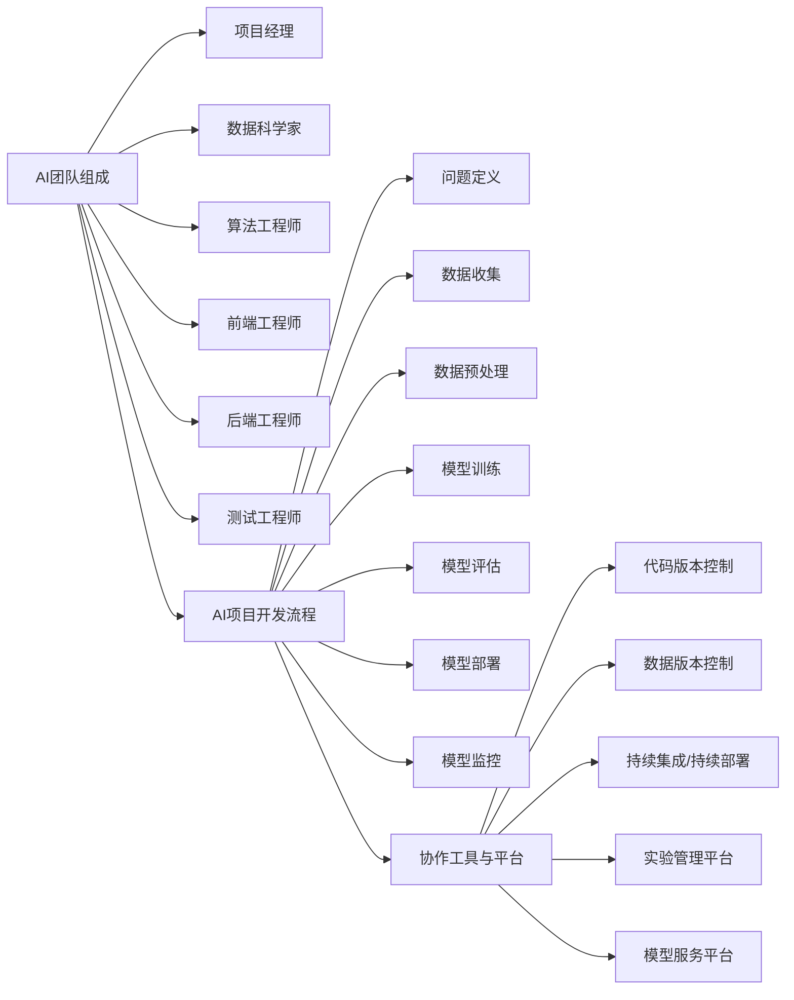

# AI团队协作原理与代码实战案例讲解

## 1.背景介绍

随着人工智能技术的飞速发展,AI已经渗透到各行各业,成为推动社会进步和经济增长的重要引擎。越来越多的企业和组织开始组建AI团队,致力于将AI技术应用到实际业务场景中。然而,AI团队的协作和管理与传统软件开发团队有很大不同。如何有效地组织和管理一个AI团队,充分发挥每个成员的潜力,是一个值得深入探讨的话题。

本文将从AI团队协作的原理出发,结合实际的代码案例,深入剖析AI团队协作的关键要素和最佳实践。通过本文的学习,你将了解到:

- AI团队组建的核心原则
- 有效的AI团队角色分工
- AI项目开发流程与协作机制  
- 代码版本控制与持续集成
- 模型训练与部署的协同
- 数据管理与共享的最佳实践

让我们一起探索AI团队协作的奥秘,提升团队效率,创造出更多惊艳的AI应用!

## 2.核心概念与联系

在深入探讨AI团队协作之前,我们需要先了解一些核心概念:

### 2.1 AI团队的组成

一个典型的AI团队通常由以下角色组成:

- 项目经理:负责整个项目的规划、进度跟踪和资源协调。
- 数据科学家:负责数据分析、特征工程和模型设计。
- 算法工程师:负责算法的实现、优化和部署。
- 前端工程师:负责AI应用的用户界面开发。
- 后端工程师:负责AI应用的服务端开发和数据存储。
- 测试工程师:负责AI应用的测试和质量保障。

### 2.2 AI项目开发流程

AI项目的开发流程与传统软件开发有所不同,通常包括以下步骤:

1. 问题定义:明确AI应用要解决的具体问题。
2. 数据收集:收集和标注训练模型所需的数据。
3. 数据预处理:清洗、转换和特征工程数据。
4. 模型训练:选择合适的算法,训练AI模型。
5. 模型评估:使用测试集评估模型性能,进行优化。
6. 模型部署:将训练好的模型集成到应用程序中。
7. 模型监控:持续监控模型性能,进行必要的再训练和更新。

### 2.3 协作工具与平台

为了支持AI团队的高效协作,需要使用一些专门的工具和平台,例如:

- 代码版本控制工具:如Git,用于管理代码的版本和分支。
- 数据版本控制工具:如DVC,用于管理数据集的版本和追踪。
- 持续集成/持续部署平台:如Jenkins,用于自动化构建、测试和部署。
- 实验管理平台:如MLflow,用于跟踪和管理机器学习实验。
- 模型服务平台:如TensorFlow Serving,用于模型的在线服务。

下图展示了这些核心概念之间的联系:

## 3.核心算法原理具体操作步骤

在AI项目中,选择合适的算法至关重要。以下是一些常用的AI算法及其具体操作步骤:

### 3.1 监督学习算法

监督学习是最常见的机器学习范式,适用于有标注数据的场景。以下是一些典型的监督学习算法:

#### 3.1.1 线性回归

线性回归用于预测连续型变量,步骤如下:

1. 准备训练数据,包括特征矩阵X和目标向量y。
2. 初始化模型参数w和b。
3. 定义损失函数,如均方误差(MSE)。
4. 使用优化算法(如梯度下降)最小化损失函数,更新参数w和b。
5. 迭代执行步骤4,直到达到停止条件(如损失函数收敛)。
6. 使用训练好的模型对新数据进行预测。

#### 3.1.2 逻辑回归

逻辑回归用于二分类问题,步骤如下:

1. 准备训练数据,包括特征矩阵X和二元标签向量y。
2. 初始化模型参数w和b。
3. 定义sigmoid函数和对数似然损失函数。
4. 使用优化算法最小化损失函数,更新参数w和b。
5. 迭代执行步骤4,直到达到停止条件。
6. 使用训练好的模型对新数据进行分类预测。

#### 3.1.3 支持向量机(SVM) 

SVM可用于分类和回归任务,以分类为例,步骤如下:

1. 准备训练数据,包括特征矩阵X和标签向量y。
2. 选择合适的核函数(如线性核、高斯核)。
3. 定义SVM的目标函数和约束条件。
4. 使用优化算法(如SMO)求解对偶问题,得到最优的拉格朗日乘子。
5. 根据拉格朗日乘子计算出支持向量和超平面参数。
6. 使用训练好的SVM模型对新数据进行分类预测。

### 3.2 无监督学习算法

无监督学习用于没有标注数据的场景,旨在发现数据内在的结构和模式。以下是一些典型的无监督学习算法:

#### 3.2.1 K-均值聚类

K-均值聚类将数据划分为K个簇,步骤如下:

1. 准备待聚类的数据集。
2. 指定聚类数K,随机选择K个点作为初始聚类中心。
3. 计算每个数据点到各个聚类中心的距离,将其分配到距离最近的簇。
4. 更新每个簇的聚类中心为该簇内所有点的均值。  
5. 重复步骤3和4,直到聚类中心不再变化或达到最大迭代次数。
6. 输出最终的聚类结果。

#### 3.2.2 主成分分析(PCA)

PCA用于降维和特征提取,步骤如下:

1. 准备数据集,将其中心化。
2. 计算数据的协方差矩阵。
3. 对协方差矩阵进行特征值分解。
4. 选择前k个最大特征值对应的特征向量,构成变换矩阵P。
5. 将原始数据乘以变换矩阵P,得到降维后的数据。

### 3.3 深度学习算法

深度学习是AI领域的重要分支,以神经网络为主要模型。以下是一些常见的深度学习算法:

#### 3.3.1 卷积神经网络(CNN)

CNN常用于图像识别等场景,步骤如下:

1. 准备训练数据,包括输入图像和标签。
2. 设计CNN的网络结构,包括卷积层、池化层和全连接层。
3. 定义损失函数(如交叉熵)和优化算法(如Adam)。
4. 在训练数据上进行前向传播和反向传播,更新网络参数。
5. 迭代执行步骤4,直到达到停止条件。
6. 使用训练好的CNN模型对新图像进行分类预测。

#### 3.3.2 循环神经网络(RNN)

RNN适用于序列数据处理,如自然语言处理,步骤如下:

1. 准备训练数据,将文本转化为数值序列。
2. 设计RNN的网络结构,如LSTM或GRU。
3. 定义损失函数和优化算法。
4. 在训练数据上进行前向传播和反向传播,更新网络参数。
5. 迭代执行步骤4,直到达到停止条件。
6. 使用训练好的RNN模型对新的序列数据进行预测。

## 4.数学模型和公式详细讲解举例说明

为了更好地理解AI算法的原理,我们需要深入了解其背后的数学模型和公式。以下是一些常见算法的数学模型详解:

### 4.1 线性回归的数学模型

在线性回归中,我们假设输入特征x和输出目标y之间存在线性关系:

$$y = w^Tx + b$$

其中,$w$是权重向量,$b$是偏置项。

给定训练数据集$\{(x_i,y_i)\}_{i=1}^N$,线性回归的目标是找到最优的$w$和$b$,使得预测值$\hat{y}_i=w^Tx_i+b$与真实值$y_i$的差异最小。

我们定义均方误差损失函数:

$$J(w,b) = \frac{1}{N}\sum_{i=1}^N(\hat{y}_i - y_i)^2 = \frac{1}{N}\sum_{i=1}^N(w^Tx_i + b - y_i)^2$$

为了最小化损失函数,我们可以使用梯度下降算法,不断更新参数$w$和$b$:

$$w := w - \alpha\frac{\partial J}{\partial w}$$
$$b := b - \alpha\frac{\partial J}{\partial b}$$

其中,$\alpha$是学习率。

### 4.2 逻辑回归的数学模型

在逻辑回归中,我们使用sigmoid函数将线性函数$w^Tx+b$映射到(0,1)区间,得到样本属于正类的概率:

$$p(y=1|x) = \sigma(w^Tx+b) = \frac{1}{1+e^{-(w^Tx+b)}}$$

对于二分类问题,我们定义对数似然损失函数:

$$J(w,b) = -\frac{1}{N}\sum_{i=1}^N[y_i\log p(y_i=1|x_i) + (1-y_i)\log(1-p(y_i=1|x_i))]$$

同样,我们使用梯度下降算法最小化损失函数,更新参数$w$和$b$。

### 4.3 支持向量机的数学模型

支持向量机(SVM)的目标是找到一个最大间隔超平面,使得不同类别的样本能够被超平面正确分开。

对于线性可分的数据集,SVM的优化目标可以表示为:

$$\min_{w,b} \frac{1}{2}\|w\|^2$$
$$s.t. \ y_i(w^Tx_i+b) \geq 1, i=1,2,...,N$$

其中,$y_i\in\{-1,+1\}$是样本的类别标签。

对于线性不可分的情况,我们引入松弛变量$\xi_i$和惩罚系数$C$,优化目标变为:

$$\min_{w,b,\xi} \frac{1}{2}\|w\|^2 + C\sum_{i=1}^N\xi_i$$
$$s.t. \ y_i(w^Tx_i+b) \geq 1-\xi_i, \xi_i\geq0, i=1,2,...,N$$

通过求解对偶问题,我们可以得到最优的$w$和$b$,从而得到分类超平面。

### 4.4 神经网络的数学模型

以全连接神经网络为例,假设有$L$层网络,第$l$层有$n_l$个神经元,激活函数为$f$。

对于第$l$层的第$i$个神经元,其输出为:

$$a_i^{(l)} = f(\sum_{j=1}^{n_{l-1}}w_{ij}^{(l)}a_j^{(l-1)} + b_i^{(l)})$$

其中,$w_{ij}^{(l)}$是第$l-1$层第$j$个神经元到第$l$层第$i$个神经元的权重,$b_i^{(l)}$是第$l$层第$i$个神经元的偏置项。

给定训练数据和损失函数,我们使用反向传播算法计算每一层权重和偏置的梯度:

$$\frac{\partial J}{\partial w_{ij}^{(l)}} = a_j^{(l-1)}\