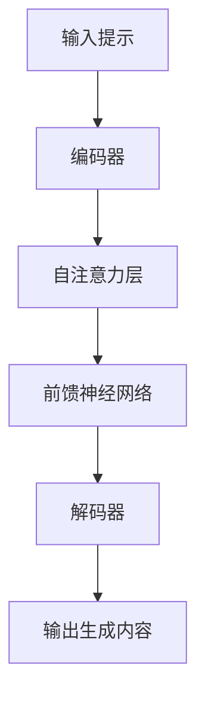

# AI生成内容的版权归属与伦理边界探讨

## 1. 背景介绍

### 1.1 人工智能生成内容的兴起

随着人工智能(AI)技术的不断进步,AI生成内容(AI-Generated Content, AIGC)的应用日益广泛。从文字、图像到视频,AI已经可以创作出令人惊艳的作品。以ChatGPT等大型语言模型为代表的AI写作助手,可以根据提示生成高质量的文章、代码、对话等内容。而像Midjourney、DALL-E等AI绘画模型,则能够基于文字描述创作出精美的图像。

AIGC的兴起不仅为创作者提供了新的辅助工具,也为内容生产带来了革命性的变化。然而,这种全新的创作方式也引发了一系列棘手的版权和伦理问题。

### 1.2 版权归属的困境

传统的版权法主要规范人类创作的作品,而AI生成内容的版权归属却存在灰色地带。究竟是AI模型的训练数据拥有版权,还是AI系统的开发者拥有版权?亦或是输入提示的用户拥有版权?目前法律界和学术界对此尚未形成统一的观点。

此外,AI生成内容可能会涉及到现有作品的版权侵权问题。例如,如果AI模型在训练过程中吸收了大量的版权内容,那么它生成的作品是否构成了对原作品的侵权?这些都是亟待解决的法律难题。

### 1.3 伦理边界的考量

除了版权问题,AIGC还面临着一些伦理道德方面的挑战。比如,AI生成的内容可能会带有偏见或者传播不实信息,这将对社会产生负面影响。另外,AIGC也可能被滥用于生成违法或有害内容,如仇恨言论、色情内容等。

因此,我们需要审慎考虑AIGC的伦理边界,制定相应的规范和准则,促进AI技术的健康发展,最大限度地发挥其积极作用,同时规避潜在的风险。

## 2. 核心概念与联系

为了更好地探讨AIGC的版权和伦理问题,我们需要先理解一些核心概念及其相互联系。

### 2.1 人工智能生成内容(AIGC)

人工智能生成内容(AIGC)是指利用人工智能技术(如深度学习、自然语言处理等)自动生成的各种形式的内容,包括文本、图像、视频、音频等。AIGC的核心是训练有素的AI模型,它们能够基于输入的提示或数据,生成全新的、具有创造性的内容。

### 2.2 版权法

版权法是一种法律制度,旨在保护原创性作品的权利,包括复制权、发行权、改编权等。传统的版权法主要适用于人类创作的作品,但对于AIGC的版权归属却存在法律空白。

### 2.3 伦理规范

伦理规范是指一套行为准则,旨在规范人们的行为,使之符合社会公德。在AIGC的背景下,我们需要制定相应的伦理规范,以确保AI技术的应用符合道德底线,避免滥用和负面影响。

### 2.4 核心联系

AIGC、版权法和伦理规范三者之间存在着紧密的联系。AIGC作为一种全新的创作方式,对现有的版权法构成了挑战,需要法律界做出相应的调整和完善。同时,AIGC的应用也需要遵循一定的伦理准则,以确保其发展的可持续性和社会影响的正面性。

因此,探讨AIGC的版权归属和伦理边界,需要综合考虑这三个核心概念,并在法律、技术和伦理层面上进行全面的分析和规范。

## 3. 核心算法原理具体操作步骤

AIGC的核心算法原理主要基于深度学习和自然语言处理技术,其中最关键的是transformer架构和自注意力机制。以下是AIGC系统的典型操作步骤:



1. **输入提示(Input Prompt)**: 用户输入一个文本提示,作为AIGC系统生成内容的起点。

2. **编码器(Encoder)**: 将输入的提示转换为一系列向量表示,这些向量包含了提示中的语义信息。

3. **自注意力层(Self-Attention Layer)**: 这是transformer架构的核心部分。自注意力层能够捕捉输入序列中不同位置之间的依赖关系,从而更好地理解上下文信息。

4. **前馈神经网络(Feed-Forward Neural Network)**: 对自注意力层的输出进行进一步处理,提取更高层次的特征表示。

5. **解码器(Decoder)**: 根据编码器输出的向量表示,生成目标输出序列(即生成的内容)。解码器也采用了自注意力机制,同时还引入了编码器-解码器注意力机制,以捕捉输入和输出之间的依赖关系。

6. **输出生成内容(Output Generated Content)**: 最终,AIGC系统输出生成的内容,如文本、图像或其他形式。

需要注意的是,不同的AIGC系统可能会采用不同的具体模型架构和训练方法,但基本原理都源自transformer和自注意力机制。此外,一些系统还会引入其他技术,如控制生成质量、增强模型鲁棒性等。

## 4. 数学模型和公式详细讲解举例说明

AIGC系统的核心是基于transformer架构的序列到序列(Seq2Seq)模型,其中自注意力机制扮演了关键角色。下面我们来详细解释自注意力机制的数学原理。

### 4.1 自注意力机制

自注意力机制的目标是计算一个加权隐状态向量,它是输入序列中所有向量的加权和。对于输入序列 $X = (x_1, x_2, \dots, x_n)$,我们需要计算一个加权隐状态向量 $z_i$ 用于生成第 $i$ 个输出元素。

$$z_i = \sum_{j=1}^n \alpha_{ij}(x_j W^V)$$

其中 $W^V$ 是一个可学习的权重矩阵,用于将输入向量 $x_j$ 映射到值空间。$\alpha_{ij}$ 是注意力权重,它决定了 $x_j$ 对 $z_i$ 的影响程度。

注意力权重 $\alpha_{ij}$ 是通过以下公式计算得到的:

$$\alpha_{ij} = \frac{exp(e_{ij})}{\sum_{k=1}^n exp(e_{ik})}$$

$$e_{ij} = \frac{(x_iW^Q)(x_jW^K)^T}{\sqrt{d_k}}$$

其中 $W^Q$ 和 $W^K$ 也是可学习的权重矩阵,用于将输入向量映射到查询(Query)空间和键(Key)空间。$d_k$ 是缩放因子,用于防止点积的值过大导致梯度消失或爆炸。

上述公式可以解释为:对于每个查询向量 $x_iW^Q$,我们计算它与所有键向量 $x_jW^K$ 的缩放点积,得到一个注意力分数 $e_{ij}$。然后,我们对这些分数执行 softmax 操作,得到注意力权重 $\alpha_{ij}$。最后,我们将值向量 $x_jW^V$ 与对应的注意力权重相乘,并求和,得到加权隐状态向量 $z_i$。

通过这种方式,自注意力机制能够自动捕捉输入序列中不同位置之间的依赖关系,从而更好地理解上下文信息,这对于生成高质量的内容至关重要。

### 4.2 多头注意力机制

在实际应用中,transformer模型通常采用多头注意力机制,它将注意力过程分成多个"头"(head),每个头都独立地计算注意力,然后将它们的结果拼接在一起。

具体来说,对于每个注意力头 $h$,我们有:

$$z_i^h = \sum_{j=1}^n \alpha_{ij}^h(x_j W^{V_h})$$

$$\alpha_{ij}^h = \frac{exp(e_{ij}^h)}{\sum_{k=1}^n exp(e_{ik}^h)}$$

$$e_{ij}^h = \frac{(x_iW^{Q_h})(x_jW^{K_h})^T}{\sqrt{d_k}}$$

其中 $W^{Q_h}$、$W^{K_h}$ 和 $W^{V_h}$ 分别是第 $h$ 个头的查询、键和值的权重矩阵。

最后,我们将所有头的结果拼接起来,得到最终的加权隐状态向量:

$$z_i = \text{Concat}(z_i^1, z_i^2, \dots, z_i^H)W^O$$

其中 $H$ 是头的数量,而 $W^O$ 是另一个可学习的权重矩阵,用于将拼接的向量映射回模型的隐状态空间。

多头注意力机制的优点在于,它允许模型从不同的表示子空间中捕捉不同的依赖关系,从而提高了模型的表达能力和性能。

通过上述数学模型,transformer架构能够有效地建模输入和输出序列之间的依赖关系,从而实现高质量的序列到序列生成任务,如AIGC中的文本生成、图像生成等。

## 5. 项目实践:代码实例和详细解释说明

为了更好地理解AIGC系统的工作原理,我们来看一个基于Python和Hugging Face Transformers库的代码示例,实现一个简单的文本生成器。

```python
from transformers import AutoTokenizer, AutoModelForCausalLM

# 加载预训练模型和分词器
tokenizer = AutoTokenizer.from_pretrained("microsoft/DialoGPT-medium")
model = AutoModelForCausalLM.from_pretrained("microsoft/DialoGPT-medium")

# 输入提示
prompt = "写一篇关于人工智能的文章:"

# 对提示进行编码
input_ids = tokenizer.encode(prompt, return_tensors="pt")

# 生成文本
output_ids = model.generate(
    input_ids,
    max_length=1024,
    num_beams=5,
    early_stopping=True
)

# 解码输出
output_text = tokenizer.decode(output_ids[0], skip_special_tokens=True)

print(output_text)
```

这个示例使用了 Microsoft 开源的 DialoGPT 对话模型,它是一个基于 transformer 架构的大型语言模型,可用于各种自然语言处理任务。

1. 首先,我们导入必要的模块,并加载预训练的模型和分词器。

2. 然后,我们定义一个输入提示,作为生成文本的起点。

3. 使用分词器将提示编码为模型可以理解的张量表示。

4. 调用模型的 `generate` 方法,传入编码后的提示,并设置一些生成参数,如最大长度、beam search 大小等。

5. 模型会基于输入的提示,生成一个新的输出序列。

6. 最后,我们使用分词器将输出序列解码为可读的文本,并打印出来。

通过这个简单的示例,我们可以看到 AIGC 系统是如何根据输入的提示生成新的内容的。当然,实际的 AIGC 系统通常会更加复杂和强大,但基本原理是相似的。

值得注意的是,不同的 AIGC 系统可能会使用不同的模型架构、训练数据和生成策略。此外,一些系统还会引入其他技术,如控制生成质量、增强模型鲁棒性等,以提高生成内容的质量和可靠性。

## 6. 实际应用场景

AIGC技术在许多领域都有广泛的应用前景,下面是一些典型的应用场景:

### 6.1 内容创作

AIGC可以辅助创作各种形式的内容,如文章、小说、剧本、广告语、产品描述等。作家、营销人员、内容创作者等都可以利用 AIGC 来获取灵感、加快创作速度,提高内容质量。

### 6.2 客户服务

AIGC 可以生成自然、人性化的对话,因此可以应用于智能客服系统中,为用户提供 7x24 小时的在线支持和问题解