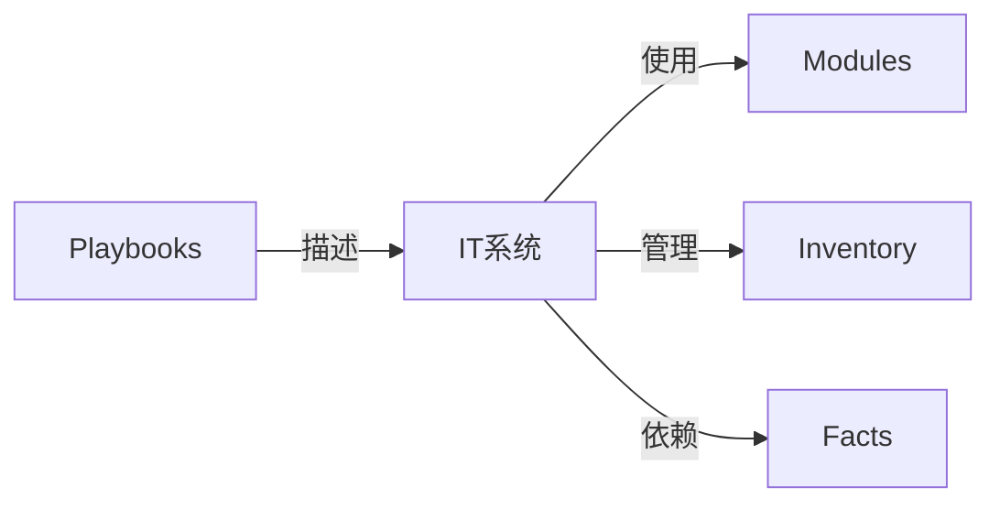

## 1.背景介绍

Ansible是一种自动化IT工具，可以帮助系统管理员和开发人员自动化各种任务。它可以用于配置管理、应用程序部署、任务自动化和IT协调。Ansible使用无代理的方式，通过SSH进行通信，这意味着它没有需要在远程系统上安装的代理。Ansible使用YAML语言描述IT系统的配置、部署和编排，这使得它易于读写和理解。

## 2.核心概念与联系

Ansible的核心概念包括：

- Playbooks：Ansible的配置、部署和编排语言，用YAML格式编写。
- Inventory：Ansible管理的主机列表，可以是静态的或动态的。
- Modules：Ansible的库，提供各种功能，例如文件操作、包管理、网络操作等。
- Facts：Ansible收集的远程系统信息，可以在Playbooks中使用。

这些概念之间的联系如下：



## 3.核心算法原理具体操作步骤

Ansible的工作流程如下：

1. Ansible从Inventory获取主机列表。
2. Ansible在主机上执行Facts收集。
3. Ansible按照Playbooks的描述在主机上执行任务，使用Modules提供的功能。

## 4.数学模型和公式详细讲解举例说明

虽然Ansible主要是用于IT自动化，不涉及复杂的数学模型和公式，但是我们可以使用一些简单的数学模型来描述Ansible的行为。例如，我们可以使用集合论来描述Inventory的行为。

假设我们有一个Inventory I，包含了所有的主机。我们可以定义一个函数 f，将一个主机映射到其Facts。我们可以定义另一个函数 g，将一个Playbook P和一个主机 h映射到一个结果 r。那么，Ansible的行为可以表示为下面的公式：

$$
\forall h \in I, r = g(P, h)
$$

这个公式表示的是，对于Inventory中的每一个主机，Ansible都会执行Playbook P，得到一个结果 r。

## 5.项目实践：代码实例和详细解释说明

让我们通过一个简单的例子来看看Ansible的实际使用。假设我们有一个Playbook，用于在所有的主机上安装nginx。

```yaml
---
- name: Install nginx
  hosts: all
  tasks:
    - name: Install nginx
      apt:
        name: nginx
        state: present
```

这个Playbook的名字是"Install nginx"，它会在所有的主机上执行。它只有一个任务，就是安装nginx。它使用了apt模块，指定了包的名字是nginx，状态是present，表示需要安装nginx。

## 6.实际应用场景

Ansible可以用于各种场景，包括：

- 配置管理：Ansible可以用于管理系统配置，确保所有的主机都符合预期的状态。
- 应用程序部署：Ansible可以用于自动化应用程序的部署，减少人为的错误和提高效率。
- 任务自动化：Ansible可以用于自动化各种任务，例如备份、更新等。
- IT协调：Ansible可以用于协调各个IT系统，确保它们能够协同工作。

## 7.工具和资源推荐

如果你想要学习和使用Ansible，下面的资源可能会有帮助：

- Ansible官方文档：https://docs.ansible.com/
- Ansible GitHub仓库：https://github.com/ansible/ansible
- Ansible Galaxy：https://galaxy.ansible.com/
- Ansible for DevOps：这是一本关于Ansible的书，作者是Jeff Geerling。

## 8.总结：未来发展趋势与挑战

随着DevOps和自动化的普及，Ansible的使用越来越广泛。然而，Ansible也面临一些挑战，例如复杂性管理、性能优化等。未来，Ansible可能会更加注重易用性和性能，同时也会有更多的功能和模块。

## 9.附录：常见问题与解答

Q: Ansible的性能如何？
A: Ansible的性能主要取决于网络和远程主机的性能。Ansible使用SSH进行通信，如果网络或远程主机的性能不佳，那么Ansible的性能也会受到影响。

Q: Ansible支持哪些操作系统？
A: Ansible支持各种Unix-like系统，包括Linux、BSD、macOS等。它也有限度地支持Windows。

Q: Ansible如何处理错误？
A: Ansible有多种方式处理错误。默认情况下，如果一个任务失败，Ansible会停止执行。但是，你可以在Playbook中指定ignore_errors: true来忽略错误。

作者：禅与计算机程序设计艺术 / Zen and the Art of Computer Programming