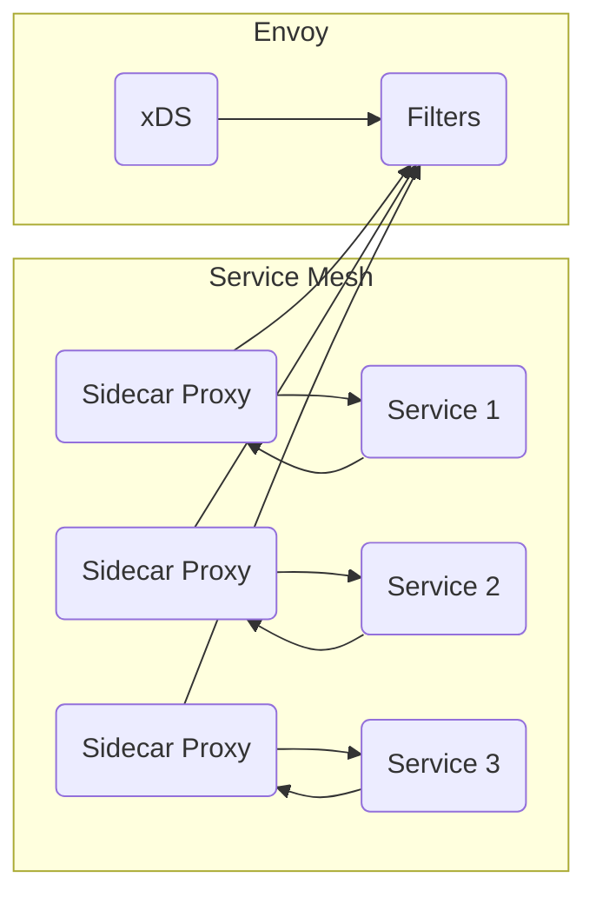

# AI系统Envoy原理与代码实战案例讲解

## 1.背景介绍

在当今快速发展的数字时代,人工智能(AI)技术已经广泛应用于各个领域,成为推动创新和提高效率的关键驱动力。随着数据量的不断增加和计算能力的提高,AI系统的复杂性也在不断增长。为了有效管理和优化这些复杂的AI系统,需要一种灵活、可扩展且高效的解决方案。这就是Envoy的用武之地。

Envoy是一款开源的边缘代理,最初由Lyft公司开发,现已被许多知名公司和组织广泛采用。它被设计为云原生应用程序的网络代理,提供了丰富的功能,如动态服务发现、负载均衡、流量路由、监控和可观测性等。在AI系统中,Envoy可以作为控制平面和数据平面之间的通信层,实现对AI模型的高效管理和部署。

## 2.核心概念与联系

### 2.1 Service Mesh

Service Mesh是一种用于解耦服务通信的网络架构模式。在Service Mesh中,每个服务实例都被包裹在一个Sidecar代理中,负责处理入站和出站网络流量。Envoy作为一种流行的Sidecar代理,可以与Service Mesh无缝集成,提供可靠的服务网格功能。

### 2.2 xDS

xDS(Discovery Service)是Envoy的核心配置管理机制,它允许Envoy动态地发现和更新配置。xDS包括多个独立的发现服务,如CDS(Cluster Discovery Service)、EDS(Endpoint Discovery Service)、LDS(Listener Discovery Service)等。通过xDS,Envoy可以实现无中断的配置更新,提高系统的灵活性和可扩展性。

### 2.3 Filters

Filters是Envoy的核心功能组件,它们可以在数据平面层执行各种任务,如协议转换、认证、速率限制等。Envoy提供了丰富的内置Filter,同时也支持用户定义自己的Filter,以满足特定的需求。在AI系统中,可以利用Filters实现对AI模型的管理和控制。



## 3.核心算法原理具体操作步骤

Envoy的核心算法原理主要体现在以下几个方面:

### 3.1 连接管理

Envoy使用了高效的连接管理算法,可以有效地处理大量的并发连接。它采用了多线程和事件驱动的架构,通过Reactor模式实现了高性能的非阻塞I/O操作。

具体操作步骤如下:

1. 建立监听器(Listener),用于接受新的连接请求。
2. 为每个新连接创建一个连接对象(Connection),并将其加入事件循环(Event Loop)中。
3. 在事件循环中,通过多路复用I/O(I/O Multiplexing)技术监听连接事件。
4. 当有新的事件(如数据到达或连接关闭)发生时,执行相应的回调函数进行处理。
5. 通过线程池(Thread Pool)实现并发处理,提高系统吞吐量。

### 3.2 负载均衡

Envoy内置了多种负载均衡算法,如轮询(Round Robin)、最小请求(Least Request)、环形哈希(Ring Hash)等。这些算法可以根据不同的场景进行选择和配置。

负载均衡的具体操作步骤如下:

1. 通过服务发现机制(如DNS或xDS)获取上游集群(Upstream Cluster)的端点信息。
2. 根据配置的负载均衡策略,选择一个合适的端点。
3. 将请求发送到选定的端点。
4. 监控端点的健康状态,并动态更新集群信息。
5. 根据监控数据调整负载均衡策略,以优化系统性能。

### 3.3 路由

Envoy提供了灵活的路由功能,可以根据各种条件(如HTTP头、路径、虚拟主机等)进行请求路由。路由规则可以通过xDS动态配置和更新。

路由的具体操作步骤如下:

1. 解析请求,提取路由所需的信息(如虚拟主机、路径等)。
2. 根据路由配置,匹配合适的路由规则。
3. 根据路由规则,执行相应的操作(如转发、重写、重定向等)。
4. 通过xDS动态更新路由配置,实现无中断的配置更改。

### 3.4 可观测性

Envoy提供了丰富的监控和可观测性功能,包括指标(Metrics)、分布式追踪(Distributed Tracing)和访问日志(Access Logging)等。这些功能可以帮助用户深入了解系统的运行状况,并进行问题诊断和性能优化。

可观测性的具体操作步骤如下:

1. 配置监控后端(如Prometheus、Zipkin等),用于收集和存储监控数据。
2. 在Envoy中启用相应的监控功能,如指标、分布式追踪和访问日志。
3. 定期将监控数据推送到后端进行存储和分析。
4. 通过可视化工具(如Grafana)展示监控数据,并设置警报规则。
5. 根据监控数据进行问题诊断和性能优化。

## 4.数学模型和公式详细讲解举例说明

在Envoy中,一些核心算法涉及到数学模型和公式,以下是一些重要的数学模型和公式的详细讲解。

### 4.1 负载均衡算法

Envoy支持多种负载均衡算法,其中一些算法涉及到数学模型和公式。

#### 4.1.1 轮询算法(Round Robin)

轮询算法是一种简单且公平的负载均衡算法,它按照固定的顺序依次选择后端服务器。假设有$n$个后端服务器,编号为$0,1,2,...,n-1$,第$i$个请求将被分配到第$((i+1) \bmod n)$个服务器。

$$
server\_index = (request\_index + 1) \bmod n
$$

其中,$server\_index$表示选择的服务器编号,$request\_index$表示请求的编号,$n$表示后端服务器的数量。

#### 4.1.2 最小请求算法(Least Request)

最小请求算法根据每个后端服务器当前的请求数量进行负载均衡,将新的请求分配给当前请求数最少的服务器。假设有$n$个后端服务器,第$i$个服务器当前的请求数为$r_i$,则第$j$个请求将被分配到$\min\limits_{0 \leq i < n} r_i$对应的服务器。

$$
server\_index = \arg\min\limits_{0 \leq i < n} r_i
$$

其中,$server\_index$表示选择的服务器编号,$r_i$表示第$i$个服务器的当前请求数量。

#### 4.1.3 环形哈希算法(Ring Hash)

环形哈希算法是一种基于哈希的负载均衡算法,它将后端服务器映射到一个环形空间中,并根据请求的哈希值选择最近的服务器。假设有$n$个后端服务器,服务器编号为$0,1,2,...,n-1$,请求的哈希值为$h$,则第$j$个请求将被分配到$\arg\min\limits_{0 \leq i < n} (h - hash(i))$对应的服务器。

$$
server\_index = \arg\min\limits_{0 \leq i < n} (h - hash(i))
$$

其中,$server\_index$表示选择的服务器编号,$h$表示请求的哈希值,$hash(i)$表示第$i$个服务器在环形空间中的哈希值。

### 4.2 指数加权移动平均数(EWMA)

Envoy使用指数加权移动平均数(EWMA)算法来计算各种指标的平滑值,如请求延迟、成功率等。EWMA算法可以有效地减小数据噪声,并反映出指标的长期趋势。

EWMA的计算公式如下:

$$
\begin{aligned}
&\text{EWM}_t = \alpha \times \text{Value}_t + (1 - \alpha) \times \text{EWM}_{t-1}\\
&\text{where:}\\
&\quad\text{EWM}_t \text{ is the exponentially weighted moving average at time }t\\
&\quad\text{Value}_t \text{ is the value of the metric at time }t\\
&\quad\alpha \text{ is the smoothing factor (0 < } \alpha \text{ < 1)}
\end{aligned}
$$

$\alpha$是平滑因子,它决定了新数据对平均值的影响程度。$\alpha$越大,新数据的影响越大;$\alpha$越小,平均值对历史数据的依赖越大。通常情况下,$\alpha$的取值范围为$0.1$到$0.3$之间。

例如,假设我们要计算请求延迟的EWMA,平滑因子$\alpha=0.2$,前一个EWMA值为$100ms$,当前请求延迟为$120ms$,则当前EWMA值为:

$$
\begin{aligned}
\text{EWM}_t &= 0.2 \times 120 + (1 - 0.2) \times 100\\
            &= 24 + 80\\
            &= 104
\end{aligned}
$$

因此,当前请求延迟的EWMA值为$104ms$。

## 5.项目实践:代码实例和详细解释说明

为了更好地理解Envoy的工作原理,我们将通过一个简单的示例项目来实践Envoy的配置和使用。在这个示例中,我们将使用Envoy作为反向代理,将请求路由到后端服务。

### 5.1 环境准备

首先,我们需要安装Envoy。你可以从官方网站下载预编译的二进制文件,或者使用Docker镜像。本示例将使用Docker镜像。

```bash
docker pull envoyproxy/envoy:v1.21.1
```

接下来,我们需要准备一个简单的后端服务。我们将使用Node.js编写一个HTTP服务器,监听8080端口。

```javascript
// server.js
const http = require('http');

const server = http.createServer((req, res) => {
  res.statusCode = 200;
  res.setHeader('Content-Type', 'text/plain');
  res.end('Hello, World!\n');
});

server.listen(8080, () => {
  console.log('Server running at http://localhost:8080/');
});
```

### 5.2 配置Envoy

Envoy的配置文件使用YAML格式。我们将创建一个名为`envoy.yaml`的配置文件,内容如下:

```yaml
static_resources:
  listeners:
  - name: listener_0
    address:
      socket_address:
        address: 0.0.0.0
        port_value: 10000
    filter_chains:
    - filters:
      - name: envoy.filters.network.http_connection_manager
        typed_config:
          "@type": type.googleapis.com/envoy.extensions.filters.network.http_connection_manager.v3.HttpConnectionManager
          stat_prefix: ingress_http
          route_config:
            name: local_route
            virtual_hosts:
            - name: local_service
              domains: ["*"]
              routes:
              - match:
                  prefix: "/"
                route:
                  cluster: service_cluster
          http_filters:
          - name: envoy.filters.http.router
  clusters:
  - name: service_cluster
    type: STATIC
    lb_policy: ROUND_ROBIN
    load_assignment:
      cluster_name: service_cluster
      endpoints:
      - lb_endpoints:
        - endpoint:
            address:
              socket_address:
                address: host.docker.internal
                port_value: 8080
```

这个配置文件定义了以下内容:

- 一个监听器(`listener_0`)监听10000端口,接收HTTP请求。
- 一个路由(`local_route`)将所有请求(`/`)路由到`service_cluster`集群。
- 一个集群(`service_cluster`)包含一个端点(`host.docker.internal:8080`),即我们的后端服务。
- 使用轮询(`ROUND_ROBIN`)作为负载均衡策略。

### 5.3 启动Envoy和后端服务

现在,我们可以启动Envoy和后端服务了。

在一个终端中,启动后端服务:

```bash
node server.js
```

在另一个终端中,启动Envoy:

```bash
docker run -p 10000:10000