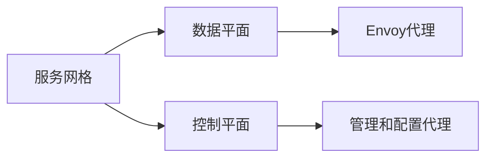
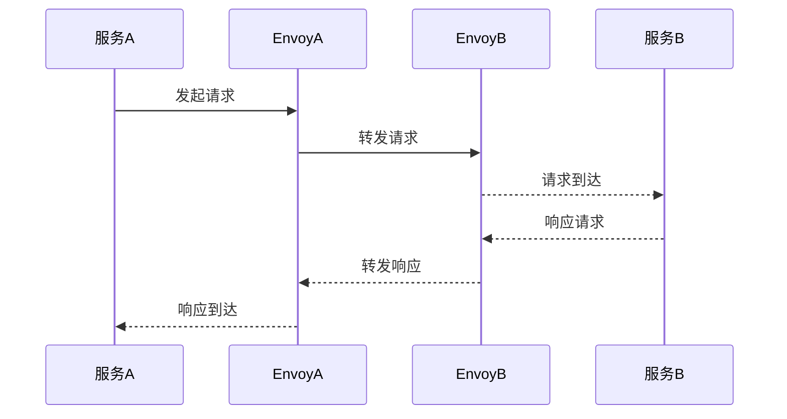

## 1.背景介绍

在云计算时代，微服务架构已经成为了软件开发的主流模式。然而，微服务的管理和运维却是一项极具挑战性的任务。为了解决这个问题，Google, IBM, Lyft等公司联合开发了Istio，一个开源的服务网格（Service Mesh）框架。Istio不仅提供了一种统一的方式来连接、保护、控制和观察服务，而且还支持多种平台，包括Kubernetes、Consul等。

## 2.核心概念与联系

Istio的核心概念包括服务网格、数据平面和控制平面。服务网格是由微服务实例和他们之间的网络通信组成的复杂结构。数据平面和控制平面是服务网格的两个主要组成部分。数据平面由一组智能代理（Envoy）组成，它们负责拦截服务之间的网络通信。控制平面负责管理和配置代理，来路由流量，以及执行策略。



## 3.核心算法原理具体操作步骤

Istio的工作原理可以分为以下几个步骤：

1. 当服务间通信发生时，流量会被Envoy代理拦截。
2. Envoy代理会根据Istio控制平面的配置进行流量的路由。
3. Envoy代理还会收集流量的详细信息，并发送给Istio的遥测组件。
4. Istio的策略组件会根据预设的策略决定是否允许流量的通过。



## 4.数学模型和公式详细讲解举例说明

在Istio中，服务间的流量可以用数学模型来描述。假设我们有N个服务，每个服务的请求率为$\lambda_i$，响应时间为$T_i$，那么系统的总体响应时间$T$可以表示为：

$$
T = \frac{1}{N} \sum_{i=1}^{N} T_i
$$

而系统的吞吐量$\lambda$可以表示为：

$$
\lambda = \min_{i=1}^{N} \lambda_i
$$

这就是我们通常说的"系统的性能取决于最弱的一环"。

## 5.项目实践：代码实例和详细解释说明

接下来，我们来看一个使用Istio的实战例子。假设我们有一个微服务应用，包括服务A和服务B，我们想要将所有从服务A到服务B的请求都路由到服务B的v2版本。

首先，我们需要在Kubernetes中部署我们的应用，并注入Envoy代理：

```bash
kubectl apply -f <(istioctl kube-inject -f app.yaml)
```

然后，我们需要定义一个Istio的VirtualService，来配置流量的路由规则：

```yaml
apiVersion: networking.istio.io/v1alpha3
kind: VirtualService
metadata:
  name: service-b
spec:
  hosts:
  - service-b
  http:
  - match:
    - sourceLabels:
        app: service-a
    route:
    - destination:
        host: service-b
        subset: v2
```

最后，我们可以使用以下命令来应用这个配置：

```bash
kubectl apply -f virtual-service.yaml
```

现在，所有从服务A到服务B的请求都会被路由到服务B的v2版本。

## 6.实际应用场景

Istio在许多实际场景中都有应用，例如：

- **流量管理**：Istio可以轻松实现流量的分割、路由和重试等功能。
- **安全**：Istio可以实现服务间通信的加密，以及强大的身份验证和授权功能。
- **观察性**：Istio可以收集详细的服务间通信数据，帮助开发者理解系统的行为。

## 7.工具和资源推荐

如果你想要深入学习Istio，以下是一些推荐的资源：

- **Istio官方文档**：这是最权威、最全面的Istio学习资源。
- **Envoy官方文档**：由于Envoy是Istio的核心组件，因此理解Envoy的工作原理是非常重要的。
- **Kubernetes官方文档**：由于Istio通常与Kubernetes一起使用，因此理解Kubernetes的工作原理也是非常重要的。

## 8.总结：未来发展趋势与挑战

随着微服务架构的普及，服务网格技术将会越来越重要。Istio作为服务网格的领导者，其未来的发展趋势无疑是光明的。然而，Istio也面临着一些挑战，例如如何简化配置、如何提高性能、如何与其他系统更好地集成等。但是，我相信Istio的社区会成功应对这些挑战。

## 9.附录：常见问题与解答

- **Q: Istio支持哪些平台？**
  A: Istio支持多种平台，包括Kubernetes、Consul等。

- **Q: Istio如何影响服务的性能？**
  A: Istio的Envoy代理会增加一些延迟，但通常在毫秒级别，对大多数应用来说是可以接受的。

- **Q: Istio支持哪些语言？**
  A: Istio本身是用Go语言编写的，但它并不依赖于服务的编程语言。无论你的服务是用Java、Python、Node.js还是其他语言编写的，都可以使用Istio。

作者：禅与计算机程序设计艺术 / Zen and the Art of Computer Programming