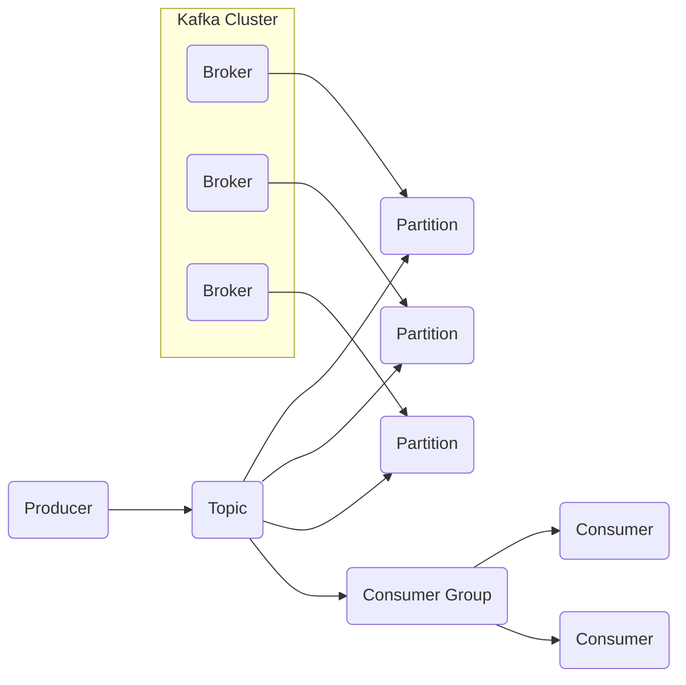

# AI系统Kafka原理与代码实战案例讲解

## 1.背景介绍

### 1.1 什么是Kafka?

Apache Kafka是一个分布式流处理平台,最初由LinkedIn公司开发,后来被开源到Apache软件基金会。它被广泛应用于大数据领域,用于构建实时数据管道和流应用程序。Kafka以高吞吐量、低延迟、高可靠性和持久性而闻名,被认为是大数据生态系统中不可或缺的组件。

### 1.2 Kafka的应用场景

Kafka可以用于多种应用场景,包括但不限于:

- **消息系统**: Kafka可用作分布式消息队列,实现异步通信、解耦生产者和消费者。
- **日志收集**: Kafka常被用于收集分布式系统中的日志数据,用于监控、故障排查等。
- **数据集成**: Kafka可以作为数据管道,将数据从各种来源传输到不同的系统中,实现数据集成。
- **流处理**: Kafka可用于构建实时流处理应用程序,如实时监控、在线分析等。

### 1.3 Kafka的优势

Kafka相较于传统消息队列具有以下优势:

- **高吞吐量**: 能够以高吞吐量持续处理大量数据。
- **可扩展性**: 通过分区和复制机制,可以轻松扩展以处理更多数据。
- **持久性**: 消息被持久化到磁盘,即使节点宕机也不会丢失数据。
- **容错性**: 通过复制机制实现高可用性,能够自动恢复故障节点。

## 2.核心概念与联系

### 2.1 Kafka核心概念

理解Kafka的核心概念对于掌握其原理和使用至关重要,主要包括:

- **Broker**: Kafka集群中的每个服务器节点都称为Broker。
- **Topic**: 一个Topic可以被认为是一个"主题",生产者发布消息到Topic,消费者从Topic订阅消息。
- **Partition**: 每个Topic可以分为多个Partition,一个Partition只属于一个Broker。
- **Offset**: 每条消息在Partition中的唯一位置标识,用于控制消费位置。
- **Producer**: 生产者,负责发布消息到Topic。
- **Consumer**: 消费者,负责订阅Topic并消费消息。
- **Consumer Group**: 消费者组,多个消费者可以组成一个组,组内消费者共享消费任务。

### 2.2 Kafka核心概念关系

Kafka的核心概念之间存在紧密的联系,如下图所示:



- Kafka集群由多个Broker组成,每个Broker可以存储一个或多个Partition。
- 一个Topic可以分为多个Partition,Partition在Broker之间分布。
- 生产者向Topic发布消息,消息会被均匀分布到Topic的不同Partition中。
- 消费者通过订阅Topic并加入消费者组来消费消息。消费者组内的消费者共享消费任务,每个消费者只消费部分Partition的消息。

## 3.核心算法原理具体操作步骤  

### 3.1 生产者发送消息原理

Kafka生产者发送消息的基本流程如下:

1. **选择Partition**: 生产者根据分区策略(如按键分区或轮询分区)选择将消息发送到哪个Partition。
2. **获取Partition元数据**: 生产者向任意一个Broker发送获取Partition元数据的请求,包括Partition的Leader Broker信息。
3. **发送消息到Leader Broker**: 生产者将消息直接发送到Partition的Leader Broker。
4. **Leader Broker写入消息**: Leader Broker将消息写入本地磁盘,并等待所有In-Sync Replica(ISR)副本复制完成。
5. **返回ACK确认**: Leader Broker向生产者返回ACK确认,表示消息已成功写入。

### 3.2 消费者消费消息原理

Kafka消费者消费消息的基本流程如下:

1. **加入消费者组**: 消费者启动时向任意一个Broker发送加入消费者组的请求,等待分配Partition任务。
2. **分配Partition任务**: Broker根据组内消费者数量和Partition数量,为每个消费者分配Partition任务。
3. **获取Partition元数据**: 消费者向Leader Broker获取分配的Partition元数据,包括该Partition的起始Offset位置。
4. **拉取消息数据**: 消费者从Leader Broker拉取分配的Partition中的消息数据。
5. **处理消息数据**: 消费者处理拉取到的消息数据。
6. **提交Offset位移**: 消费者定期向Broker提交已消费的Offset位置,用于故障恢复时继续消费。

### 3.3 Kafka容错机制

Kafka通过复制机制实现高可用性和容错能力:

1. **Leader选举**: 每个Partition都有一个Leader Broker和多个Follower Broker副本。当Leader Broker宕机时,剩余的ISR中选举出一个新的Leader。
2. **数据复制**: Leader Broker将消息复制到所有的ISR副本中,确保数据备份。
3. **故障恢复**: 当Leader Broker宕机后,新选举出的Leader从ISR副本中恢复数据,继续提供服务。
4. **重平衡**: 当Broker加入或离开集群时,Kafka会自动进行Partition重平衡,将Partition重新分配到不同的Broker上。

## 4.数学模型和公式详细讲解举例说明

### 4.1 一致性模型

Kafka采用了一种称为"最终一致性"的模型,即在一段时间内,所有副本最终都会达成一致状态。这种模型通过牺牲一些数据一致性,换取了更高的可用性和吞吐量。

Kafka中使用ISR(In-Sync Replica)集合来表示处于同步状态的副本集合。当Leader收到消息后,会先将消息写入本地日志,然后等待所有ISR副本都完成复制后,再向生产者返回ACK确认。这种方式确保了如果Leader宕机,新选举出的Leader一定包含了所有已确认的消息。

ISR集合的计算公式如下:

$$ISR = \{replicas\ with\ LEO \geq HW\}$$

其中:

- $LEO$表示每个副本的Log End Offset,即最后一条消息的位置。
- $HW$表示High Watermark,即所有副本中最小的LEO值。

只有$LEO \geq HW$的副本才会被认为是同步的,加入ISR集合。这样可以确保如果Leader宕机,新选举出的Leader一定包含了所有已确认的消息。

### 4.2 分区分配策略

Kafka在分配Partition任务给消费者时,需要考虑负载均衡和容错性。常见的分区分配策略包括:

1. **Range分区分配策略**

Range策略将连续的Partition分配给同一个消费者,公式如下:

$$consumer_i\ gets\ partitions\ \left\lfloor\frac{i}{N}\right\rfloor*\frac{P}{N}\ to\ \left\lfloor\frac{i+1}{N}\right\rfloor*\frac{P}{N}-1$$

其中:
- $N$是消费者数量
- $P$是Partition数量
- $i$是消费者编号,从0开始

这种策略可以最大化消费者的本地化,减少跨节点的数据传输。但如果消费者数量发生变化,需要大量迁移Partition。

2. **RoundRobin分区分配策略**

RoundRobin策略将Partition逐个分配给不同的消费者,公式如下:

$$consumer_i\ gets\ partitions\ i,\ i+N,\ i+2N,\ ...$$

这种策略可以更好地实现负载均衡,但如果消费者数量发生变化,也需要迁移部分Partition。

3. **HashCode分区分配策略**

HashCode策略根据Partition的HashCode值将其分配给消费者,公式如下:

$$consumer_i\ gets\ partitions\ with\ \text{hash}(partition) \bmod N = i$$

这种策略可以在消费者数量变化时最小化Partition的迁移,但可能导致负载不太均衡。

## 5.项目实践:代码实例和详细解释说明

### 5.1 生产者示例代码

下面是一个使用Java编写的Kafka生产者示例代码:

```java
Properties props = new Properties();
props.put("bootstrap.servers", "broker1:9092,broker2:9092");
props.put("key.serializer", "org.apache.kafka.common.serialization.StringSerializer");
props.put("value.serializer", "org.apache.kafka.common.serialization.StringSerializer");

Producer<String, String> producer = new KafkaProducer<>(props);

String topic = "my-topic";
String key = "key";
String value = "value";

ProducerRecord<String, String> record = new ProducerRecord<>(topic, key, value);
producer.send(record);

producer.flush();
producer.close();
```

代码解释:

1. 首先创建`Properties`对象,配置Broker地址和序列化器。
2. 创建`KafkaProducer`实例,传入配置参数。
3. 构建`ProducerRecord`对象,指定Topic、Key和Value。
4. 调用`producer.send()`方法发送消息。
5. 调用`producer.flush()`确保所有消息被发送出去。
6. 最后调用`producer.close()`关闭生产者。

### 5.2 消费者示例代码

下面是一个使用Java编写的Kafka消费者示例代码:

```java
Properties props = new Properties();
props.put("bootstrap.servers", "broker1:9092,broker2:9092");
props.put("group.id", "my-group");
props.put("key.deserializer", "org.apache.kafka.common.serialization.StringDeserializer");
props.put("value.deserializer", "org.apache.kafka.common.serialization.StringDeserializer");

KafkaConsumer<String, String> consumer = new KafkaConsumer<>(props);
consumer.subscribe(Collections.singletonList("my-topic"));

while (true) {
    ConsumerRecords<String, String> records = consumer.poll(Duration.ofMillis(100));
    for (ConsumerRecord<String, String> record : records) {
        System.out.printf("offset = %d, key = %s, value = %s%n", record.offset(), record.key(), record.value());
    }
    consumer.commitAsync();
}
```

代码解释:

1. 首先创建`Properties`对象,配置Broker地址、消费者组ID和反序列化器。
2. 创建`KafkaConsumer`实例,传入配置参数。
3. 调用`consumer.subscribe()`订阅Topic。
4. 进入无限循环,调用`consumer.poll()`拉取消息。
5. 遍历拉取到的消息记录,打印Offset、Key和Value。
6. 调用`consumer.commitAsync()`异步提交已消费的Offset位置。

## 6.实际应用场景

Kafka在实际应用中有着广泛的用途,下面列举了一些常见的应用场景:

### 6.1 实时数据管道

Kafka可以作为实时数据管道,将数据从各种来源(如日志文件、数据库、传感器等)收集并传输到不同的系统中,如Hadoop、Spark、Flink等,用于离线批处理或实时流处理。

### 6.2 日志收集和监控

Kafka常被用于收集分布式系统中的日志数据,用于系统监控、故障排查和审计等目的。相比传统的日志收集系统,Kafka具有更高的吞吐量和可靠性。

### 6.3 事件驱动架构

在事件驱动架构中,Kafka可以作为事件总线,将各个微服务之间的事件进行解耦和传递。这样可以提高系统的可扩展性和灵活性,同时也方便了事件的复制和重放。

### 6.4 物联网(IoT)数据处理

在物联网领域,Kafka可以用于收集和处理来自各种传感器和设备的海量数据流,实现实时监控、预测分析等功能。

### 6.5 实时推荐系统

Kafka可以用于构建实时推荐系统,收集用户的行为数据,并通过流处理引擎(如Spark Streaming或Flink)进行实时分析,生成个性化推荐结果。

## 7.工具和资源推荐

### 7.1 Kafka工具

- **Kafka Tool**: 一款功能强大的Kafka客户端工具,提