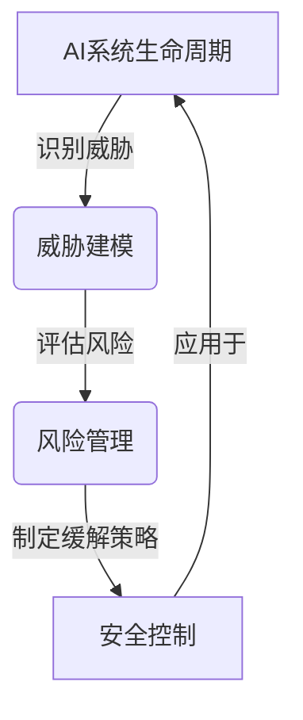

# AI系统SecOps原理与代码实战案例讲解

## 1. 背景介绍

随着人工智能(AI)系统在各行业的广泛应用,确保这些系统的安全性和可靠性变得至关重要。AI系统SecOps(AI系统安全运维)是一个新兴领域,旨在通过综合应用安全性、可靠性、隐私保护和伦理等方面的最佳实践,来保护AI系统免受各种威胁和风险。

AI系统面临着多种安全挑战,包括对抗性攻击、数据隐私泄露、模型漏洞和偏差等。这些威胁不仅会导致系统故障或性能下降,还可能造成严重的经济损失和社会影响。因此,有效的AI系统SecOps策略对于确保AI系统的安全性和可靠性至关重要。

## 2. 核心概念与联系

AI系统SecOps涉及多个关键概念,包括:

### 2.1 AI系统生命周期

AI系统的生命周期包括数据收集、模型训练、模型评估、模型部署和模型监控等阶段。每个阶段都需要采取相应的安全措施来防范潜在的威胁。

### 2.2 威胁建模

威胁建模是识别、分析和评估AI系统面临的各种威胁的过程。它有助于制定有效的缓解策略,并优先考虑最紧迫的风险。

### 2.3 风险管理

风险管理包括识别、评估和缓解与AI系统相关的风险。它需要制定全面的风险缓解计划,并持续监控和调整这些计划。

### 2.4 安全控制

安全控制是一组策略、程序和技术措施,旨在减轻或消除AI系统面临的威胁。它们可以应用于AI系统生命周期的各个阶段。

这些核心概念紧密相连,共同构成了AI系统SecOps的基础框架。



## 3. 核心算法原理具体操作步骤

AI系统SecOps涉及多种算法和技术,以下是一些核心算法原理和具体操作步骤:

### 3.1 对抗性攻击检测

对抗性攻击是指针对AI模型的输入数据进行细微扰动,以误导模型做出错误预测的攻击方式。检测对抗性攻击的一种常用算法是基于对抗训练的方法。

1. 收集一组干净的训练数据 $D = \{(x_i, y_i)\}_{i=1}^N$,其中 $x_i$ 是输入,而 $y_i$ 是相应的标签。
2. 对每个输入样本 $x_i$,使用对抗攻击算法(如快速梯度符号方法FGSM)生成对抗样本 $x_i^{adv}$:
   $$x_i^{adv} = x_i + \epsilon \cdot \text{sign}(\nabla_x J(x_i, y_i))$$
   其中 $J$ 是模型的损失函数, $\epsilon$ 是扰动的强度。
3. 使用原始数据 $D$ 和对抗样本 $D^{adv} = \{(x_i^{adv}, y_i)\}$ 对模型进行对抗训练,以提高其对抗性能力。
4. 在推理阶段,对输入数据进行扰动,并检查模型的输出是否发生显著变化。如果发生变化,则可能存在对抗性攻击。

### 3.2 隐私保护

差分隐私是一种广泛使用的隐私保护技术,它通过在数据中引入噪声来保护个人隐私。以下是差分隐私的具体步骤:

1. 定义隐私损失函数 $L(D, D')$,用于量化两个相邻数据集 $D$ 和 $D'$ 之间的隐私损失。
2. 选择隐私参数 $\epsilon$ 和 $\delta$,它们控制隐私保护的强度。较小的 $\epsilon$ 和 $\delta$ 值意味着更强的隐私保护。
3. 设计一个随机算法 $\mathcal{M}$,使得对于任意相邻数据集 $D$ 和 $D'$,以及任意输出 $S \subseteq \text{Range}(\mathcal{M})$,都满足:
   $$\Pr[\mathcal{M}(D) \in S] \leq e^\epsilon \Pr[\mathcal{M}(D') \in S] + \delta$$
4. 在数据处理过程中应用算法 $\mathcal{M}$,以实现差分隐私保护。

### 3.3 模型可解释性

可解释性算法旨在提高AI模型的透明度和可解释性,从而更好地理解模型的决策过程。一种常用的方法是使用shapley值来量化每个特征对模型预测的贡献。

1. 对于一个具有 $d$ 个特征的模型 $f(x)$,其中 $x = (x_1, x_2, \ldots, x_d)$,shapley值定义为:
   $$\phi_i(x) = \sum_{S \subseteq \{1, 2, \ldots, d\} \backslash \{i\}} \frac{|S|!(d-|S|-1)!}{d!}[f(x_S \cup \{i\}) - f(x_S)]$$
   其中 $x_S$ 是只包含特征子集 $S$ 的输入向量。
2. 计算每个特征的shapley值,并将其视为该特征对模型预测的贡献。
3. 根据shapley值的大小,确定对模型预测影响最大的特征,从而提高模型的可解释性。

这些算法原理为AI系统SecOps提供了有力的技术支持,有助于提高AI系统的安全性、隐私保护和可解释性。

## 4. 数学模型和公式详细讲解举例说明

在AI系统SecOps中,数学模型和公式扮演着重要的角色。以下是一些常见模型和公式的详细讲解和举例说明:

### 4.1 对抗性攻击模型

对抗性攻击旨在通过对输入数据进行细微扰动,误导AI模型做出错误预测。一种常见的对抗性攻击模型是快速梯度符号方法(FGSM)。

对于一个分类模型 $f(x)$,其损失函数为 $J(x, y)$,其中 $x$ 是输入,而 $y$ 是真实标签。FGSM攻击的目标是找到一个扰动 $\eta$,使得:

$$x^{adv} = x + \eta, \quad \text{s.t.} \quad \|\eta\|_\infty \leq \epsilon$$

其中 $\epsilon$ 控制扰动的强度。扰动 $\eta$ 可以通过以下公式计算:

$$\eta = \epsilon \cdot \text{sign}(\nabla_x J(x, y))$$

这种攻击可以有效地欺骗模型,使其对扰动后的输入 $x^{adv}$ 做出错误预测。

例如,对于一个手写数字识别模型,如果我们对一个代表数字7的输入图像进行FGSM攻击,模型可能会将其错误地识别为数字3或其他数字。

### 4.2 差分隐私模型

差分隐私是一种广泛使用的隐私保护技术,它通过在数据中引入噪声来保护个人隐私。差分隐私的数学定义如下:

对于任意相邻数据集 $D$ 和 $D'$(它们相差一条记录),以及任意随机算法 $\mathcal{M}$,如果对于任意输出 $S \subseteq \text{Range}(\mathcal{M})$,都满足:

$$\Pr[\mathcal{M}(D) \in S] \leq e^\epsilon \Pr[\mathcal{M}(D') \in S] + \delta$$

则称算法 $\mathcal{M}$ 满足 $(\epsilon, \delta)$-差分隐私。其中 $\epsilon$ 和 $\delta$ 控制隐私保护的强度,较小的值意味着更强的隐私保护。

一种常见的实现差分隐私的方法是高斯机制,它通过在查询函数的输出上添加高斯噪声来实现隐私保护。对于一个查询函数 $f: \mathcal{D} \rightarrow \mathbb{R}^k$,高斯机制定义为:

$$\mathcal{M}(D) = f(D) + \mathcal{N}(0, \sigma^2 I_k)$$

其中 $\sigma$ 是噪声的标准差,它与 $\epsilon$ 和 $\delta$ 有关。

例如,在一个统计查询中,我们可以使用高斯机制来保护个人隐私,而不会过多影响统计结果的准确性。

### 4.3 Shapley值模型

Shapley值是一种用于量化特征重要性的模型解释技术。它基于联盟游戏理论,为每个特征分配一个值,表示该特征对模型预测的贡献。

对于一个具有 $d$ 个特征的模型 $f(x)$,其中 $x = (x_1, x_2, \ldots, x_d)$,第 $i$ 个特征的Shapley值定义为:

$$\phi_i(x) = \sum_{S \subseteq \{1, 2, \ldots, d\} \backslash \{i\}} \frac{|S|!(d-|S|-1)!}{d!}[f(x_S \cup \{i\}) - f(x_S)]$$

其中 $x_S$ 是只包含特征子集 $S$ 的输入向量。

Shapley值的计算过程可以概括为:对于每个特征,计算它在所有可能的特征组合中对模型预测的平均边际贡献。

例如,在一个房价预测模型中,我们可以使用Shapley值来量化每个特征(如房屋面积、卧室数量等)对房价预测的贡献,从而更好地理解模型的决策过程。

通过对这些数学模型和公式的深入理解,我们可以更好地应对AI系统SecOps中的各种挑战,提高系统的安全性、隐私保护和可解释性。

## 5. 项目实践:代码实例和详细解释说明

为了更好地理解AI系统SecOps的原理和实践,我们将通过一个实际项目案例来进行说明。在这个项目中,我们将构建一个对抗性攻击检测系统,用于保护手写数字识别模型免受对抗性攻击。

### 5.1 数据准备

我们将使用MNIST数据集,它包含了60,000个训练样本和10,000个测试样本,每个样本是一个28x28像素的手写数字图像。

```python
from tensorflow.keras.datasets import mnist
import numpy as np

(x_train, y_train), (x_test, y_test) = mnist.load_data()

# 数据预处理
x_train = x_train.reshape(-1, 28, 28, 1) / 255.0
x_test = x_test.reshape(-1, 28, 28, 1) / 255.0
```

### 5.2 构建模型

我们将使用一个简单的卷积神经网络作为手写数字识别模型。

```python
from tensorflow.keras.models import Sequential
from tensorflow.keras.layers import Conv2D, MaxPooling2D, Flatten, Dense

model = Sequential([
    Conv2D(32, (3, 3), activation='relu', input_shape=(28, 28, 1)),
    MaxPooling2D((2, 2)),
    Conv2D(64, (3, 3), activation='relu'),
    MaxPooling2D((2, 2)),
    Flatten(),
    Dense(64, activation='relu'),
    Dense(10, activation='softmax')
])

model.compile(optimizer='adam', loss='sparse_categorical_crossentropy', metrics=['accuracy'])
model.fit(x_train, y_train, epochs=5, batch_size=64, validation_data=(x_test, y_test))
```

### 5.3 实现对抗性攻击

我们将使用快速梯度符号方法(FGSM)来生成对抗样本,并评估模型对这些样本的鲁棒性。

```python
import tensorflow as tf

def fgsm(model, x, y, epsilon=0.1):
    x_adv = x.copy()
    loss_fn = tf.keras.losses.SparseCategoricalCrossentropy(from_logits=True)
    
    with tf.GradientTape() as tape:
        tape.watch(x_adv)
        preds = model(x_adv)
        loss = loss_fn(y, preds)
    
    gradients = tape.gradient(loss, x_adv)
    x_adv += epsilon * tf.sign(gradients)
    x_adv = tf.clip_by_value(x_adv, 0, 1)
    
    return x_adv