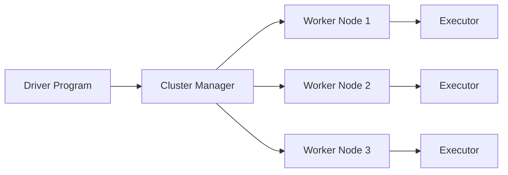

# AI系统Spark原理与代码实战案例讲解

## 1.背景介绍

### 1.1 大数据处理的挑战
在当今大数据时代,海量数据的高效处理和分析已成为企业和组织面临的重大挑战。传统的数据处理方式难以应对数据量的急剧增长,迫切需要一种高性能、可扩展的大数据处理框架。

### 1.2 Spark的诞生
Spark作为一个快速、通用的大规模数据处理引擎,由加州大学伯克利分校AMP实验室于2009年开发,旨在解决Hadoop MapReduce的局限性,为大数据处理提供更高的性能和易用性。

### 1.3 Spark的发展历程
自诞生以来,Spark凭借其出色的性能和丰富的生态系统,迅速成为大数据处理领域的主流工具。Spark不断演进,从最初的批处理引擎发展为支持流处理、机器学习、图计算等多种计算模型的统一平台。

## 2.核心概念与联系

### 2.1 RDD(弹性分布式数据集)
RDD是Spark的核心抽象,表示一个不可变、可分区、里面的元素可并行计算的集合。RDD支持两种操作:转换(transformation)和行动(action)。RDD的特点包括:
- 不可变性:RDD一旦创建,其内容不可更改
- 可分区性:RDD可以被分成多个分区,分布在集群的不同节点上
- 里面的元素可并行计算:RDD中的元素可以被并行处理
- 容错性:RDD可以自动容错和恢复

### 2.2 DataFrame和DataSet
DataFrame是Spark SQL提供的分布式数据集合,与RDD类似,但引入了schema概念。DataFrame可以从各种数据源创建,如结构化文件、Hive表、外部数据库等。DataSet是DataFrame的扩展,提供了强类型支持。

### 2.3 Spark生态系统
Spark生态系统包括了多个紧密集成的组件,覆盖了大数据处理的各个方面:
- Spark Core:Spark的核心,提供了RDD和基本的I/O功能
- Spark SQL:用于结构化数据处理,支持SQL查询、DataFrame和DataSet API
- Spark Streaming:用于实时流处理
- MLlib:Spark的机器学习库
- GraphX:用于图计算和图并行计算

### 2.4 Spark运行架构
Spark采用了主从(Master-Slave)架构,由集群管理器、驱动器程序(Driver)和执行器(Executor)组成。
- 集群管理器:负责资源的分配和管理,如Standalone、YARN、Mesos等
- 驱动器程序:负责任务的调度和协调
- 执行器:负责执行具体的任务



## 3.核心算法原理具体操作步骤

### 3.1 RDD的创建
RDD可以通过两种方式创建:
1. 从外部数据源创建,如本地文件、HDFS、HBase等
2. 从其他RDD转换而来

```scala
// 从本地文件创建RDD
val rdd1 = sc.textFile("file:///path/to/file")

// 从HDFS创建RDD
val rdd2 = sc.textFile("hdfs://namenode:port/path/to/file")

// 从其他RDD转换而来
val rdd3 = rdd1.filter(_.contains("Spark"))
```

### 3.2 RDD的转换操作
RDD支持多种转换操作,常用的有:
- map:对RDD中的每个元素应用一个函数,返回一个新的RDD
- filter:对RDD中的每个元素应用一个函数,返回满足条件的元素组成的新RDD
- flatMap:对RDD中的每个元素应用一个函数,将结果扁平化后返回一个新的RDD
- groupByKey:对RDD中的元素按照key进行分组,返回一个新的RDD
- reduceByKey:对RDD中的元素按照key进行分组,并对每个组应用一个reduce函数,返回一个新的RDD

```scala
// map操作
val rdd1 = sc.parallelize(1 to 10)
val rdd2 = rdd1.map(_ * 2)

// filter操作
val rdd3 = rdd1.filter(_ % 2 == 0)

// flatMap操作
val rdd4 = sc.parallelize(Seq("hello world", "hello spark"))
val rdd5 = rdd4.flatMap(_.split(" "))

// groupByKey操作
val rdd6 = sc.parallelize(Seq(("a", 1), ("b", 2), ("a", 2), ("c", 3)))
val rdd7 = rdd6.groupByKey()

// reduceByKey操作
val rdd8 = rdd6.reduceByKey(_ + _)
```

### 3.3 RDD的行动操作
RDD的行动操作会触发实际的计算,常用的有:
- collect:将RDD中的所有元素收集到Driver程序中,返回一个数组
- count:返回RDD中元素的个数
- first:返回RDD中的第一个元素
- take(n):返回RDD中的前n个元素
- reduce:对RDD中的元素进行聚合,返回一个结果

```scala
// collect操作
val rdd1 = sc.parallelize(1 to 10)
val array = rdd1.collect()

// count操作
val count = rdd1.count()

// first操作
val first = rdd1.first()

// take操作
val top3 = rdd1.take(3)

// reduce操作
val sum = rdd1.reduce(_ + _)
```

### 3.4 DataFrame和DataSet的操作
DataFrame和DataSet提供了类似SQL的操作方式,常用的有:
- select:选择指定的列
- where:根据条件过滤数据
- groupBy:根据指定的列对数据进行分组
- agg:对分组后的数据进行聚合操作
- join:对两个DataFrame进行连接操作

```scala
// 创建DataFrame
val df = spark.read.json("file:///path/to/file")

// select操作
val selectedDF = df.select("name", "age")

// where操作
val filteredDF = df.where("age > 18")

// groupBy和agg操作
val aggDF = df.groupBy("department").agg(avg("salary"))

// join操作
val joinedDF = df1.join(df2, "id")
```

## 4.数学模型和公式详细讲解举例说明

### 4.1 线性回归
线性回归是一种常用的机器学习算法,用于预测连续型变量。给定一组训练样本 $\{(x_1, y_1), (x_2, y_2), ..., (x_n, y_n)\}$,其中 $x_i$ 为特征向量, $y_i$ 为目标值,线性回归的目标是找到一个线性函数:

$$f(x) = w^Tx + b$$

使得预测值 $f(x_i)$ 与真实值 $y_i$ 的差距最小。通常使用最小二乘法来求解参数 $w$ 和 $b$,即最小化损失函数:

$$J(w, b) = \frac{1}{2n}\sum_{i=1}^n(f(x_i) - y_i)^2$$

求解该最优化问题的方法有梯度下降法、正规方程法等。

在Spark MLlib中,可以使用LinearRegression类来进行线性回归:

```scala
import org.apache.spark.ml.regression.LinearRegression

// 准备训练数据
val training = spark.read.format("libsvm").load("data/mllib/sample_linear_regression_data.txt")

// 创建线性回归模型
val lr = new LinearRegression()
  .setMaxIter(10)
  .setRegParam(0.3)
  .setElasticNetParam(0.8)

// 训练模型
val lrModel = lr.fit(training)

// 打印模型参数
println(s"Coefficients: ${lrModel.coefficients} Intercept: ${lrModel.intercept}")
```

### 4.2 逻辑回归
逻辑回归是一种常用的分类算法,用于二分类问题。给定一组训练样本 $\{(x_1, y_1), (x_2, y_2), ..., (x_n, y_n)\}$,其中 $x_i$ 为特征向量, $y_i \in \{0, 1\}$ 为类别标签,逻辑回归的目标是找到一个逻辑函数(sigmoid函数):

$$f(x) = \frac{1}{1 + e^{-(w^Tx + b)}}$$

使得预测值 $f(x_i)$ 接近真实标签 $y_i$。通常使用极大似然估计来求解参数 $w$ 和 $b$,即最大化对数似然函数:

$$\ell(w, b) = \sum_{i=1}^n[y_i \log f(x_i) + (1 - y_i) \log(1 - f(x_i))]$$

在Spark MLlib中,可以使用LogisticRegression类来进行逻辑回归:

```scala
import org.apache.spark.ml.classification.LogisticRegression

// 准备训练数据
val training = spark.read.format("libsvm").load("data/mllib/sample_libsvm_data.txt")

// 创建逻辑回归模型
val lr = new LogisticRegression()
  .setMaxIter(10)
  .setRegParam(0.3)
  .setElasticNetParam(0.8)

// 训练模型
val lrModel = lr.fit(training)

// 打印模型参数
println(s"Coefficients: ${lrModel.coefficients} Intercept: ${lrModel.intercept}")
```

## 5.项目实践：代码实例和详细解释说明

下面通过一个实际的项目案例,演示如何使用Spark进行数据处理和机器学习。该项目基于MovieLens数据集,目标是构建一个电影推荐系统。

### 5.1 数据准备
首先,我们需要下载MovieLens数据集,并将其上传到HDFS:

```bash
wget http://files.grouplens.org/datasets/movielens/ml-latest-small.zip
unzip ml-latest-small.zip
hdfs dfs -put ml-latest-small /movielens
```

### 5.2 数据读取和预处理
使用Spark SQL读取评分数据和电影元数据,并进行预处理:

```scala
// 读取评分数据
val ratingsDF = spark.read.format("csv")
  .option("header", "true")
  .option("inferSchema", "true")
  .load("hdfs:///movielens/ratings.csv")
  .toDF("userId", "movieId", "rating", "timestamp")

// 读取电影元数据  
val moviesDF = spark.read.format("csv")
  .option("header", "true")
  .option("inferSchema", "true")
  .load("hdfs:///movielens/movies.csv")
  .toDF("movieId", "title", "genres")

// 将评分数据和电影元数据连接起来
val ratingsWithMoviesDF = ratingsDF.join(moviesDF, "movieId")
```

### 5.3 探索性数据分析
对数据进行探索性分析,了解数据的基本情况:

```scala
// 查看前10条数据
ratingsWithMoviesDF.show(10)

// 统计评分数据的基本信息
ratingsDF.describe("rating").show()

// 统计电影数量
val numMovies = moviesDF.count()
println(s"Number of movies: $numMovies")

// 统计用户数量
val numUsers = ratingsDF.select("userId").distinct().count() 
println(s"Number of users: $numUsers")
```

### 5.4 构建推荐模型
使用Spark MLlib中的ALS(交替最小二乘)算法构建推荐模型:

```scala
import org.apache.spark.ml.recommendation.ALS

// 将数据集分为训练集和测试集
val Array(training, test) = ratingsDF.randomSplit(Array(0.8, 0.2))

// 创建ALS模型
val als = new ALS()
  .setMaxIter(5)
  .setRegParam(0.01)
  .setUserCol("userId")
  .setItemCol("movieId")
  .setRatingCol("rating")

// 训练模型
val model = als.fit(training)

// 在测试集上评估模型
model.transform(test)
  .select("prediction", "rating")
  .rdd
  .map(row => (row.getFloat(0), row.getFloat(1)))
  .toDF("prediction", "rating")
  .show(10)
```

### 5.5 生成推荐结果
使用训练好的模型为每个用户生成Top-N推荐:

```scala
// 为每个用户生成Top-10推荐
val userRecs = model.recommendForAllUsers(10)

// 查看推荐结果
userRecs.show(false)

// 将推荐结果与电影元数据连接,显示电影标题
val movieTitles = moviesDF.select("movieId", "title").as[(Int, String)].rdd.collectAsMap()
userRecs.rdd.map(row => (row.getInt(0), row.getSeq[Row](1).map(r => movieTitles(r.getInt(0)))))
  .toDF("userId", "recommendations")
  .show(false)
```

## 6