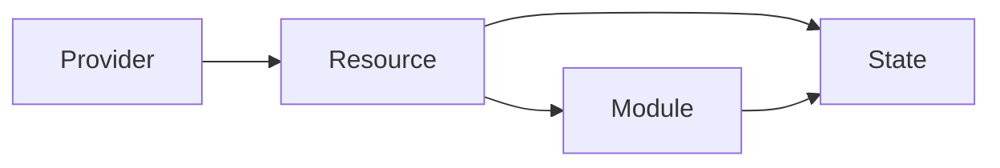

## 1.背景介绍

在现代IT生态中，基础设施即代码（Infrastructure as Code，简称IaC）已经成为了一种主流的实践。Terraform作为一种开源的IaC工具，能够让开发者和系统管理员更高效地管理和构建数据中心的基础设施。本文将深入探讨Terraform的原理，并通过实战案例讲解其在AI系统中的应用。

## 2.核心概念与联系

Terraform的核心概念主要包括Provider、Resource、Module和State。Provider是Terraform与具体云服务提供商进行交互的桥梁；Resource代表了云服务中的一个实体，如一个虚拟机或者一个数据库实例；Module是一组相关资源的集合，可以被复用以构建更复杂的系统；State则记录了Terraform管理的资源的状态。

在Terraform中，上述四个概念之间存在着紧密的联系。Provider提供了操作Resource的能力，Resource构成了Module，而State则记录了Resource和Module的状态。



## 3.核心算法原理具体操作步骤

Terraform的核心算法主要包括计划生成和状态同步。

计划生成阶段，Terraform会解析用户的配置文件，生成一个执行计划。这个计划包括了需要创建、更新或删除的资源列表。Terraform会尽可能地并行执行这些操作，以提高执行效率。

状态同步阶段，Terraform会将执行计划中的操作应用到实际的资源上，并更新State。如果在应用操作的过程中发生了错误，Terraform会尝试回滚到一个一致的状态。

## 4.数学模型和公式详细讲解举例说明

在Terraform的计划生成阶段，其实质上是一个图的遍历问题。假设我们有一个有向图$G = (V, E)$，其中$V$是资源的集合，$E$是资源之间的依赖关系。我们的目标是找到一个遍历序列，使得任何一个资源都在其依赖的资源之后。

这可以通过拓扑排序算法来实现。拓扑排序算法的时间复杂度为$O(V + E)$，其中$V$是顶点的数量，$E$是边的数量。

## 5.项目实践：代码实例和详细解释说明

接下来，我们将通过一个实战案例来讲解如何使用Terraform构建一个AI系统。

首先，我们需要定义一个Provider。在本例中，我们使用AWS作为云服务提供商。

```hcl
provider "aws" {
  region = "us-west-2"
}
```

然后，我们定义一个EC2实例，用于运行AI模型。

```hcl
resource "aws_instance" "ai_model_server" {
  ami           = "ami-0c55b159cbfafe1f0"
  instance_type = "t2.micro"
}
```

最后，我们定义一个S3桶，用于存储AI模型的输出。

```hcl
resource "aws_s3_bucket" "model_output" {
  bucket = "my_model_output"
  acl    = "private"
}
```

## 6.实际应用场景

Terraform在实际的AI系统开发中有着广泛的应用。例如，在自动驾驶系统中，可以使用Terraform快速地部署和扩展模型训练和推理的基础设施；在推荐系统中，可以使用Terraform管理用户行为数据的存储和处理资源。

## 7.工具和资源推荐

除了Terraform本身，还有一些工具和资源可以帮助你更好地使用Terraform。

- Terraform Registry：一个包含了大量Terraform Module和Provider的公共仓库。
- Terraform Cloud：一个提供了Terraform协作和远程运行功能的服务。
- Terraform Documentation：Terraform的官方文档，包含了详细的使用指南和API参考。

## 8.总结：未来发展趋势与挑战

随着云计算和AI技术的发展，Terraform的重要性将会越来越大。然而，Terraform也面临着一些挑战，如如何处理复杂的依赖关系，如何提供更好的错误处理机制等。

## 9.附录：常见问题与解答

Q: Terraform支持哪些云服务提供商？

A: Terraform支持大多数主流的云服务提供商，如AWS、Azure、Google Cloud等。

Q: 如何处理Terraform的状态冲突？

A: Terraform提供了一个锁定机制，可以防止多个用户同时修改State。此外，Terraform还支持State的版本控制，可以回滚到历史状态。

Q: Terraform和其他IaC工具有何区别？

A: 不同于其他IaC工具，Terraform是声明式的，用户只需要描述目标状态，Terraform会自动计算如何达到这个状态。此外，Terraform支持的云服务提供商数量也比其他工具多。

作者：禅与计算机程序设计艺术 / Zen and the Art of Computer Programming