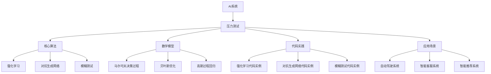

# AI系统压力测试原理与代码实战案例讲解

## 1. 背景介绍
### 1.1 AI系统压力测试的重要性
### 1.2 AI系统压力测试面临的挑战
### 1.3 本文的主要内容和贡献

## 2. 核心概念与联系
### 2.1 AI系统的定义和特点
### 2.2 压力测试的定义和目的
#### 2.2.1 压力测试的定义
#### 2.2.2 压力测试的目的
### 2.3 AI系统压力测试的特殊性
#### 2.3.1 AI系统的复杂性
#### 2.3.2 AI系统的不确定性
#### 2.3.3 AI系统的自适应性

## 3. 核心算法原理具体操作步骤
### 3.1 基于强化学习的AI系统压力测试算法
#### 3.1.1 强化学习的基本原理
#### 3.1.2 将强化学习应用于AI系统压力测试
#### 3.1.3 算法的具体操作步骤
### 3.2 基于对抗生成网络的AI系统压力测试算法
#### 3.2.1 对抗生成网络的基本原理
#### 3.2.2 将对抗生成网络应用于AI系统压力测试
#### 3.2.3 算法的具体操作步骤
### 3.3 基于模糊测试的AI系统压力测试算法
#### 3.3.1 模糊测试的基本原理
#### 3.3.2 将模糊测试应用于AI系统压力测试
#### 3.3.3 算法的具体操作步骤

## 4. 数学模型和公式详细讲解举例说明
### 4.1 马尔可夫决策过程模型
#### 4.1.1 马尔可夫决策过程的定义
#### 4.1.2 马尔可夫决策过程在AI系统压力测试中的应用
#### 4.1.3 相关数学公式推导和说明
### 4.2 贝叶斯优化模型
#### 4.2.1 贝叶斯优化的定义
#### 4.2.2 贝叶斯优化在AI系统压力测试中的应用 
#### 4.2.3 相关数学公式推导和说明
### 4.3 高斯过程回归模型
#### 4.3.1 高斯过程回归的定义
#### 4.3.2 高斯过程回归在AI系统压力测试中的应用
#### 4.3.3 相关数学公式推导和说明

## 5. 项目实践：代码实例和详细解释说明
### 5.1 基于强化学习的AI系统压力测试代码实例
#### 5.1.1 代码架构设计
#### 5.1.2 关键代码模块解释
#### 5.1.3 代码运行结果分析
### 5.2 基于对抗生成网络的AI系统压力测试代码实例  
#### 5.2.1 代码架构设计
#### 5.2.2 关键代码模块解释
#### 5.2.3 代码运行结果分析
### 5.3 基于模糊测试的AI系统压力测试代码实例
#### 5.3.1 代码架构设计 
#### 5.3.2 关键代码模块解释
#### 5.3.3 代码运行结果分析

## 6. 实际应用场景
### 6.1 自动驾驶系统的压力测试
#### 6.1.1 自动驾驶系统面临的压力因素
#### 6.1.2 针对自动驾驶系统的压力测试方案
#### 6.1.3 压力测试结果分析与改进建议
### 6.2 智能客服系统的压力测试
#### 6.2.1 智能客服系统面临的压力因素 
#### 6.2.2 针对智能客服系统的压力测试方案
#### 6.2.3 压力测试结果分析与改进建议
### 6.3 智能推荐系统的压力测试
#### 6.3.1 智能推荐系统面临的压力因素
#### 6.3.2 针对智能推荐系统的压力测试方案
#### 6.3.3 压力测试结果分析与改进建议

## 7. 工具和资源推荐
### 7.1 开源压力测试工具
#### 7.1.1 Apache JMeter
#### 7.1.2 Gatling
#### 7.1.3 Locust
### 7.2 商业压力测试工具
#### 7.2.1 LoadRunner 
#### 7.2.2 WebLOAD
#### 7.2.3 NeoLoad
### 7.3 相关学习资源
#### 7.3.1 在线课程
#### 7.3.2 技术博客
#### 7.3.3 学术论文

## 8. 总结：未来发展趋势与挑战
### 8.1 AI系统压力测试的发展趋势  
#### 8.1.1 测试自动化程度不断提高
#### 8.1.2 测试场景日益复杂多样
#### 8.1.3 测试与系统开发更加紧密结合
### 8.2 AI系统压力测试面临的挑战
#### 8.2.1 AI系统的黑盒特性
#### 8.2.2 缺乏行业标准和规范
#### 8.2.3 测试人才培养滞后
### 8.3 应对挑战的建议
#### 8.3.1 加强AI系统可解释性研究
#### 8.3.2 制定AI系统压力测试标准
#### 8.3.3 加大AI测试人才培养力度

## 9. 附录：常见问题与解答
### 9.1 如何选择合适的AI系统压力测试工具？
### 9.2 AI系统压力测试需要哪些专业技能？
### 9.3 如何设计全面有效的AI系统压力测试场景？
### 9.4 压力测试发现的问题如何有效反馈和跟进？
### 9.5 如何评估AI系统压力测试的投入产出比？

AI系统压力测试是保障AI系统鲁棒性、安全性和可靠性的重要手段。随着AI技术的快速发展和广泛应用，AI系统变得日益复杂，其内在逻辑难以穷尽,给压力测试带来巨大挑战。传统的软件测试方法难以完全适用于AI系统,需要探索新的测试理念和技术。

本文系统梳理了AI系统压力测试的核心概念、关键算法、数学模型和代码实践。重点介绍了基于强化学习、对抗生成网络和模糊测试的三类压力测试算法,并给出了详细的数学推导和代码实例。此外,本文还讨论了AI系统压力测试在自动驾驶、智能客服、智能推荐等领域的实际应用,总结了面临的挑战和未来的发展趋势。

未来,AI系统压力测试将向自动化、智能化、场景多样化的方向发展。测试与系统开发的结合将更加紧密,测试过程和结果可以实时反馈,持续优化系统。但AI系统的"黑盒"特性、行业标准缺失、专业人才匮乏等问题亟待解决。我们需要在加强AI可解释性研究的同时,制定严谨的测试规范,加大复合型测试人才的培养力度,推动AI系统压力测试向更高质量、更高效率、更具智能的方向迈进。

AI系统压力测试事关AI系统的安全和社会信任,关乎AI产业的健康发展。作为AI开发者和研究者,我们要以高度的使命感和责任感,扎实做好每一项压力测试工作,为打造鲁棒、可信、可靠的AI系统砥砺前行。

作者：禅与计算机程序设计艺术 / Zen and the Art of Computer Programming