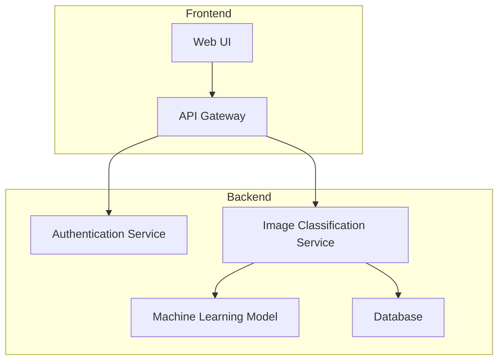

# AI系统安全审计原理与代码实战案例讲解

## 1.背景介绍

随着人工智能(AI)系统在各行业的广泛应用,确保这些系统的安全性和可靠性变得越来越重要。AI系统安全审计是一种评估和验证AI系统在设计、开发和部署过程中是否符合安全标准和最佳实践的过程。它旨在识别潜在的安全风险,并提供改进建议,从而保护AI系统免受恶意攻击、数据泄露和其他安全威胁。

AI系统安全审计不仅关注系统本身的安全性,还需要考虑数据隐私、算法公平性、系统透明度和可解释性等方面。随着AI系统在关键领域(如金融、医疗和交通)的应用越来越广泛,确保这些系统的安全性和可靠性对于保护用户隐私、维护社会信任至关重要。

## 2.核心概念与联系

### 2.1 AI系统安全审计的核心概念

1. **威胁建模(Threat Modeling)**: 识别和评估AI系统可能面临的潜在威胁,包括恶意攻击、数据泄露、系统故障等。
2. **漏洞分析(Vulnerability Analysis)**: 发现AI系统中存在的安全漏洞,包括代码漏洞、配置错误、设计缺陷等。
3. **风险评估(Risk Assessment)**: 根据威胁和漏洞的严重性,评估AI系统面临的安全风险水平。
4. **数据隐私保护(Data Privacy Protection)**: 确保AI系统在处理和存储个人数据时遵守相关隐私法规和最佳实践。
5. **算法公平性(Algorithm Fairness)**: 评估AI系统的算法是否存在潜在的偏差或歧视,确保其决策过程公平合理。
6. **系统透明度和可解释性(System Transparency and Interpretability)**: 确保AI系统的决策过程透明,并提供可解释的输出,以增强用户对系统的信任。
7. **安全控制措施(Security Controls)**: 实施适当的安全控制措施,如访问控制、加密、审计跟踪等,以保护AI系统免受威胁。

### 2.2 AI系统安全审计与其他领域的联系

AI系统安全审计与多个领域密切相关,包括:

1. **软件工程**: 采用软件工程的最佳实践,如安全编码、测试和持续集成,可以提高AI系统的安全性和可靠性。
2. **网络安全**: AI系统通常部署在网络环境中,因此需要考虑网络安全问题,如防火墙配置、入侵检测和响应等。
3. **隐私保护**: AI系统处理大量个人数据,因此需要遵守隐私法规和最佳实践,如数据加密、匿名化和访问控制。
4. **伦理和社会影响**: AI系统的决策可能产生重大影响,因此需要考虑算法公平性、透明度和可解释性等伦理和社会影响。

## 3.核心算法原理具体操作步骤

AI系统安全审计涉及多种算法和技术,以下是一些核心算法原理和具体操作步骤:

### 3.1 威胁建模

威胁建模是AI系统安全审计的基础,它有助于识别和评估潜在的威胁。常用的威胁建模方法包括:

1. **STRIDE(Spoofing, Tampering, Repudiation, Information Disclosure, Denial of Service, Elevation of Privilege)**: 一种系统化的威胁分类方法,用于识别常见的威胁类型。
2. **攻击树(Attack Tree)**: 一种图形化表示方法,用于描述攻击者可能采取的行动路径和目标。

威胁建模的具体操作步骤如下:

1. 确定AI系统的边界和信任边界。
2. 识别系统中的关键资产(如数据、模型、API等)。
3. 使用STRIDE或其他方法分析每个资产可能面临的威胁。
4. 构建攻击树,描述攻击者可能采取的行动路径。
5. 评估每种威胁的可能性和影响,确定风险级别。
6. 制定缓解措施,降低风险。

### 3.2 漏洞分析

漏洞分析旨在发现AI系统中存在的安全漏洞,包括代码漏洞、配置错误和设计缺陷。常用的漏洞分析技术包括:

1. **静态代码分析(Static Code Analysis)**: 使用自动化工具分析源代码,识别常见的安全漏洞,如缓冲区溢出、SQL注入等。
2. **动态测试(Dynamic Testing)**: 在运行时测试AI系统,模拟真实的攻击场景,检测系统的响应和行为。
3. **模糊测试(Fuzzing)**: 向AI系统输入大量无效或恶意的数据,观察系统是否存在异常行为或崩溃。

漏洞分析的具体操作步骤如下:

1. 收集AI系统的源代码、配置文件和设计文档。
2. 使用静态代码分析工具扫描源代码,识别潜在的漏洞。
3. 设计动态测试用例,模拟各种攻击场景。
4. 进行模糊测试,输入大量无效或恶意数据。
5. 分析测试结果,确定存在的漏洞。
6. 修复漏洞,并进行回归测试。

### 3.3 风险评估

风险评估是根据威胁和漏洞的严重性,评估AI系统面临的安全风险水平。常用的风险评估方法包括:

1. **风险矩阵(Risk Matrix)**: 一种基于概率和影响程度的风险评估方法,将风险分为高、中、低等级别。
2. **DREAD(Damage, Reproducibility, Exploitability, Affected Users, Discoverability)**: 一种定性风险评估模型,根据多个因素评估风险级别。

风险评估的具体操作步骤如下:

1. 收集威胁建模和漏洞分析的结果。
2. 对每种威胁和漏洞进行评分,考虑其发生概率和潜在影响。
3. 使用风险矩阵或DREAD模型,计算每种风险的总体风险级别。
4. 根据风险级别,确定需要优先处理的风险。
5. 制定风险缓解计划,实施适当的控制措施。

## 4.数学模型和公式详细讲解举例说明

在AI系统安全审计中,数学模型和公式可以用于量化和评估风险,以及优化安全控制措施。以下是一些常见的数学模型和公式:

### 4.1 风险计算公式

风险通常被定义为威胁发生的概率与潜在影响的乘积:

$$\text{Risk} = \text{Probability} \times \text{Impact}$$

其中:

- **Probability**: 威胁发生的概率,通常在0到1之间。
- **Impact**: 威胁造成的潜在影响,可以是经济损失、数据泄露或其他后果。

例如,如果一种威胁发生的概率为0.2,造成的潜在影响为10万美元的经济损失,则该威胁的风险为:

$$\text{Risk} = 0.2 \times 100,000 = 20,000$$

### 4.2 DREAD风险评估模型

DREAD是一种定性风险评估模型,它考虑了多个因素来评估风险级别。DREAD的计算公式如下:

$$\text{DREAD} = \sum_{i=1}^{5} w_i \times s_i$$

其中:

- $w_i$是每个因素的权重,总和为1。
- $s_i$是每个因素的评分,通常在1到10之间。
- 五个因素分别是:
    - **D**amage: 威胁造成的潜在损害程度。
    - **R**eproducibility: 重复发生该威胁的难易程度。
    - **E**xploitability: 利用该威胁的难易程度。
    - **A**ffected Users: 受影响的用户数量。
    - **D**iscoverability: 发现该威胁的难易程度。

例如,假设五个因素的权重分别为0.3、0.2、0.2、0.1和0.2,评分分别为8、6、5、9和7,则DREAD值为:

$$\text{DREAD} = 0.3 \times 8 + 0.2 \times 6 + 0.2 \times 5 + 0.1 \times 9 + 0.2 \times 7 = 6.8$$

根据DREAD值的大小,可以将风险分为高、中、低等级别。

### 4.3 攻击图模型

攻击图是一种建模和分析网络攻击路径的方法。它使用有向无环图(DAG)来表示系统状态和攻击步骤之间的关系。

在攻击图中,每个节点表示一个系统状态或攻击步骤,边表示从一个状态转移到另一个状态所需的条件或操作。攻击者的目标是找到从初始状态到目标状态的一条或多条路径。

攻击图可以用于计算攻击路径的成本和概率,从而评估系统的安全性。常用的度量包括:

- **最短攻击路径长度**: 从初始状态到目标状态的最短路径长度,反映了攻击的难度。
- **攻击成功概率**: 沿着特定路径成功攻击的概率,取决于每个攻击步骤的成功概率。

通过分析攻击图,可以识别系统中的薄弱环节,并优化安全控制措施。

## 5.项目实践:代码实例和详细解释说明

为了更好地理解AI系统安全审计的原理和实践,我们将使用一个示例项目进行说明。该项目是一个基于机器学习的图像分类应用程序,用于识别不同种类的植物。

### 5.1 项目架构

该项目的架构如下所示:

- **Web UI**: 用户可以通过Web界面上传图像并获取分类结果。
- **API Gateway**: 处理来自Web UI的API请求,并将请求转发给后端服务。
- **Authentication Service**: 负责用户认证和授权。
- **Image Classification Service**: 调用机器学习模型对上传的图像进行分类。
- **Machine Learning Model**: 基于训练数据构建的图像分类模型。
- **Database**: 存储上传的图像和分类结果。

### 5.2 安全审计过程

对该项目进行安全审计的过程如下:

1. **威胁建模**:
    - 使用STRIDE方法识别潜在威胁,例如:
        - **S**poofing: 攻击者伪造身份,绕过认证。
        - **T**ampering: 攻击者篡改上传的图像或分类结果。
        - **R**epudiation: 用户否认上传过图像或获取过分类结果。
        - **I**nformation Disclosure: 敏感信息(如用户数据或模型参数)泄露。
        - **D**enial of Service: 攻击者发起DoS攻击,导致服务中断。
        - **E**levation of Privilege: 攻击者获取更高的权限,执行未授权操作。
    - 构建攻击树,描述攻击者可能采取的行动路径。

2. **漏洞分析**:
    - 使用静态代码分析工具(如SonarQube)扫描源代码,识别潜在的漏洞。
    - 设计动态测试用例,模拟各种攻击场景,例如:
        - 尝试上传恶意图像文件,测试文件上传和验证机制。
        - 尝试注入恶意数据,测试输入验证和数据sanitization机制。
        - 模拟高并发请求,测试系统的负载能力和DoS防护措施。
    - 进行模糊测试,向系统输入大量无效或恶意数据,观察系统的响应和行为。

3. **风险评估**:
    - 根据威胁和漏洞的严重性,使用风险矩阵或DREAD模型评估风险级别。
    - 确定需要优先处理的高风险项目,制定风险缓解计划。

4. **实施安全控制措施**:
    - 根据风险评估结果,实施适当的安全控制措施,例如:
        - 加强认证和授权机制,防止身份伪造和权限提升。
        - 实施输入验证和数据sanitization,防止注入攻击。
        - 加强文件上传和验证机制