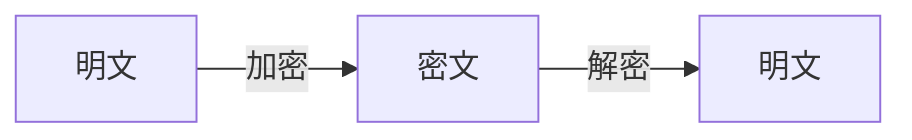
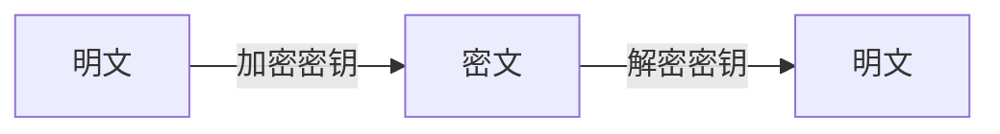
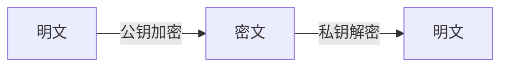
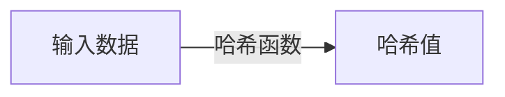
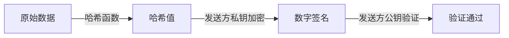

# AI系统数据加密原理与代码实战案例讲解

## 1.背景介绍

### 1.1 数据安全性的重要性

在当今的数字时代,数据安全性已经成为一个至关重要的问题。随着越来越多的敏感信息被存储和传输,确保这些数据不会被未经授权的人访问或篡改变得至关重要。无论是个人信息、金融记录、医疗数据还是机密商业信息,一旦遭到泄露或被恶意利用,都可能造成巨大的经济损失和社会影响。

### 1.2 AI系统中的数据安全挑战

人工智能(AI)系统正在被广泛应用于各个领域,从医疗诊断到自动驾驶汽车。这些系统需要处理大量的数据,包括敏感的个人信息和机密数据。然而,AI系统面临着一些独特的数据安全挑战:

1. **数据隐私**: AI系统通常需要访问大量的个人数据,如医疗记录、位置数据等,这些数据可能包含敏感的个人信息。如何在保护个人隐私的同时利用这些数据训练AI模型是一个棘手的问题。

2. **模型安全**: AI模型本身也可能存在安全漏洞,如果被黑客攻击或被恶意利用,可能会导致严重的后果。例如,一个被"投毒"的AI模型可能会做出错误的决策,或者泄露敏感信息。

3. **数据完整性**: AI系统的决策依赖于输入数据的质量和完整性。如果输入数据被篡改或被注入错误信息,AI系统的输出结果可能会被严重扭曲,导致灾难性的后果。

### 1.3 数据加密在AI系统中的作用

为了解决上述挑战,确保AI系统中的数据安全,数据加密技术扮演着关键的角色。通过对数据进行加密,即使数据被截获,也无法被未经授权的人读取或修改。加密技术可以应用于以下几个方面:

1. **数据存储加密**: 将AI系统中的敏感数据(如个人信息、模型参数等)加密存储,防止数据泄露。

2. **数据传输加密**: 在AI系统的不同组件之间传输数据时,对数据进行加密,防止数据被窃听或篡改。

3. **模型加密**: 对AI模型本身进行加密,防止模型被盗用或被投毒攻击。

4. **隐私保护技术**: 结合加密技术和其他隐私保护技术(如联邦学习、差分隐私等),在保护个人隐私的同时利用数据训练AI模型。

本文将深入探讨AI系统中的数据加密原理,介绍常用的加密算法和技术,并通过实际的代码示例,演示如何在AI系统中应用这些加密技术,以提高数据安全性。

## 2.核心概念与联系

在深入探讨数据加密技术之前,我们需要了解一些核心概念和它们之间的联系。

### 2.1 加密和解密

加密(Encryption)是将明文(Plaintext)转换为密文(Ciphertext)的过程,使得只有拥有正确密钥(Key)的人才能够解密并读取原始数据。解密(Decryption)则是将密文转换回明文的逆过程。



### 2.2 对称加密与非对称加密

加密算法可以分为两大类:对称加密(Symmetric Encryption)和非对称加密(Asymmetric Encryption)。

#### 2.2.1 对称加密

对称加密使用相同的密钥进行加密和解密。这种算法的优点是计算速度快,适合加密大量数据。但是,密钥的安全传输和管理是一个挑战。



常见的对称加密算法包括:AES、DES、Blowfish等。

#### 2.2.2 非对称加密

非对称加密使用一对密钥:公钥(Public Key)和私钥(Private Key)。公钥用于加密,私钥用于解密。这种算法的优点是密钥管理相对简单,但计算速度较慢。



常见的非对称加密算法包括:RSA、ECC等。

### 2.3 哈希函数

哈希函数(Hash Function)是一种将任意长度的数据映射为固定长度的值(哈希值或消息摘要)的函数。哈希函数具有单向性,即给定输入很容易计算出哈希值,但从哈希值反推出原始输入几乎是不可能的。

哈希函数在数据完整性验证、数字签名等场景中有广泛应用。常见的哈希函数包括MD5、SHA系列等。



### 2.4 数字签名

数字签名(Digital Signature)是一种使用加密技术为电子文件或消息提供身份验证的方法。发送方使用自己的私钥对数据进行签名,接收方使用发送方的公钥验证签名,从而确认数据的完整性和发送者的身份。



数字签名可以防止数据被篡改,并确认发送者的身份,在AI系统中具有重要应用。

### 2.5 密钥交换和管理

无论使用对称加密还是非对称加密,密钥的安全交换和管理都是一个关键问题。常见的密钥交换协议包括Diffie-Hellman协议、SSL/TLS协议等。密钥管理则涉及密钥的生成、存储、更新和撤销等过程。

在AI系统中,密钥管理需要特别小心,因为一旦密钥泄露,整个系统的安全性就会受到威胁。

## 3.核心算法原理具体操作步骤

在上一节中,我们介绍了数据加密的一些核心概念。现在,让我们深入探讨一些常见的加密算法的原理和具体操作步骤。

### 3.1 对称加密算法

#### 3.1.1 AES (Advanced Encryption Standard)

AES是目前最流行的对称加密算法之一,它取代了之前的DES算法。AES使用不同的密钥长度(128位、192位或256位)和多轮迭代,以提高安全性和抗暴力破解能力。

AES加密过程包括以下步骤:

1. **密钥扩展(Key Expansion)**: 从原始密钥派生出多个轮密钥(Round Key),用于每轮迭代。
2. **初始化(Initial Round)**: 将明文与第一个轮密钥进行异或运算。
3. **迭代轮(Rounds)**: 对数据进行多轮迭代,每轮包括以下四个步骤:
   - **字节替换(SubBytes)**: 使用预定义的S盒(Substitution Box)替换每个字节。
   - **行移位(ShiftRows)**: 对每行字节进行循环移位。
   - **列混合(MixColumns)**: 将每列字节与预定义的矩阵相乘。
   - **轮密钥加(AddRoundKey)**: 将当前轮的结果与轮密钥进行异或运算。
4. **最终轮(Final Round)**: 执行字节替换、行移位和轮密钥加,但不进行列混合。

下面是一个Python示例,演示如何使用AES算法加密和解密数据:

```python
from Crypto.Cipher import AES
from Crypto.Util.Padding import pad, unpad

# 定义密钥和初始向量
key = b'This is a secret key'
iv = b'This is an IV456'

# 创建AES加密器
cipher = AES.new(key, AES.MODE_CBC, iv)

# 加密数据
plaintext = b'This is a secret message'
ciphertext = cipher.encrypt(pad(plaintext, AES.block_size))

# 解密数据
decrypted = unpad(cipher.decrypt(ciphertext), AES.block_size)

print(f'Plaintext: {plaintext}')
print(f'Ciphertext: {ciphertext}')
print(f'Decrypted: {decrypted}')
```

#### 3.1.2 ChaCha20

ChaCha20是一种流加密算法,由Daniel J. Bernstein设计。它具有高性能、高安全性和简单实现的优点,被广泛应用于各种场景。

ChaCha20的加密过程包括以下步骤:

1. **初始化状态(Initialization)**: 使用256位密钥、96位随机数(Nonce)和计数器(Counter)初始化16个32位字的状态矩阵。
2. **迭代轮(Rounds)**: 对状态矩阵进行20轮迭代,每轮包括四个并行的加法、异或和移位操作。
3. **输出(Output)**: 将最终状态矩阵的前64字节作为密文输出。

下面是一个Python示例,演示如何使用ChaCha20算法加密和解密数据:

```python
from cryptography.hazmat.primitives.ciphers import Cipher, algorithms, modes
from cryptography.hazmat.backends import default_backend

# 定义密钥和随机数
key = b'This is a secret key'
nonce = b'This is a nonce'

# 创建ChaCha20加密器
algorithm = algorithms.ChaCha20(key, nonce)
cipher = Cipher(algorithm, mode=None, backend=default_backend())
encryptor = cipher.encryptor()

# 加密数据
plaintext = b'This is a secret message'
ciphertext = encryptor.update(plaintext) + encryptor.finalize()

# 解密数据
decryptor = cipher.decryptor()
decrypted = decryptor.update(ciphertext) + decryptor.finalize()

print(f'Plaintext: {plaintext}')
print(f'Ciphertext: {ciphertext}')
print(f'Decrypted: {decrypted}')
```

### 3.2 非对称加密算法

#### 3.2.1 RSA

RSA是一种广泛使用的非对称加密算法,它基于大数的因数分解问题。RSA的安全性依赖于选择两个大质数及其乘积(模数)的困难性。

RSA加密过程包括以下步骤:

1. **密钥生成(Key Generation)**: 选择两个大质数p和q,计算它们的乘积n=p*q,并选择一个与(p-1)*(q-1)互质的公钥指数e。然后计算私钥指数d,使得(d*e) mod ((p-1)*(q-1)) = 1。
2. **加密(Encryption)**: 将明文m转换为一个小于n的整数,然后计算密文c = m^e mod n。
3. **解密(Decryption)**: 计算明文m = c^d mod n。

下面是一个Python示例,演示如何使用RSA算法加密和解密数据:

```python
from Crypto.PublicKey import RSA
from Crypto.Cipher import PKCS1_OAEP

# 生成RSA密钥对
key = RSA.generate(2048)
public_key = key.publickey()

# 加密数据
plaintext = b'This is a secret message'
cipher = PKCS1_OAEP.new(public_key)
ciphertext = cipher.encrypt(plaintext)

# 解密数据
private_key = key
cipher = PKCS1_OAEP.new(private_key)
decrypted = cipher.decrypt(ciphertext)

print(f'Plaintext: {plaintext}')
print(f'Ciphertext: {ciphertext}')
print(f'Decrypted: {decrypted}')
```

#### 3.2.2 ECC (Elliptic Curve Cryptography)

ECC是一种基于椭圆曲线数学的非对称加密算法,相比RSA,它具有更小的密钥长度和更高的计算效率。ECC的安全性依赖于在有限域上求解椭圆曲线离散对数问题的困难性。

ECC加密过程包括以下步骤:

1. **密钥生成(Key Generation)**: 选择一条椭圆曲线E和一个基点G,生成私钥k(一个随机整数),并计算公钥Q=k*G。
2. **加密(Encryption)**: 选择一个随机整数r,计算点R=r*G和密文C=(r*Q, M+r*Q),其中M是明文。
3. **解密(Decryption)**: 计算S=k*R,然后从密文C中恢复明文M=C2-S。

下面是一个Python示例,演示如何使用ECC