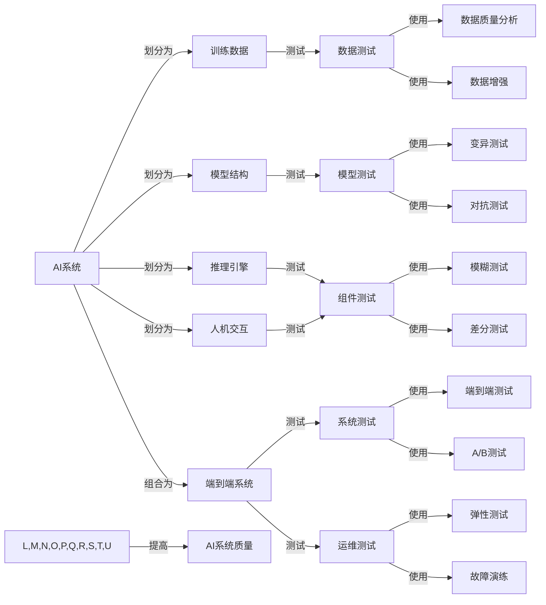

# AI系统测试原理与代码实战案例讲解

## 1.背景介绍
### 1.1 AI系统测试的重要性
随着人工智能技术的飞速发展,AI系统在各行各业得到越来越广泛的应用。从自动驾驶汽车到智能客服,从医疗诊断到金融风控,AI系统正在深刻改变着我们的生活和工作方式。然而,与此同时,AI系统的复杂性、不确定性、黑盒特性也给测试工作带来了前所未有的挑战。一个没有经过充分测试验证的AI系统,一旦在关键领域中出现问题,后果不堪设想。因此,AI系统测试已经成为保障AI系统安全、可靠、合规的关键环节。

### 1.2 AI系统测试面临的挑战
与传统软件测试不同,AI系统测试面临着许多独特的困难和挑战:

1. AI系统的决策过程往往是黑盒,缺乏可解释性和透明度,给白盒测试带来障碍。
2. AI模型对训练数据高度依赖,数据质量问题可能导致模型行为异常。
3. AI系统的输入空间巨大,传统的穷举测试方法难以奏效。 
4. AI系统对环境有很强的适应性,测试场景难以穷尽。
5. AI系统容易受到对抗样本攻击,传统软件测试方法难以发现这类缺陷。

### 1.3 AI系统测试的目标
AI系统测试的根本目标是通过各种测试手段,尽可能发现AI系统中存在的各类缺陷、异常行为、性能瓶颈、安全漏洞等问题,并推动问题的修复,从而提高AI系统的质量和可靠性。具体来说,AI系统测试需要重点关注以下几个方面:

1. 功能正确性:AI系统能否按照预期完成既定功能。
2. 鲁棒性:AI系统在噪声、异常、对抗等情况下能否保持稳定。
3. 安全性:AI系统是否存在隐私泄露、数据中毒等安全隐患。
4. 性能:AI系统的响应速度、资源占用是否满足需求。
5. 公平性:AI系统的决策是否存在偏见和歧视。
6. 可解释性:AI系统的决策逻辑是否可审计、可追溯。

## 2.核心概念与联系
### 2.1 AI系统测试分类
根据测试对象和测试方法,AI系统测试可以分为以下几类:

1. 数据测试:针对AI系统使用的训练数据、验证数据进行测试,重点关注数据的质量、分布、标注等。
2. 模型测试:针对AI模型进行测试,重点关注模型结构、超参数、泛化能力等。
3. 组件测试:将AI系统划分为不同模块进行测试,如数据预处理、特征工程、模型推理等。
4. 系统测试:对AI系统进行端到端的黑盒测试,重点关注系统的功能、性能、安全等。
5. 运维测试:针对AI系统的部署运维进行测试,如弹性伸缩、故障恢复、版本更新等。

### 2.2 AI系统测试技术
针对AI系统测试的特殊性,业界已经提出了多种测试技术,主要包括:

1. 变异测试(Mutation Testing):通过引入人工缺陷,评估测试用例的有效性。
2. 模糊测试(Fuzzing):通过随机生成或变异输入,发现边界异常行为。
3. 对抗测试(Adversarial Testing):通过构造对抗样本,发现模型的脆弱点。
4. 差分测试(Differential Testing):通过比较不同版本系统的差异,发现引入的缺陷。
5. A/B测试:通过线上流量分桶,比较不同版本模型的效果。
6. 因果推理(Causal Inference):通过因果分析,揭示模型的决策机制。
7. 可解释性分析(Explainable AI):通过可视化、规则提取等技术,解释模型的决策过程。

### 2.3 核心概念关系图
下面使用Mermaid流程图展示了AI系统测试的核心概念之间的关系:



## 3.核心算法原理具体操作步骤
下面以变异测试为例,详细讲解其核心算法原理和具体操作步骤。

### 3.1 变异测试原理
变异测试的基本思想是通过人为引入缺陷(变异体)到被测系统中,然后运行测试用例,如果测试用例能够检测到这些变异体,则说明测试用例的有效性较高;反之则说明测试用例的覆盖不足,需要补充和优化。

变异测试可以分为以下几个步骤:

1. 在被测系统中引入变异体。
2. 使用测试用例运行原系统和变异系统。
3. 比较原系统和变异系统的运行结果,统计测试用例对变异体的杀伤率。
4. 分析存活的变异体,补充和优化测试用例。

### 3.2 变异算子
在变异测试中,变异体是通过变异算子生成的。常见的变异算子包括:

1. 条件变异:将条件判断符号替换,如>变为>=。
2. 常量变异:将常量值替换,如1变为0。
3. 变量变异:将变量替换,如x变为y。
4. 算术变异:将算术运算符替换,如+变为-。
5. 控制流变异:改变代码执行顺序,如删除break语句。

### 3.3 变异分数
变异分数是评估测试用例有效性的重要指标,计算公式为:

$$
\text{Mutation Score} = \frac{\text{Number of Killed Mutants}}{\text{Total Number of Mutants}} \times 100\%
$$

其中,$\text{Number of Killed Mutants}$表示被测试用例检测到的变异体数量,$\text{Total Number of Mutants}$表示引入的变异体总数。

变异分数越高,说明测试用例的覆盖率和有效性越高。一般来说,变异分数达到80%以上就可以认为测试较为充分。

### 3.4 变异测试操作步骤
下面以一个简单的Python函数为例,演示变异测试的具体操作步骤:

```python
def calculate_grade(score):
    if score >= 90:
        return 'A'
    elif score >= 80:
        return 'B'
    elif score >= 70:
        return 'C'
    elif score >= 60:
        return 'D'
    else:
        return 'F'
```

假设我们已经编写了一些测试用例:

```python
def test_calculate_grade():
    assert calculate_grade(95) == 'A'
    assert calculate_grade(85) == 'B'
    assert calculate_grade(75) == 'C'
    assert calculate_grade(65) == 'D'
    assert calculate_grade(55) == 'F'
```

#### 步骤1:引入变异体
我们可以使用条件变异算子,将>= 90改为> 90,生成一个变异体:

```python
def mutant_calculate_grade(score):
    if score > 90:  # 变异
        return 'A'
    elif score >= 80:
        return 'B'
    elif score >= 70:
        return 'C'
    elif score >= 60:
        return 'D'
    else:
        return 'F'
```

#### 步骤2:运行测试用例
分别使用测试用例运行原函数和变异函数:

```python
test_calculate_grade()
test_calculate_grade(mutant_calculate_grade)
```

#### 步骤3:分析结果
对比两次运行结果,发现原函数测试全部通过,但变异函数在score=90时测试不通过,说明测试用例成功检测到了这个变异体。

#### 步骤4:计算变异分数
假设我们只引入了这1个变异体,且被成功检测,则变异分数为:

$$
\text{Mutation Score} = \frac{1}{1} \times 100\% = 100\%
$$

说明当前的测试用例覆盖率较高。但实际工作中,我们往往需要引入多个变异体,来全面评估测试用例的有效性。

以上就是变异测试的基本原理和操作步骤,通过不断引入变异体并运行测试用例,可以持续优化和完善AI系统的测试体系。

## 4.数学模型和公式详细讲解举例说明
除了变异测试,AI系统测试中还涉及一些常用的数学模型和公式,下面举例说明。

### 4.1 混淆矩阵
混淆矩阵是评估分类模型的常用工具,对于二分类问题,混淆矩阵一般长这样:

|      | 预测正例 | 预测反例 |
|------|---------|---------|
| 实际正例 | TP   | FN      |
| 实际反例 | FP   | TN      |

其中:
- TP(True Positive):预测为正例,实际为正例。
- FN(False Negative):预测为反例,实际为正例。
- FP(False Positive):预测为正例,实际为反例。
- TN(True Negative):预测为反例,实际为反例。

基于混淆矩阵,可以计算出以下常用指标:

- 准确率(Accuracy):$\frac{TP+TN}{TP+FN+FP+TN}$
- 精确率(Precision):$\frac{TP}{TP+FP}$ 
- 召回率(Recall):$\frac{TP}{TP+FN}$
- F1分数:$2 \times \frac{Precision \times Recall}{Precision + Recall}$

例如,某个二分类模型在测试集上的表现如下:

|      | 预测正例 | 预测反例 |
|------|---------|---------|
| 实际正例 | 80   | 20      |
| 实际反例 | 10   | 90      |

则模型的各项指标为:

- 准确率(Accuracy):$\frac{80+90}{80+20+10+90}=0.85$
- 精确率(Precision):$\frac{80}{80+10}=0.89$
- 召回率(Recall):$\frac{80}{80+20}=0.80$ 
- F1分数:$\frac{2 \times 0.89 \times 0.80}{0.89+0.80}=0.84$

可以看出,该模型整体表现不错,但在召回率上还有提升空间。

### 4.2 ROC曲线和AUC
ROC(Receiver Operating Characteristic)曲线是评估二分类模型性能的另一常用工具。ROC曲线横坐标为假正例率(FPR),纵坐标为真正例率(TPR),其中:

$$
FPR = \frac{FP}{FP+TN} \\
TPR = \frac{TP}{TP+FN}
$$

ROC曲线下的面积称为AUC(Area Under Curve),AUC越大,说明模型性能越好。

例如,某个二分类模型在不同阈值下的表现如下:

| 阈值 | TP | FN | FP | TN |
|-----|----|----|----|----|
| 0.1 | 98 | 2  | 80 | 20 |
| 0.2 | 96 | 4  | 60 | 40 |
| 0.3 | 93 | 7  | 40 | 60 |
| 0.4 | 90 | 10 | 20 | 80 |
| 0.5 | 85 | 15 | 10 | 90 |

则可以绘制出如下ROC曲线:

```mermaid
graph LR
A[0,0] --> B[