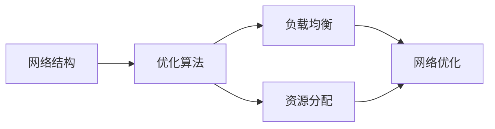

## 1.背景介绍

在当今世界，人工智能（AI）已经成为科技进步的主要驱动力之一。AI系统的网络优化是一个关键的研究领域，它旨在通过改进网络的配置和操作，提高AI系统的性能和效率。本文将深入探讨AI系统网络优化的原理，并通过代码实战案例进行详细讲解。

## 2.核心概念与联系

AI系统网络优化涉及的核心概念包括网络结构、优化算法、负载均衡和资源分配等。网络结构是AI系统的基础，优化算法是改进网络性能的关键，负载均衡和资源分配则是保证网络稳定和高效运行的重要手段。



## 3.核心算法原理具体操作步骤

网络优化的核心算法原理包括梯度下降法、牛顿法等。这些算法通过迭代优化过程，不断调整网络参数，以最小化预定义的损失函数，从而改进网络性能。

以梯度下降法为例，其具体操作步骤如下：

1. 初始化网络参数
2. 计算损失函数
3. 计算损失函数的梯度
4. 更新网络参数
5. 重复步骤2-4，直到满足停止条件（例如，达到预设的迭代次数，或损失函数的改变小于预设的阈值）

## 4.数学模型和公式详细讲解举例说明

我们以梯度下降法为例，来详细讲解其数学模型和公式。假设我们的损失函数为 $L(\theta)$，其中 $\theta$ 是网络参数，我们的目标是找到一个 $\theta$，使得 $L(\theta)$ 最小。

梯度下降法的更新公式为：

$$
\theta = \theta - \alpha \nabla L(\theta)
$$

其中，$\alpha$ 是学习率，$\nabla L(\theta)$ 是损失函数 $L(\theta)$ 的梯度。通过不断迭代这个更新公式，我们可以逐步优化网络参数 $\theta$，从而最小化损失函数 $L(\theta)$。

## 5.项目实践：代码实例和详细解释说明

下面我们通过一个简单的代码实战案例，来具体演示如何使用梯度下降法进行网络优化。

假设我们的网络只有一个参数 $\theta$，损失函数 $L(\theta) = (\theta - 2)^2$，初始参数 $\theta = 0$，学习率 $\alpha = 0.1$。我们可以使用以下 Python 代码来实现梯度下降法：

```python
theta = 0
alpha = 0.1
for i in range(100):
    grad = 2 * (theta - 2)
    theta = theta - alpha * grad
    print(f'Iteration {i + 1}: theta = {theta}')
```

## 6.实际应用场景

AI系统网络优化在许多实际应用场景中都有重要的作用，例如：

- 在自动驾驶中，通过优化神经网络的结构和参数，可以提高车辆的行驶安全和效率。
- 在推荐系统中，通过优化网络的负载均衡和资源分配，可以提高推荐的准确性和用户体验。

## 7.工具和资源推荐

- TensorFlow：一个强大的开源库，用于构建和训练深度学习模型。
- PyTorch：一个用于机器学习的开源Python库，提供了丰富的工具和资源，以支持各种网络优化任务。
- Scikit-learn：一个用于机器学习的开源Python库，提供了丰富的优化算法和工具。

## 8.总结：未来发展趋势与挑战

AI系统网络优化是一个持续发展的领域，其未来的发展趋势可能包括更高效的优化算法、更复杂的网络结构、更智能的负载均衡和资源分配策略等。然而，这也带来了一些挑战，例如如何在保证网络性能的同时，保持网络的可解释性和透明性。

## 9.附录：常见问题与解答

Q: 梯度下降法的学习率 $\alpha$ 应该如何选择？

A: 学习率 $\alpha$ 的选择取决于具体的问题和数据。一般来说，我们可以从一个较小的值开始，然后逐步增大，观察损失函数的变化，以找到一个合适的学习率。

Q: 如何处理网络优化中的过拟合问题？

A: 过拟合问题可以通过正则化、dropout、早停等方法来解决。

作者：禅与计算机程序设计艺术 / Zen and the Art of Computer Programming