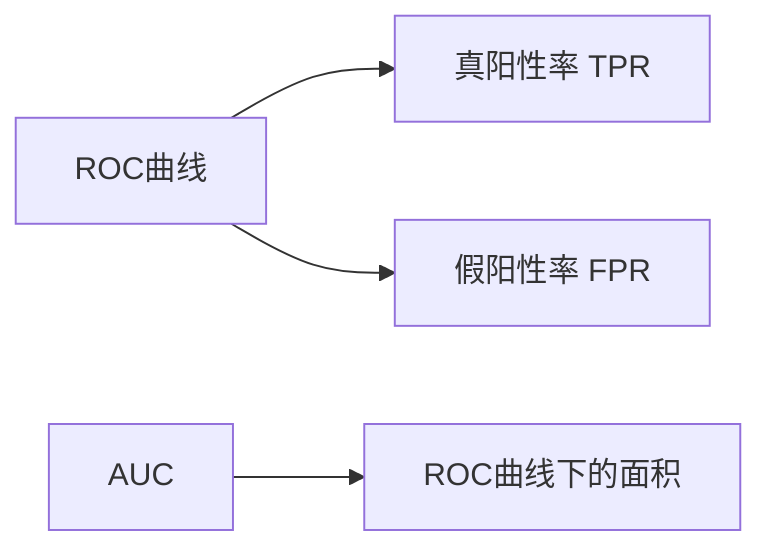

## 1.背景介绍

AUC-ROC是机器学习中常见的性能度量指标，尤其在分类问题中，广泛应用于模型的评估。ROC曲线的全称是"Receiver Operating Characteristic"，中文可以翻译为"接收者操作特性"。AUC是"Area Under Curve"的缩写，即曲线下的面积。这个概念最早在二战时期由电气工程师提出，用于检测敌方飞机的雷达信号。而现在，我们更多地见到它在机器学习的各种应用中。

## 2.核心概念与联系

ROC曲线是通过将连续性变量设定不同的临界值，计算出一系列的敏感度和特异度，然后以1-特异度为横坐标，敏感度为纵坐标，绘制出来的曲线。而AUC则是ROC曲线下的面积，用来量化ROC的整体表现。

ROC曲线的横坐标为假阳性率(False Positive Rate, FPR)，纵坐标为真阳性率(True Positive Rate, TPR)。其中，FPR定义为FP/(TN+FP)，TPR定义为TP/(TP+FN)。TPR也叫做敏感度，FPR在1-特异度。

AUC的值介于0.5和1之间，AUC越接近1，说明模型的性能越好。如果AUC=0.5，表示模型没有预测能力。如果AUC<0.5，表示模型的预测完全错误。



## 3.核心算法原理具体操作步骤

ROC曲线的绘制步骤如下：

1. 对于给定的测试数据集，首先，基于某个机器学习模型计算出每个样本的预测概率。
2. 将这些预测概率排序，然后设定一个阈值，大于阈值的样本被预测为正例，小于等于阈值的样本被预测为负例。
3. 对于每一个阈值，计算出对应的TPR和FPR，绘制在二维平面，形成ROC曲线。
4. 计算ROC曲线下的面积，即AUC。

## 4.数学模型和公式详细讲解举例说明

假设我们有一个二分类问题，样本总数为$N$，其中正例样本数为$P$，负例样本数为$N$。

设定一个阈值$t$，所有大于$t$的样本被预测为正例，小于等于$t$的样本被预测为负例。

那么，真阳性（TP）的数量就是被正确预测为正例的样本数，假阳性（FP）的数量就是被错误预测为正例的样本数。

我们可以计算出TPR和FPR：

$$ TPR = \frac{TP}{P} $$

$$ FPR = \frac{FP}{N} $$

然后，我们就可以绘制ROC曲线，并计算AUC。

$$ AUC = \int_{0}^{1} TPR(FPR) dFPR $$

## 5.项目实践：代码实例和详细解释说明

这里我们使用Python的sklearn库来进行AUC-ROC的计算和绘制。首先，我们需要创建一个分类模型，并使用训练数据进行训练。然后，我们使用测试数据进行预测，并计算出每个样本的预测概率。

```python
from sklearn.ensemble import RandomForestClassifier
from sklearn.metrics import roc_curve, auc
from sklearn.model_selection import train_test_split
import matplotlib.pyplot as plt

# 创建模型
clf = RandomForestClassifier()

# 训练模型
clf.fit(X_train, y_train)

# 预测概率
y_score = clf.predict_proba(X_test)[:, 1]

# 计算ROC曲线
fpr, tpr, thresholds = roc_curve(y_test, y_score)

# 计算AUC
roc_auc = auc(fpr, tpr)

# 绘制ROC曲线
plt.figure()
lw = 2
plt.plot(fpr, tpr, color='darkorange',
         lw=lw, label='ROC curve (area = %0.2f)' % roc_auc)
plt.plot([0, 1], [0, 1], color='navy', lw=lw, linestyle='--')
plt.xlim([0.0, 1.0])
plt.ylim([0.0, 1.05])
plt.xlabel('False Positive Rate')
plt.ylabel('True Positive Rate')
plt.title('Receiver Operating Characteristic example')
plt.legend(loc="lower right")
plt.show()
```

## 6.实际应用场景

AUC-ROC广泛应用于各种分类问题的模型评估中，例如信用卡欺诈检测、疾病诊断、客户流失预测等。它可以帮助我们选择出最优的模型和参数。

## 7.工具和资源推荐

- Python的sklearn库：包含了大量的机器学习模型和评估工具，包括AUC-ROC。
- R的pROC包：提供了ROC曲线的计算和绘制功能。
- Weka：一个包含大量机器学习算法的开源工具，可以通过图形界面进行操作，非常适合初学者。

## 8.总结：未来发展趋势与挑战

AUC-ROC是一个非常重要的模型评估指标，但它也有一些局限性。例如，它假设每个阈值下的TPR和FPR是等价的，但在实际应用中，我们可能更关心某个特定的阈值。此外，AUC-ROC对于不平衡数据的处理也存在一些问题。因此，未来我们可能需要更多的新方法来补充和改进AUC-ROC。

## 9.附录：常见问题与解答

1. 问：为什么AUC-ROC可以作为模型的评估指标？
答：AUC-ROC可以反映模型在各种阈值下的性能，而不仅仅是一个固定的阈值。因此，它可以给我们提供更全面的信息。

2. 问：AUC-ROC有什么局限性？
答：AUC-ROC假设每个阈值下的TPR和FPR是等价的，但在实际应用中，我们可能更关心某个特定的阈值。此外，AUC-ROC对于不平衡数据的处理也存在一些问题。

作者：禅与计算机程序设计艺术 / Zen and the Art of Computer Programming