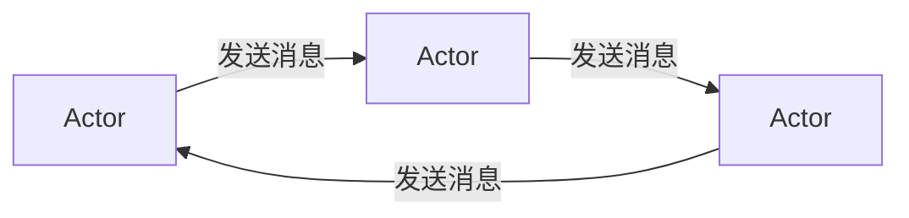
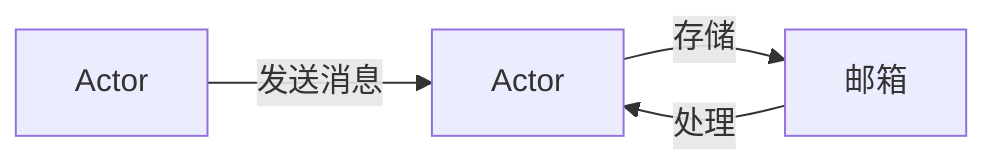
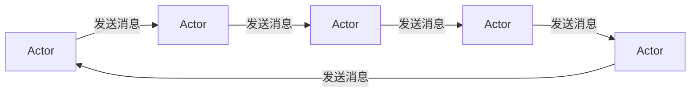
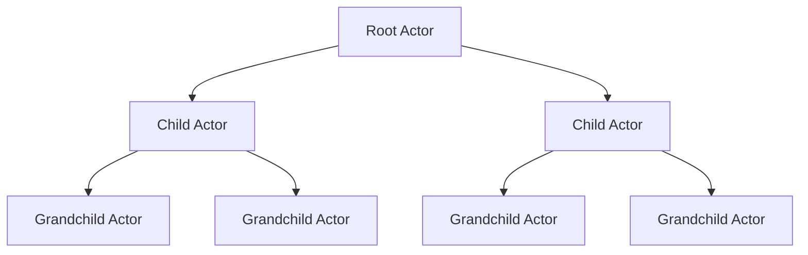

# Actor Model原理与代码实例讲解

## 1.背景介绍

在当今分布式系统和并发编程的世界中,Actor模型作为一种强大的编程范式,越来越受到广泛关注和应用。它提供了一种简单而优雅的方式来构建可伸缩、容错和响应迅速的应用程序。Actor模型的核心思想是将系统划分为许多独立的、轻量级的单元(Actor),它们通过异步消息传递进行通信和协作,而不是直接共享内存。

Actor模型的概念最早可以追溯到1973年,由卡尔·休伊特(Carl Hewitt)和其同事在麻省理工学院人工智能实验室提出。他们的目标是设计一种新的并发计算模型,以解决传统模型中存在的一些问题,例如低效的资源利用、复杂的同步机制和死锁等。

随着云计算、微服务架构和大数据处理等领域的兴起,Actor模型再次引起了人们的浓厚兴趣。许多流行的编程语言和框架,如Erlang、Akka、Orleans和Project Reactor等,都采用了Actor模型或受其启发。Actor模型在构建高并发、高可用、可扩展的分布式系统中发挥着重要作用。

## 2.核心概念与联系

### 2.1 Actor

Actor是Actor模型的核心构造单元。每个Actor都是一个独立的、并发执行的对象,拥有自己的状态和行为。Actor之间通过发送异步消息进行通信,而不是直接调用对方的方法或共享内存。这种松散耦合的设计使得Actor可以更容易地进行并行计算,同时避免了传统并发模型中常见的竞争条件和死锁问题。



### 2.2 消息

在Actor模型中,Actor之间的通信是通过异步消息传递实现的。每个Actor都有一个邮箱(mailbox),用于接收其他Actor发送的消息。Actor按照消息到达的顺序依次处理它们,确保了消息处理的顺序性和原子性。消息可以携带任何类型的数据,包括基本数据类型、对象或者函数等。



### 2.3 Location Transparency

Actor模型支持位置透明性(Location Transparency),这意味着Actor可以在同一台机器上运行,也可以分布在不同的机器或集群中。发送消息的Actor无需知道接收Actor的具体位置,只需知道它的地址(Address)即可。这种设计使得Actor模型非常适合构建分布式系统,并且具有很好的可扩展性和容错性。



### 2.4 无共享状态

Actor模型中,每个Actor都是独立的,拥有自己的状态和行为。Actor之间不共享状态,只能通过发送消息进行通信。这种设计避免了传统并发模型中常见的竞争条件和死锁问题,使得Actor模型具有更好的可伸缩性和容错性。


### 2.5 监督树

在Actor模型中,Actor可以创建子Actor,形成一个层次结构,称为监督树(Supervision Tree)。父Actor负责监督和管理子Actor的生命周期,包括重启失败的子Actor、终止不可恢复的子Actor等。这种设计提高了系统的容错性和可靠性,使得系统能够自我修复和恢复。



## 3.核心算法原理具体操作步骤

Actor模型的核心算法原理可以概括为以下几个步骤:

1. **创建Actor**

   首先,需要创建一个或多个Actor。每个Actor都是一个独立的对象,拥有自己的状态和行为。Actor可以在同一台机器上运行,也可以分布在不同的机器或集群中。

2. **启动Actor**

   创建Actor后,需要启动它们。启动Actor意味着将它们加入到Actor系统中,准备好接收和处理消息。

3. **发送消息**

   Actor之间的通信是通过异步消息传递实现的。发送消息时,只需要知道接收Actor的地址(Address)即可,无需关心它的具体位置。消息可以携带任何类型的数据,包括基本数据类型、对象或者函数等。

4. **接收消息**

   每个Actor都有一个邮箱(mailbox),用于接收其他Actor发送的消息。Actor按照消息到达的顺序依次处理它们,确保了消息处理的顺序性和原子性。

5. **处理消息**

   Actor接收到消息后,会根据自身的状态和行为对消息进行处理。处理过程可能会修改Actor的内部状态,也可能会向其他Actor发送新的消息。

6. **监督和容错**

   在Actor模型中,Actor可以创建子Actor,形成一个监督树(Supervision Tree)。父Actor负责监督和管理子Actor的生命周期,包括重启失败的子Actor、终止不可恢复的子Actor等。这种设计提高了系统的容错性和可靠性,使得系统能够自我修复和恢复。

7. **终止Actor**

   当Actor完成了它的任务或者不再需要时,可以终止它。终止Actor意味着将它从Actor系统中移除,释放相关资源。

这些步骤循环往复,形成了Actor模型的核心算法流程。通过异步消息传递、无共享状态和监督树等机制,Actor模型能够构建出高度并发、可伸缩、容错和响应迅速的应用程序。

## 4.数学模型和公式详细讲解举例说明

在Actor模型中,我们可以使用一些数学模型和公式来描述和分析Actor系统的行为和性能。下面是一些常见的数学模型和公式:

### 4.1 Actor系统建模

我们可以将Actor系统建模为一个有向图$G=(V,E)$,其中$V$表示Actor集合,$E$表示消息传递关系。如果Actor $a_i$向Actor $a_j$发送消息,则在图中存在一条有向边$(a_i,a_j) \in E$。

$$
G = (V, E) \\
V = \{a_1, a_2, \dots, a_n\} \\
E = \{(a_i, a_j) | a_i \text{ sends message to } a_j\}
$$

通过这种建模方式,我们可以分析Actor系统的拓扑结构、消息传递路径和潜在的通信瓶颈等。

### 4.2 消息处理时间

对于每个Actor $a_i$,我们可以使用随机变量$X_i$来表示它处理一条消息所需的时间。假设$X_i$服从某种概率分布,例如指数分布或者均匀分布,我们可以计算出Actor系统的吞吐量和延迟等性能指标。

$$
X_i \sim f(x) \quad \text{(概率分布函数)}
$$

### 4.3 吞吐量和延迟

吞吐量(Throughput)表示Actor系统在单位时间内能够处理的消息数量,延迟(Latency)表示从发送消息到接收响应所需的时间。我们可以根据Actor的数量、消息处理时间分布和系统拓扑结构等因素,建立数学模型来估计吞吐量和延迟。

$$
\text{Throughput} = \frac{\text{Number of messages processed}}{\text{Time interval}} \\
\text{Latency} = \sum_{i=1}^{n} X_i + \text{Network delay}
$$

### 4.4 小世界网络模型

在分布式Actor系统中,Actor之间的通信关系可能呈现出小世界网络(Small-World Network)的特征,即大多数Actor之间的距离较短,但也存在一些长距离连接。我们可以使用小世界网络模型来描述和分析这种拓扑结构,并优化Actor的部署和消息传递路径。

$$
L = \frac{1}{n(n-1)} \sum_{i \neq j} d(i,j) \quad \text{(平均最短路径长度)}\\
C = \frac{1}{n} \sum_{i=1}^{n} \frac{2E_i}{k_i(k_i-1)} \quad \text{(平均聚类系数)}
$$

上述公式中,$L$表示平均最短路径长度,$C$表示平均聚类系数,$d(i,j)$表示Actor $i$和Actor $j$之间的最短路径长度,$E_i$表示Actor $i$的邻居之间的边数,$k_i$表示Actor $i$的度数(邻居数)。

通过分析这些数学模型和公式,我们可以更好地理解和优化Actor系统的性能和可靠性。

## 5.项目实践:代码实例和详细解释说明

为了更好地理解Actor模型的实际应用,我们将通过一个简单的示例项目来演示如何使用Actor模型构建一个分布式系统。在这个示例中,我们将创建一个简单的在线商店系统,包括客户端(Customer)、库存管理器(InventoryManager)和订单处理器(OrderProcessor)等Actor。

我们将使用Akka框架,它是一个流行的Actor模型实现,支持多种编程语言,如Java、Scala和C#等。下面是使用Scala语言实现的代码示例:

### 5.1 定义Actor

首先,我们需要定义各种Actor及其行为。

```scala
// 客户端Actor
class Customer(inventoryManager: ActorRef, orderProcessor: ActorRef) extends Actor {
  def receive = {
    case PlaceOrder(item, quantity) =>
      inventoryManager ! CheckInventory(item, quantity, sender())
    case InventoryConfirmed(item, quantity) =>
      orderProcessor ! ProcessOrder(item, quantity, sender())
    case OrderConfirmed(orderId) =>
      println(s"Order $orderId confirmed!")
    case _ =>
  }
}

// 库存管理器Actor
class InventoryManager extends Actor {
  var inventory = Map[String, Int]()

  def receive = {
    case CheckInventory(item, quantity, customer) =>
      if (inventory.getOrElse(item, 0) >= quantity) {
        customer ! InventoryConfirmed(item, quantity)
      } else {
        customer ! InventoryRejected(item, quantity)
      }
    case _ =>
  }
}

// 订单处理器Actor
class OrderProcessor extends Actor {
  var orders = Map[String, Order]()

  def receive = {
    case ProcessOrder(item, quantity, customer) =>
      val orderId = UUID.randomUUID().toString
      orders += (orderId -> Order(item, quantity, customer))
      customer ! OrderConfirmed(orderId)
    case _ =>
  }
}
```

在上面的代码中,我们定义了三种Actor:

- `Customer`负责发起订单请求,并与`InventoryManager`和`OrderProcessor`进行交互。
- `InventoryManager`负责管理商品库存,并响应库存查询请求。
- `OrderProcessor`负责处理订单,并向客户端确认订单。

每个Actor都有自己的状态(如`inventory`和`orders`)和行为(`receive`方法),它们通过发送和接收消息进行通信和协作。

### 5.2 创建和启动Actor系统

接下来,我们需要创建Actor系统,并启动各种Actor。

```scala
import akka.actor.ActorSystem
import akka.actor.Props

object OnlineShop extends App {
  val system = ActorSystem("OnlineShopSystem")
  val inventoryManager = system.actorOf(Props[InventoryManager], "inventoryManager")
  val orderProcessor = system.actorOf(Props[OrderProcessor], "orderProcessor")
  val customer1 = system.actorOf(Props(classOf[Customer], inventoryManager, orderProcessor), "customer1")
  val customer2 = system.actorOf(Props(classOf[Customer], inventoryManager, orderProcessor), "customer2")

  // 初始化库存
  inventoryManager ! CheckInventory("Book", 10, null)
  inventoryManager ! CheckInventory("Pen", 5, null)

  // 客户端发起订单
  customer1 ! PlaceOrder("Book", 3)
  customer2 ! PlaceOrder("Pen", 2)
}
```

在上面的代码中,我们首先创建了一个名为`OnlineShopSystem`的Actor系统。然后,我们使用`actorOf`方法创建并启动了`InventoryManager`、`OrderProcessor`和两个`Customer