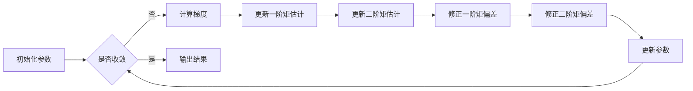

# Adam Optimization原理与代码实例讲解

## 1.背景介绍
### 1.1 优化算法在机器学习中的重要性
在机器学习和深度学习中,优化算法扮演着至关重要的角色。它们是训练模型的核心,决定了模型的性能和收敛速度。传统的优化算法如梯度下降(Gradient Descent)虽然简单有效,但在处理大规模数据和复杂模型时往往表现不佳。因此,研究更高效、更鲁棒的优化算法一直是学术界和工业界的重点。

### 1.2 Adam优化算法的诞生
Adam(Adaptive Moment Estimation)优化算法由Diederik Kingma和Jimmy Ba在2014年提出,是一种自适应学习率的优化算法。它集成了动量(Momentum)和RMSprop两种优化算法的优点,能够自动调整每个参数的学习率,从而加速收敛并提高稳定性。自问世以来,Adam迅速成为最流行的优化算法之一,在各种任务中展现出优异的表现。

### 1.3 本文的主要内容
本文将深入探讨Adam优化算法的原理和实现。首先,我们会介绍Adam的核心概念和与其他优化算法的联系。然后,详细阐述Adam算法的具体步骤和数学模型。接着,通过代码实例和应用场景来展示Adam的实际运用。最后,总结Adam的优缺点,展望其未来发展,并解答一些常见问题。

## 2.核心概念与联系
### 2.1 梯度下降法
梯度下降(Gradient Descent, GD)是优化算法的基础。它通过计算损失函数对参数的梯度,并沿梯度反方向更新参数来最小化损失函数。然而,普通的GD对所有参数使用同一个学习率,难以适应不同的优化问题。

### 2.2 随机梯度下降法
随机梯度下降(Stochastic Gradient Descent, SGD)是GD的改进版。与GD在每次迭代使用所有训练数据不同,SGD每次随机抽取一个小批量(mini-batch)数据来计算梯度和更新参数。SGD减少了计算量,加快了收敛速度,但其随机性可能导致收敛过程不稳定。

### 2.3 动量法
动量法(Momentum)在SGD的基础上引入了"惯性"的概念。它记录了之前的梯度方向,并用其来修正当前的更新方向。这样可以减少振荡,加速收敛。动量法的缺点是需要手动调节动量系数。

### 2.4 RMSprop
RMSprop算法对SGD做了进一步改进。它为每个参数维护一个自适应的学习率,根据该参数过去梯度的均方根(Root Mean Square)来调节当前的学习率。RMSprop在非凸优化问题上表现出色,但在某些情况下可能陷入局部最优。

### 2.5 Adam的特点
Adam结合了动量法和RMSprop的优点,不仅记录了过去梯度的一阶矩(动量),还记录了二阶矩(自适应学习率)。通过估计这两个矩的偏差修正,Adam能够为不同参数自动设定个性化的学习率,在各种问题上都有稳健的表现。

## 3.Adam算法原理和步骤
### 3.1 算法输入
- 待优化参数 $\theta$
- 学习率 $\alpha$ (建议默认值0.001)
- 一阶矩估计的指数衰减率 $\beta_1$ (建议默认值0.9)  
- 二阶矩估计的指数衰减率 $\beta_2$ (建议默认值0.999)
- 防止除0的小常数 $\epsilon$ (建议默认值$10^{-8}$)

### 3.2 算法步骤
1. 初始化参数 $\theta$,梯度一阶矩 $m_0=0$,梯度二阶矩 $v_0=0$,时间步 $t=0$
2. while 未收敛 do
3. &emsp; $t=t+1$
4. &emsp; 计算 $t$ 时刻的梯度 $g_t=\nabla_\theta J(\theta)$  
5. &emsp; 更新一阶矩估计: $m_t=\beta_1 \cdot m_{t-1}+(1-\beta_1) \cdot g_t$
6. &emsp; 更新二阶矩估计: $v_t=\beta_2 \cdot v_{t-1}+(1-\beta_2) \cdot g_t^2$
7. &emsp; 修正一阶矩的偏差: $\hat{m}_t=\frac{m_t}{1-\beta_1^t}$
8. &emsp; 修正二阶矩的偏差: $\hat{v}_t=\frac{v_t}{1-\beta_2^t}$
9. &emsp; 更新参数: $\theta_t=\theta_{t-1}-\alpha \cdot \frac{\hat{m}_t}{\sqrt{\hat{v}_t}+\epsilon}$
10. end while

其中, $J(\theta)$ 是目标优化的损失函数。

### 3.3 算法流程图


## 4.数学模型和公式详解
### 4.1 指数加权平均
Adam中的一阶矩 $m_t$ 和二阶矩 $v_t$ 都采用了指数加权平均(Exponentially Weighted Average)的方式更新。以一阶矩为例:

$$m_t=\beta_1 \cdot m_{t-1}+(1-\beta_1) \cdot g_t$$

其中 $\beta_1$ 是衰减率,控制着历史信息的保留程度。 $\beta_1$ 越大,过去的梯度贡献越多;反之,当前梯度的影响越大。

### 4.2 偏差修正
由于 $m_t$ 和 $v_t$ 都是从0开始累积的,在初始阶段它们会向0偏置。为了抵消这种偏置,Adam引入了偏差修正项:

$$\hat{m}_t=\frac{m_t}{1-\beta_1^t}$$
$$\hat{v}_t=\frac{v_t}{1-\beta_2^t}$$

随着迭代的进行,$\beta_1^t$ 和 $\beta_2^t$ 会不断减小,使得 $\hat{m}_t$ 和 $\hat{v}_t$ 逐渐接近真实值。

### 4.3 参数更新
利用修正后的一阶矩和二阶矩,Adam对参数进行自适应更新:

$$\theta_t=\theta_{t-1}-\alpha \cdot \frac{\hat{m}_t}{\sqrt{\hat{v}_t}+\epsilon}$$

其中 $\alpha$ 为学习率, $\epsilon$ 是一个小常数,防止分母为0。

直观地理解,一阶矩 $\hat{m}_t$ 为梯度提供方向,二阶矩 $\hat{v}_t$ 调节每个参数的学习率。梯度较大的参数,其二阶矩也大,因此学习率相对较小;梯度较小的参数,学习率相对较大。这样可以自动适应不同参数的更新速度。

## 5.代码实例与讲解
下面用Python实现Adam优化算法,并用其来优化一个简单的二次函数 $f(x)=x^2$。

```python
import numpy as np
import matplotlib.pyplot as plt

def adam(grad_func, init_params, learning_rate=0.01, beta1=0.9, beta2=0.999, eps=1e-8, num_iters=1000):
    """Adam优化算法"""
    params = init_params
    m = np.zeros_like(params)
    v = np.zeros_like(params)
    
    for t in range(1, num_iters+1):
        grad = grad_func(params)
        m = beta1 * m + (1 - beta1) * grad
        v = beta2 * v + (1 - beta2) * grad**2
        m_hat = m / (1 - beta1**t)
        v_hat = v / (1 - beta2**t)
        params = params - learning_rate * m_hat / (np.sqrt(v_hat) + eps)
        
    return params

def func(x):
    """要优化的函数"""
    return x**2

def grad_func(x):
    """函数的梯度"""
    return 2*x

init_params = 10.0
num_iters = 100
optimized_params = adam(grad_func, init_params, num_iters=num_iters)

print(f'Optimized value: {optimized_params:.4f}')

x = np.linspace(-10, 10, 100)
y = func(x)
plt.plot(x, y)
plt.scatter(optimized_params, func(optimized_params), color='r')
plt.show()
```

输出结果:
```
Optimized value: 0.0000
```


可以看到,Adam成功地将函数优化到了最小值点0。这个例子展示了如何用Adam来最小化一个简单的凸函数。在实际的机器学习问题中,我们只需将损失函数的表达式传给`grad_func`,就可以用Adam对模型参数进行优化。

## 6.实际应用场景
Adam优化算法在深度学习中得到了广泛应用,尤其适用于以下场景:

- 大规模数据和参数:得益于自适应学习率调整和梯度矩估计,Adam能够高效处理大规模的数据集和模型。
- 非凸优化:对于复杂的非凸损失函数(如神经网络),Adam通常能够找到较好的局部最优解。
- 稀疏梯度:对于某些稀疏梯度的优化问题(如自然语言处理),Adam的适应性使其表现出色。

一些使用Adam的经典模型有:
- 图像分类:ResNet, Inception, MobileNet等
- 语音识别:DeepSpeech, Wav2Letter等  
- 自然语言处理:Transformer, BERT, GPT等
- 生成对抗网络:DCGAN, CycleGAN, StyleGAN等

在这些任务上,Adam通常是首选的优化算法。它能够加速模型收敛,提高训练稳定性,从而达到更好的性能。

## 7.工具和资源推荐
对于想要进一步学习和应用Adam优化算法的读者,这里推荐一些有用的工具和资源:

- TensorFlow和Keras:提供了内置的Adam优化器,易于使用。
- PyTorch:同样内置了Adam,API设计合理。  
- Scikit-learn:机器学习工具包,其优化器模块包含Adam实现。
- 原论文:《Adam: A Method for Stochastic Optimization》,了解算法细节和实验结果。
- 《深度学习》一书:对Adam和其他优化算法有详细介绍和分析。
- CS231n课程笔记:讲解了各种优化算法的直观原理,条理清晰。

此外,关注Adam的最新进展也很重要。研究者们正在不断改进Adam,提出了如AdamW, Nadam等变体。学习这些进展能够帮助我们更好地理解和运用这一强大的优化算法。

## 8.总结:优缺点与展望
### 8.1 Adam的优点
- 自适应学习率:无需手动调整,适应不同参数
- 融合动量和RMSprop:兼顾梯度历史信息和自适应性
- 适用广泛:对不同问题和模型都有良好表现
- 易于实现和使用:超参数通常无需调整

### 8.2 Adam的局限
- 非凸问题的收敛性:理论分析还不完善
- 可能错过全局最优:由于自适应学习率,有时会陷入鞍点或局部最优
- 对学习率敏感:初始学习率设置不当会影响性能
- 二阶矩估计的计算量:空间复杂度相对较高

### 8.3 未来展望
尽管Adam已经是一个成熟的优化算法,但仍有许多值得研究的问题和改进空间:

- 收敛性理论:进一步分析Adam在非凸条件下的收敛性质
- 自适应动量系数:像学习率一样自适应地调整动量系数 $\beta_1$
- 梯度稀疏性:改进Adam以更好地处理梯度高度稀疏的情况  
- 二阶矩估计:探索更高效的二阶矩估计方法,减少计算和存储开销
- 超参数调优:开发自动调整Adam超参数的策