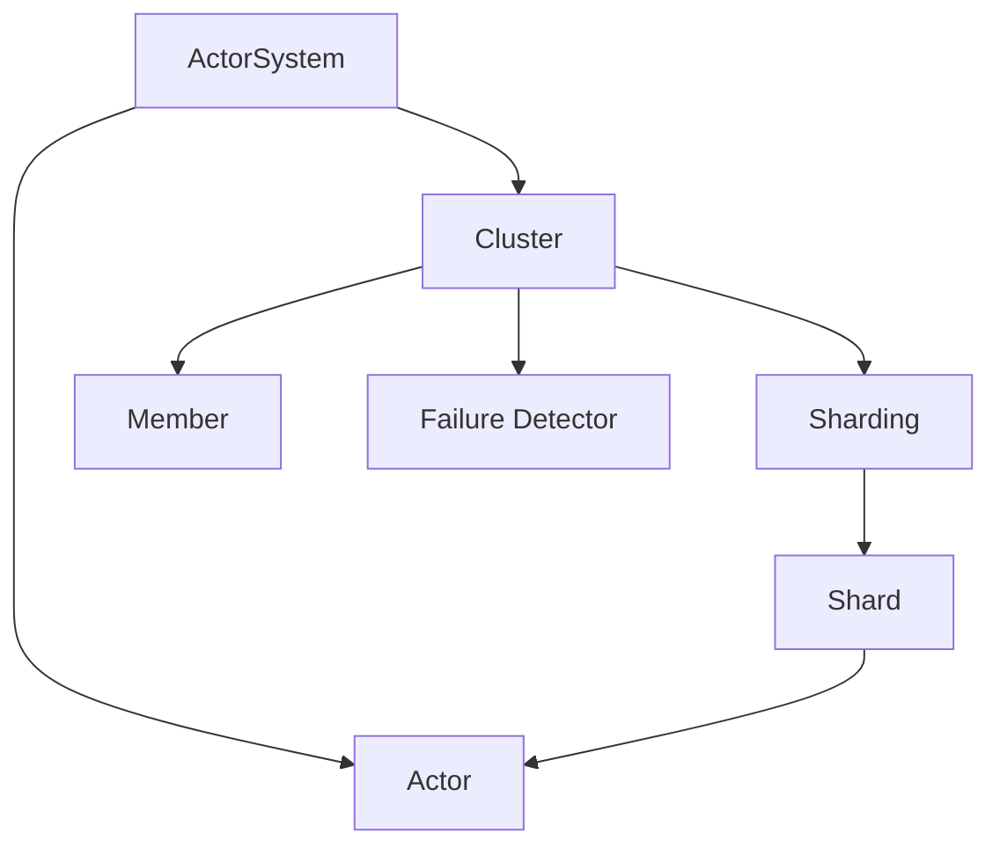
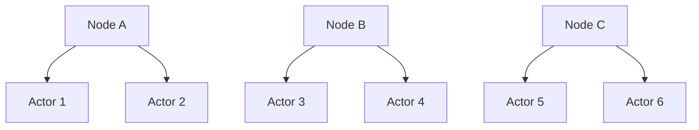

# Akka集群原理与代码实例讲解

## 1. 背景介绍

### 1.1 分布式系统的挑战

在当今互联网时代,越来越多的应用需要处理海量数据和高并发请求。单台服务器已经无法满足这些需求,因此分布式系统应运而生。然而,分布式系统的开发和维护面临诸多挑战,例如:

- 如何实现节点间的通信和协作
- 如何保证系统的高可用性和容错性  
- 如何实现负载均衡和弹性伸缩
- 如何保证数据的一致性和完整性

### 1.2 Actor模型与Akka框架

Actor模型是一种用于构建高并发、分布式系统的编程模型。它将应用程序划分为多个独立的Actor,每个Actor拥有自己的状态和行为,通过消息传递的方式与其他Actor通信。Actor模型具有以下优点:

- 解决了并发编程中的线程安全问题
- 提供了更高层次的抽象,简化了并发编程
- 易于构建弹性和容错的分布式系统

Akka是一个基于Actor模型的开源工具包,用于构建高并发、分布式和容错的应用程序。它提供了一套完整的库和工具,使得开发者能够更加专注于业务逻辑,而不必过多关注底层细节。Akka的主要特性包括:

- 基于Actor模型的编程抽象
- 容错性和自我修复能力
- 位置透明性,支持本地和远程Actor
- 负载均衡和弹性伸缩
- 易于集成和扩展

### 1.3 Akka集群的优势

Akka集群是Akka提供的一种分布式解决方案,它允许将多个Akka节点组成一个集群,并在集群内部进行协作和通信。与传统的分布式系统相比,Akka集群具有以下优势:

- 简化了分布式应用的开发和部署
- 提供了开箱即用的集群membership和failure detection机制
- 支持自动的负载均衡和故障转移
- 提供了分布式数据结构和协调工具
- 易于与其他系统集成,如Kafka、Cassandra等

## 2. 核心概念与联系

### 2.1 Actor和ActorSystem

Actor是Akka中最基本的编程单元,它是一个封装了状态和行为的实体,通过异步消息与其他Actor通信。每个Actor都有一个邮箱,用于接收其他Actor发送的消息。当收到消息时,Actor会根据消息的类型和内容执行相应的行为。

ActorSystem是Actor的运行环境,它负责管理Actor的生命周期、消息调度和资源分配。一个应用程序可以包含多个ActorSystem,每个ActorSystem都是独立的,拥有自己的配置和资源。

### 2.2 集群成员(Cluster Membership)

在Akka集群中,每个节点都是一个成员(member),成员之间通过gossip协议交换信息,以维护集群的状态。当一个新节点加入集群时,它会向种子节点(seed node)发送加入请求,种子节点会将新节点的信息传播给其他成员,最终形成一个完整的集群视图。

每个成员都有一个唯一的标识符,称为Member UID,用于在集群中识别和寻址成员。成员还具有一些元数据信息,如角色(role)、状态(status)等,这些信息可用于实现更高级的集群功能。

### 2.3 故障检测(Failure Detection)

在分布式系统中,节点故障是不可避免的。为了保证系统的可用性和数据一致性,必须及时检测和处理故障。Akka集群采用了Phi Accrual Failure Detector算法来实现分布式故障检测。

该算法基于历史心跳信息计算每个成员的可疑度(suspicion level),当可疑度超过一定阈值时,就认为该成员已经故障。与传统的心跳机制相比,Phi Accrual Failure Detector具有更高的准确性和适应性,可以根据网络状况动态调整参数。

### 2.4 集群分片(Cluster Sharding)

在Actor模型中,每个Actor都是一个独立的实体,它们之间通过消息进行通信。然而,当Actor的数量非常庞大时,如何有效地管理和路由这些Actor就成了一个问题。Akka集群分片提供了一种解决方案。

集群分片将Actor划分为多个分片(shard),每个分片负责管理一部分Actor。分片之间可以在不同的节点上移动和复制,从而实现负载均衡和故障转移。集群分片使用一致性哈希(consistent hashing)算法来决定Actor与分片之间的映射关系,保证了分布的均匀性和稳定性。

下图展示了Akka集群的核心概念以及它们之间的关系:

## 3. 核心算法原理具体操作步骤

### 3.1 Gossip协议

Gossip协议是Akka集群用于传播集群状态信息的核心算法。其基本思想是:每个节点周期性地向随机选择的其他节点发送自己的状态信息,接收到信息的节点再将其转发给其他节点,最终所有节点都能获得完整的集群状态视图。

Gossip协议的具体操作步骤如下:

1. 每个节点维护一个版本号(version),用于标识状态信息的新旧程度。
2. 每个节点周期性地向随机选择的其他节点发送Gossip消息,消息包含自己的状态信息和版本号。
3. 当节点收到Gossip消息时,比较消息中的版本号与自己的版本号:
   - 如果消息中的版本号更大,说明收到了更新的状态信息,更新自己的状态并将版本号设置为消息中的版本号。
   - 如果消息中的版本号更小或相等,则忽略该消息。
4. 节点将收到的Gossip消息转发给其他随机选择的节点,重复步骤2-4。
5. 经过若干轮Gossip交换后,所有节点最终会收敛到一致的集群状态视图。

### 3.2 Phi Accrual Failure Detector

Phi Accrual Failure Detector是Akka集群用于进行节点故障检测的算法。其基本思想是:根据历史心跳到达间隔的统计信息,计算每个节点的故障可疑度,当可疑度超过一定阈值时,就认为该节点已经故障。

算法的具体操作步骤如下:

1. 每个节点周期性地向其他节点发送心跳消息。
2. 当节点收到心跳消息时,记录当前时间与上一次收到心跳的时间间隔。
3. 节点根据历史心跳间隔信息,计算平均心跳间隔μ和方差σ。
4. 节点根据最新的心跳间隔t,计算可疑度φ:
   
   $\phi = -\log_{10}(\frac{1}{1+e^{\frac{t-\mu}{\sigma}}})$
   
5. 如果可疑度φ超过预设的阈值,则将该节点标记为可疑。
6. 如果一个节点连续多次被标记为可疑,则将其标记为故障。
7. 故障节点的信息会通过Gossip协议传播给其他节点,触发故障处理流程。

### 3.3 一致性哈希

一致性哈希是Akka集群分片用于将Actor映射到分片的算法。其基本思想是:将哈希空间看作一个环,每个节点和Actor都映射到这个环上的某个位置,每个Actor由顺时针方向最近的节点负责管理。

算法的具体操作步骤如下:

1. 将哈希空间看作一个0到2^32-1的整数环。
2. 对每个节点的标识符(如IP地址)进行哈希,将其映射到环上的某个位置。
3. 对每个Actor的标识符进行哈希,将其映射到环上的某个位置。
4. 对于每个Actor,从其映射位置开始顺时针查找,将其分配给第一个遇到的节点,该节点就是Actor所属的分片。
5. 当有新节点加入或现有节点退出时,只需重新分配一小部分Actor,而不会影响整个集群的分片分配。

下图展示了一致性哈希算法的基本原理:

## 4. 数学模型和公式详细讲解举例说明

### 4.1 Phi Accrual Failure Detector中的数学模型

在Phi Accrual Failure Detector算法中,节点根据历史心跳间隔信息计算可疑度φ。这里使用了指数分布的概率密度函数来建模心跳间隔的分布。

指数分布的概率密度函数为:

$$f(x) = \lambda e^{-\lambda x}, x \geq 0$$

其中,λ是分布的参数,表示单位时间内事件发生的平均次数。在Failure Detector中,λ可以根据历史心跳间隔的统计信息估计:

$$\lambda = \frac{1}{\mu}$$

其中,μ是历史心跳间隔的平均值。

根据指数分布的累积分布函数,可以计算出在时间间隔t内没有收到心跳的概率:

$$P(X > t) = 1 - F(t) = 1 - (1 - e^{-\lambda t}) = e^{-\lambda t}$$

为了将这个概率转换为可疑度,Failure Detector使用了以下公式:

$$\phi = -\log_{10}(\frac{1}{1+e^{\frac{t-\mu}{\sigma}}})$$

其中,σ是历史心跳间隔的方差。这个公式将概率映射到了一个0到1之间的可疑度值,数值越大表示节点越可疑。

举例说明:假设某个节点的历史心跳间隔平均值μ为10秒,方差σ为2秒。如果当前已经过去了15秒还没有收到心跳,则可以计算出可疑度:

$$\phi = -\log_{10}(\frac{1}{1+e^{\frac{15-10}{2}}}) \approx 0.62$$

这个可疑度超过了0.5,说明节点有较大的故障可能性。

### 4.2 一致性哈希中的哈希函数

一致性哈希算法依赖于哈希函数将节点和Actor映射到哈希环上。常用的哈希函数包括MD5、SHA-1、MurmurHash等。以MurmurHash为例,它是一种非加密型哈希函数,具有高效、低碰撞率的特点。

MurmurHash的基本算法如下:

1. 将待哈希的键(如节点ID、Actor路径)转换为字节数组。
2. 初始化一个32位的哈希值seed。
3. 对字节数组中的每个字节进行如下处理:
   - 将字节转换为32位无符号整数k。
   - 计算 $k \ast m$,其中m是一个大质数,如0x5bd1e995。
   - 对结果进行按位异或并循环右移r位,r通常取24。
   - 将结果累加到seed上。
4. 对seed进行一系列位运算和移位操作,得到最终的哈希值。

举例说明:假设要对Actor路径"/user/actor-1"进行哈希,转换为字节数组为[47, 117, 115, 101, 114, 47, 97, 99, 116, 111, 114, 45, 49]。设初始seed为0,m为0x5bd1e995,r为24。则哈希过程如下:

1. k = 47,  seed = seed ^ (k * m) = 0x37743a1b
2. k = 117, seed = (seed ^ (k * m)) >>> r = 0x7e6e4b10 
3. k = 115, seed = (seed ^ (k * m)) >>> r = 0xabc2e147
4. ...
5. 最终得到哈希值:0xd8a3b0f2

这个哈希值对应到0到2^32-1的哈希环上的某个位置,用于确定该Actor所属的分片。

## 5. 项目实践：代码实例和详细解释说明

下面通过一个简单的Akka集群应用来演示Akka集群的基本用法。该应用由三个节点组成,每个节点上运