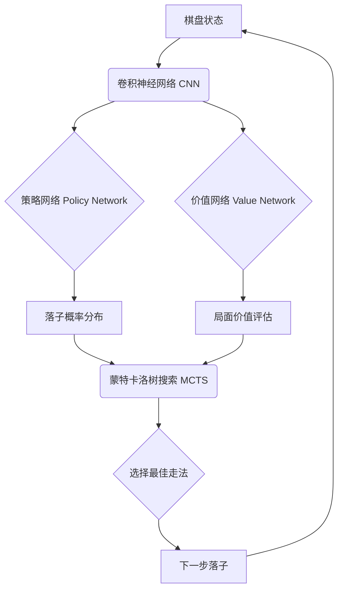

# AlphaGo 原理与代码实例讲解

## 1. 背景介绍

### 1.1 AlphaGo的诞生

2016年3月,由Google旗下DeepMind公司开发的人工智能程序AlphaGo与世界围棋冠军李世石进行了一场世纪之战。最终AlphaGo以4:1的总比分战胜了人类棋手,这是人工智能发展史上的一个里程碑事件。它标志着人工智能在复杂领域的决策能力已经达到或超越了人类顶尖水平。

### 1.2 AlphaGo的意义

AlphaGo的胜利引发了全世界对人工智能的极大关注。围棋被认为是检验人工智能水平的一个重要标准,因为围棋的变化和可能性远远超过国际象棋等其他棋类游戏。AlphaGo的成功证明了深度学习、强化学习等人工智能技术的强大潜力,为其在更多领域的应用指明了方向。

### 1.3 AlphaGo的后续发展

在战胜李世石后,DeepMind又开发了AlphaGo的升级版AlphaGo Master和AlphaGo Zero,实力更上一层楼。2017年AlphaGo Master以60连胜的战绩碾压了众多顶尖棋手。AlphaGo Zero则实现了完全通过自我对弈学习,在没有任何人类棋谱输入的情况下超越了以前所有版本。DeepMind还将相关算法应用到了更多领域。

## 2. 核心概念与联系

### 2.1 深度学习 (Deep Learning)

深度学习是AlphaGo的核心技术之一。它模仿人脑的神经网络结构,使用多层人工神经网络来自动学习特征和模式。AlphaGo使用卷积神经网络(CNN)来直接从棋盘状态提取特征,并使用深度神经网络(DNN)来评估局面价值和选择落子概率。

### 2.2 强化学习 (Reinforcement Learning)

强化学习是AlphaGo的另一个关键技术。它通过设置奖励函数,让智能体在与环境互动的过程中最大化累积奖励,从而学习最优策略。AlphaGo使用蒙特卡洛树搜索(MCTS)算法来模拟对局,并基于模拟结果更新神经网络,从而不断提升棋力。

### 2.3 蒙特卡洛树搜索 (MCTS)

蒙特卡洛树搜索是一种启发式搜索算法,它通过随机模拟来评估不同走法的胜率。AlphaGo使用MCTS来缩小落子选择范围,并指导神经网络的训练。MCTS包括选择、扩展、模拟、回溯四个步骤。

### 2.4 策略网络与价值网络

AlphaGo使用两个神经网络：策略网络(Policy Network)和价值网络(Value Network)。策略网络用于预测在当前棋局下的落子概率分布,价值网络用于评估当前局面对AlphaGo的胜率。两个网络相互配合,共同决定最佳走法。

### 2.5 技术架构图



## 3. 核心算法原理具体操作步骤

### 3.1 神经网络训练

#### 3.1.1 监督学习阶段

- 步骤1：从人类高水平棋谱中提取大量局面状态和对应的落子分布作为训练数据
- 步骤2：使用训练数据训练策略网络,使其输出与人类棋手的落子概率分布尽可能接近
- 步骤3：使用训练数据训练价值网络,使其对局面价值的预测与对局最终结果一致

#### 3.1.2 强化学习阶段 

- 步骤1：策略网络与自己或其他AI下大量对局,产生自对弈数据 
- 步骤2：从自对弈数据中采样,用于训练策略网络,使其向更优策略靠拢
- 步骤3：用价值网络评估自对弈终局,并据此更新价值网络权重

### 3.2 蒙特卡洛树搜索

#### 3.2.1 选择 (Selection)

- 步骤1：从根节点(当前局面)出发,递归选择最有潜力的子节点
- 步骤2：使用UCB(Upper Confidence Bound)公式权衡探索和利用,优先选择被访问次数少且价值预期高的节点

#### 3.2.2 扩展 (Expansion)

- 步骤1：在选择到的节点处,根据策略网络的预测概率分布,创建一个或多个新的子节点

#### 3.2.3 模拟 (Simulation) 

- 步骤1：从新扩展的节点开始,使用快速走子策略(如随机走子)进行多次模拟对局,直到终局
- 步骤2：使用价值网络评估模拟对局的结果(胜负或胜率)

#### 3.2.4 回溯 (Backpropagation)

- 步骤1：将模拟结果反向传播更新路径上各节点的统计数据(如访问次数、价值总和)
- 步骤2：重复以上选择-扩展-模拟-回溯过程,不断细化搜索树,直到满足停止条件(如搜索时间或迭代次数)
- 步骤3：根据子节点的访问次数比例,选择最佳落子

### 3.3 完整算法流程

- 步骤1：使用策略网络和价值网络对当前局面进行评估
- 步骤2：根据神经网络输出,运行若干轮蒙特卡洛树搜索,并行扩展搜索树
- 步骤3：搜索停止后,根据子节点访问频率选择最佳落子
- 步骤4：落子后进入下一回合,重复步骤1-3直到对局结束

## 4. 数学模型和公式详细讲解举例说明

### 4.1 策略网络损失函数

策略网络的目标是最小化预测落子概率分布与实际落子分布之间的交叉熵损失。设 $s$ 为棋盘状态,$\pi$ 为策略网络输出的落子概率分布向量,$z$ 为实际落子的one-hot编码向量,则策略网络的损失函数为:

$$
L_p = -\sum_s z^T \log \pi
$$

举例说明:假设在某个状态 $s$ 下,策略网络输出的落子概率分布为 $\pi=[0.1,0.2,0.3,0.4]$,实际落子为第3个候选点,则 $z=[0,0,1,0]$。代入公式计算:

$$
L_p = -[0,0,1,0] \cdot [\log 0.1,\log 0.2,\log 0.3,\log 0.4] = -\log 0.3 \approx 1.20
$$

可见,预测概率分布与实际落子差异越大,损失函数值越大。网络训练的目标就是调整参数以最小化这种差异。

### 4.2 价值网络损失函数

价值网络的目标是最小化预测局面价值与实际对局结果之间的均方误差损失。设 $s$ 为棋盘状态,$v$ 为价值网络输出的局面价值(通常在0到1之间),$z$ 为对局最终结果(1为胜,-1为负),则价值网络的损失函数为:

$$
L_v = \sum_s (v - z)^2
$$

举例说明:假设在某个状态 $s$ 下,价值网络预测的胜率为 $v=0.8$,但最终对局结果为负 $z=-1$,代入公式计算:

$$
L_v = (0.8 - (-1))^2 = 3.24
$$

可见,预测局面价值与实际对局结果差异越大,损失函数值越大。网络训练的目标就是调整参数以最小化这种差异。

### 4.3 蒙特卡洛树搜索中的UCB公式

在MCTS选择阶段,使用UCB(Upper Confidence Bound)公式来平衡探索和利用。UCB值越高,节点被选中的优先级越高。设节点 $i$ 的UCB值为 $U_i$,其计算公式为:

$$
U_i = \frac{W_i}{N_i} + C \sqrt{\frac{\ln N}{N_i}}
$$

其中,$W_i$ 为节点 $i$ 的价值总和,$N_i$ 为节点 $i$ 的访问次数,$N$ 为其父节点的访问次数,$C$ 为探索系数(控制探索和利用的平衡)。

举例说明:假设在某次搜索中,节点 $i$ 已被访问了10次,累积价值为6,其父节点访问次数为50,探索系数取1.4,则其UCB值为:

$$
U_i = \frac{6}{10} + 1.4 \sqrt{\frac{\ln 50}{10}} \approx 1.18
$$

可见,UCB公式综合考虑了节点的平均价值(利用)和访问频率(探索),平衡了对高价值节点的深入探索和对少访问节点的广泛探索。

## 5. 项目实践：代码实例和详细解释说明

下面给出AlphaGo核心算法的简化Python实现示例,并对关键部分进行解释说明。

### 5.1 神经网络定义

```python
import torch
import torch.nn as nn

class PolicyNet(nn.Module):
    def __init__(self, board_size):
        super(PolicyNet, self).__init__()
        self.conv = nn.Sequential(
            nn.Conv2d(1, 32, kernel_size=3, padding=1),
            nn.ReLU(),
            nn.Conv2d(32, 64, kernel_size=3, padding=1),
            nn.ReLU(),
            nn.Conv2d(64, 128, kernel_size=3, padding=1),
            nn.ReLU()
        )
        self.fc = nn.Sequential(
            nn.Linear(128 * board_size ** 2, 1024),
            nn.ReLU(),
            nn.Linear(1024, board_size ** 2)
        )
        self.softmax = nn.Softmax(dim=1)

    def forward(self, x):
        x = self.conv(x)
        x = x.view(x.size(0), -1) 
        x = self.fc(x)
        prob = self.softmax(x)
        return prob

class ValueNet(nn.Module):
    def __init__(self, board_size):
        super(ValueNet, self).__init__()
        self.conv = nn.Sequential(
            nn.Conv2d(1, 32, kernel_size=3, padding=1),
            nn.ReLU(),
            nn.Conv2d(32, 64, kernel_size=3, padding=1),
            nn.ReLU(),
            nn.Conv2d(64, 128, kernel_size=3, padding=1),
            nn.ReLU()
        )
        self.fc = nn.Sequential(
            nn.Linear(128 * board_size ** 2, 1024),
            nn.ReLU(),
            nn.Linear(1024, 1),
            nn.Tanh()
        )

    def forward(self, x):
        x = self.conv(x)
        x = x.view(x.size(0), -1)
        value = self.fc(x)
        return value
```

解释说明:
- PolicyNet和ValueNet都是卷积神经网络,输入为当前棋盘状态的二维表示(通道数为1)
- PolicyNet输出落子概率分布,最后一层使用Softmax归一化
- ValueNet输出局面价值预测,最后一层使用Tanh激活函数将输出压缩到[-1,1]范围内
- 两个网络都使用3层卷积+2层全连接的结构,中间使用ReLU激活函数
- 卷积层提取棋盘局部特征,全连接层整合特征并输出预测结果

### 5.2 蒙特卡洛树搜索实现

```python
import numpy as np

class TreeNode:
    def __init__(self, parent, prob):
        self.parent = parent
        self.children = {}
        self.visits = 0
        self.value_sum = 0
        self.prob = prob

    def expand(self, move_probs):
        for move, prob in move_probs:
            if move not in self.children:
                self.children[move] = TreeNode(self, prob)

    def select(self, c_puct):
        return max(self.children.items(),
                   key=lambda item: item[1].ucb_value(c_puct))

    def ucb_value(self, c_puct):
        q = self.value_sum / (1 + self.visits)
        u = c_puct * self.prob