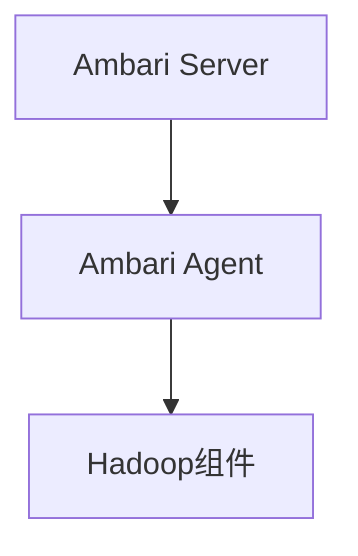

## 1.背景介绍

在大数据领域，Hadoop生态系统是一套重要的开源框架，涵盖了数据存储，数据处理，数据分析等各个环节。然而，Hadoop生态系统包含许多组件，如HDFS，MapReduce，Hive，Pig，HBase等，每个组件都有其自身的配置和管理方式，这对于系统管理员来说，管理和监控这些组件的运行情况是一项复杂的任务。Ambari应运而生，它是Apache基金会的一个开源项目，旨在简化Hadoop生态系统的管理和监控。

## 2.核心概念与联系

Ambari主要由Ambari Server和Ambari Agent两部分组成。Ambari Server负责与用户交互，接收用户的指令并将其转发给Ambari Agent执行。Ambari Agent则负责在各个节点上执行Ambari Server发来的指令，如安装、启动、停止服务等。



## 3.核心算法原理具体操作步骤

Ambari的工作流程如下：

1. 用户通过Web UI或者REST API与Ambari Server交互，发出管理指令。
2. Ambari Server接收到指令后，将其转化为具体的操作，并通过RPC调用的方式发送给相应的Ambari Agent。
3. Ambari Agent接收到操作后，调用相应的脚本在本地节点执行该操作，如安装、启动、停止服务等。
4. Ambari Agent将操作结果返回给Ambari Server，Ambari Server将结果反馈给用户。

## 4.数学模型和公式详细讲解举例说明

Ambari的核心并没有涉及复杂的数学模型和公式，它更多的是依赖于系统管理和网络通信的知识。

## 5.项目实践：代码实例和详细解释说明

接下来，我们通过一个简单的例子，来说明如何使用Ambari来管理Hadoop集群。

首先，我们需要在Ambari Server所在的机器上安装Ambari Server：

```shell
sudo yum install ambari-server
```

接着，我们需要初始化Ambari Server：

```shell
sudo ambari-server setup
```

然后，我们需要启动Ambari Server：

```shell
sudo ambari-server start
```

在Ambari Server启动后，我们可以通过浏览器访问Ambari Server的Web UI，进一步进行Hadoop集群的管理。

## 6.实际应用场景

Ambari在大数据处理领域有着广泛的应用，它可以用来管理和监控Hadoop集群，包括HDFS，MapReduce，Hive，Pig，HBase等各个组件。

## 7.工具和资源推荐

推荐阅读Apache Ambari的官方文档，以获取更多关于Ambari的信息和使用方法。同时，推荐使用Ambari提供的REST API，可以更灵活和高效的管理Hadoop集群。

## 8.总结：未来发展趋势与挑战

随着大数据处理技术的发展，Hadoop生态系统的组件越来越多，管理和监控这些组件的需求也越来越强烈。Ambari作为一个开源的Hadoop集群管理工具，将会有着更广阔的应用前景。然而，随着Hadoop生态系统的不断发展和变化，Ambari也面临着如何适应这些变化，如何提供更好的用户体验等挑战。

## 9.附录：常见问题与解答

Q: Ambari能管理哪些Hadoop组件？

A: Ambari可以管理Hadoop生态系统中的大多数组件，如HDFS，MapReduce，Hive，Pig，HBase等。

Q: Ambari支持哪些操作系统？

A: Ambari支持大部分主流的Linux发行版，如CentOS，Ubuntu，Debian等。

作者：禅与计算机程序设计艺术 / Zen and the Art of Computer Programming