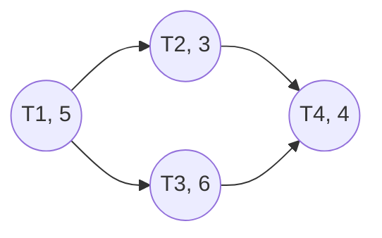

# ApplicationMaster与可持续计算：降低能源消耗

## 1. 背景介绍
### 1.1 可持续计算的重要性
在当今数字化时代,计算机系统和数据中心的能源消耗日益增长,成为全球能源消耗和碳排放的重要来源之一。可持续计算旨在通过优化资源利用、提高能效、减少浪费等方式,实现计算资源的可持续发展,降低对环境的负面影响。
### 1.2 ApplicationMaster的角色
ApplicationMaster是大数据处理框架YARN(Yet Another Resource Negotiator)的核心组件之一,负责管理和调度应用程序的运行。它在提高集群资源利用率、优化任务调度等方面发挥着关键作用,对于实现可持续计算具有重要意义。

## 2. 核心概念与联系
### 2.1 YARN架构
YARN采用主/从架构,由ResourceManager(RM)、NodeManager(NM)和ApplicationMaster(AM)三个核心组件组成。
- ResourceManager:负责整个集群的资源管理和调度。
- NodeManager:负责单个节点的资源管理和任务执行。
- ApplicationMaster:负责单个应用程序的管理和调度。
### 2.2 ApplicationMaster的功能
ApplicationMaster的主要功能包括:
- 向ResourceManager申请资源。
- 与NodeManager通信,启动和监控任务执行。
- 动态调整资源需求,优化资源利用。
- 容错处理,保证应用程序的可靠性。
### 2.3 ApplicationMaster与可持续计算的关系
ApplicationMaster通过优化资源分配、动态调整资源需求等方式,可以显著提高集群资源利用率,减少资源浪费,从而降低能源消耗。同时,ApplicationMaster还可以通过任务调度优化、数据本地化等技术,减少数据传输和网络通信,进一步降低能耗。

## 3. 核心算法原理与具体操作步骤
### 3.1 资源请求与分配
1. ApplicationMaster根据应用程序的资源需求,向ResourceManager提交资源请求。
2. ResourceManager根据集群资源状态和调度策略,为ApplicationMaster分配合适的资源容器。
3. ApplicationMaster将任务分配到获得的资源容器中执行。
### 3.2 动态资源调整
1. ApplicationMaster在运行过程中,持续监控任务执行情况和资源利用率。
2. 当发现资源利用率低或任务执行进度缓慢时,ApplicationMaster可以向ResourceManager申请额外的资源。
3. 当任务完成或资源利用率高时,ApplicationMaster可以释放多余的资源,避免浪费。
### 3.3 任务调度优化
1. ApplicationMaster根据任务的依赖关系、优先级、资源需求等因素,合理安排任务执行顺序。
2. 优先调度关键路径上的任务,尽早完成任务,减少资源占用时间。
3. 将相关任务调度到同一节点或机架,实现数据本地化,减少数据传输开销。

## 4. 数学模型和公式详细讲解举例说明
### 4.1 资源利用率模型
设集群中有$n$个节点,每个节点的资源容量为$C_i(i=1,2,...,n)$,ApplicationMaster申请的资源量为$R$,则资源利用率$U$可表示为:

$$U = \frac{\sum_{i=1}^{n} A_i}{\sum_{i=1}^{n} C_i}$$

其中,$A_i$表示节点$i$上实际分配给ApplicationMaster的资源量。

例如,一个集群有3个节点,每个节点的资源容量为[10, 15, 12],ApplicationMaster申请的资源量为20,实际分配的资源量为[8, 12, 0],则资源利用率为:

$$U = \frac{8+12+0}{10+15+12} = \frac{20}{37} \approx 0.54$$

### 4.2 任务调度优化模型
设一个应用程序有$m$个任务$\{T_1, T_2, ..., T_m\}$,每个任务的执行时间为$t_i(i=1,2,...,m)$,任务之间存在依赖关系。我们的目标是最小化应用程序的总执行时间$T$,即:

$$\min T = \max_{i=1}^{m} (t_i + \sum_{j \in pred(i)} t_j)$$

其中,$pred(i)$表示任务$T_i$的前驱任务集合。

例如,考虑如下任务依赖关系和执行时间:



最优调度顺序为T1 -> T3 -> T2 -> T4,总执行时间为:

$$T = \max(5+6+3+4, 5+6+4) = 18$$

## 5. 项目实践：代码实例和详细解释说明
下面是一个使用Python实现的简单ApplicationMaster示例,用于演示其基本工作流程:

```python
import yarn_api_client

class MyApplicationMaster:
    def __init__(self, rm_host, rm_port):
        self.rm_client = yarn_api_client.ResourceManager(address=rm_host, port=rm_port)
        self.am_client = yarn_api_client.ApplicationMaster()
        
    def run(self):
        # 1. 向ResourceManager注册ApplicationMaster
        self.am_client.register_application_master()
        
        # 2. 申请资源容器
        resource_request = yarn_api_client.ResourceRequest(
            priority=1,
            resource_name="*",
            capability=yarn_api_client.Resource(memory=2048, virtual_cores=1),
            num_containers=3
        )
        self.am_client.allocate(resource_request)
        
        # 3. 启动任务并监控执行
        tasks = [...]  # 任务列表
        for task in tasks:
            container_id = self.am_client.get_container()
            self.am_client.start_container(container_id, task.command)
            self.am_client.monitor_task(container_id)
        
        # 4. 释放资源并注销ApplicationMaster
        self.am_client.release_containers()
        self.am_client.unregister_application_master()
        
if __name__ == "__main__":
    am = MyApplicationMaster("localhost", 8032)
    am.run()
```

代码解释:
1. 初始化ApplicationMaster,建立与ResourceManager的连接。
2. 向ResourceManager注册ApplicationMaster,表示应用程序已启动。
3. 申请所需的资源容器,指定资源量和优先级等信息。
4. 获取分配的资源容器,启动任务并监控执行状态。
5. 任务完成后,释放资源容器,并向ResourceManager注销ApplicationMaster。

这个示例代码简要展示了ApplicationMaster的核心功能,实际应用中还需要考虑更多细节,如容错处理、动态资源调整等。

## 6. 实际应用场景
ApplicationMaster在实际生产环境中有广泛的应用,特别是在大数据处理领域。一些典型的应用场景包括:
### 6.1 MapReduce任务调度
Hadoop MapReduce是一种经典的大数据处理框架,其ApplicationMaster负责管理和调度Map和Reduce任务的执行。通过优化任务调度和资源分配,可以显著提高MapReduce作业的执行效率和资源利用率。
### 6.2 Spark任务调度
Apache Spark是一种流行的内存计算框架,其ApplicationMaster(称为Driver Program)负责管理和调度Spark任务的执行。通过动态资源分配、任务本地化等优化技术,Spark可以实现高效的内存计算,降低能源消耗。
### 6.3 Flink任务调度
Apache Flink是一种实时流处理框架,其ApplicationMaster(称为JobManager)负责管理和调度Flink任务的执行。通过对流数据的实时处理和优化,Flink可以在保证低延迟的同时,提高资源利用率,实现可持续计算。

## 7. 工具和资源推荐
以下是一些与ApplicationMaster和可持续计算相关的工具和资源:
- Apache YARN: https://hadoop.apache.org/docs/current/hadoop-yarn/hadoop-yarn-site/YARN.html
- Hadoop MapReduce: https://hadoop.apache.org/docs/current/hadoop-mapreduce-client/hadoop-mapreduce-client-core/MapReduceTutorial.html
- Apache Spark: https://spark.apache.org/docs/latest/cluster-overview.html
- Apache Flink: https://flink.apache.org/docs/stable/concepts/flink-architecture.html
- Google的可持续计算实践: https://sustainability.google/progress/energy/
- 微软的可持续计算实践: https://www.microsoft.com/en-us/sustainability

## 8. 总结：未来发展趋势与挑战
随着大数据和人工智能技术的快速发展,可持续计算面临着新的机遇和挑战。未来的ApplicationMaster需要在提高性能和效率的同时,更加注重能源优化和可持续发展。一些值得关注的发展趋势包括:
- 异构计算资源的统一管理和调度。
- 基于AI的智能化资源管理和任务调度。
- 可持续数据中心的设计与构建。
- 可再生能源在数据中心的应用。

同时,可持续计算也面临着一些挑战,例如:
- 复杂多变的工作负载和资源需求。
- 数据中心能耗管理和优化的难度。
- 可持续发展与高性能之间的权衡。
- 缺乏统一的可持续计算标准和评估体系。

未来,需要业界和学术界的共同努力,不断创新ApplicationMaster和可持续计算技术,推动计算资源的可持续发展,实现数字化转型和绿色发展的双赢。

## 9. 附录：常见问题与解答
### 9.1 什么是可持续计算？
可持续计算是指在满足计算性能需求的同时,最大限度地减少计算资源的能源消耗和环境影响,实现计算资源的可持续发展。
### 9.2 ApplicationMaster如何实现可持续计算？
ApplicationMaster通过优化资源分配、动态调整资源需求、任务调度优化等方式,提高资源利用率,减少资源浪费,从而降低能源消耗,实现可持续计算。
### 9.3 可持续计算对数据中心有什么要求？
可持续计算要求数据中心在设计和运营中注重能效优化,采用节能技术和可再生能源,减少碳足迹。同时,还需要优化数据中心的布局和冷却系统,提高能源利用效率。
### 9.4 如何评估一个系统的可持续性？
可以从能源效率、资源利用率、碳排放等多个维度来评估一个系统的可持续性。一些常用的指标包括PUE(Power Usage Effectiveness)、CUE(Carbon Usage Effectiveness)、WUE(Water Usage Effectiveness)等。
### 9.5 可持续计算与绿色计算有什么区别？
可持续计算和绿色计算都强调在计算过程中减少对环境的负面影响,但可持续计算更加强调长期的资源可持续利用和发展,而绿色计算更侧重于减少能耗和碳排放。两者是相辅相成的,共同促进计算行业的可持续发展。

作者：禅与计算机程序设计艺术 / Zen and the Art of Computer Programming