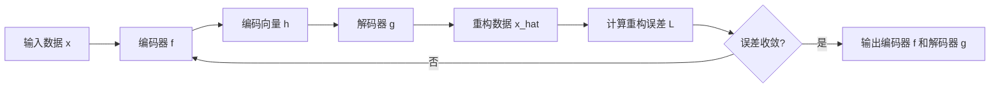

# Autoencoders 原理与代码实战案例讲解

## 1. 背景介绍
### 1.1 人工智能与表示学习
人工智能(Artificial Intelligence, AI)是计算机科学领域的一个重要分支,旨在研究如何让计算机模拟人类的智能行为。而机器学习(Machine Learning, ML)作为实现人工智能的主要途径,其核心是通过数据来学习模型。在机器学习中,如何学习到数据的良好表示(Representation)是一个关键问题。表示学习(Representation Learning)就是机器学习的一个重要分支,旨在自动学习数据的表示,从而提高机器学习系统的性能。

### 1.2 无监督学习与自编码器
在表示学习中,无监督学习(Unsupervised Learning)扮演着重要角色。与有监督学习(Supervised Learning)不同,无监督学习不需要人工标注的训练数据,而是通过数据本身的结构和特点来学习有用的表示。自编码器(Autoencoder)就是无监督学习中的一类重要模型,它能够自动学习数据的压缩表示,在降维、去噪等任务中有广泛应用。

### 1.3 自编码器的发展历程
自编码器的概念最早由 Rumelhart 等人在 1986 年提出,之后经历了长足的发展。传统的自编码器主要基于多层感知机(MLP)构建。近年来,随着深度学习的兴起,出现了多种新型自编码器变体,如稀疏自编码器(Sparse Autoencoder)、降噪自编码器(Denoising Autoencoder)、变分自编码器(Variational Autoencoder)等。这些变体在结构和训练方式上进行了改进,极大地拓展了自编码器的应用范围。

## 2. 核心概念与联系
### 2.1 编码器与解码器
自编码器由两部分组成:编码器(Encoder)和解码器(Decoder)。编码器将输入数据映射到一个低维表示(编码),解码器再将这个低维编码还原成原始数据。形式化地,假设输入数据为 $x$,编码器 $f$ 将其映射为编码 $h=f(x)$,解码器 $g$ 再将 $h$ 映射回数据空间 $\hat{x}=g(h)$。自编码器通过最小化重构误差 $L(x,\hat{x})$ 来学习编码器和解码器的参数。

### 2.2 数据压缩与降维
自编码器学习数据的低维编码,实质上实现了数据压缩(Data Compression)和降维(Dimensionality Reduction)。传统的数据压缩和降维方法,如主成分分析(PCA)是线性的,而自编码器能够学习非线性的编码函数,从而能够捕捉数据中更复杂的结构。

### 2.3 特征学习与迁移学习
自编码器学习到的低维编码可以看作是数据的高层特征表示。这种无监督学习到的特征可以用于下游的监督学习任务,如分类和回归。将自编码器学习到的特征迁移到其他任务中,体现了迁移学习(Transfer Learning)的思想。预训练的自编码器也常作为深度神经网络的初始化方法。

### 2.4 生成模型与数据重构
自编码器训练后的解码器可以将低维编码映射回原始数据空间,因此也可视为一种生成模型(Generative Model)。给定编码向量,解码器能够重构出类似原始数据的样本。一些变体如变分自编码器进一步增强了自编码器的生成能力。

## 3. 核心算法原理与操作步骤
### 3.1 自编码器的网络结构
自编码器的基本结构是一个对称的前馈神经网络:
- 编码器:由若干层全连接层组成,将输入 $x$ 映射为低维编码 $h$。
- 编码向量:网络中间层,维度低于输入 $x$,表示压缩的特征。  
- 解码器:结构与编码器对称,将编码 $h$ 映射回原始数据空间 $\hat{x}$。

编码器和解码器的具体结构(如层数和每层宽度)是超参数,需要根据任务和数据调节。

### 3.2 自编码器的训练过程 
自编码器的训练过程如下:
1. 将输入数据 $x$ 传入编码器,得到编码 $h=f(x)$。
2. 将编码 $h$ 传入解码器,得到重构数据 $\hat{x}=g(h)$。
3. 计算重构误差 $L(x,\hat{x})$,如均方误差(MSE)或交叉熵。
4. 通过梯度下降法更新编码器和解码器的参数,最小化重构误差。
5. 重复步骤1-4,直到重构误差收敛或达到预设的训练轮数。

需要注意的是,虽然编码器和解码器是分别参数化的,但它们是联合训练优化的,目标都是最小化重构误差。

### 3.3 自编码器的推理应用
训练完成后,就得到了优化的编码器 $f$ 和解码器 $g$。在推理(或下游任务)时:
- 将数据 $x$ 传入编码器 $f$,得到压缩表示 $h$,可用于可视化、聚类等。
- 将编码向量 $h$ 传入解码器 $g$,得到重构样本 $\hat{x}$,可生成新样本。

自编码器学习到的编码向量 $h$ 对原始数据有更紧凑和富有信息的表示,可用于改进其他学习任务。

### 3.4 算法流程图
下图展示了自编码器的核心算法流程:



## 4. 数学模型与公式详解
### 4.1 编码器与解码器的数学形式
假设输入数据 $x\in \mathbb{R}^d$,编码器 $f$ 和解码器 $g$ 都是参数化的函数,如全连接神经网络:

$$
\begin{aligned}
h &= f(x) = \sigma(W_1x+b_1) \\
\hat{x} &= g(h) = \sigma(W_2h+b_2)
\end{aligned}
$$

其中 $W_1,b_1$ 是编码器的权重和偏置,$W_2,b_2$ 是解码器的权重和偏置,$\sigma$ 是激活函数(如 sigmoid 或 ReLU)。

编码向量 $h\in \mathbb{R}^m$ 的维度 $m$ 通常小于输入维度 $d$,从而起到压缩作用。当 $m=d$ 时,自编码器退化为恒等映射。

### 4.2 重构误差与损失函数
重构误差衡量了自编码器的重构能力,即 $\hat{x}=g(f(x))$ 与原始输入 $x$ 的差异。均方误差(MSE)是常用的重构误差:

$$
L_{\text{MSE}}(x,\hat{x}) = \frac{1}{d}\sum_{i=1}^d (x_i-\hat{x}_i)^2
$$

对于二值数据,交叉熵误差更为合适:

$$
L_{\text{CE}}(x,\hat{x}) = -\frac{1}{d}\sum_{i=1}^d [x_i\log\hat{x}_i + (1-x_i)\log(1-\hat{x}_i)]
$$

自编码器的损失函数就是所有训练样本的平均重构误差:

$$
J = \frac{1}{n}\sum_{j=1}^n L(x^{(j)},\hat{x}^{(j)})
$$

其中 $n$ 是训练集大小,$x^{(j)}$ 是第 $j$ 个训练样本。

### 4.3 参数学习与优化方法
自编码器的参数 $\theta=\{W_1,b_1,W_2,b_2\}$ 通过最小化损失函数 $J$ 来学习:

$$
\theta^* = \arg\min_\theta J(\theta)
$$

梯度下降法是最常用的优化算法。给定学习率 $\eta$,参数更新公式为:

$$
\theta := \theta - \eta \nabla_\theta J
$$

其中梯度 $\nabla_\theta J$ 通过反向传播算法高效计算。随机梯度下降(SGD)和 Adam 是深度学习中常用的梯度下降变体。

### 4.4 正则化技术
为了防止过拟合并学习更有意义的表示,自编码器常使用以下正则化技术:

- $L_1$ 或 $L_2$ 权重正则化:在损失函数中加入权重的 $L_1$ 范数或 $L_2$ 范数,鼓励权重取小值。
- 稀疏性约束:在损失函数中加入编码向量 $h$ 的稀疏度,鼓励 $h$ 中大部分元素为零。
- 噪声注入:在训练时对输入 $x$ 加入噪声,提高自编码器的鲁棒性。

正则化项与重构误差加权相加,构成最终的损失函数进行优化。

## 5. 代码实例与详解
下面以 PyTorch 为例,展示如何实现和训练一个简单的自编码器。

### 5.1 自编码器的定义
```python
import torch
import torch.nn as nn

class Autoencoder(nn.Module):
    def __init__(self, input_dim, hidden_dim):
        super(Autoencoder, self).__init__()
        self.encoder = nn.Sequential(
            nn.Linear(input_dim, hidden_dim),
            nn.ReLU(),
            nn.Linear(hidden_dim, hidden_dim),
            nn.ReLU()
        )
        self.decoder = nn.Sequential(
            nn.Linear(hidden_dim, hidden_dim),
            nn.ReLU(),
            nn.Linear(hidden_dim, input_dim),
            nn.Sigmoid()
        )

    def forward(self, x):
        h = self.encoder(x)
        x_hat = self.decoder(h)
        return x_hat
```

这里定义了一个简单的自编码器 `Autoencoder`,包含对称的编码器和解码器,都是两层全连接层。`forward` 函数定义了数据的前向传播过程。

### 5.2 数据加载与预处理
```python
from torch.utils.data import DataLoader
from torchvision.datasets import MNIST
import torchvision.transforms as transforms

transform = transforms.Compose([
    transforms.ToTensor()
])

train_dataset = MNIST(root='./data', train=True, transform=transform, download=True)
test_dataset = MNIST(root='./data', train=False, transform=transform)

train_loader = DataLoader(train_dataset, batch_size=128, shuffle=True)
test_loader = DataLoader(test_dataset, batch_size=128, shuffle=False)
```

这里使用 MNIST 手写数字数据集,并将其加载为 PyTorch 的 `DataLoader` 对象,方便批量训练。

### 5.3 模型训练与测试
```python
device = torch.device('cuda' if torch.cuda.is_available() else 'cpu')
model = Autoencoder(input_dim=784, hidden_dim=128).to(device)
criterion = nn.MSELoss()
optimizer = torch.optim.Adam(model.parameters(), lr=1e-3)

num_epochs = 10
for epoch in range(num_epochs):
    for data in train_loader:
        img, _ = data
        img = img.view(img.size(0), -1).to(device)
        
        output = model(img)
        loss = criterion(output, img)
        
        optimizer.zero_grad()
        loss.backward()
        optimizer.step()
        
    print(f'Epoch [{epoch+1}/{num_epochs}], Loss: {loss.item():.4f}')

with torch.no_grad():
    for data in test_loader:
        img, _ = data
        img = img.view(img.size(0), -1).to(device)
        output = model(img)
        loss = criterion(output, img)
        print(f'Test Loss: {loss.item():.4f}')
```

这段代码展示了自编码器的训练和测试过程。首先定义模型、损失函数和优化器,然后在训练集上迭代训练,每个 epoch 结束后在测试集上评估重构误差。

### 5.4 可视化重构结果
```python
import matplotlib.pyplot as plt

def plot_images(imgs, title):
    fig, axes = plt.subplots(3, 6, figsize=(12, 6))
    axes = axes.flatten()
    for img, ax in zip(imgs, axes):
        ax.imshow(img.reshape(28, 28), cmap='gray')
        ax.axis('off')
    fig.suptitle(title, fontsize=16)
    plt.tight_layout()