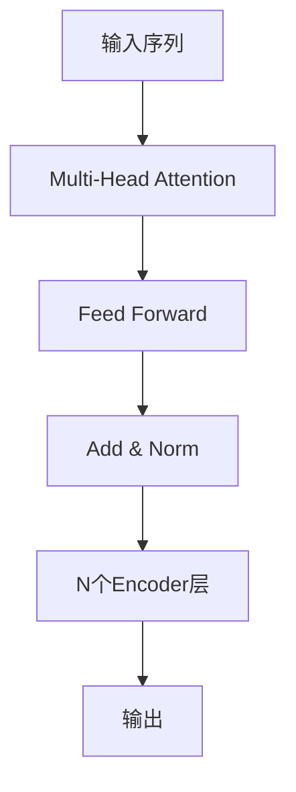
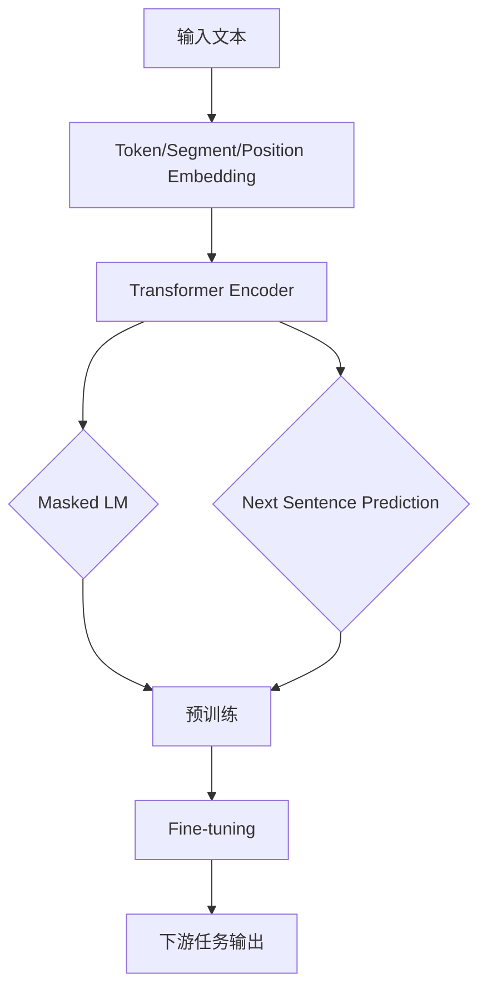

# BERT 原理与代码实战案例讲解

## 1.背景介绍

自然语言处理(NLP)是人工智能领域的一个重要分支,旨在使计算机能够理解和处理人类语言。传统的NLP方法主要基于规则和统计模型,但随着深度学习的发展,基于神经网络的方法逐渐占据主导地位。

2018年,谷歌推出了BERT(Bidirectional Encoder Representations from Transformers)模型,这是一种全新的预训练语言表示模型,在多个NLP任务上取得了突破性的成果。BERT的出现极大地推动了NLP领域的发展,成为当前最先进的语言模型之一。

## 2.核心概念与联系

### 2.1 Transformer

BERT是基于Transformer架构的,Transformer最初被设计用于机器翻译任务。它完全依赖于注意力机制(Attention Mechanism)来捕获输入序列中的长程依赖关系,摒弃了传统序列模型中的循环神经网络(RNN)和卷积神经网络(CNN)结构。



### 2.2 预训练与微调

BERT采用了预训练(Pre-training)与微调(Fine-tuning)的范式。在预训练阶段,BERT在大规模无标注语料库上学习通用的语言表示;在微调阶段,BERT在特定的NLP任务上进行进一步训练,以适应该任务的需求。这种范式大大提高了模型的性能和泛化能力。

### 2.3 掩码语言模型

BERT使用了掩码语言模型(Masked Language Model)的预训练目标。在训练过程中,模型会随机掩码一些输入token,并试图基于上下文预测这些被掩码的token。这种方式迫使模型更好地理解语义和上下文信息。

### 2.4 下一句预测

除了掩码语言模型,BERT还使用了下一句预测(Next Sentence Prediction)作为预训练目标之一。这个目标旨在让模型学习理解两个句子之间的关系,从而提高在各种任务中的表现。

## 3.核心算法原理具体操作步骤

BERT的核心算法包括以下几个步骤:

1. **Token Embedding**:将输入文本按字词切分,每个字词被表示为一个向量。

2. **Segment Embedding**:对于双句子输入,需要区分两个句子,因此引入了Segment Embedding。

3. **Position Embedding**:由于Transformer没有捕获序列顺序的能力,因此需要Position Embedding来编码token在序列中的位置信息。

4. **Transformer Encoder**:输入经过Token Embedding、Segment Embedding和Position Embedding相加后,送入Transformer Encoder进行编码。

5. **Masked LM**:在预训练阶段,随机选择一些token并将其替换为特殊的[MASK]标记。模型需要基于上下文预测被掩码的token。

6. **Next Sentence Prediction**:在预训练阶段,输入是两个句子的拼接,模型需要预测第二个句子是否为第一个句子的下一句。

7. **Fine-tuning**:在下游任务上,根据任务需求对BERT进行微调,如增加特定的输出层等。



## 4.数学模型和公式详细讲解举例说明

### 4.1 注意力机制(Attention Mechanism)

注意力机制是Transformer的核心,它允许模型在编码序列时关注不同位置的信息。给定一个查询向量$q$和一组键值对$(k_i, v_i)$,注意力机制的计算过程如下:

$$\begin{aligned}
\text{Attention}(q, K, V) &= \text{softmax}\left(\frac{qK^T}{\sqrt{d_k}}\right)V \\
&= \sum_{i=1}^n \alpha_i v_i \\
\text{where}\ \alpha_i &= \frac{\exp\left(\frac{q\cdot k_i}{\sqrt{d_k}}\right)}{\sum_{j=1}^n \exp\left(\frac{q\cdot k_j}{\sqrt{d_k}}\right)}
\end{aligned}$$

其中$d_k$是缩放因子,用于防止点积过大导致梯度消失。$\alpha_i$表示查询向量对第$i$个键值对的注意力权重。

### 4.2 多头注意力(Multi-Head Attention)

为了捕获不同子空间的信息,Transformer使用了多头注意力机制。具体来说,将查询、键和值线性投影到不同的子空间,分别计算注意力,再将结果拼接:

$$\begin{aligned}
\text{MultiHead}(Q, K, V) &= \text{Concat}(\text{head}_1, \ldots, \text{head}_h)W^O\\
\text{where}\ \text{head}_i &= \text{Attention}(QW_i^Q, KW_i^K, VW_i^V)
\end{aligned}$$

其中$W_i^Q\in\mathbb{R}^{d_\text{model}\times d_k}, W_i^K\in\mathbb{R}^{d_\text{model}\times d_k}, W_i^V\in\mathbb{R}^{d_\text{model}\times d_v}$是可学习的线性投影矩阵,$W^O\in\mathbb{R}^{hd_v\times d_\text{model}}$是用于拼接多头注意力结果的矩阵。

### 4.3 位置编码(Positional Encoding)

由于Transformer没有捕获序列顺序的能力,因此需要为每个位置添加位置编码,以显式地编码位置信息。BERT使用的是正弦/余弦函数编码位置:

$$\begin{aligned}
\text{PE}_{(pos, 2i)} &= \sin\left(\frac{pos}{10000^{2i/d_\text{model}}}\right)\\
\text{PE}_{(pos, 2i+1)} &= \cos\left(\frac{pos}{10000^{2i/d_\text{model}}}\right)
\end{aligned}$$

其中$pos$是token的位置索引,$i$是维度索引。位置编码会直接加到embedding上。

## 5.项目实践:代码实例和详细解释说明

本节将使用Hugging Face的Transformers库,演示如何使用BERT进行文本分类任务。我们将使用BERT对IMDB电影评论数据集进行二分类(正面/负面评论)。

### 5.1 导入库和数据准备

```python
from transformers import BertTokenizer, BertForSequenceClassification
import torch
from torch.utils.data import TensorDataset, DataLoader, RandomSampler, SequentialSampler
from sklearn.model_selection import train_test_split
import pandas as pd

# 加载IMDB数据集
df = pd.read_csv('IMDB_Dataset.csv')

# 数据预处理
sentences = df.review.values
labels = df.sentiment.values

# 将文本和标签转换为BERT输入格式
tokenizer = BertTokenizer.from_pretrained('bert-base-uncased')
input_ids = []
attention_masks = []

for sent in sentences:
    encoded_dict = tokenizer.encode_plus(
                        sent,                      
                        add_special_tokens = True,
                        max_length = 64,          
                        pad_to_max_length = True,
                        return_attention_mask = True,  
                        return_tensors = 'pt',
                   )
    
    input_ids.append(encoded_dict['input_ids'])
    attention_masks.append(encoded_dict['attention_mask'])

input_ids = torch.cat(input_ids, dim=0)
attention_masks = torch.cat(attention_masks, dim=0)
labels = torch.tensor(labels)

# 划分训练集和测试集
train_inputs, test_inputs, train_labels, test_labels = train_test_split(input_ids, labels, test_size=0.1)
train_masks, test_masks, _, _ = train_test_split(attention_masks, input_ids, test_size=0.1)

# 创建DataLoader
batch_size = 16

train_data = TensorDataset(train_inputs, train_masks, train_labels)
train_sampler = RandomSampler(train_data)
train_dataloader = DataLoader(train_data, sampler=train_sampler, batch_size=batch_size)

test_data = TensorDataset(test_inputs, test_masks, test_labels)
test_sampler = SequentialSampler(test_data)
test_dataloader = DataLoader(test_data, sampler=test_sampler, batch_size=batch_size)
```

### 5.2 加载BERT模型并进行微调

```python
# 加载预训练的BERT模型和分类头
model = BertForSequenceClassification.from_pretrained(
    "bert-base-uncased",
    num_labels = 2, 
    output_attentions = False,
    output_hidden_states = False,
)

# 告诉模型不计算梯度
model.eval()

# 设置GPU或CPU设备
device = torch.device("cuda" if torch.cuda.is_available() else "cpu")
model.to(device)

# 定义优化器和损失函数
optimizer = torch.optim.Adam(model.parameters(), lr=2e-5)
loss_fn = torch.nn.CrossEntropyLoss()

# 训练循环
epochs = 4
for epoch in range(epochs):
    model.train()
    total_loss = 0
    for step, batch in enumerate(train_dataloader):
        # 将输入和标签移动到GPU/CPU
        b_input_ids = batch[0].to(device)
        b_input_mask = batch[1].to(device)
        b_labels = batch[2].to(device)
        
        # 前向传播
        outputs = model(b_input_ids, 
                        token_type_ids=None, 
                        attention_mask=b_input_mask, 
                        labels=b_labels)
        loss = outputs.loss
        total_loss += loss.item()
        
        # 反向传播
        loss.backward()
        
        # 更新模型参数
        optimizer.step()
        optimizer.zero_grad()
        
    avg_loss = total_loss / len(train_dataloader)
    print(f"Epoch {epoch+1}, Average Loss: {avg_loss:.4f}")

# 在测试集上评估模型
model.eval()
eval_loss, eval_accuracy = 0, 0
nb_eval_steps, nb_eval_examples = 0, 0

for batch in test_dataloader:
    batch = tuple(t.to(device) for t in batch)
    b_input_ids, b_input_mask, b_labels = batch
    
    with torch.no_grad():
        outputs = model(b_input_ids, 
                        token_type_ids=None, 
                        attention_mask=b_input_mask)
    
    logits = outputs.logits
    tmp_eval_loss = loss_fn(logits, b_labels)
    eval_loss += tmp_eval_loss.mean().item()
    
    nb_eval_steps += 1
    nb_eval_examples += b_labels.size(0)
    
    tmp_eval_accuracy = (logits.argmax(1) == b_labels).sum().item() / b_labels.size(0)
    eval_accuracy += tmp_eval_accuracy

print(f"Test Loss: {eval_loss/nb_eval_steps:.4f}")  
print(f"Test Accuracy: {eval_accuracy/nb_eval_steps:.4f}")
```

上述代码首先对IMDB数据集进行预处理,将文本转换为BERT可接受的输入格式。然后加载预训练的BERT模型,并在训练集上进行微调。最后,在测试集上评估模型的性能。

通过这个实例,你可以了解到如何使用Hugging Face的Transformers库来应用BERT模型,以及如何对BERT进行微调以适应特定的下游任务。

## 6.实际应用场景

BERT已经在多个NLP任务中展现出卓越的性能,包括但不限于:

- **文本分类**: 将文本分类到预定义的类别中,如情感分析、新闻分类等。
- **命名实体识别(NER)**: 识别文本中的人名、地名、组织机构名等实体。
- **问答系统**: 根据给定的问题和文本上下文,生成相应的答案。
- **机器翻译**: 将一种自然语言翻译成另一种语言。
- **文本摘要**: 自动生成文本的摘要或概括。
- **语言推理**: 根据前提推理出合理的结论。

除了NLP任务,BERT也被应用于计算机视觉、语音识别等其他领域。总的来说,BERT展现出了强大的语言理解能力,为各种AI应用提供了有力支持。

## 7.工具和资源推荐

- **Hugging Face Transformers**: 提供了BERT等多种预训练语言模型的实现,并支持下游任务的微调。(https://huggingface.co/transformers)
- **BERT GitHub Repo**: BERT的官方GitHub代码库。(https://github.com/google-research/bert)
- **Allen AI BERT Viz Tool**: 可视化BERT注意力权重的工具。(http://bert-viz.co)
- **Papers With Code - BERT**: