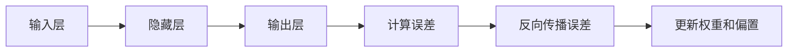

## 1.背景介绍

在计算机科学和人工智能领域，反向传播算法（Backpropagation，简称BP）是一种在神经网络中应用广泛的学习算法。它是由Rumelhart、Hinton和Williams在1986年提出的，是一种用于训练神经网络的监督式学习方法。反向传播算法通过比较模型的预测输出和实际输出，然后反向传播误差，更新模型参数，以此来优化模型的预测能力。

## 2.核心概念与联系

反向传播算法的核心在于误差的反向传播，它包含两个主要步骤：前向传播和反向传播。在前向传播阶段，输入数据通过每一层的神经元，最后产生预测结果。在反向传播阶段，计算预测结果与实际结果的误差，然后将这个误差反向传播回网络，更新每一层神经元的权重和偏置。



## 3.核心算法原理具体操作步骤

反向传播算法的具体操作步骤如下：

1. 初始化神经网络的权重和偏置
2. 进行前向传播，计算预测结果
3. 计算预测结果与实际结果的误差
4. 通过反向传播，计算每一层的误差
5. 更新每一层的权重和偏置
6. 重复步骤2-5，直到达到预设的迭代次数，或者误差已经小于预设的阈值

## 4.数学模型和公式详细讲解举例说明

在反向传播算法中，我们通常使用均方误差作为损失函数，用来衡量预测结果与实际结果的差距。均方误差的计算公式为：

$$
E = \frac{1}{2} \sum_{k} (y_k - t_k)^2
$$

其中，$y_k$ 是神经网络的预测输出，$t_k$ 是实际的输出。

在反向传播过程中，我们需要计算损失函数对于每一层的权重和偏置的偏导数，然后使用梯度下降法来更新权重和偏置。偏导数的计算公式为：

$$
\frac{\partial E}{\partial w_{ij}} = \delta_j x_{ij}
$$

$$
\frac{\partial E}{\partial b_{j}} = \delta_j
$$

其中，$w_{ij}$ 和 $b_j$ 分别是第 $i$ 个神经元到第 $j$ 个神经元的权重和偏置，$\delta_j$ 是第 $j$ 个神经元的误差项，$x_{ij}$ 是第 $i$ 个神经元的输出。

## 5.项目实践：代码实例和详细解释说明

以下是一个使用Python和NumPy库实现的反向传播算法的简单示例：

```python
import numpy as np

def sigmoid(x):
    return 1 / (1 + np.exp(-x))

def sigmoid_derivative(x):
    return x * (1 - x)

# 初始化参数
inputLayerSize, hiddenLayerSize, outputLayerSize = 3, 3, 1
weights1 = np.random.uniform(size=(inputLayerSize, hiddenLayerSize))
weights2 = np.random.uniform(size=(hiddenLayerSize, outputLayerSize))

# 训练神经网络
for i in range(10000):
    # 前向传播
    hiddenLayerInput = np.dot(inputs, weights1)
    hiddenLayerOutput = sigmoid(hiddenLayerInput)
    outputLayerInput = np.dot(hiddenLayerOutput, weights2)
    output = sigmoid(outputLayerInput)

    # 反向传播
    outputError = targets - output
    outputDelta = outputError * sigmoid_derivative(output)
    
    hiddenError = outputDelta.dot(weights2.T)
    hiddenDelta = hiddenError * sigmoid_derivative(hiddenLayerOutput)
    
    # 更新权重
    weights2 += hiddenLayerOutput.T.dot(outputDelta)
    weights1 += inputs.T.dot(hiddenDelta)
```

## 6.实际应用场景

反向传播算法在许多实际应用中都有广泛的应用，包括但不限于：

- 图像识别：使用神经网络对图像进行分类，识别图像中的物体。
- 自然语言处理：使用神经网络对文本进行分析，进行情感分析、文本分类等任务。
- 语音识别：使用神经网络对语音信号进行分析，实现语音到文本的转换。

## 7.工具和资源推荐

- TensorFlow：Google开源的深度学习框架，内置了反向传播算法。
- PyTorch：Facebook开源的深度学习框架，内置了反向传播算法。
- Keras：基于TensorFlow的高级深度学习框架，简化了神经网络的构建和训练过程。

## 8.总结：未来发展趋势与挑战

反向传播算法是神经网络的核心，它的发展直接影响到神经网络和深度学习的发展。随着计算能力的提升和大数据的发展，反向传播算法将会在更多的领域得到应用。然而，反向传播算法也面临着一些挑战，例如梯度消失和梯度爆炸问题，以及优化局部最优的问题。

## 9.附录：常见问题与解答

1. **反向传播算法和梯度下降法有什么关系？**

反向传播算法和梯度下降法是密切相关的。反向传播算法通过计算损失函数对于每一层的权重和偏置的偏导数，得到梯度，然后使用梯度下降法来更新权重和偏置。

2. **反向传播算法如何解决梯度消失和梯度爆炸问题？**

解决梯度消失和梯度爆炸问题的常用方法包括使用ReLU激活函数、批量归一化、权重初始化等。

3. **反向传播算法能否用于非监督学习？**

反向传播算法是一种监督学习方法，它需要知道实际的输出结果来计算误差。但是，反向传播算法也可以用于一些非监督学习的场景，例如自编码器。

作者：禅与计算机程序设计艺术 / Zen and the Art of Computer Programming