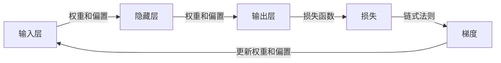

## 1.背景介绍

在深度学习领域，反向传播（Backpropagation）是一种用于训练神经网络的核心算法。它是一种高效的梯度计算方法，用于更新神经网络的权重和偏置，以最小化损失函数。由于其效率和易于实现的特性，反向传播已经成为了深度学习中的标准训练算法。

## 2.核心概念与联系

反向传播的核心概念是链式法则。链式法则是微积分中的一个基本定理，它允许我们计算一个函数相对于其输入的梯度。在神经网络中，我们利用链式法则来计算损失函数相对于权重和偏置的梯度。



## 3.核心算法原理具体操作步骤

反向传播的操作步骤可以分为以下四个主要步骤：

1. **前向传播**：输入数据通过每一层的权重和偏置的线性变换和激活函数，生成输出结果。

2. **计算损失**：利用预测结果和真实标签，计算损失函数的值。

3. **反向传播**：通过链式法则，从输出层开始，逐层计算损失函数相对于每一层权重和偏置的梯度。

4. **更新权重和偏置**：根据计算出的梯度，利用优化算法（如梯度下降），更新每一层的权重和偏置。

## 4.数学模型和公式详细讲解举例说明

假设我们的神经网络只有一个隐藏层，我们的损失函数为均方误差（MSE）：

$$
L = \frac{1}{2}(y - \hat{y})^2
$$

其中，$y$为真实标签，$\hat{y}$为预测结果。我们的目标是找到使$L$最小的权重$w$和偏置$b$。

根据链式法则，我们可以得到损失函数$L$相对于权重$w$的梯度为：

$$
\frac{\partial L}{\partial w} = \frac{\partial L}{\partial \hat{y}} \cdot \frac{\partial \hat{y}}{\partial w}
$$

其中，$\frac{\partial L}{\partial \hat{y}} = \hat{y} - y$，$\frac{\partial \hat{y}}{\partial w}$为输出层的输入。

同理，我们可以得到损失函数$L$相对于偏置$b$的梯度为：

$$
\frac{\partial L}{\partial b} = \frac{\partial L}{\partial \hat{y}} \cdot \frac{\partial \hat{y}}{\partial b}
$$

其中，$\frac{\partial \hat{y}}{\partial b}$为1。

有了这些梯度，我们就可以使用梯度下降算法来更新我们的权重和偏置：

$$
w = w - \eta \frac{\partial L}{\partial w}
$$

$$
b = b - \eta \frac{\partial L}{\partial b}
$$

其中，$\eta$为学习率。

## 5.项目实践：代码实例和详细解释说明

下面我们通过一个简单的Python代码示例来实现反向传播算法。

首先，我们初始化神经网络的权重和偏置：

```python
import numpy as np

# 初始化权重和偏置
w = np.random.randn()
b = np.random.randn()
```

然后，我们定义前向传播和损失函数的计算：

```python
# 前向传播
def forward(x, w, b):
    return w * x + b

# 计算损失
def compute_loss(y, y_hat):
    return 0.5 * (y - y_hat) ** 2
```

接着，我们定义反向传播的计算：

```python
# 反向传播
def backward(x, y, y_hat):
    dL_dy = y_hat - y
    dy_dw = x
    dy_db = 1
    return dL_dy * dy_dw, dL_dy * dy_db
```

最后，我们进行权重和偏置的更新：

```python
# 更新权重和偏置
def update_parameters(w, b, dw, db, learning_rate):
    w -= learning_rate * dw
    b -= learning_rate * db
    return w, b
```

通过这些代码，我们就实现了一个简单的反向传播算法。

## 6.实际应用场景

反向传播算法在深度学习的许多应用中都有使用，例如图像识别、语音识别、自然语言处理等。它是训练神经网络的基础，无论是卷积神经网络（CNN）、循环神经网络（RNN）还是Transformer，都离不开反向传播算法。

## 7.工具和资源推荐

如果你对反向传播算法有深入的学习需求，我推荐以下几个资源：

- 《深度学习》：这本书由深度学习领域的三位大牛合著，详细介绍了深度学习的基础知识，包括反向传播算法。

- TensorFlow和PyTorch：这两个深度学习框架都提供了自动求导的功能，可以方便地实现反向传播算法。

- Coursera的深度学习课程：这个课程由深度学习领域的大牛吴恩达教授主讲，详细介绍了深度学习的基础知识，包括反向传播算法。

## 8.总结：未来发展趋势与挑战

反向传播算法是深度学习的核心，其发展趋势和挑战也反映了深度学习的发展趋势和挑战。随着深度学习的发展，神经网络的结构越来越复杂，如何有效地进行反向传播，成为了一个重要的研究方向。此外，随着硬件的发展，如何利用GPU和TPU等硬件进行高效的反向传播，也是一个重要的挑战。

## 9.附录：常见问题与解答

1. **反向传播算法是如何工作的？**

反向传播算法通过链式法则，从输出层开始，逐层计算损失函数相对于每一层权重和偏置的梯度，然后根据这些梯度来更新权重和偏置。

2. **反向传播算法有什么用？**

反向传播算法用于训练神经网络，通过更新神经网络的权重和偏置，使得神经网络的预测结果更接近真实标签。

3. **反向传播算法有哪些挑战？**

随着神经网络的结构越来越复杂，如何有效地进行反向传播成为了一个重要的研究方向。此外，随着硬件的发展，如何利用GPU和TPU等硬件进行高效的反向传播，也是一个重要的挑战。

作者：禅与计算机程序设计艺术 / Zen and the Art of Computer Programming
