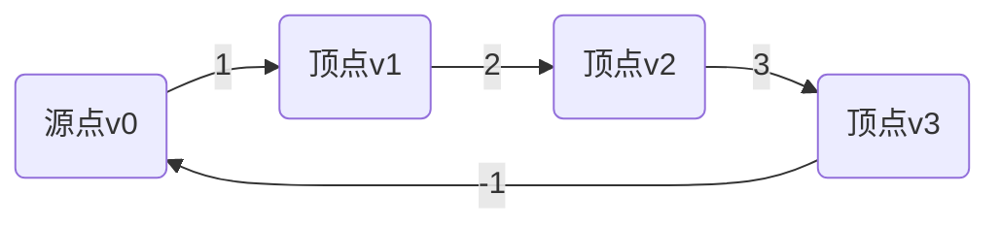

## 1.背景介绍

Bellman-Ford算法是一种解决单源最短路径问题的算法，由Richard Bellman和Lester Ford在1958年独立提出。不同于Dijkstra算法，Bellman-Ford算法能够处理图中存在负权边的情况，因此在网络路由、分布式系统等领域有广泛的应用。

## 2.核心概念与联系

Bellman-Ford算法的核心概念是动态规划。算法的基本思想是，如果图中存在从源点$v_0$到顶点$v_i$的最短路径，那么这条路径上的前一段一定是从$v_0$到$v_i$的前一个顶点$v_{i-1}$的最短路径。因此，我们可以从$v_0$开始，逐步计算出到达每个顶点的最短路径。


## 3.核心算法原理具体操作步骤

Bellman-Ford算法的具体操作步骤如下：

1. 初始化：将源点$v_0$的最短路径长度设为0，其它所有顶点的最短路径长度设为无穷大。
2. 松弛操作：对图中的每一条边$(v_i, v_j)$，如果$v_i$的最短路径长度加上边$(v_i, v_j)$的权重小于$v_j$的最短路径长度，那么更新$v_j$的最短路径长度。
3. 重复步骤2，直到所有顶点的最短路径长度都不再变化，或者执行了$n-1$次步骤2，其中$n$是图中顶点的数量。
4. 检查负权环：如果在执行一次步骤2后，还有顶点的最短路径长度发生变化，那么图中存在负权环。

## 4.数学模型和公式详细讲解举例说明

Bellman-Ford算法的数学模型可以用以下的递推公式表示：

$$
D(v_i) = \min\{D(v_i), D(v_{i-1}) + w(v_{i-1}, v_i)\}
$$

其中，$D(v_i)$表示从源点$v_0$到顶点$v_i$的最短路径长度，$w(v_{i-1}, v_i)$表示边$(v_{i-1}, v_i)$的权重。

例如，考虑下图中的有向图：



我们可以按照Bellman-Ford算法的步骤，计算出从$v_0$到其它每个顶点的最短路径长度。

1. 初始化：$D(v_0) = 0, D(v_1) = D(v_2) = D(v_3) = \infty$。
2. 第一次松弛操作：$D(v_1) = 1, D(v_2) = 3, D(v_3) = 6$。
3. 第二次松弛操作：$D(v_0) = 5, D(v_1) = 1, D(v_2) = 3, D(v_3) = 6$。
4. 检查负权环：$D(v_0)$的值发生了变化，因此图中存在负权环。

## 5.项目实践：代码实例和详细解释说明

以下是Bellman-Ford算法的Python实现：

```python
def bellman_ford(graph, source):
    distance = {vertex: float('infinity') for vertex in graph}
    distance[source] = 0

    for _ in range(len(graph) - 1):
        for vertex in graph:
            for neighbour in graph[vertex]:
                new_distance = distance[vertex] + graph[vertex][neighbour]
                if new_distance < distance[neighbour]:
                    distance[neighbour] = new_distance

    for vertex in graph:
        for neighbour in graph[vertex]:
            if distance[neighbour] > distance[vertex] + graph[vertex][neighbour]:
                return "Graph contains negative weight cycle"
    return distance
```

在这段代码中，`graph`是一个字典，表示图的邻接表。`source`是源点的标识符。`distance`是一个字典，表示从源点到每个顶点的最短路径长度。

## 6.实际应用场景

Bellman-Ford算法在网络路由、分布式系统等领域有广泛的应用。例如，Internet的路由选择协议RIP就是基于Bellman-Ford算法的。

## 7.工具和资源推荐

推荐使用Python的networkx库来处理图相关的问题。networkx提供了丰富的图操作函数，包括创建图、添加/删除顶点和边、计算最短路径等。

## 8.总结：未来发展趋势与挑战

Bellman-Ford算法虽然能够处理负权边，但是其时间复杂度为$O(n^2)$，在处理大规模图时可能会有性能问题。因此，如何改进Bellman-Ford算法，提高其在大规模图上的性能，是未来的一个重要研究方向。

## 9.附录：常见问题与解答

1. Bellman-Ford算法和Dijkstra算法有什么区别？

Bellman-Ford算法和Dijkstra算法都是解决单源最短路径问题的算法。但是，Bellman-Ford算法能够处理图中存在负权边的情况，而Dijkstra算法不能。另外，Bellman-Ford算法的时间复杂度为$O(n^2)$，而Dijkstra算法的时间复杂度为$O(n\log n)$。

2. Bellman-Ford算法为什么能够检测负权环？

Bellman-Ford算法在每次松弛操作后，都会检查是否有顶点的最短路径长度发生变化。如果在$n-1$次松弛操作后，还有顶点的最短路径长度发生变化，那么就说明图中存在负权环。

作者：禅与计算机程序设计艺术 / Zen and the Art of Computer Programming