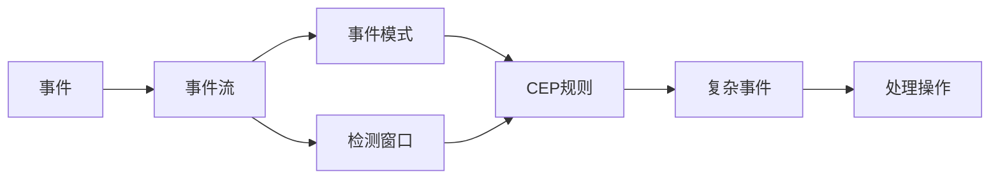

# CEP 原理与代码实例讲解

## 1.背景介绍

### 1.1 CEP的起源与发展
CEP(Complex Event Processing)即复杂事件处理,起源于20世纪90年代。随着信息技术的快速发展,海量数据的实时处理和分析需求日益增长。CEP应运而生,旨在从大量实时事件流中发现有意义的复杂事件模式,进而触发相应的业务逻辑。

### 1.2 CEP的应用领域
CEP在众多领域得到广泛应用,包括:
- 金融领域:如实时风控、欺诈检测等
- 物联网领域:如设备状态监控、预测性维护等  
- 电信领域:如网络性能监控、异常检测等
- 智慧城市:如交通流量分析、应急事件处理等

### 1.3 CEP的技术生态
目前市面上有多种CEP引擎和平台,代表性的有:
- Esper:开源的Java CEP引擎,提供EPL(Event Processing Language)
- Flink:开源的分布式流处理框架,支持CEP库
- Siddhi:WSO2开源的云原生CEP引擎
- Apache Beam:统一批流处理的编程模型,支持CEP  

## 2.核心概念与联系

### 2.1 事件(Event) 
事件是CEP的基本处理单元。一个事件通常包含时间戳、事件类型以及一组属性。事件可以是原子的,也可以是复杂事件。

### 2.2 事件流(Event Stream)
事件流是一系列持续产生的事件构成的数据流。CEP的核心就是要从海量的事件流中,实时检测出有意义的事件模式。

### 2.3 事件模式(Event Pattern) 
事件模式定义了感兴趣的复杂事件结构,通常由一系列原子事件以及它们之间的时序关系、逻辑关系组成。

### 2.4 检测窗口(Detection Window)
CEP引擎在事件流上定义检测窗口,窗口可以基于事件数量或时间跨度。CEP规则在窗口范围内进行模式匹配。

### 2.5 CEP规则(CEP Rule)
CEP规则定义了如何将原子事件组合成复杂事件,以及匹配成功后要执行的操作。规则通常采用类SQL的EPL来定义。

以下是这些概念之间的关系图:



## 3.核心算法原理具体操作步骤

### 3.1 事件模式匹配算法
CEP的核心是基于事件流进行模式匹配,主要采用以下几种算法:

#### 3.1.1 NFA(非确定有限自动机)
- 将事件模式转换为NFA状态机
- 事件流驱动NFA状态转移
- 当到达接受状态时,输出匹配的复杂事件

#### 3.1.2 树形模式匹配
- 将事件模式表示为模式树
- 事件流在模式树上自底向上传播
- 当传播到根节点时,输出匹配的复杂事件

#### 3.1.3 基于规则的推理 
- 将事件和CEP规则转化为事实和规则
- 利用规则引擎(如Drools)进行推理
- 推理结果即为匹配的复杂事件

### 3.2 窗口操作算法
CEP引擎在事件流上定义各种窗口,主要有:

#### 3.2.1 滑动窗口(Sliding Window)
- 固定窗口大小,每次滑动一定步长 
- 窗口内的事件超时后被移除

#### 3.2.2 跳跃窗口(Tumbling Window)  
- 固定窗口大小,窗口之间没有重叠
- 每个事件只属于一个窗口

#### 3.2.3 会话窗口(Session Window)
- 窗口边界由事件的属性决定
- 如果一段时间没有事件到达,会话就结束

## 4.数学模型和公式详细讲解举例说明

### 4.1 事件流数学模型

我们可以将事件流看作是一个随时间变化的随机过程$\{X(t),t\in T\}$,其中$T$表示时间轴。

假设$\Omega$表示所有可能事件的集合,则在时刻$t$事件$X(t)$可取的值为$\Omega$的子集,记为$R(X(t))$。

一次具体的事件流可以表示为:

$$
\{X(t_1)=x_1,X(t_2)=x_2,\dots,X(t_n)=x_n\}
$$

其中,$t_1<t_2<\dots<t_n$, $x_i\in R(X(t_i))$。

### 4.2 模式匹配的形式化定义

给定事件模式$P$,在事件流$\{X(t),t\in T\}$上的一次匹配可以表示为:

$$
M(P)=\{X(t_{i_1})=x_{i_1},X(t_{i_2})=x_{i_2},\dots,X(t_{i_m})=x_{i_m}\}
$$

其中,$P$中的每个原子事件都能在$M(P)$中找到匹配,且满足$P$定义的时序关系和逻辑关系。

### 4.3 窗口模型

以滑动窗口为例,假设窗口大小为$\Delta t$,滑动步长为$\delta t$,则第$k$个窗口可表示为:

$$
W_k=\{X(t)|t\in [k\delta t,(k+1)\delta t)\}
$$

事件模式$P$在窗口$W_k$上的匹配可表示为:

$$
M(P,W_k)=\{X(t_{i_1})=x_{i_1},X(t_{i_2})=x_{i_2},\dots,X(t_{i_m})=x_{i_m}\}
$$

其中,$t_{i_1},t_{i_2},\dots,t_{i_m}\in [k\delta t,(k+1)\delta t)$。

## 5.项目实践：代码实例和详细解释说明

下面我们以Esper为例,展示如何用Java代码实现CEP。

### 5.1 Maven依赖

首先在pom.xml中添加Esper依赖:

```xml
<dependency>
    <groupId>com.espertech</groupId>
    <artifactId>esper</artifactId>
    <version>8.4.0</version>
</dependency>
```

### 5.2 事件定义

定义一个简单的温度事件:

```java
public class TemperatureEvent {
    private String sensorId;
    private double temperature;
    private long timestamp;

    // 构造函数、getter和setter方法
}
```

### 5.3 EPL规则

定义EPL规则,检测连续3个温度读数超过阈值的事件:

```java
String epl = "select * from pattern [" +
    "every (e1=TemperatureEvent(temperature > 100) -> " +
    "e2=TemperatureEvent(temperature > 100) -> " +
    "e3=TemperatureEvent(temperature > 100))]";
```

### 5.4 Esper引擎初始化

创建Esper引擎实例,注册事件类型和EPL语句:

```java
Configuration config = new Configuration();
config.getCommon().addEventType(TemperatureEvent.class);

EPServiceProvider epService = EPServiceProviderManager.getDefaultProvider(config);
EPAdministrator epAdmin = epService.getEPAdministrator();
EPStatement epStatement = epAdmin.createEPL(epl);
```

### 5.5 事件处理

实现事件处理逻辑,并注册到Esper引擎:

```java
epStatement.addListener((newData, oldData) -> {
    TemperatureEvent e1 = (TemperatureEvent) newData[0].get("e1");
    TemperatureEvent e2 = (TemperatureEvent) newData[0].get("e2");
    TemperatureEvent e3 = (TemperatureEvent) newData[0].get("e3");
    System.out.println("连续3次温度超标!");
    System.out.printf("事件详情: %s, %s, %s\n", e1, e2, e3);
});
```

### 5.6 发送事件

最后,启动Esper引擎,并发送事件进行测试:

```java
EPRuntime epRuntime = epService.getEPRuntime();

TemperatureEvent event1 = new TemperatureEvent("sensor1", 120.0, System.currentTimeMillis());
TemperatureEvent event2 = new TemperatureEvent("sensor1", 130.0, System.currentTimeMillis());
TemperatureEvent event3 = new TemperatureEvent("sensor1", 140.0, System.currentTimeMillis());

epRuntime.sendEvent(event1);
epRuntime.sendEvent(event2);  
epRuntime.sendEvent(event3);
```

当连续发送3个温度超标事件时,将触发事件处理逻辑,输出检测到的复杂事件。

## 6.实际应用场景

CEP在众多领域有广泛应用,下面列举几个典型场景。

### 6.1 金融欺诈检测
- 实时分析客户交易事件流
- 设置各种欺诈模式,如短时间内大量小额交易
- 一旦检测到欺诈模式,立即触发预警和处理

### 6.2 物联网设备监控
- 实时采集各IoT设备的运行状态事件流
- 定义设备故障、异常的复杂事件模式
- 实时检测并预警,触发维护或控制操作

### 6.3 智慧交通
- 实时分析车辆GPS事件流
- 实时检测拥堵、事故等复杂事件模式
- 触发交通疏导、应急处理等操作

### 6.4 电商实时营销
- 实时分析用户浏览、购买事件流 
- 设置各种营销事件模式,如浏览某商品但未购买
- 实时触发个性化推荐、优惠券等营销操作

## 7.工具和资源推荐

### 7.1 CEP引擎和平台
- Esper:Java/.NET平台的开源CEP引擎
- Flink CEP:基于Apache Flink的CEP库
- Siddhi:云原生CEP引擎,支持多种部署模式
- WSO2 Stream Processor:基于Siddhi的流处理平台

### 7.2 相关书籍
- 《Complex Event Processing in Practice》by Mani Chandy
- 《Event Processing in Action》by Opher Etzion
- 《Guide to Complex Event Processing for Enterprise》by Hubert Manilla

### 7.3 在线学习资源
- Esper官方文档:https://esper.espertech.com/
- Flink CEP文档:https://nightlies.apache.org/flink/flink-docs-release-1.14/docs/libs/cep/
- Siddhi文档:https://siddhi.io/en/v5.1/docs/
- WSO2 Stream Processor文档:https://docs.wso2.com/display/SP440/

## 8.总结：未来发展趋势与挑战

CEP技术经过20多年的发展,已经相当成熟,但仍然面临诸多挑战和机遇:

### 8.1 融合机器学习和AI
将CEP与机器学习、AI技术相结合,从海量事件流中自动挖掘、学习复杂事件模式,将是一个重要的发展方向。

### 8.2 云原生和无服务器化
云计算和无服务器(Serverless)架构是大势所趋,如何设计和实现适合云环境的分布式、高弹性的CEP引擎,是一大挑战。

### 8.3 标准化和互操作
当前CEP领域缺乏统一的标准规范,不同CEP系统之间的互操作性较差。推动CEP标准化,提高互操作性,将有利于CEP生态的繁荣发展。

### 8.4 极低延迟处理
在高频交易、工业控制等领域,CEP系统需要支持极低的事件处理延迟(毫秒级甚至微秒级)。这对CEP引擎的设计和实现提出了很高的要求。

### 8.5 可解释性和可审计性
随着CEP应用范围的扩大,尤其是在金融、医疗等强监管行业,CEP系统需要具备可解释性和可审计性,以满足合规性要求。

## 9.附录：常见问题与解答

### Q1:CEP与传统的数据处理方式有何不同?
A1:传统数据处理通常是事后、离线的批处理,无法实时响应。而CEP是基于事件流的实时处理,可以在事件发生时立即检测和响应。

### Q2:CEP规则(如EPL)难学吗?
A2:CEP规则通常采用类SQL的语法,对于有SQL基础的开发者而言,上手并不难。但CEP规则的表达能力更强,需要