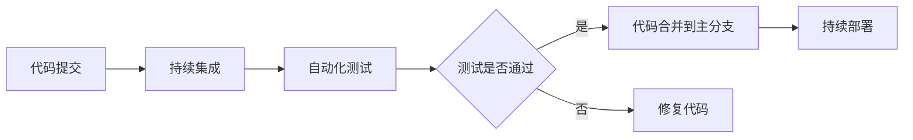

## 1.背景介绍

在这个迅速发展的技术世界中，软件开发的过程也在不断地革新和优化。其中，CI/CD流程（持续集成/持续部署）和自动化测试成为了软件开发必不可少的环节。这两个概念的出现，让软件开发的效率和质量得到了显著的提升。本文将详细介绍CI/CD和自动化测试的原理，并结合代码实战案例进行讲解。

## 2.核心概念与联系

### 2.1 CI/CD

CI/CD是Continuous Integration（持续集成）和Continuous Deployment（持续部署）的缩写。这是一种通过在每次提交后自动化构建和测试代码，然后自动化部署到生产环境的方法，以提高软件开发的速度和质量。

### 2.2 自动化测试

自动化测试是将人工测试自动化的过程，它使用专门的测试工具来控制测试执行，然后比较实际结果和预期结果，以此来达到验证软件功能正确性的目的。

### 2.3 CI/CD与自动化测试的联系

CI/CD和自动化测试是紧密相连的。在CI/CD流程中，自动化测试是一个重要环节。每次代码提交后，自动化测试工具将自动运行测试用例，确保代码的质量。只有测试通过，代码才会被合并到主分支，然后触发持续部署流程。



## 3.核心算法原理具体操作步骤

### 3.1 CI/CD流程

1. 开发人员提交代码到版本控制系统（如Git）。

2. CI服务器检测到代码提交，自动触发构建过程。

3. 构建过程包括编译代码，运行单元测试，生成构建报告等。

4. 如果构建成功，代码将被部署到测试环境。

5. 在测试环境中，运行自动化测试。

6. 如果测试通过，代码将被部署到生产环境。

### 3.2 自动化测试流程

1. 根据测试需求，编写测试用例。

2. 使用自动化测试工具，如Selenium、Junit等，编写自动化测试脚本。

3. 在CI/CD流程中，自动化测试脚本将自动运行。

4. 测试工具会自动比较实际结果和预期结果，如果一致，测试通过；如果不一致，测试失败。

5. 测试结果将被记录在测试报告中。

## 4.数学模型和公式详细讲解举例说明

在CI/CD和自动化测试中，我们通常会使用一些指标来衡量其效果。例如，我们可以使用"构建成功率"和"测试覆盖率"这两个指标。

构建成功率可以用以下公式表示：

$$
\text{构建成功率} = \frac{\text{成功构建的次数}}{\text{总构建次数}}
$$

测试覆盖率可以用以下公式表示：

$$
\text{测试覆盖率} = \frac{\text{执行了测试的代码行数}}{\text{总代码行数}}
$$

通过这两个指标，我们可以了解到我们的CI/CD流程和自动化测试的效果。

## 5.项目实践：代码实例和详细解释说明

以下是一个使用Jenkins进行CI/CD和使用Selenium进行自动化测试的简单示例。

### 5.1 Jenkins配置

首先，我们需要在Jenkins中创建一个新的任务，然后在源码管理中配置我们的代码仓库。在构建触发器中，我们选择"Poll SCM"，然后设置定时任务，如每分钟检查一次。

在构建环节，我们可以添加执行shell脚本，如编译代码，运行单元测试等。如果构建成功，我们可以在后续操作中添加部署到测试环境的步骤。

### 5.2 Selenium测试脚本

以下是一个简单的Selenium测试脚本，用于测试登录功能。

```python
from selenium import webdriver
from selenium.webdriver.common.keys import Keys

driver = webdriver.Firefox()
driver.get("http://www.example.com/login")

username = driver.find_element_by_name("username")
password = driver.find_element_by_name("password")

username.send_keys("testuser")
password.send_keys("testpassword")

password.send_keys(Keys.RETURN)

assert "登录成功" in driver.page_source
```

这个脚本首先打开登录页面，然后输入用户名和密码，点击登录。最后，检查页面中是否出现"登录成功"的文字，如果出现，说明登录功能正常。

## 6.实际应用场景

CI/CD和自动化测试广泛应用于各种软件开发项目中。例如，在网站开发中，每次开发人员提交代码后，CI/CD流程将自动进行，包括编译代码，运行单元测试，部署到测试环境，运行自动化测试，最后部署到生产环境。这样可以大大提高开发效率，保证代码质量，同时，也能快速响应用户需求。

## 7.工具和资源推荐

以下是一些CI/CD和自动化测试相关的工具和资源推荐：

1. Jenkins：一个开源的持续集成工具，提供了丰富的插件支持。

2. Travis CI：一个提供托管服务的持续集成工具，支持多种语言。

3. Selenium：一个开源的自动化测试工具，主要用于Web应用的测试。

4. Junit：一个Java编程语言的单元测试框架。

5. Docker：一个开源的应用容器引擎，可以用于部署应用。

## 8.总结：未来发展趋势与挑战

随着DevOps文化的普及，CI/CD和自动化测试的重要性将越来越被人们认识到。在未来，我们预计这两个领域将有以下发展趋势：

1. 更智能的测试：通过AI和机器学习，自动化测试将变得更智能，能够自动生成测试用例，自动识别和修复错误。

2. 更快的部署：通过新的技术如容器化和云计算，应用的部署将变得更快，更容易。

3. 更紧密的集成：持续集成将不仅仅局限于代码的集成，还将包括配置管理，数据库管理，甚至业务流程的集成。

然而，这些发展也带来了挑战，如如何保证测试的质量，如何管理复杂的部署环境，如何处理更频繁的变更等。这些都需要我们在实践中不断探索和解决。

## 9.附录：常见问题与解答

1. **问：CI/CD和自动化测试有什么好处？**

   答：CI/CD和自动化测试可以提高软件开发的效率和质量。它们可以帮助开发人员快速发现和修复错误，缩短新功能的上线时间，同时，也可以减少人工测试的工作量。

2. **问：如何选择CI/CD和自动化测试工具？**

   答：选择CI/CD和自动化测试工具时，可以考虑以下因素：支持的语言和框架，集成的程度，社区的活跃度，以及你的团队是否熟悉这个工具。

3. **问：CI/CD和自动化测试是否适合所有项目？**

   答：CI/CD和自动化测试适合大多数项目，特别是规模较大，需要多人协作的项目。但对于一些小型项目，或者变更不频繁的项目，可能不需要完全的CI/CD流程，但自动化测试仍然是有益的。

作者：禅与计算机程序设计艺术 / Zen and the Art of Computer Programming