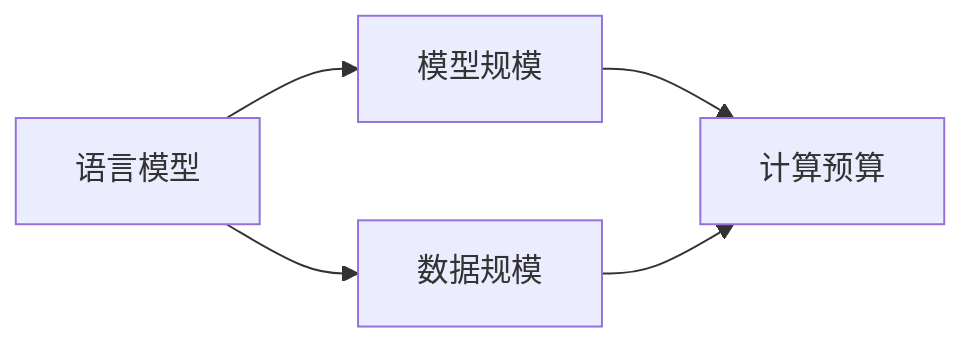

# Chinchilla原理与代码实例讲解

## 1. 背景介绍
### 1.1 Chinchilla的由来
2022年，DeepMind的研究人员提出了一种名为Chinchilla的语言模型，在相同的计算预算下，它在各种基准测试中的表现都优于此前最先进的语言模型GPT-3和Gopher。Chinchilla的提出引发了人们对语言模型训练方法的新思考。

### 1.2 Chinchilla的意义
Chinchilla的意义在于，它证明了在语言模型训练中，模型规模和数据规模之间存在一个最优平衡点。通过找到这个平衡点，可以用更少的计算资源训练出性能更好的模型。这一发现为后续的语言模型研究指明了方向。

## 2. 核心概念与联系
### 2.1 语言模型
语言模型是一种对语言进行建模的机器学习模型，它可以学习语言的统计规律，并根据上下文预测下一个最可能出现的词。常见的语言模型有n-gram模型、RNN、Transformer等。

### 2.2 模型规模与数据规模
- 模型规模：指语言模型中可训练参数的数量，通常以亿或十亿为单位。模型规模越大，模型的容量和表达能力就越强。
- 数据规模：指用于训练语言模型的文本数据的数量，通常以GB或TB为单位。数据规模越大，模型见过的语言现象就越多，泛化能力也越强。

### 2.3 计算预算
计算预算指训练语言模型所消耗的计算资源，通常以FLOPs(浮点数运算次数)来衡量。在给定计算预算的情况下，需要在模型规模和数据规模之间进行权衡。

### 2.4 核心概念之间的联系

从上图可以看出，语言模型的性能由模型规模和数据规模共同决定，而这两者都受到计算预算的制约。Chinchilla的核心思想就是在计算预算不变的情况下，调整模型规模和数据规模之间的比例，从而达到最优的性能。

## 3. 核心算法原理具体操作步骤
Chinchilla的核心算法可以分为以下几个步骤：

### 3.1 确定计算预算
首先需要确定可用的计算预算C，通常以FLOPs为单位。这个预算限制了模型规模和数据规模之和。

### 3.2 选择模型架构
Chinchilla使用了Transformer的Decoder作为基础架构，但原则上也可以使用其他架构如RNN等。

### 3.3 确定最优的模型规模和数据规模
这是Chinchilla的核心所在。令模型参数量为N，数据样本量为D，则有:
$$C = 6ND$$
其中系数6反映了Transformer前向和后向的总FLOPs。在给定C的情况下，Chinchilla通过理论分析，得出了N和D的最优比例关系：
$$N \propto D^{0.5}$$
即模型规模应与数据规模的平方根成正比。根据这一关系，可以求出满足