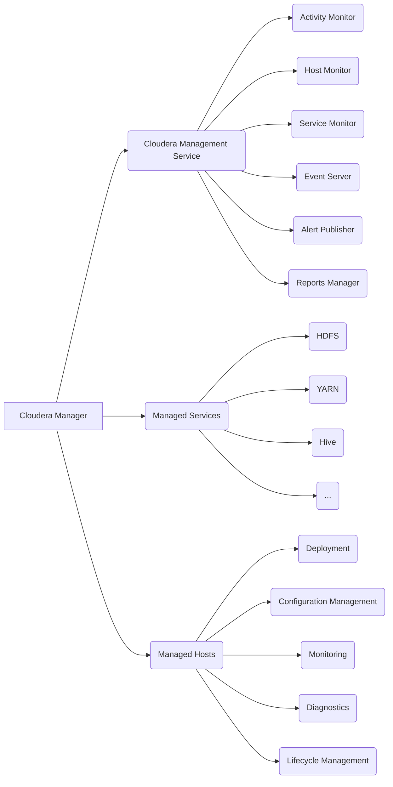

# Cloudera Manager原理与代码实例讲解

## 1. 背景介绍

### 1.1 大数据平台管理的挑战

随着大数据技术的快速发展,企业面临着越来越多的大数据平台管理挑战。Hadoop生态系统中包含了众多组件,如HDFS、YARN、Hive、HBase、Spark等,每个组件都有其独特的配置和管理方式。手动部署、配置和管理这些组件非常耗时耗力,容易出错。此外,大数据集群的规模不断扩大,节点数量成百上千,传统的运维方式难以应对。因此,亟需一种高效、可靠、易用的大数据平台管理工具。

### 1.2 Cloudera Manager的优势

Cloudera Manager应运而生,它是业界领先的大数据管理平台。通过提供集中式的管理界面,Cloudera Manager能够显著简化Hadoop及相关大数据组件的安装、配置、监控和诊断等管理任务。其主要优势包括:

- 易用性:提供Web UI,傻瓜式操作,降低管理门槛
- 自动化:一键式安装部署,配置变更自动同步
- 全面性:覆盖Hadoop生态各个组件,提供端到端的管理
- 智能化:内置专家经验,提供最佳实践建议和故障诊断
- 可扩展:支持数千节点规模,满足企业级需求

### 1.3 本文结构安排

本文将深入剖析Cloudera Manager的技术原理,并辅以代码实例加以讲解。内容安排如下:

- 第2节介绍Cloudera Manager的核心概念与内部组件之间的关系
- 第3节讲解其核心工作原理和操作流程
- 第4节对相关数学模型和公式进行推导说明
- 第5节给出使用CM API进行二次开发的示例代码
- 第6节总结CM在实际场景中的典型应用
- 第7节推荐相关工具和学习资源
- 第8节展望CM的未来发展趋势和面临的挑战
- 第9节附录解答常见问题

## 2. 核心概念与联系

### 2.1 管理服务 - Cloudera Management Service

这是Cloudera Manager的核心管理服务,由一组角色联合提供管理和监控功能,包括:

- Activity Monitor:监控MapReduce和YARN作业活动
- Host Monitor:监控主机健康状态指标
- Service Monitor:监控各服务健康状态指标
- Event Server:管理各种事件和告警
- Alert Publisher:发布告警通知
- Reports Manager:管理诊断和使用报告

### 2.2 受管服务 - Managed Services

即受Cloudera Manager管理的各种大数据服务,如HDFS、YARN、Hive等。每个服务由若干角色实例构成。

### 2.3 受管主机 - Managed Hosts 

集群中安装了Cloudera Manager Agent的主机节点,可以被纳入CM的管理范围,称为受管主机。

### 2.4 部署 - Deployment

使用Cloudera Manager在受管主机上安装和部署各种受管服务的过程。支持全新部署和已有集群的接管。

### 2.5 配置管理 - Configuration Management

CM负责管理所有受管服务的配置。支持配置变更、版本控制、回滚、跨集群克隆等特性。

### 2.6 监控 - Monitoring

CM提供了强大的监控和告警功能,实时采集主机、服务、作业等各种性能指标,进行可视化展示和分析。

### 2.7 诊断 - Diagnostics

CM能够主动发现潜在问题,提供智能化的诊断建议,并生成诊断包协助排查故障。

### 2.8 生命周期管理 - Lifecycle Management

CM覆盖了从服务部署安装、配置变更、升级更新到下线卸载的全生命周期管理。

以上核心概念之间的关系如下图所示:



## 3. 核心算法原理具体操作步骤

### 3.1 自动化部署

Cloudera Manager采用自动化部署算法简化集群部署流程,主要步骤如下:

1. 通过Web UI或API录入集群主机信息
2. 自动检测主机资源和环境依赖
3. 生成部署清单和配置模板
4. 并行分发程序包到目标主机
5. 远程执行命令完成安装配置
6. 启动服务进程并注册到CM
7. 执行smoke test冒烟测试确认部署成功

### 3.2 配置管理

CM将配置管理抽象为Safety Valve模型,允许用户在原有配置基础上进行增量覆盖,而不影响其他配置。工作原理如下:

1. 每个服务和角色定义了一组配置参数
2. 将用户变更转化为Safety Valve snippets
3. 下发Safety Valve到对应节点
4. 使用Safety Valve中的值覆盖默认配置
5. 下发最终合并的配置到组件
6. 重启受影响的服务角色

### 3.3 服务监控

CM采用自适应的监控算法和流式处理架构,实现服务指标的实时采集、聚合、存储和展示。

1. Agent采集各种服务和主机指标
2. 使用Flume进行指标数据流式传输
3. Monitor服务进行实时聚合计算
4. 结果写入时序数据库如OpenTSDB
5. 使用Grafana等进行可视化展示

### 3.4 告警管理

当监控指标超出预定阈值时,CM会触发告警事件并通知用户。

1. 用户定义告警策略,包括阈值、通知方式等
2. Monitor服务评估指标数据是否触发阈值
3. 生成告警事件写入Event Server
4. Alert Publisher执行通知动作,如发邮件
5. 用户在Web UI中确认处理告警

### 3.5 故障诊断

CM提供了丰富的故障诊断和自动修复能力,流程如下:

1. 基于预定义的诊断规则扫描日志和指标
2. 发现故障隐患,生成诊断事件
3. 根据知识库匹配,给出可能的根因分析
4. 提供解决方案建议,甚至尝试自动修复
5. 记录诊断和修复过程,生成诊断报告

## 4. 数学模型和公式详细讲解举例说明

### 4.1 资源需求评估模型

为了合理规划集群资源,CM提供了资源评估计算器。以HDFS为例,核心参数包括:

- 原始数据量 $D$
- 副本数 $R$
- 压缩比 $C$
- 磁盘利用率 $U$

则所需HDFS原始空间 $S$ 计算公式为:

$$ S = \frac{D \times R}{C \times U} $$

假设 $D=1PB$, $R=3$, $C=2.5$, $U=0.8$, 代入公式得:

$$ S = \frac{1PB \times 3}{2.5 \times 0.8} = 1.5PB $$

即需要预留1.5PB的HDFS空间。

### 4.2 服务可用性模型

CM支持对服务可用性进行建模分析。以HDFS NameNode为例,令:

- $F$ 为故障事件
- $P(F)$ 为故障概率
- $T_D$ 为故障检测时间
- $T_R$ 为修复时间

则NameNode可用性 $A$ 的计算公式为:

$$ A = 1 - \frac{P(F) \times (T_D + T_R)}{MTTF} $$

其中 $MTTF$ 为平均故障间隔时间。假设:

- $P(F) = 0.01$
- $T_D = 5min$
- $T_R = 30min$
- $MTTF = 1 year$

代入公式得:

$$ A = 1 - \frac{0.01 \times (5+30)}{365 \times 24 \times 60} = 99.9996\% $$

即NameNode的可用性可达99.9996%。

### 4.3 告警阈值动态调整模型

为降低告警噪音,CM支持动态阈值,即根据历史数据自动调整阈值。核心思想是使用指数加权移动平均(EWMA)算法预测指标的变化趋势。

令 $x_t$ 为 $t$ 时刻的指标值, $S_t$ 为EWMA值,则迭代公式为:

$$ S_t = \alpha x_t + (1-\alpha) S_{t-1} $$

其中 $\alpha$ 为平滑系数,控制历史数据的权重衰减速度。

假设告警阈值为 $S_t$ 的 $k$ 倍,则动态阈值 $y_t$ 为:

$$ y_t = k \cdot S_t $$

举例如下:

```
时间  指标值  EWMA (a=0.2)  动态阈值 (k=3)
 1    10       10           30
 2    20       12           36
 3    15       12.6         37.8
 4    30       16.08        48.24
 5    25       17.664       52.992
```

可见,告警阈值随数据变化自动调整,减少了固定阈值可能带来的频繁告警。

## 5. 项目实践：代码实例和详细解释说明

下面以使用CM API为HDFS集群创建快照为例,给出Python代码实例:

```python
from cm_api.api_client import ApiResource

# 连接CM
api = ApiResource(server_host='localhost', 
                  username='admin', password='admin')
  
# 获取HDFS服务
cluster = api.get_cluster('Cluster1')
hdfs = cluster.get_service('HDFS')

# 创建快照策略
policy = hdfs.create_snapshot_policy(policy_name='daily',
                                     description='每天快照',
                                     minute=0, hour=0)

# 为目录启用快照
dir_path = '/data'
hdfs.create_snapshot(dir_path, policy.name)

# 手动生成一次快照
snapshot = hdfs.create_snapshot(dir_path)
print('创建快照:', snapshot.name)
```

代码解释:

1. 首先通过`ApiResource`连接到CM,需提供CM的服务器地址、用户名、密码。
2. 然后通过`get_cluster`和`get_service`方法定位到HDFS服务。
3. 调用`create_snapshot_policy`创建一个每天零点生成快照的策略。
4. 调用`hdfs.create_snapshot(dir_path, policy.name)`为指定目录启用该快照策略。
5. 最后手动调用`hdfs.create_snapshot(dir_path)`即可创建一次快照。

可见,使用CM API编程可以很方便地管理集群,实现自动化运维。

## 6. 实际应用场景

Cloudera Manager在企业大数据平台的部署运维中有广泛应用,典型场景包括:

### 6.1 一键部署大数据平台

使用CM可实现一键式自动化部署。用户只需提供集群主机、服务选型等少量信息,即可快速完成从裸机到可用集群的部署过程,大幅提高效率。

### 6.2 集中配置管理

CM将所有组件的配置集中管理,提供了统一的配置变更、版本控制、历史追溯等能力。可显著降低错误配置风险,确保集群配置一致性。

### 6.3 可视化监控运维

通过CM强大的监控和告警功能,运维人员可实时掌握集群的健康状态,及时发现和解决潜在问题。丰富的可视化图表大大提高了运维效率。

### 6.4 智能故障诊断

CM专家系统可主动发现故障隐患,减少运维盲点。通过日志分析、关联分析等手段给出智能诊断建议,加速问题定位,降低运维成本。

### 6.5 自动化升级和补丁管理

CM支持管理组件的滚动升级和补丁管理。可控制升级进度和并发度,进行版本之间的兼容性检查,回滚有问题的变更,有效规避升级风险。

### 6.6 多租户资源隔离

基于CM的动态资源池,可实现不同用户、业务之间的资源隔离,确保关键任务的SLA,提高集群资源利用率