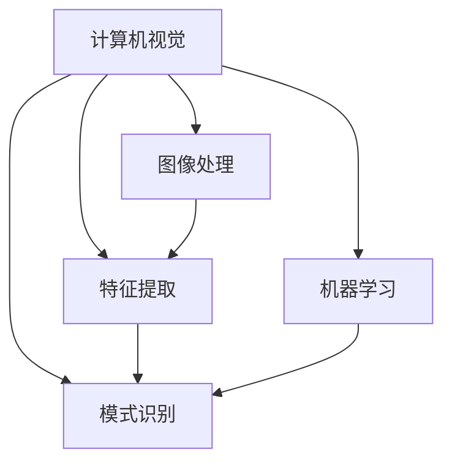
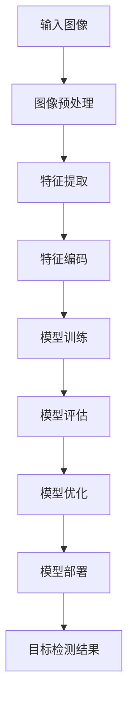

# Computer Vision Techniques 原理与代码实战案例讲解

## 1.背景介绍

计算机视觉是人工智能领域的一个重要分支,旨在使计算机能够像人类一样理解和解释数字图像或视频的内容。随着深度学习技术的飞速发展,计算机视觉在图像分类、目标检测、语义分割、实例分割、姿态估计等任务上取得了突破性的进展。

计算机视觉技术已广泛应用于多个领域,如自动驾驶、机器人视觉、人脸识别、医疗影像分析等。其核心思想是利用数学模型和算法从图像或视频中提取有用的信息,并将其转化为适合计算机处理的数字形式。

## 2.核心概念与联系

计算机视觉涉及多个核心概念,包括图像处理、特征提取、模式识别、机器学习等。这些概念相互关联且有机地结合在一起,共同推动了计算机视觉技术的发展。

### 2.1 图像处理

图像处理是计算机视觉的基础,包括图像去噪、增强、分割等预处理步骤。常用的图像处理算法有高斯滤波、中值滤波、直方图均衡化等。

### 2.2 特征提取

特征提取旨在从图像中提取出对识别目标具有代表性的特征,如边缘、角点、纹理等。经典的特征提取算法包括SIFT、SURF、HOG等。近年来,基于深度学习的特征提取方法逐渐占据主导地位。

### 2.3 模式识别

模式识别是计算机视觉的核心任务,旨在根据提取的特征对图像中的目标进行分类或检测。常用的模式识别算法有支持向量机(SVM)、决策树、朴素贝叶斯等。

### 2.4 机器学习

机器学习为计算机视觉提供了强大的工具,使得系统能够从大量数据中自动学习特征模式,而不需要人工设计规则。深度学习是机器学习的一个重要分支,在计算机视觉领域取得了卓越的成就。



## 3.核心算法原理具体操作步骤

计算机视觉算法通常包含以下几个主要步骤:

1. **图像获取**: 从相机、视频文件或图像数据库获取输入图像或视频帧。

2. **预处理**: 对获取的图像进行预处理,如去噪、增强对比度、几何校正等,以提高图像质量并为后续步骤做好准备。

3. **特征提取**: 从预处理后的图像中提取出具有代表性的特征,如边缘、角点、纹理等。常用的特征提取算法包括SIFT、SURF、HOG等。

4. **特征编码**: 将提取的特征进行编码,使其适合于机器学习模型的输入。常用的编码方法有向量量化(Vector Quantization)、稀疏编码(Sparse Coding)等。

5. **模型训练**: 使用标注好的训练数据集,基于提取的特征训练机器学习模型,如支持向量机(SVM)、随机森林、神经网络等。

6. **模型评估**: 在保留的测试数据集上评估训练好的模型的性能,如准确率、精确率、召回率等指标。

7. **模型优化**: 根据评估结果,通过调整超参数、增加训练数据、特征工程等方式优化模型性能。

8. **模型部署**: 将优化后的模型部署到实际应用系统中,用于处理新的输入图像或视频流。

以目标检测任务为例,其核心算法步骤如下所示:



## 4.数学模型和公式详细讲解举例说明

计算机视觉算法中涉及大量数学模型和公式,这些模型和公式是算法的理论基础。下面将详细讲解几个常用的数学模型和公式。

### 4.1 卷积神经网络

卷积神经网络(Convolutional Neural Network, CNN)是深度学习中一种常用的网络结构,广泛应用于图像分类、目标检测等计算机视觉任务。CNN由多个卷积层、池化层和全连接层组成,能够自动从图像中学习出有效的特征表示。

卷积层是CNN的核心部分,它通过滤波器(也称为卷积核)在输入特征图上进行卷积操作,提取出局部特征。卷积操作的数学表达式如下:

$$
S(i, j) = (I * K)(i, j) = \sum_{m}\sum_{n}I(i+m, j+n)K(m, n)
$$

其中,$$I$$表示输入特征图,$$K$$表示卷积核,$$S$$表示输出特征图。卷积核在输入特征图上滑动,在每个位置计算输入特征图与卷积核的内积,从而得到输出特征图。

池化层通常在卷积层之后,对特征图进行下采样,减小特征图的空间尺寸,从而降低计算复杂度并提取出更加鲁棒的特征。常用的池化操作有最大池化和平均池化。

全连接层则将前面卷积层和池化层提取的特征进行整合,并输出最终的分类或回归结果。

### 4.2 SIFT 特征描述子

SIFT(Scale-Invariant Feature Transform)是一种经典的局部特征描述子,能够提取出对尺度、旋转和亮度变化具有一定稳定性的特征。SIFT 特征描述子的计算过程包括以下几个主要步骤:

1. **尺度空间极值检测**: 通过构建高斯差分金字塔,在不同尺度空间上检测潜在的兴趣点。

2. **关键点精确定位**: 对检测到的潜在兴趣点进行精确定位,剔除不稳定的低对比度点和沿边缘响应较强的点。

3. **方向赋值**: 根据关键点邻域像素的梯度方向分布,为每个关键点赋予主方向,使其具有旋转不变性。

4. **关键点描述子计算**: 在关键点周围区域内,计算梯度幅值和方向,构建关键点的128维SIFT描述子向量。

SIFT 描述子具有尺度不变性、旋转不变性和部分光照不变性等优点,广泛应用于图像拼接、三维重建、目标识别与跟踪等领域。

### 4.3 HOG 特征描述子

HOG(Histogram of Oriented Gradients)是另一种常用的特征描述子,通过统计图像局部区域内梯度方向直方图来描述目标的形状和结构特征。HOG 特征描述子的计算步骤如下:

1. **计算梯度幅值和方向**: 对输入图像计算每个像素点的梯度幅值和梯度方向。

2. **构建梯度直方图**: 将图像划分为小的连续的单元,在每个单元内统计梯度方向直方图。

3. **块描述子构建**: 将相邻的单元组合成块,对块内的直方图进行归一化,构建块描述子。

4. **HOG 描述子构建**: 将所有块描述子串联,形成最终的 HOG 特征描述子。

HOG 描述子能够很好地描述目标的几何和形状信息,对光照和背景变化具有一定的鲁棒性,常用于行人检测、物体识别等计算机视觉任务。

## 5.项目实践:代码实例和详细解释说明

为了加深对计算机视觉算法的理解,下面将通过一个实际项目案例,展示如何使用 Python 和相关库(如 OpenCV、NumPy、Scikit-learn 等)实现目标检测任务。

### 5.1 项目概述

本项目旨在实现一个简单的目标检测系统,能够在给定的图像或视频中检测出特定目标(如人脸、汽车等)的位置。我们将使用 HOG 特征描述子和线性 SVM 分类器构建目标检测模型。

### 5.2 数据准备

首先,我们需要准备一个包含目标实例和负样本的数据集。对于本例,我们将使用 OpenCV 内置的人脸检测数据集。该数据集包含大量正面和侧面人脸图像,以及一些负样本图像。

```python
import cv2
import os

# 加载正样本和负样本图像
pos_images = []
neg_images = []

pos_path = 'data/positive'
neg_path = 'data/negative'

for filename in os.listdir(pos_path):
    img = cv2.imread(os.path.join(pos_path, filename))
    pos_images.append(img)

for filename in os.listdir(neg_path):
    img = cv2.imread(os.path.join(neg_path, filename))
    neg_images.append(img)
```

### 5.3 特征提取

接下来,我们将使用 HOG 描述子从正样本和负样本图像中提取特征。

```python
import cv2

def extract_hog_features(images):
    hog = cv2.HOGDescriptor()
    features = []
    for img in images:
        feature = hog.compute(img)
        features.append(feature)
    return features

pos_features = extract_hog_features(pos_images)
neg_features = extract_hog_features(neg_images)
```

### 5.4 模型训练

现在,我们可以使用提取的 HOG 特征训练线性 SVM 分类器。

```python
from sklearn.svm import LinearSVC
import numpy as np

labels = np.concatenate((np.ones(len(pos_features)), np.zeros(len(neg_features))))
features = np.concatenate((pos_features, neg_features))

model = LinearSVC()
model.fit(features, labels)
```

### 5.5 目标检测

最后,我们可以使用训练好的模型在新图像或视频中进行目标检测。

```python
import cv2

def detect_objects(img, model, win_stride=(8, 8), scale=1.05, min_neighbors=2):
    rects = []
    found = []
    hog = cv2.HOGDescriptor()
    
    # 构建图像金字塔
    scale = 1.0
    img = cv2.resize(img, (0, 0), fx=scale, fy=scale)
    
    while True:
        # 在当前尺度下进行滑动窗口检测
        found = found + hog.detectMultiScale(img, winStride=win_stride, scale=scale, hitThreshold=model.decision_function)
        
        # 更新尺度
        scale = scale * scale_factor
        img = cv2.resize(img, (0, 0), fx=scale, fy=scale)
        
        if scale > max_scale:
            break
            
    # 对检测结果进行非极大值抑制
    rects = np.array([x for x in found if len(set(tuple(y) for y in x)) >= min_neighbors])
    
    return rects

# 在图像中进行目标检测
img = cv2.imread('test.jpg')
rects = detect_objects(img, model)

# 在图像上绘制检测结果
for (x, y, w, h) in rects:
    cv2.rectangle(img, (x, y), (x+w, y+h), (0, 255, 0), 2)

cv2.imshow('Object Detection', img)
cv2.waitKey(0)
cv2.destroyAllWindows()
```

在上述代码中,我们首先构建图像金字塔,然后在每个尺度下使用滑动窗口和 HOG 特征进行目标检测。最后,我们对检测结果进行非极大值抑制,并在原始图像上绘制检测框。

通过这个实例,我们可以看到如何将计算机视觉理论与实践相结合,构建一个简单但实用的目标检测系统。

## 6.实际应用场景

计算机视觉技术在现实世界中有着广泛的应用,下面列举了一些典型的应用场景:

### 6.1 自动驾驶

自动驾驶汽车需要实时检测和识别道路上的车辆、行人、交通标志等目标,并根据检测结果做出相应的驾驶决策。计算机视觉技术在自动驾驶系统中扮演着关键角色。

### 6.2 机器人视觉

机器人需要通过视觉系统感知周围环境,识别目标物体的位置和姿态,从而