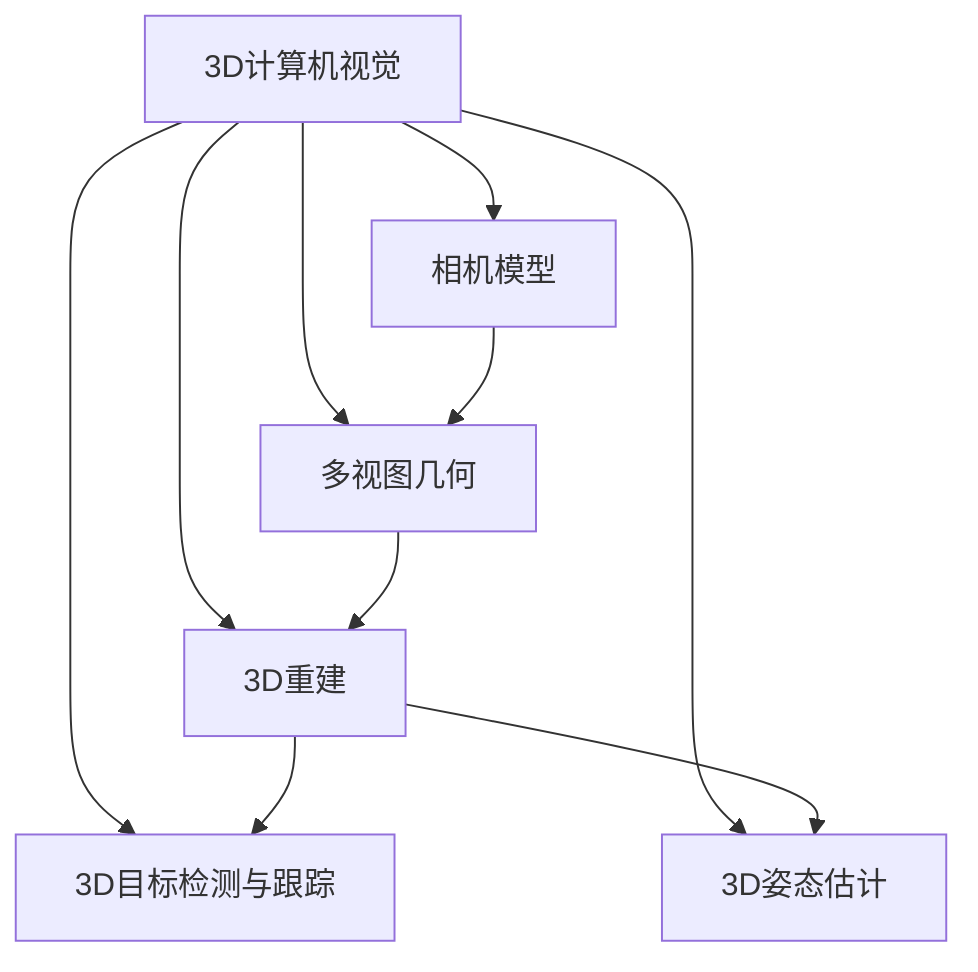

# 3D Computer Vision 原理与代码实战案例讲解

## 1. 背景介绍

### 1.1 什么是3D计算机视觉?

3D计算机视觉是计算机视觉领域的一个重要分支,旨在从2D图像或视频数据中重建和理解3D场景信息。它通过从多个视角捕获的图像或使用深度传感器获取的3D数据,来估计和分析场景中物体的3D结构、位置、运动和属性。

3D计算机视觉技术广泛应用于增强现实(AR)、虚拟现实(VR)、机器人导航、自动驾驶、人机交互等领域,为人工智能系统提供宝贵的3D环境理解能力。

### 1.2 3D计算机视觉的重要性

随着计算能力的不断提高和深度学习技术的快速发展,3D计算机视觉正在经历前所未有的进步。它为许多应用领域带来了革命性的变化,例如:

- **增强现实(AR)和虚拟现实(VR)**: 准确的3D重建和跟踪是实现高质量AR/VR体验的关键。
- **自动驾驶**: 自动驾驶汽车需要对周围3D环境进行精确建模和理解,以实现安全导航。
- **机器人导航**: 3D视觉技术使机器人能够在复杂环境中自主定位、导航和操作。
- **人机交互**: 通过3D姿态估计和手势识别,实现自然的人机交互方式。

3D计算机视觉技术的发展不仅推动了人工智能领域的进步,也为各行业带来了新的机遇和挑战。

## 2. 核心概念与联系

3D计算机视觉涉及多个核心概念和技术,它们相互关联、互为基础。以下是一些关键概念:

### 2.1 相机模型

相机模型描述了3D世界到2D图像平面的投影关系,是3D计算机视觉的基础。常用的相机模型包括针孔相机模型、鱼眼相机模型等。理解相机内外参数对于从2D图像恢复3D信息至关重要。

### 2.2 多视图几何

多视图几何研究不同视角下捕获的图像之间的几何关系,包括相机运动估计、视图匹配和三角测量等。它是实现3D重建的关键步骤。

### 2.3 3D重建

3D重建技术从2D图像或3D数据(如深度图)中估计和恢复场景的3D几何结构和表面细节。常见的3D重建方法包括基于多视图的重建、基于深度的重建等。

### 2.4 3D目标检测与跟踪

3D目标检测旨在从3D数据中定位和识别感兴趣的物体,而3D目标跟踪则是在连续帧中跟踪目标的3D运动。这些技术在AR/VR、自动驾驶等应用中扮演着重要角色。

### 2.5 3D姿态估计

3D姿态估计指从图像或3D数据中估计目标物体的3D位置和方向。它对于人机交互、机器人操作等应用至关重要。

上述概念相互关联、互为基础,共同构建了3D计算机视觉的理论和技术体系。掌握这些核心概念有助于更好地理解和应用3D计算机视觉技术。

## 3. 核心算法原理具体操作步骤

### 3.1 相机模型

#### 3.1.1 针孔相机模型

针孔相机模型是最常用的相机模型,它将3D世界点投影到2D图像平面上。投影过程可以分为两个步骤:

1. **内参数映射**:将3D世界坐标系中的点转换到相机坐标系。

$$
\begin{bmatrix}
u\\
v\\
1
\end{bmatrix}
=
\begin{bmatrix}
f_x & 0 & c_x\\
0 & f_y & c_y\\
0 & 0 & 1
\end{bmatrix}
\begin{bmatrix}
X/Z\\
Y/Z\\
1
\end{bmatrix}
$$

其中,$(f_x, f_y)$是相机的焦距,$(c_x, c_y)$是主点坐标。

2. **外参数映射**:将相机坐标系中的点转换到世界坐标系。

$$
\begin{bmatrix}
X_c\\
Y_c\\
Z_c\\
1
\end{bmatrix}
=
\begin{bmatrix}
R & t\\
0^T & 1
\end{bmatrix}
\begin{bmatrix}
X_w\\
Y_w\\
Z_w\\
1
\end{bmatrix}
$$

其中,$(R, t)$分别表示旋转矩阵和平移向量。

通过这两个步骤,我们可以将3D世界点投影到2D图像平面上。

#### 3.1.2 鱼眼相机模型

鱼眼相机具有超广角视野,在AR/VR等应用中很有用。鱼眼相机模型通常使用等距投影或球面投影等非线性投影模型。以等距投影为例:

$$
\begin{bmatrix}
u\\
v
\end{bmatrix}
=
\begin{bmatrix}
f_x & 0 & c_x\\
0 & f_y & c_y
\end{bmatrix}
\begin{bmatrix}
\theta \cos\phi\\
\theta \sin\phi
\end{bmatrix}
$$

其中,$(u, v)$是图像平面坐标,$(f_x, f_y)$是焦距,$(c_x, c_y)$是主点坐标,$\theta$和$\phi$分别是球面坐标系中的极径和方位角。

通过建立鱼眼相机模型,我们可以从鱼眼图像中恢复3D信息。

### 3.2 多视图几何

#### 3.2.1 相机运动估计

给定两个视图,我们可以通过特征点匹配和基础矩阵(Fundamental Matrix)估计相机运动。基础矩阵描述了两个视图之间的几何约束关系:

$$
p_2^TFp_1 = 0
$$

其中,$p_1$和$p_2$分别是第一个和第二个视图中对应的同一空间点的像素坐标。

我们可以通过RANSAC等鲁棒估计方法从匹配点对中计算出基础矩阵$F$,进而估计相机的相对位姿。

#### 3.2.2 三角测量

已知相机内外参数和匹配的像素坐标,我们可以通过三角测量恢复3D点的空间坐标:

$$
\begin{bmatrix}
u_1\\
v_1\\
1
\end{bmatrix}
=
P_1
\begin{bmatrix}
X\\
Y\\
Z\\
1
\end{bmatrix}
,\quad
\begin{bmatrix}
u_2\\
v_2\\
1
\end{bmatrix}
=
P_2
\begin{bmatrix}
X\\
Y\\
Z\\
1
\end{bmatrix}
$$

其中,$P_1$和$P_2$是两个相机的投影矩阵。通过求解这个过度约束的方程组,我们可以获得3D点$(X, Y, Z)$的坐标。

### 3.3 3D重建

#### 3.3.1 基于多视图的重建

利用多视图几何原理,我们可以从多个视角的图像中重建出3D模型。常见的方法包括:

1. **基于特征的重建**:通过提取和匹配图像特征点,结合三角测量和bundle adjustment等优化技术,重建出稀疏的3D点云。
2. **基于密集匹配的重建**:使用立体匹配等技术,对图像进行密集匹配,生成深度图或点云,再通过融合和滤波获得完整的3D模型。

#### 3.3.2 基于深度的重建

利用深度相机(如Kinect)或主动深度传感器(如激光雷达),我们可以直接获取场景的3D数据。常见的重建方法包括:

1. **基于体素的重建**:将3D空间划分为体素,根据深度数据对每个体素进行融合和更新,最终生成3D模型。
2. **基于点云的重建**:从深度数据中提取点云,再对点云进行平滑、去噪、三角化等处理,生成网格模型。

### 3.4 3D目标检测与跟踪

#### 3.4.1 3D目标检测

3D目标检测旨在从3D数据(如点云或体素)中定位和识别感兴趣的物体。常见的方法包括:

1. **基于深度学习的检测**:使用3D卷积神经网络(如PointNet++、VoxelNet)直接从3D数据中学习和预测目标的3D边界框。
2. **基于区域提议的检测**:首先在2D图像上生成目标候选框,然后结合深度信息提取3D区域,最后进行3D边界框回归和分类。

#### 3.4.2 3D目标跟踪

3D目标跟踪是在连续帧中跟踪目标的3D运动和位置。常见的方法包括:

1. **基于滤波的跟踪**:使用卡尔曼滤波、粒子滤波等滤波器,结合检测结果和运动模型,预测和更新目标的3D状态。
2. **基于关联的跟踪**:在每一帧中检测目标,然后使用数据关联算法(如匈牙利算法)将检测结果与现有轨迹相关联。

### 3.5 3D姿态估计

3D姿态估计是从图像或3D数据中估计目标物体的3D位置和方向。常见的方法包括:

1. **基于2D特征的估计**:从2D图像中提取特征点,然后使用PnP(Perspective-n-Point)算法或基于深度学习的方法估计目标的6DoF姿态。
2. **基于3D数据的估计**:从3D点云或深度图中提取目标区域,然后使用ICP(Iterative Closest Point)等算法与已知的3D模型进行配准,获得目标的姿态。

上述算法原理和具体操作步骤是3D计算机视觉的核心部分,掌握这些内容有助于更好地理解和应用相关技术。

## 4. 数学模型和公式详细讲解举例说明

在3D计算机视觉中,数学模型和公式扮演着重要角色,为各种算法和技术提供了理论基础。以下是一些关键的数学模型和公式,以及详细的讲解和举例说明。

### 4.1 相机模型

#### 4.1.1 针孔相机模型

针孔相机模型是最常用的相机模型,它将3D世界点投影到2D图像平面上。投影过程可以分为两个步骤:

1. **内参数映射**:将3D世界坐标系中的点转换到相机坐标系。

$$
\begin{bmatrix}
u\\
v\\
1
\end{bmatrix}
=
\begin{bmatrix}
f_x & 0 & c_x\\
0 & f_y & c_y\\
0 & 0 & 1
\end{bmatrix}
\begin{bmatrix}
X/Z\\
Y/Z\\
1
\end{bmatrix}
$$

其中,$(f_x, f_y)$是相机的焦距,$(c_x, c_y)$是主点坐标。这个矩阵被称为相机内参数矩阵(Camera Intrinsic Matrix)。

2. **外参数映射**:将相机坐标系中的点转换到世界坐标系。

$$
\begin{bmatrix}
X_c\\
Y_c\\
Z_c\\
1
\end{bmatrix}
=
\begin{bmatrix}
R & t\\
0^T & 1
\end{bmatrix}
\begin{bmatrix}
X_w\\
Y_w\\
Z_w\\
1
\end{bmatrix}
$$

其中,$(R, t)$分别表示旋转矩阵和平移向量,称为相机外参数(Camera Extrinsic Parameters)。

通过这两个步骤,我们可以将3D世界点投影到2D图像平面上。

**举例说明**:

假设一个3D点在世界坐标系中的坐标为$(X_w, Y_w, Z_w) = (1, 2, 3)$,相机的内参数矩阵为:

$$
K = \begin{bmatrix}
500 & 0 & 320