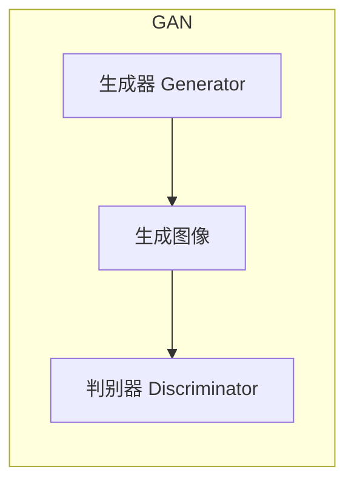
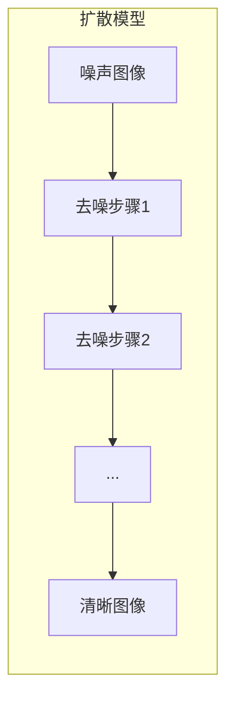
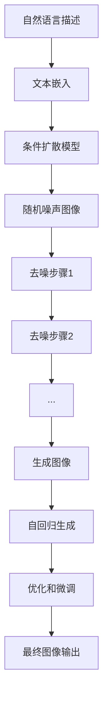

# DALL-E 2原理与代码实例讲解

## 1.背景介绍

在人工智能领域,生成式AI模型正在引领着一场新的革命。其中,DALL-E 2是OpenAI推出的一款先进的文本到图像生成模型,它能够根据自然语言描述生成逼真的图像,展现出令人惊叹的创造力和想象力。DALL-E 2的出现,不仅极大地推动了计算机视觉和自然语言处理技术的发展,同时也为艺术创作、设计、教育等领域带来了全新的可能性。

## 2.核心概念与联系

### 2.1 生成式对抗网络(GAN)

DALL-E 2的核心技术是基于生成式对抗网络(GAN)。GAN由两个神经网络模型组成:生成器(Generator)和判别器(Discriminator)。



生成器的作用是从随机噪声中生成逼真的图像,而判别器则负责区分生成的图像是真是假。通过生成器和判别器之间的对抗训练,GAN可以逐步优化生成器,使其生成的图像越来越逼真。

### 2.2 自然语言处理(NLP)

DALL-E 2还融合了自然语言处理(NLP)技术,使其能够理解和解析自然语言描述。通过将文本嵌入到语义空间中,DALL-E 2可以捕捉文本的语义信息,并将其映射到图像空间,从而实现文本到图像的生成。

### 2.3 扩散模型(Diffusion Model)

DALL-E 2采用了扩散模型作为生成器的核心架构。扩散模型是一种新型的生成模型,它通过逐步去噪的方式生成图像。具体来说,扩散模型首先将随机噪声添加到真实图像中,然后学习一个逆过程,从噪声图像中恢复出原始的清晰图像。



通过这种逐步去噪的方式,扩散模型可以更好地捕捉图像的细节和结构信息,从而生成更加逼真和高质量的图像。

## 3.核心算法原理具体操作步骤

DALL-E 2的核心算法原理可以概括为以下几个主要步骤:

1. **文本嵌入**:将自然语言描述转换为语义向量表示。
2. **条件扩散**:使用条件扩散模型,将文本嵌入作为条件,从随机噪声开始生成图像。
3. **去噪过程**:通过多个去噪步骤,逐步恢复出清晰的图像。
4. **自回归生成**:在生成过程中,模型会自回归地生成图像的每个像素。
5. **优化和微调**:使用对抗训练和其他优化技术,不断提高生成图像的质量和多样性。

具体操作步骤如下:



1. 将自然语言描述输入到DALL-E 2模型中。
2. 使用预训练的文本编码器(如BERT)将文本转换为语义向量表示。
3. 将文本嵌入作为条件输入到条件扩散模型中。
4. 条件扩散模型从随机噪声开始生成初始噪声图像。
5. 通过多个去噪步骤,逐步恢复出清晰的图像。每个去噪步骤都会根据当前噪声图像和文本条件,预测下一步的去噪结果。
6. 在生成过程中,模型会自回归地生成图像的每个像素,利用已生成的像素来预测下一个像素。
7. 使用对抗训练、正则化等优化技术,不断提高生成图像的质量和多样性。
8. 经过多次迭代优化后,输出最终的生成图像。

## 4.数学模型和公式详细讲解举例说明

### 4.1 扩散过程

扩散过程是将清晰图像转换为噪声图像的过程。设$x_0$为原始清晰图像,通过$T$个步骤的扩散过程,可以得到最终的噪声图像$x_T$。每个扩散步骤都会向图像添加一定程度的高斯噪声,使图像逐渐变得模糊。数学表示如下:

$$
q\left(x_{t} | x_{t-1}\right)=\mathcal{N}\left(x_{t} ; \sqrt{1-\beta_{t}} x_{t-1}, \beta_{t} \mathbf{I}\right)
$$

其中,$\beta_t$是扩散步骤$t$的扩散率,控制了噪声的强度。$\mathcal{N}(\cdot;\mu,\Sigma)$表示均值为$\mu$,协方差矩阵为$\Sigma$的高斯分布。

通过$T$步扩散,可以得到最终的噪声图像$x_T$:

$$
q\left(x_{T} | x_{0}\right)=\prod_{t=1}^{T} q\left(x_{t} | x_{t-1}\right)
$$

### 4.2 去噪过程

去噪过程是从噪声图像$x_T$恢复出清晰图像$x_0$的过程。DALL-E 2使用一个去噪模型$p_\theta(x_{t-1}|x_t,c)$,根据当前噪声图像$x_t$和文本条件$c$,预测前一步的去噪结果$x_{t-1}$。通过$T$步去噪,可以逐步恢复出原始清晰图像$x_0$。

去噪过程的目标是最大化$x_0$的似然,即:

$$
\max _{\theta} \mathbb{E}_{x_{0}, c}\left[\log p_{\theta}\left(x_{0} | x_{T}, c\right)\right]
$$

根据马尔可夫链条件,可以将上式分解为:

$$
\log p_{\theta}\left(x_{0} | x_{T}, c\right)=\sum_{t=1}^{T} \log p_{\theta}\left(x_{t-1} | x_{t}, c\right)
$$

因此,去噪过程可以转化为最小化每一步的去噪损失:

$$
\mathcal{L}_{\text {vlb}}=\mathbb{E}_{q\left(x_{T} | x_{0}\right)}\left[\sum_{t=1}^{T}\left\|x_{t-1}-\epsilon_{\theta}\left(x_{t}, c\right)\right\|_{2}^{2}\right]
$$

其中,$\epsilon_\theta$是去噪模型,用于预测$x_{t-1}$。

### 4.3 自回归生成

在生成过程中,DALL-E 2采用自回归方式,利用已生成的像素来预测下一个像素。具体来说,对于每个像素$x_{i,j}$,模型会根据上下文信息(包括已生成的像素和文本条件)来预测该像素的值。

设$X_{<i,j}$表示位于$(i,j)$之前的所有像素,则自回归过程可以表示为:

$$
p\left(x_{i, j} | X_{<i, j}, c\right)=f_{\theta}\left(X_{<i, j}, c\right)
$$

其中,$f_\theta$是自回归模型,用于预测像素$x_{i,j}$的条件分布。

通过自回归生成,DALL-E 2可以有效地捕捉图像的空间结构和语义信息,从而生成更加逼真和连贯的图像。

## 5.项目实践:代码实例和详细解释说明

以下是一个使用PyTorch实现DALL-E 2的简化代码示例,包括扩散过程、去噪过程和自回归生成。

```python
import torch
import torch.nn as nn

# 扩散过程
def q_sample(x_0, beta, T):
    x = x_0
    for t in range(T):
        noise = torch.randn_like(x)
        x = torch.sqrt(1 - beta[t]) * x + torch.sqrt(beta[t]) * noise
    return x

# 去噪过程
class DenoisingModel(nn.Module):
    def __init__(self):
        super().__init__()
        self.conv1 = nn.Conv2d(4, 64, kernel_size=3, padding=1)
        self.conv2 = nn.Conv2d(64, 64, kernel_size=3, padding=1)
        self.conv3 = nn.Conv2d(64, 3, kernel_size=3, padding=1)

    def forward(self, x, c):
        x = torch.cat([x, c], dim=1)
        x = nn.functional.relu(self.conv1(x))
        x = nn.functional.relu(self.conv2(x))
        x = self.conv3(x)
        return x

# 自回归生成
class AutoregressiveModel(nn.Module):
    def __init__(self):
        super().__init__()
        self.conv1 = nn.Conv2d(4, 64, kernel_size=3, padding=1)
        self.conv2 = nn.Conv2d(64, 64, kernel_size=3, padding=1)
        self.conv3 = nn.Conv2d(64, 3, kernel_size=3, padding=1)

    def forward(self, x, c):
        x = torch.cat([x, c], dim=1)
        x = nn.functional.relu(self.conv1(x))
        x = nn.functional.relu(self.conv2(x))
        x = self.conv3(x)
        return x

# 训练过程
def train(x_0, text_condition, beta, T):
    x_T = q_sample(x_0, beta, T)
    denoising_model = DenoisingModel()
    autoregressive_model = AutoregressiveModel()

    for t in range(T, 0, -1):
        x_t = q_sample(x_0, beta, t)
        x_pred = denoising_model(x_t, text_condition)
        loss = nn.functional.mse_loss(x_pred, x_0)
        loss.backward()
        optimizer.step()

    # 生成图像
    x_gen = x_T
    for t in range(T, 0, -1):
        x_pred = autoregressive_model(x_gen, text_condition)
        x_gen = x_pred

    return x_gen
```

上述代码实现了以下几个主要部分:

1. **扩散过程**:通过`q_sample`函数,将清晰图像`x_0`转换为噪声图像`x_T`。
2. **去噪模型**:定义了一个卷积神经网络`DenoisingModel`,用于预测去噪结果。
3. **自回归模型**:定义了一个卷积神经网络`AutoregressiveModel`,用于自回归生成图像像素。
4. **训练过程**:通过反向传播优化去噪模型的参数,并使用自回归模型生成图像。

在训练过程中,首先使用`q_sample`函数生成噪声图像`x_T`。然后,从时间步`T`开始,使用去噪模型`DenoisingModel`预测前一步的去噪结果,并计算与真实图像`x_0`的均方误差作为损失函数。通过反向传播优化去噪模型的参数。

在生成图像时,从噪声图像`x_T`开始,使用自回归模型`AutoregressiveModel`逐步生成图像的像素,利用已生成的像素作为上下文信息。

需要注意的是,上述代码只是一个简化版本,实际的DALL-E 2模型会更加复杂,包括更深层的网络结构、更先进的优化技术等。但是,这个示例代码可以帮助读者理解DALL-E 2的核心原理和实现思路。

## 6.实际应用场景

DALL-E 2的出现为许多领域带来了新的机遇和可能性,以下是一些典型的应用场景:

1. **艺术创作**:艺术家可以使用DALL-E 2快速生成各种风格和主题的图像,为创作提供无限的灵感和素材。
2. **设计领域**:设计师可以利用DALL-E 2生成各种概念图、草图和参考图像,加速设计过程。
3. **教育领域**:教师可以使用DALL-E 2生成丰富的视觉教学资源,提高学生的学习兴趣和效率。
4. **营销和广告**:营销人员可以使用DALL-E 2快速生成各种广告素