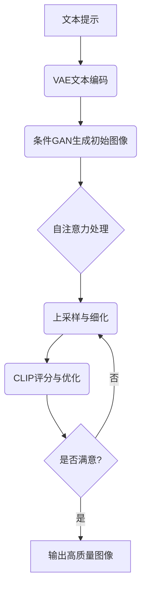

# DALL-E原理与代码实例讲解

## 1.背景介绍

在过去几年中,人工智能领域取得了长足的进步,尤其是在计算机视觉和自然语言处理方面。生成式人工智能模型已经展现出令人印象深刻的能力,可以根据文本提示生成逼真的图像、音频、视频和其他形式的内容。其中,OpenAI推出的DALL-E是一个突破性的文本到图像生成模型,它能够根据自然语言描述生成高质量、高分辨率的图像,为人工智能在创意领域的应用开辟了新的可能性。

DALL-E的名称源于著名的画家萨尔瓦多·达利(Salvador Dalí)和机器人Wall-E,寓意着将艺术创作与人工智能相结合。该模型通过深度学习技术,学习了大量的文本-图像对,从而掌握了理解自然语言描述并生成相应图像的能力。DALL-E不仅可以生成逼真的图像,还能够根据提示进行图像编辑、组合和操作,展现出了令人惊叹的创造力。

### 1.1 DALL-E的重要意义

DALL-E的出现标志着人工智能在创意领域取得了重大突破。传统上,创意活动被认为是人类独有的能力,需要想象力、创新思维和艺术天赋。但是DALL-E展示了人工智能系统也能够产生富有创意的内容,这为人工智能在艺术、设计、广告等创意行业的应用带来了新的可能性。

此外,DALL-E还可以为视觉交互、辅助设计、内容创作等领域提供强大的支持。例如,它可以帮助设计师快速生成概念图和草图,为艺术家提供创作灵感,或者为内容创作者生成丰富多样的视觉素材。DALL-E的出现也引发了人们对人工智能系统的创造力、伦理和版权等问题的深入思考和讨论。

### 1.2 DALL-E的局限性

尽管DALL-E取得了令人瞩目的成就,但它仍然存在一些局限性和挑战。首先,DALL-E生成的图像质量并不完美,有时会出现失真、模糊或不自然的情况。其次,DALL-E在处理一些复杂的场景或概念时可能会产生错误或偏差。此外,DALL-E也存在潜在的安全和隐私风险,比如可能被用于生成虚假信息或侵犯版权等。

因此,DALL-E的发展和应用需要谨慎和负责任的态度,必须解决这些技术和伦理挑战,才能真正发挥其潜力,为人类创造更大的价值。

## 2.核心概念与联系

为了更好地理解DALL-E的工作原理,我们需要先了解一些核心概念和相关技术。

### 2.1 生成式对抗网络(GAN)

生成式对抗网络(Generative Adversarial Networks,GAN)是一种深度学习架构,由两个神经网络组成:生成器(Generator)和判别器(Discriminator)。生成器的目标是生成逼真的数据样本(如图像),而判别器则试图区分生成的样本和真实数据。通过这种对抗性训练,生成器和判别器相互竞争,最终使生成器能够生成高质量的数据。

GAN在图像生成、语音合成、数据增强等领域有着广泛的应用。DALL-E也采用了GAN的思想,但在架构和训练方式上做了创新,以适应文本到图像生成的任务。

### 2.2 变分自编码器(VAE)

变分自编码器(Variational Autoencoder,VAE)是一种用于生成模型的深度学习架构。它包含两个主要部分:编码器(Encoder)和解码器(Decoder)。编码器将输入数据(如图像)编码为潜在变量的概率分布,而解码器则从该分布中采样,并尝试重构原始输入数据。

VAE在DALL-E中扮演着重要的角色,它用于将文本提示编码为潜在空间中的向量表示,然后由生成器网络解码为图像。VAE的引入使DALL-E能够更好地捕捉文本和图像之间的语义关联。

### 2.3 自注意力机制(Self-Attention)

自注意力机制(Self-Attention)是一种用于序列数据处理的关键技术,它允许模型捕捉输入序列中任意两个位置之间的依赖关系。自注意力机制在自然语言处理领域取得了巨大成功,例如在Transformer模型中发挥了关键作用。

在DALL-E中,自注意力机制被应用于处理文本提示和图像数据,以捕捉它们之间的长程依赖关系。这使得DALL-E能够更好地理解复杂的文本描述,并生成与之相符的高质量图像。

### 2.4 CLIP模型

CLIP(Contrastive Language-Image Pre-training)是一种用于图像-文本对比任务的大型预训练模型。它由OpenAI开发,通过在大量的图像-文本对上进行对比学习,学习到了图像和文本之间的语义关联。

DALL-E利用了CLIP模型的强大能力,将其用作图像-文本对比的评分函数。在生成过程中,DALL-E会根据CLIP模型的评分,不断调整生成的图像,使其与文本提示更加匹配。这种策略大大提高了DALL-E生成图像的质量和相关性。

## 3.核心算法原理具体操作步骤 

DALL-E的核心算法原理可以概括为以下几个主要步骤:

1. **文本编码**:首先,DALL-E使用一个变分自编码器(VAE)将输入的文本提示编码为一个潜在空间中的向量表示。

2. **条件生成**:接下来,DALL-E使用一个条件生成式对抗网络(Conditional GAN),将编码后的文本向量作为条件,生成一个初始的低分辨率图像。

3. **自注意力处理**:生成的初始图像和文本向量被输入到一个基于Transformer的自注意力模块中,以捕捉它们之间的长程依赖关系。

4. **上采样与细化**:通过一系列上采样和残差连接操作,DALL-E逐步将低分辨率图像上采样到高分辨率,同时根据文本向量不断细化和优化图像细节。

5. **CLIP评分与优化**:在每个上采样阶段,DALL-E使用预训练的CLIP模型对生成的图像和文本提示进行评分,并根据评分对图像进行优化,使其与文本描述更加匹配。

6. **反复迭代**:上述步骤会反复进行多次迭代,直到生成满意的高分辨率图像输出。

以下是DALL-E核心算法的Mermaid流程图:

通过上述步骤,DALL-E能够有效地将自然语言描述转换为高质量图像,展现出了令人印象深刻的文本到图像生成能力。

## 4.数学模型和公式详细讲解举例说明

在DALL-E的核心算法中,涉及到了多个数学模型和公式,下面我们将对其中的几个关键部分进行详细讲解。

### 4.1 变分自编码器(VAE)

变分自编码器(VAE)是DALL-E中用于文本编码的关键模块。它的目标是学习一个潜在变量 $z$ 的概率分布 $q_\phi(z|x)$,使其能够近似真实数据 $x$ 的潜在分布 $p(z|x)$。VAE的基本思想是通过最大化证据下界(Evidence Lower Bound,ELBO)来优化模型参数:

$$
\mathcal{L}(\phi, \theta; x) = \mathbb{E}_{q_\phi(z|x)}[\log p_\theta(x|z)] - D_\text{KL}(q_\phi(z|x) \| p(z))
$$

其中,第一项是重构项,表示根据潜在变量 $z$ 重构原始数据 $x$ 的对数似然;第二项是KL散度项,用于约束潜在变量分布 $q_\phi(z|x)$ 接近先验分布 $p(z)$,通常假设 $p(z)$ 是标准正态分布。

在DALL-E中,VAE的编码器将文本提示编码为潜在空间中的向量表示 $z$,而解码器则将 $z$ 解码为初始的低分辨率图像。通过优化上述目标函数,VAE可以学习到有意义的文本-图像映射关系。

### 4.2 生成式对抗网络(GAN)

生成式对抗网络(GAN)是DALL-E中用于图像生成的核心模块。GAN由生成器(Generator)和判别器(Discriminator)两个网络组成,它们相互对抗地训练,目标是使生成器能够生成逼真的数据样本。

生成器 $G$ 的目标是从噪声向量 $z$ 生成逼真的数据样本 $G(z)$,使其足以欺骗判别器;而判别器 $D$ 的目标是区分真实数据 $x$ 和生成数据 $G(z)$。GAN的目标函数可以表示为:

$$
\min_G \max_D V(D, G) = \mathbb{E}_{x \sim p_\text{data}(x)}[\log D(x)] + \mathbb{E}_{z \sim p_z(z)}[\log(1 - D(G(z)))]
$$

通过最小化上述目标函数,生成器和判别器相互对抗地训练,最终使生成器能够生成高质量的数据样本。

在DALL-E中,生成器 $G$ 接收编码后的文本向量 $z$ 作为条件,生成与之相符的初始图像。通过与判别器 $D$ 的对抗训练,生成器可以逐步提高生成图像的质量和相关性。

### 4.3 自注意力机制

自注意力机制是DALL-E中用于捕捉长程依赖关系的关键技术。它允许模型在处理序列数据时,直接建立任意两个位置之间的关联。

对于一个长度为 $n$ 的序列 $X = (x_1, x_2, \dots, x_n)$,自注意力机制首先计算每个位置 $i$ 与其他所有位置 $j$ 的注意力权重 $\alpha_{ij}$:

$$
\alpha_{ij} = \frac{\exp(e_{ij})}{\sum_{k=1}^n \exp(e_{ik})}
$$

其中,$e_{ij}$ 是位置 $i$ 和 $j$ 之间的相似性分数,通常由查询向量 $q_i$、键向量 $k_j$ 和值向量 $v_j$ 计算得到:

$$
e_{ij} = f(q_i, k_j, v_j)
$$

然后,自注意力输出 $y_i$ 是所有位置 $j$ 的值向量 $v_j$ 的加权和:

$$
y_i = \sum_{j=1}^n \alpha_{ij}v_j
$$

通过自注意力机制,DALL-E能够有效地捕捉文本提示和图像数据之间的长程依赖关系,从而生成更加准确和相关的图像输出。

### 4.4 CLIP评分函数

CLIP(Contrastive Language-Image Pre-training)是一种用于图像-文本对比任务的大型预训练模型。DALL-E利用CLIP模型作为评分函数,评估生成图像与文本提示之间的相关性。

CLIP模型通过对比学习,学习到了图像和文本之间的语义关联。给定一个图像 $I$ 和文本 $T$,CLIP会计算它们之间的相似性分数 $s(I, T)$:

$$
s(I, T) = \frac{I^\top T}{\|I\| \|T\|}
$$

其中,$I$ 和 $T$ 分别是图像和文本的向量表示。

在DALL-E的生成过程中,会不断调整生成的图像,使其与文本提示的CLIP相似性分数 $s(I, T)$ 最大化。通过这种方式,DALL-E可以生成与文本描述高度相关的图像输出。

## 5.项目实践:代码实例和详细解释说明