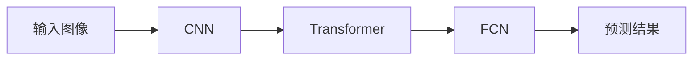

## 1.背景介绍

DETR，全称为End-to-End Object Detection with Transformers，是Facebook AI在2020年提出的一种全新的目标检测方法。传统的目标检测方法，如Faster R-CNN、YOLO、SSD等，都是基于区域提议网络（Region Proposal Network, RPN）的思想，先生成大量的候选框，然后对这些候选框进行分类和回归。然而，DETR打破了这种传统的思路，它将目标检测问题转化为了一个端到端的集合预测问题，通过Transformer结构直接在全图像上进行预测，避免了复杂的区域提议和NMS操作，极大地简化了目标检测的流程。

## 2.核心概念与联系

DETR的核心思想是将目标检测问题看作一个预测集合的问题，而不是预测每个像素或者预测一组预定义的候选框。其主要由三个部分组成：卷积神经网络（CNN）、Transformer和全连接网络（FCN）。CNN用于提取图像的特征，Transformer用于处理特征之间的关系，FCN用于最后的预测。



## 3.核心算法原理具体操作步骤

DETR的主要步骤如下：

1. 使用CNN对输入图像进行特征提取，得到特征图。
2. 将特征图平铺成序列，然后输入到Transformer中。Transformer中的自注意力机制可以处理这些特征之间的关系。
3. Transformer的输出被送入FCN进行最后的预测，包括类别和边界框的预测。

## 4.数学模型和公式详细讲解举例说明

DETR的损失函数由两部分组成：边界框的损失和类别的损失。边界框的损失是预测的边界框和实际边界框之间的L1损失，类别的损失是预测的类别和实际类别之间的交叉熵损失。

设$p_i$为预测的类别，$c_i$为实际的类别，$b_i$为预测的边界框，$g_i$为实际的边界框，那么损失函数$L$可以表示为：

$$
L = \sum_i CE(p_i, c_i) + \lambda \sum_i L1(b_i, g_i)
$$

其中，$\lambda$是用于平衡两部分损失的权重，CE表示交叉熵损失，L1表示L1损失。

## 5.项目实践：代码实例和详细解释说明

以下是一个简单的DETR的PyTorch实现：

```python
import torch
import torch.nn as nn
from torchvision.models import resnet50
from torch.nn import Transformer

class DETR(nn.Module):
    def __init__(self, num_classes, hidden_dim, nheads, num_queries):
        super(DETR, self).__init__()
        self.backbone = resnet50(pretrained=True)
        self.transformer = Transformer(hidden_dim, nheads, num_layers=6)
        self.class_embed = nn.Linear(hidden_dim, num_classes + 1)
        self.bbox_embed = nn.Linear(hidden_dim, 4)
        self.query_embed = nn.Embedding(num_queries, hidden_dim)
        self.row_embed = nn.Embedding(50, hidden_dim // 2)
        self.col_embed = nn.Embedding(50, hidden_dim // 2)

    def forward(self, inputs):
        x = self.backbone(inputs)
        h, w = x.shape[-2:]
        pos = torch.cat([
            self.col_embed[:w].unsqueeze(0).repeat(h, 1, 1),
            self.row_embed[:h].unsqueeze(1).repeat(1, w, 1),
        ], dim=-1).flatten(0, 1).unsqueeze(1)
        x = x.flatten(2).permute(2, 0, 1)
        tgt = torch.zeros_like(self.query_embed.weight).unsqueeze(1)
        x = self.transformer(x + pos, tgt + self.query_embed.weight.unsqueeze(1))
        return {'pred_logits': self.class_embed(x), 'pred_boxes': self.bbox_embed(x)}
```

## 6.实际应用场景

DETR在目标检测、实例分割等任务上都有优秀的表现，特别是在小目标检测、密集目标检测等复杂场景下，由于其全局视野和端到端的优势，能够得到更好的结果。

## 7.工具和资源推荐

- [Facebook AI的DETR官方实现](https://github.com/facebookresearch/detr)
- [PyTorch](https://pytorch.org/): 一个开源的深度学习框架，提供了丰富的API和工具，方便进行模型的搭建和训练。

## 8.总结：未来发展趋势与挑战

DETR的提出，开启了目标检测的新篇章，其端到端、无需候选框的特性，使得模型结构更加简洁，也使得模型有更大的发挥空间。然而，DETR也存在一些挑战，如训练速度慢、对小目标的检测效果不佳等。未来，如何解决这些问题，进一步提升DETR的性能，将是研究的重要方向。

## 9.附录：常见问题与解答

Q: DETR的训练速度为什么慢？
A: DETR使用了Transformer结构，该结构的计算复杂度较高，因此训练速度较慢。

Q: DETR如何处理小目标？
A: DETR对小目标的处理效果不佳，这是因为在进行特征提取时，小目标的信息容易被丢失。可以通过增加模型的深度或者使用更复杂的结构来改善这个问题。

作者：禅与计算机程序设计艺术 / Zen and the Art of Computer Programming