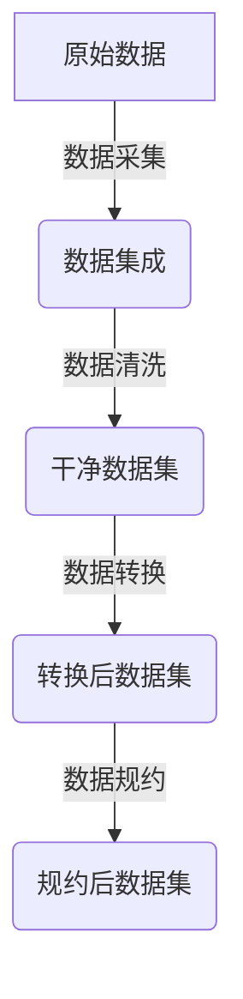
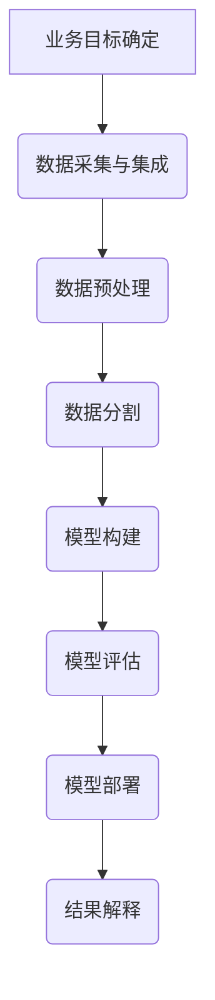

# Data Mining 原理与代码实战案例讲解

## 1.背景介绍

数据挖掘(Data Mining)是从大量的数据中通过自动或半自动的方式提取有价值的信息和知识的过程。随着信息技术的飞速发展,各行各业产生的数据量都呈现出爆炸式增长,传统的数据分析方法已经无法满足现代商业智能和科学研究的需求。数据挖掘应运而生,它利用人工智能、机器学习、统计学、数据库等多学科知识,从海量数据中发现隐藏的模式和规律,为决策提供有价值的支持。

数据挖掘广泛应用于多个领域,如金融风险管理、电信客户分析、网络安全、生物信息学等。它能够从原始数据中发现潜在的、先前未知的有趣模式和关系,从而帮助企业提高决策水平,预测未来发展趋势,优化业务流程等。

## 2.核心概念与联系

数据挖掘涉及多个核心概念,包括:

### 2.1 数据预处理



数据预处理是数据挖掘的基础,包括数据采集、数据集成、数据清洗、数据转换和数据规约等步骤,旨在从原始数据中获取高质量的数据集,为后续数据挖掘分析做好准备。

### 2.2 数据挖掘任务

- **关联分析**(Association Analysis):发现数据集中有趣的关联或相关性模式。
- **分类**(Classification):基于已知样本数据,构建分类模型对新数据进行分类。
- **聚类**(Clustering):根据数据对象之间的相似性自动将数据对象分为多个类或簇。
- **异常检测**(Anomaly Detection):识别与大多数数据行为不一致的异常数据对象或事件。

### 2.3 模式表示

数据挖掘发现的模式通常表示为:

- **关联规则**(Association Rules)
- **决策树**(Decision Trees)
- **人工神经网络**(Artificial Neural Networks)
- **聚类模型**(Clustering Models)
- **异常模型**(Anomaly Models)

## 3.核心算法原理具体操作步骤

数据挖掘过程一般包括以下步骤:



### 3.1 业务目标确定

明确业务目标是数据挖掘的出发点,如客户细分、欺诈检测、风险评估等,确保挖掘结果对业务有实际价值。

### 3.2 数据采集与集成  

从不同数据源收集相关数据,并将其整合到统一的数据集中。

### 3.3 数据预处理

对原始数据进行清洗、转换、规约等操作,消除噪声和不一致性,提高数据质量。

### 3.4 数据分割

将预处理后的数据划分为训练集和测试集,用于模型训练和评估。

### 3.5 模型构建

根据具体任务,选择合适的算法构建数据挖掘模型,如决策树、神经网络、聚类等。

### 3.6 模型评估

使用测试集对构建的模型进行评估,计算性能指标如准确率、召回率等。

### 3.7 模型部署

若模型性能满足要求,则将其部署到实际的生产环境中使用。

### 3.8 结果解释

解释和可视化挖掘结果,帮助决策者理解并利用发现的知识。

## 4.数学模型和公式详细讲解举例说明

数据挖掘中常用的数学模型和算法包括:

### 4.1 决策树

决策树是一种常用的分类和回归算法,通过递归分割特征空间构建树状决策模型。常用的决策树算法有ID3、C4.5和CART。

决策树的构建过程可以用信息增益或信息增益比作为特征选择标准。对于离散型特征,信息增益公式为:

$$Gain(S,A)=Ent(S)-\sum_{v\in Values(A)}\frac{|S_v|}{|S|}Ent(S_v)$$

其中:
- $S$是数据集
- $A$是特征
- $Values(A)$是特征$A$的所有可能值
- $S_v$是$S$中特征$A$取值为$v$的子集
- $Ent(S)$是数据集$S$的信息熵,表示数据集的纯度

### 4.2 支持向量机(SVM)

SVM是一种有监督的机器学习算法,通过构建最大间隔超平面将数据分类。对于线性可分的二分类问题,SVM的目标是找到一个超平面,使得两类样本到超平面的距离之和最大。

对于给定的训练数据集$\{(x_1,y_1),(x_2,y_2),...,(x_n,y_n)\}$,其中$x_i\in R^n$是输入向量,$y_i\in \{-1,1\}$是类别标记,SVM需要求解以下优化问题:

$$\begin{aligned}
&\underset{w,b}{\text{minimize}}&& \frac{1}{2}||w||^2\\
&\text{subject to}&&y_i(w^Tx_i+b)\geq 1,\quad i=1,...,n
\end{aligned}$$

其中$w$是超平面的法向量,$b$是偏置项。对于非线性问题,SVM通过核技巧将数据映射到高维空间,从而使用线性分类器对其进行分类。

### 4.3 K-Means聚类

K-Means是一种常用的无监督聚类算法,通过迭代优化将数据划分为K个簇。算法步骤如下:

1. 随机选择K个初始质心$\mu_1,\mu_2,...,\mu_K$
2. 对每个数据点$x_i$,计算其与各个质心的距离,将其分配到最近的簇$c_j$中
3. 对每个簇$c_j$,重新计算质心$\mu_j$为该簇中所有点的均值
4. 重复步骤2和3,直至质心不再发生变化

K-Means算法的目标是最小化所有数据点到其所属簇质心的距离平方和:

$$J=\sum_{j=1}^{K}\sum_{i\in c_j}||x_i-\mu_j||^2$$

其中$c_j$是第$j$个簇,包含了所有被分配到该簇的数据点。

### 4.4 Apriori算法(关联规则挖掘)

Apriori算法是一种经典的关联规则挖掘算法,用于发现数据集中的频繁项集和关联规则。

对于项集$X$,其支持度定义为:

$$\text{support}(X)=\frac{\text{包含X的记录数}}{\text{记录总数}}$$

而对于关联规则$X\Rightarrow Y$,其置信度定义为:

$$\text{confidence}(X\Rightarrow Y)=\frac{\text{support}(X\cup Y)}{\text{support}(X)}$$

Apriori算法的核心思想是:对于频繁项集,其所有非空子集也必定是频繁的。算法分两步进行:

1. 发现所有频繁项集
2. 由频繁项集产生关联规则

在第一步中,算法通过迭代的方式发现长度为1、2、3...的频繁项集,并利用支持度剪枝策略剔除非频繁项集,从而大大减少搜索空间。

## 5.项目实践:代码实例和详细解释说明

以下是使用Python和常见数据挖掘库(如Scikit-Learn、Pandas等)进行数据挖掘的示例代码:

### 5.1 决策树分类

```python
from sklearn.datasets import load_iris
from sklearn.tree import DecisionTreeClassifier
from sklearn.model_selection import train_test_split
from sklearn.metrics import accuracy_score

# 加载iris数据集
iris = load_iris()
X, y = iris.data, iris.target

# 划分训练集和测试集
X_train, X_test, y_train, y_test = train_test_split(X, y, test_size=0.2, random_state=42)

# 构建决策树分类器
clf = DecisionTreeClassifier(criterion='gini', max_depth=3)

# 训练模型
clf.fit(X_train, y_train)

# 预测测试集
y_pred = clf.predict(X_test)

# 计算准确率
acc = accuracy_score(y_test, y_pred)
print(f'Accuracy: {acc:.2f}')
```

上述代码加载了著名的iris数据集,使用Scikit-Learn库构建了一个决策树分类器,并对其进行了训练和测试。代码最后输出了模型在测试集上的准确率。

### 5.2 K-Means聚类

```python
from sklearn.datasets import make_blobs
from sklearn.cluster import KMeans
import matplotlib.pyplot as plt

# 生成样本数据
X, y = make_blobs(n_samples=500, centers=4, n_features=2, random_state=42)

# 构建K-Means聚类器
kmeans = KMeans(n_clusters=4, random_state=42)

# 训练模型
kmeans.fit(X)

# 获取簇标签
labels = kmeans.labels_

# 可视化结果
plt.scatter(X[:, 0], X[:, 1], c=labels)
plt.scatter(kmeans.cluster_centers_[:, 0], kmeans.cluster_centers_[:, 1], marker='x', c='r', s=100)
plt.show()
```

上述代码使用Scikit-Learn库生成了一个包含4个簇的样本数据集,然后使用K-Means算法对其进行聚类。代码最后使用Matplotlib库对聚类结果进行了可视化,展示了每个簇的数据点以及簇质心。

### 5.3 Apriori算法(关联规则挖掘)

```python
import pandas as pd
from mlxtend.frequent_patterns import apriori
from mlxtend.frequent_patterns import association_rules

# 加载样本数据
dataset = [['牛奶', '面包', '薯片'],
           ['牛奶', '面包', '啤酒', '鸡蛋'],
           ['牛奶', '面包', '薯片', '啤酒'],
           ['牛奶', '面包', '鸡蛋'],
           ['牛奶', '薯片']]

# 构建数据框
df = pd.DataFrame(dataset, columns=['Transactions'])

# 发现频繁项集
frequent_itemsets = apriori(df, min_support=0.2, use_colnames=True)
print('Frequent Itemsets:\n', frequent_itemsets)

# 生成关联规则
rules = association_rules(frequent_itemsets, metric='confidence', min_threshold=0.6)
print('Association Rules:\n', rules)
```

上述代码使用Python的mlxtend库实现了Apriori算法,用于从一个简单的购物篮数据集中发现频繁项集和关联规则。代码首先构建了一个包含5个交易记录的数据框,然后使用apriori函数发现了所有支持度不小于0.2的频繁项集,最后使用association_rules函数从频繁项集中生成了所有置信度不小于0.6的关联规则。

## 6.实际应用场景

数据挖掘在现实生活中有着广泛的应用,下面列举了一些典型场景:

### 6.1 金融风险管理

银行和金融机构可以使用数据挖掘技术分析客户的信贷记录、交易行为等数据,构建信用评分模型和欺诈检测模型,从而有效识别潜在的违约风险和欺诈行为,降低金融风险。

### 6.2 电子商务推荐系统

电商网站可以通过分析用户的浏览记录、购买历史等数据,利用关联规则挖掘和协同过滤算法发现用户的兴趣偏好,从而为用户推荐感兴趣的商品,提高销售额和用户体验。

### 6.3 医疗健康分析

数据挖掘可以应用于医疗数据的分析,如通过分析患者的症状、检查结果等数据构建疾病诊断模型,或者发现药物不良反应之间的关联模式,为临床决策提供有价值的支持。

### 6.4 网络安全与入侵检测

通过分析网络流量数据、系统日志等,数据挖掘能够发现异常模式,从而检测潜在的网络